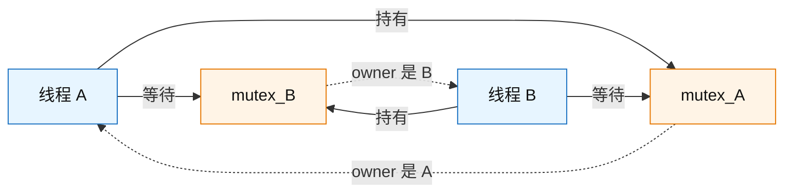
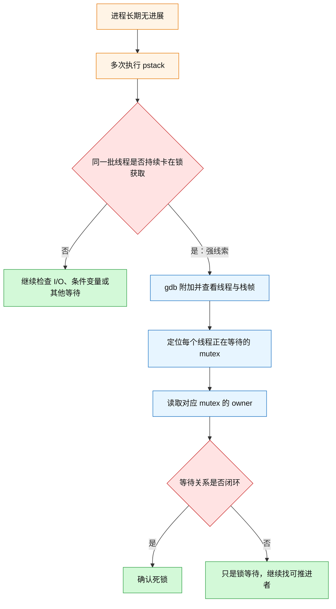
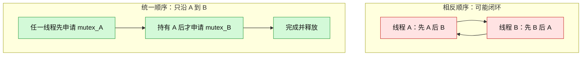
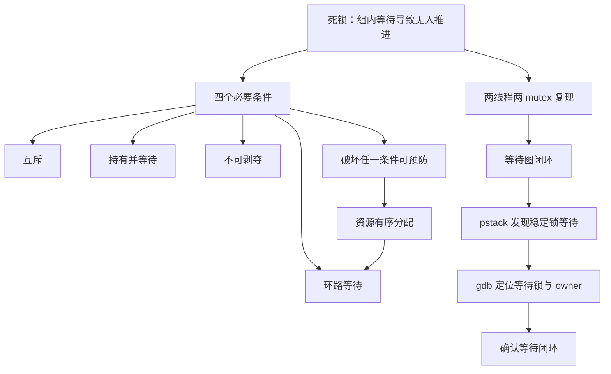

# 5.4 怎么避免死锁：条件、复现、排查与有序加锁

### 1. Topic Overview

- What this is about: 从“两个线程各持有一把锁、又等待对方的锁”建立死锁模型；理解死锁得以发生的四个必要条件；用 C/pthread 代码复现；再沿 `pstack -> gdb -> 锁 owner -> 等待闭环` 排查；最后用统一资源顺序预防。
- Why it matters: 死锁通常不会破坏某个局部互斥规则，却会让一组线程整体永久失去进展。线上看到线程都卡在 `pthread_mutex_lock` 时，真正需要回答的是“谁持有什么、又在等谁”，而不只是“线程在等待”。
- Difficulty level: 中等。难点不在四个名词，而在把代码的加锁顺序、运行时栈、锁 owner 和等待图映射到同一个闭环。
- Prerequisites: 互斥锁的 acquire/release 语义；线程阻塞与 `pthread_join`；上一章的“局部 safety 不等于系统 progress”。
- Source: `materials/os/4_process/deadlock.md`。本文按原文顺序覆盖死锁概念、两锁复现、`pstack + gdb` 排查和资源有序分配法，并核对正文中的代码、输出与配图说明。

本章路线：

1. 用“四个条件必须同时具备”识别死锁成立环境。
2. 把相反加锁顺序翻译成“持有边 + 等待边”的闭环。
3. 运行两线程代码，逐步定位停住的位置。
4. 用 `pstack` 找线索，再用 `gdb` 还原等待关系并确认闭环。
5. 给资源建立全序，让所有线程按同一方向申请，破坏环路等待。

### 2. Core Concepts

#### Schema 1: 用“四个必要条件的交集”判断死锁能否发生

- Definition: 死锁是两个或更多执行流各自等待一项只能由这组执行流中的其他成员释放的资源，在没有外力介入时无人能继续完成。原文列出的四个必要条件是：互斥、持有并等待、不可剥夺、环路等待。
- Intuition: 一把只能一个人使用的钥匙并不会自动造成死锁；真正危险的是“我拿着你需要的钥匙，同时等你手里的钥匙”，并且双方都不能强行拿走对方的钥匙。
- Example: 线程 A 持有 `mutex_A` 并等待 `mutex_B`；线程 B 持有 `mutex_B` 并等待 `mutex_A`。两把锁不可共享，等待时不释放已持有的锁，系统也不能强行剥夺，等待关系又闭成 A→B→A。

| 条件 | 要检查的问题 | 两锁示例中的证据 |
| --- | --- | --- |
| 互斥 | 同一资源能否被多个线程同时持有？ | 每把 mutex 一次只有一个 owner |
| 持有并等待 | 等待新资源时是否继续占着旧资源？ | A 等 B 锁时仍持 A 锁，B 反之 |
| 不可剥夺 | 别的线程或系统能否强制取走已持有资源？ | mutex 只能由协议中的持有者释放 |
| 环路等待 | “谁等谁”能否沿边走回起点？ | A 等 B 持有的锁，B 又等 A 持有的锁 |

- Common mistakes:
  - 看到两个线程都阻塞就直接宣布死锁；它们可能只是在等稍后会由第三方完成的 I/O 或事件。
  - 把“等待很久”当成死锁定义；死锁的关键是依赖闭环导致组内无人能产生解除条件。
  - 把四个条件当成四选一；预防时破坏任意一个即可，发生死锁则四者必须同时具备。
  - 把四条件检查当成现场证据的替代品；具体故障仍需还原“谁持有哪把锁、谁等待哪把锁”。

#### Schema 2: 把加锁代码运行成等待图，而不是只看源码顺序

- Definition: 分析多锁代码时，为每个线程记录“已经持有的锁”和“下一步请求的锁”。若线程 A 等待线程 B 持有的资源，就画一条 A→B 的等待边；等待边闭环且环中成员不能自行释放当前资源时，形成死锁。
- Intuition: 源码分散在不同线程函数里，肉眼容易只看到每段都“加锁—使用—解锁”。等待图把跨线程依赖压缩成一个可运行的模型。
- Example: 原文中 A 的顺序是 `lock(A) -> sleep -> lock(B)`，B 的顺序是 `lock(B) -> sleep -> lock(A)`。若二者在睡眠前分别拿到第一把锁，醒来后就会各自卡在第二次 `pthread_mutex_lock`。

#### Visual Model: 相反的加锁顺序怎样闭成等待环？



- How to read: 从 A 的“等待 mutex_B”走到其 owner B，再从 B 的“等待 mutex_A”走回 owner A，得到不可自行打破的闭环。
- Source anchor: `deadlock.md §模拟死锁问题的产生`。
- Boundary: `sleep(1)` 只是人为扩大“双方先拿到第一把锁”的时间窗口，方便稳定复现；它不是死锁成立的必要条件。

- Common mistakes:
  - 认为代码中最后写了 `unlock`，线程迟早就会执行到；实际它们在第二次 `lock` 已阻塞，永远到不了释放语句。
  - 只列出“线程 A、B 都在等锁”，却不写等待的是哪一把锁、该锁由谁持有。
  - 认为 `main` 卡在 `pthread_join` 也是环的一部分；主线程只是等待两个工作线程结束，并不持有它们所需的锁。

#### Schema 3: 用“停滞线索 -> 等待点 -> owner -> 闭环”排查死锁

- Definition: `pstack <pid>` 提供各线程的调用栈。多次采样若同一批线程长期停在 `pthread_mutex_lock`，只能得到强线索；随后用 `gdb -p <pid>` 切换线程、查看栈帧和锁对象 owner，把“等待哪把锁”和“谁持有它”连接起来，才能确认互相等待。
- Intuition: 栈告诉你“线程停在哪里”，锁对象告诉你“它为什么不能继续”。只有把两类证据合并，才能从“像死锁”升级为“已还原等待闭环”。
- Example: 原文的 LWP 87748 是线程 B，停在 `threadB_proc` 的 `pthread_mutex_lock(&mutex_A)`；`mutex_A.__owner=87747` 表明 A 持有 A 锁。与此同时 `mutex_B.__owner=87748`，结合线程 A 停在请求 B 锁，可得到 A 等 B、B 等 A。

#### Visual Model: `pstack` 与 `gdb` 分别回答什么？



- How to read: `pstack` 负责缩小嫌疑范围，`gdb` 负责补全锁对象和 owner；闭环才是最终结论。
- Source anchor: `deadlock.md §利用工具排查死锁问题`。
- Boundary: 原文打印的 `pthread_mutex_t.__data.__owner` 是特定 libc/调试信息的内部布局，不是可移植的 pthread 公共 API；不同平台、库版本和锁类型的字段可能不同。Java 场景按原文可使用 JDK 自带的 `jstack`。

- Common mistakes:
  - 一次 `pstack` 看到 `pthread_mutex_lock` 就确诊；正常竞争也会暂时停在这里。
  - 只看 owner，不看当前线程到底在请求哪把锁。
  - 混淆 GDB 的线程编号、LWP ID 与业务线程名字；必须通过调用栈把它们对应起来。
  - 把 `pthread_join` 主线程误判为持锁者；要检查资源所有权，而不只是“谁在等待”。

#### Schema 4: 用全局资源顺序从制度上消除环路等待

- Definition: 给所有可组合获取的资源建立同一个全序，例如 `mutex_A < mutex_B`，并要求所有线程只按升序申请。原文把线程 B 从“先 B 后 A”改成“先 A 后 B”，从而破坏环路等待条件。
- Intuition: 如果每条等待边都只能从较小编号资源指向较大编号资源，那么沿等待链资源编号只能严格变大，不可能绕一圈又回到原来的较小编号。
- Example: A 与 B 都先请求 `mutex_A`。其中一个线程先拿到 A 锁并继续拿 B 锁、完成后释放；另一个线程最多在第一把 A 锁处等待，但它此时没有持有 B 锁，因此无法形成 A↔B 的资源闭环。

#### Visual Model: 统一顺序为什么让闭环无法成立？



- How to read: 左侧允许依赖方向首尾相接；右侧规定所有请求只沿同一方向前进，因此无法回到起点。
- Source anchor: `deadlock.md §避免死锁问题的发生`，线程 B 改为先 A 后 B。
- Boundary: 这是一种死锁预防策略。标题使用“避免死锁”的日常说法；在更严格的操作系统分类中，“通过破坏必要条件”通常称为 prevention，而 Banker's Algorithm 一类安全状态检查才常称为 avoidance。本文没有讲银行家算法、死锁恢复或超时重试。

- Common mistakes:
  - 只要求“每个线程内部顺序固定”，却允许不同线程使用不同固定顺序；必须是系统共享的同一全序。
  - 给资源编号但存在例外路径；任何一次逆序嵌套获取都可能重新引入闭环。
  - 认为统一顺序让线程完全不等待；它消除的是环路等待，不消除正常锁竞争。
  - 把按相反方向释放当成消除死锁的核心；关键约束是申请顺序。反向释放是常见且清晰的嵌套资源管理方式。

### 3. Deep Understanding

#### 3.1 死锁不是“锁失效”，而是局部正确叠加成全局停滞

在原文示例里，每把 mutex 的互斥语义都完全正常：`mutex_A` 没有同时给 A、B，`mutex_B` 也没有。失败发生在组合协议：A 和 B 先各占一把，再请求另一把。于是局部 safety 仍然成立，但系统 progress 失败。

这也是多锁问题的通用诊断方式：

```text
局部检查：每把锁是否正确互斥？
组合检查：持锁时还会请求什么？
全局检查：这些请求关系是否可能闭环？
```

#### 3.2 四条件、现场闭环与预防策略如何接起来

四个条件回答“死锁为什么有可能发生”；等待图回答“这次现场是否已经发生”；资源有序分配回答“怎样让其中一个必要条件从制度上不成立”。三者不是三组独立知识，而是一条因果链：


- How to read: 条件解释机制，运行时证据确认具体闭环，统一顺序再从根上拿掉闭环条件。
- Source anchor: `deadlock.md` 全章主线。

#### 3.3 死锁、长时间等待与饥饿的边界

- 正常锁等待: owner 仍会继续运行并最终释放锁。
- 死锁: 一组参与者的解除条件只能由组内其他等待者产生，等待关系闭环，组内无人能先推进。
- 饥饿: 系统整体一直有人推进，但某个线程长期拿不到机会，例如不断被后来者插队。

因此，多次不变的栈只是“无进展”的观测线索；必须继续确认是闭环、外部事件长延迟，还是调度/公平性问题。

### 4. Minimal Working Example

原文两线程程序的最小执行轨迹：

| 时刻 | 线程 A | 线程 B | 资源状态 |
| --- | --- | --- | --- |
| t1 | `lock(mutex_A)` 成功 | 尚未执行 | A 持有 A 锁 |
| t2 | `sleep(1)` | `lock(mutex_B)` 成功 | A 持有 A，B 持有 B |
| t3 | 醒来，请求 B 锁并阻塞 | `sleep(1)` 或即将醒来 | A 等 B，仍持 A |
| t4 | 仍阻塞 | 请求 A 锁并阻塞 | B 等 A，仍持 B |
| t5 | 无法到达 `unlock` | 无法到达 `unlock` | 等待闭环保持 |

最小修正是让 B 也遵守 `mutex_A < mutex_B`：

```c
pthread_mutex_lock(&mutex_A);
pthread_mutex_lock(&mutex_B);

/* 同时需要 A、B 保护的操作 */

pthread_mutex_unlock(&mutex_B);
pthread_mutex_unlock(&mutex_A);
```

修正后的关键不是“B 更快”，而是：若 A 已被别人持有，B 会在还没有持有 B 锁时等待；因此它不能再成为“A 等 B”的另一半。

### 5. Chapter Knowledge Map



### 6. Self-Test Questions

Recall:

1. 死锁得以发生的四个必要条件分别是什么？
2. 为什么原文中的两个线程永远执行不到各自的 `pthread_mutex_unlock`？
3. `pstack` 与 `gdb` 在原文排查链中各自补充了什么证据？

Application / transfer:

4. T1 持有锁 1 等锁 2，T2 持有锁 2 等锁 3，T3 持有锁 3 等锁 1。请画出等待环，并指出资源有序分配应怎样限制请求方向。
5. 一个线程长期停在 `pthread_mutex_lock`，但锁 owner 正在执行且稍后会释放。为什么这还不足以叫死锁？还应检查什么？

Explain like I am 5:

6. 用“两个人拿钥匙”的故事解释：为什么让所有人都先拿编号小的钥匙，可以避免两个人各拿一把、互相等另一把？

### 7. Weak Point Detection

- Likely failure: 会背四个条件，却不能把具体代码行标成“持有哪把锁、等待哪把锁”。Detection: 给一段两线程代码，让学习者写出每个线程的 hold/wait 二元组。
- Likely failure: 一看到线程卡在 `pthread_mutex_lock` 就确诊。Detection: 混入一个正常但较长的临界区，追问 owner 是否仍能推进。
- Likely failure: 混淆 `pstack` 线索与 `gdb` 确认。Detection: 让学习者分别回答“等待点”和“owner”由哪个证据提供。
- Likely failure: 以为“每个线程有固定顺序”就够了。Detection: 给 A→B 与 B→A 两条都固定但互相相反的路径，要求判断。
- Likely failure: 认为统一顺序消除了所有等待。Detection: 两个线程都先请求 A，追问后到者是否仍会等待、为何却不死锁。
- Likely failure: 混淆死锁与饥饿。Detection: 对比“所有人互等、无人推进”和“系统一直推进、某线程总被插队”。
