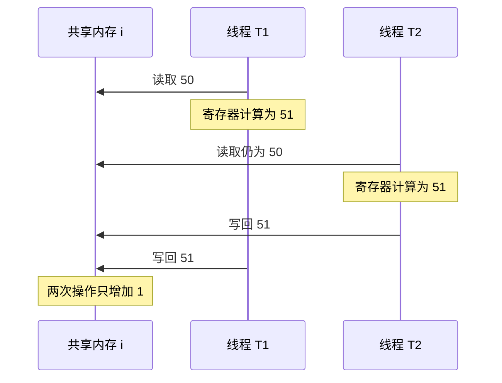
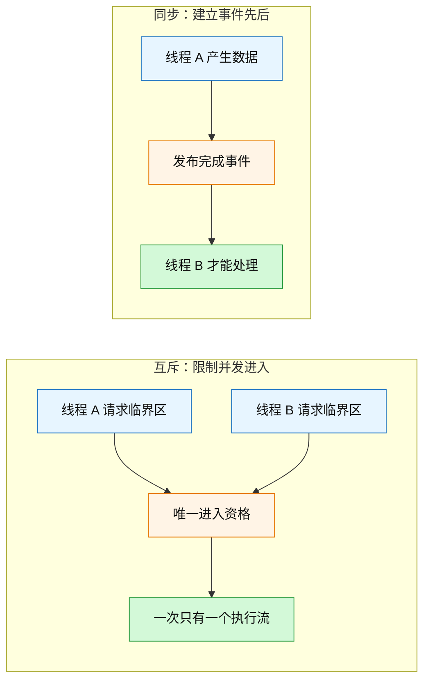
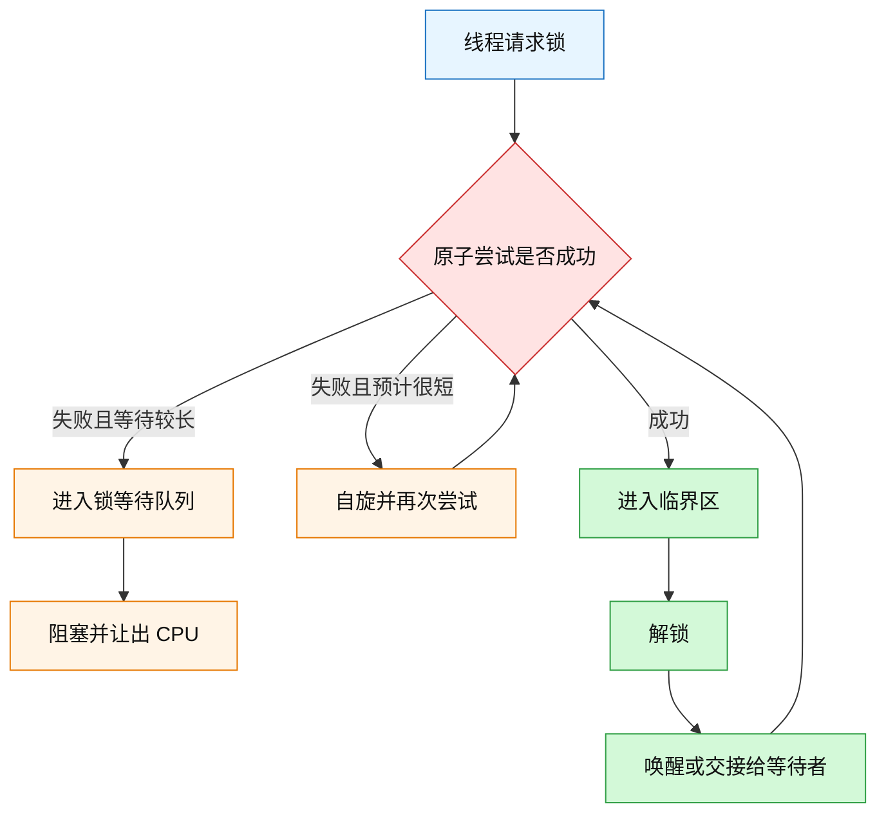
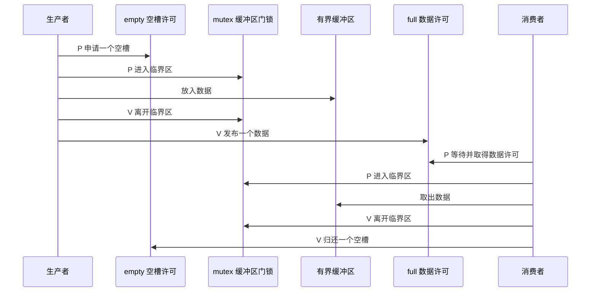
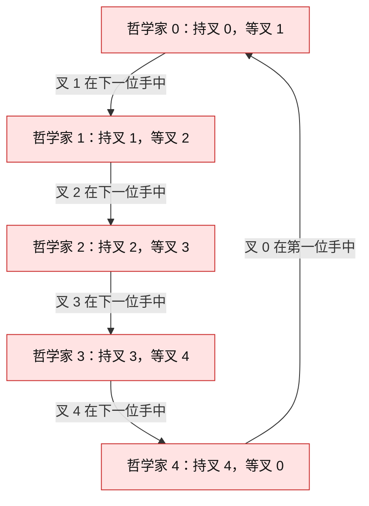
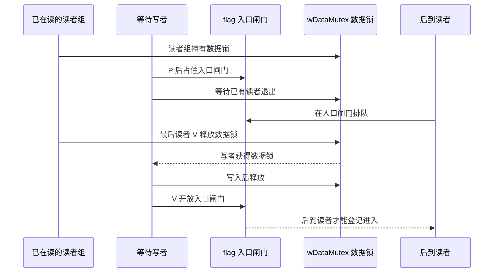
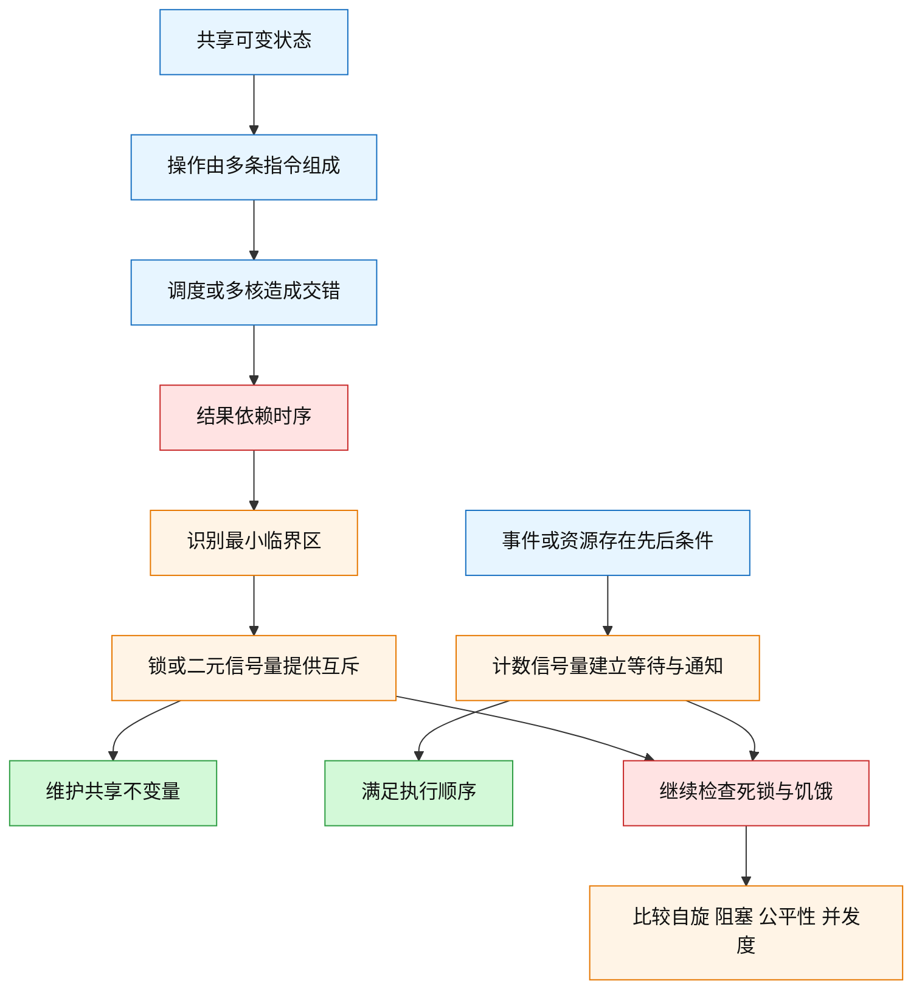
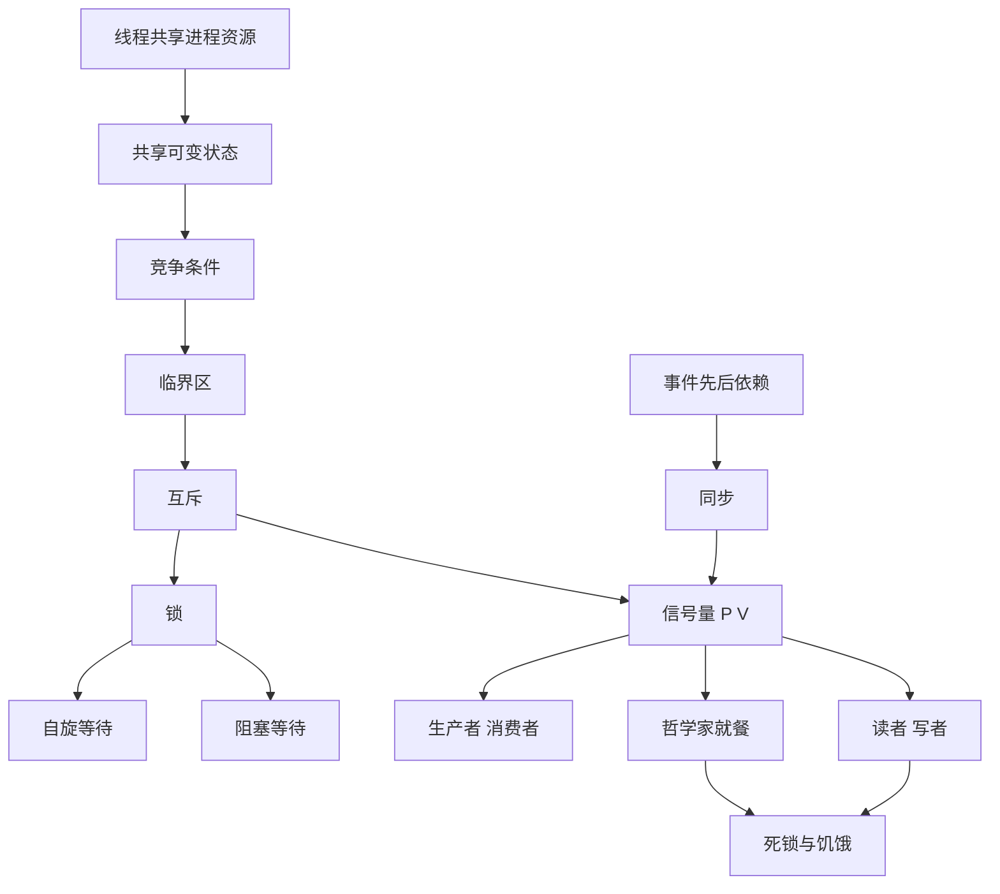

# 5.3 多线程冲突了怎么办：互斥、同步、锁与信号量

### 1. Topic Overview

- What this is about: 从两个线程对共享变量 `i` 自增却丢失更新开始，建立竞争条件、临界区、互斥与同步的边界；再用锁、信号量解决生产者—消费者、哲学家就餐和读者—写者问题。
- Why it matters: 多线程错误往往不是“每次都错”，而是取决于不可控的指令交错。面试与工程判断的核心不是只会说“加锁”，而是能指出共享状态、临界区、顺序条件、进展风险和性能代价。
- Difficulty level: 中等偏难。单个原语不复杂，难点是同时追踪计数值、等待队列、锁的持有者，以及“互斥正确但可能死锁/饥饿/低效”的边界。
- Prerequisites: 线程共享进程的代码段、数据段、堆和打开文件，但各自有栈与 CPU 上下文；线程可能因时钟中断或阻塞发生切换；阻塞线程在条件满足后先回到就绪态，再等待调度运行。
- Source: `materials/os/4_process/multithread_sync.md`，正文共 482 行；同时核对了文章中承载伪代码的原图，包括 Test-and-Set、自旋/阻塞锁、PV、生产者—消费者、四种哲学家方案和三种读者—写者方案。

本章路线：

1. 从 `i++` 的读—改—写交错定位竞争条件与临界区。
2. 区分互斥的“不能同时”与同步的“必须先后”。
3. 用 Test-and-Set 理解自旋锁，并比较忙等与阻塞等待。
4. 用“计数 + 等待队列”运行 P/V，再区分初值 `1` 和 `0`。
5. 用三个信号量解决有界生产者—消费者问题。
6. 比较哲学家就餐的死锁、并发度与状态判定方案。
7. 比较读者优先、写者优先与公平入口策略。

### 2. Core Concepts

#### Schema 1: 用“共享状态 + 非原子复合操作 + 不可控交错”识别竞争条件

- Definition: 多个执行流访问同一共享状态，至少一个执行流会修改它，而结果随执行时序变化时，就存在竞争条件。访问该共享资源且必须作为一个整体受保护的代码片段叫临界区；互斥要求任一时刻最多一个执行流进入该临界区。
- Intuition: `i++` 在源代码里是一行，但处理器执行时通常要经历“从内存读入寄存器 → 寄存器加一 → 写回内存”。线程可在这些步骤之间被切换，所以“一行”不等于“原子”。
- Example: 初始 `i=50`。线程 T1 读到 50 并算出 51，但还未写回；切到 T2，T2 也从内存读到 50，算出并写回 51；再切回 T1，T1 又写回 51。两次自增只留下一个结果，发生 lost update。

#### Visual Model: 两次 `i++` 为什么只得到一次增长？



- How to read: 两个线程各自的局部计算都没有算错；错误发生在它们读取了同一个旧值，并先后覆盖写回。
- Source anchor: `multithread_sync.md §竞争与协作`，共享变量自增与时钟中断示例。
- Boundary: 竞争不只发生在单核的上下文切换；多核上两个线程真正并行时也会产生同类交错。反过来，仅仅“有多个线程”也不必然有数据竞争，关键要看是否共享可变状态以及访问是否受正确协调。

- Common mistakes:
  - 把 `i++` 当成不可分割的一条 CPU 指令。
  - 认为一次运行得到 `20000` 就证明程序正确；竞争错误具有时序依赖和不确定性。
  - 把整个函数都叫临界区；真正应保护的是维护共享不变量所需的最小代码范围。
  - 以为只有多线程才需互斥；共享资源上的多进程并发同样可能需要互斥。

#### Schema 2: 用“不能同时 vs 必须先后”区分互斥与同步

- Definition: 互斥限制同一时间能进入临界区的执行流数量，回答“谁能同时做”；同步在关键点建立等待与通知，回答“哪一步必须等哪一步完成”。
- Intuition: 卫生间门锁表达互斥——两个人不能同时使用同一隔间；做好饭再吃表达同步——即使只有一个人，也必须先完成做饭事件，吃饭事件才能继续。
- Example 1 — 互斥: T1 与 T2 都要修改共享链表，必须保证一次只有一个线程改变链表指针。
- Example 2 — 同步: T1 负责读入数据，T2 负责处理。T2 即使没有竞争者，也必须等待 T1 发布“数据已就绪”。

#### Visual Model: 两种约束分别在限制什么？



- How to read: 左侧把多个竞争者压成一个访问者；右侧即使没有同时访问，也必须等待前置事件。
- Source anchor: `multithread_sync.md §互斥的概念` 与 `§同步的概念`。

- Common mistakes:
  - 看到线程等待就一律叫互斥；等待可能来自同步条件、I/O 或资源不足。
  - 认为锁住缓冲区就自动保证“先生产后消费”；锁只解决同时访问，未表达数据是否已经存在。
  - 认为互斥与同步完全无关；同一问题常同时需要二者，但它们承担不同约束。

#### Schema 3: 用“原子抢占资格”理解锁，并按等待成本选择自旋或阻塞

- Definition: 锁把临界区入口变成一个原子资格竞争。Test-and-Set 原子地返回旧值并写入新值，使多个线程不可能同时把空闲锁抢到手。获取失败后，可以继续自旋，也可以进入等待队列并让出 CPU。
- Intuition: 普通的“先看门是否空，再挂牌占用”会在查看和挂牌之间被插队；Test-and-Set 把“查看旧牌 + 挂上占用牌”压成一个不可分割动作。
- Example — Test-and-Set spin lock:

```c
int TestAndSet(int *old_ptr, int new_value) {
    int old = *old_ptr;
    *old_ptr = new_value;
    return old;
} // 整体必须原子执行

void lock(lock_t *lock) {
    while (TestAndSet(&lock->flag, 1) == 1) {
        /* busy wait */
    }
}

void unlock(lock_t *lock) {
    lock->flag = 0;
}
```

当 `flag=0` 时，某线程拿到旧值 0，同时把它改为 1，于是获得锁；其他线程只会拿到旧值 1 并继续等待。

阻塞等待锁的抽象路径：



- How to read: 自旋用 CPU 时间换取避免睡眠/唤醒开销；阻塞用调度与队列开销换取不空耗 CPU。选择取决于临界区长度、竞争程度和调度环境。
- Source anchor: `multithread_sync.md §锁`，Test-and-Set、忙等待锁与等待队列锁。
- Boundary: 原文所说“无等待锁”更准确地应理解为“无忙等待的阻塞锁”，并不是并发算法术语中的 wait-free 或 lock-free。原文伪代码只用于展示“原子状态 + 等待队列 + 调度”三个元素；真实锁还必须处理丢失唤醒、内存顺序、公平性和所有权。

- Common mistakes:
  - 先普通读取 `flag`、再普通写 `flag=1`，却声称它等价于原子 Test-and-Set。
  - 认为自旋线程“什么都没做所以不耗资源”；它持续占用 CPU 执行检查。
  - 在单核、锁持有者尚未运行的场景无限自旋；若调度不能让持有者获得 CPU，锁永远不会释放。
  - 认为阻塞锁一定更快；极短临界区里，睡眠和唤醒开销可能超过短暂自旋。

#### Schema 4: 用“资源计数 + 等待队列”运行 P/V

- Definition: 经典信号量把整数计数和等待队列组合起来。P 是原子申请：计数减一，若结果小于 0，则当前执行流入队阻塞；V 是原子释放/通知：计数加一，若结果小于等于 0，则唤醒一个等待者。
- Intuition: 正数表示尚有可直接取得的许可；当许可耗尽，后来者不再靠自旋抢，而是在队列等待。V 归还许可时，如果此前已经有人排队，就把机会交给一个等待者。
- Example — 经典语义模型:

```text
P(s):                         V(s):
  atomically s.count--          atomically s.count++
  if s.count < 0:               if s.count <= 0:
    current -> s.wait_queue       one waiter -> ready queue
    block and schedule
```

负数的绝对值可解释为等待者数量：例如资源初值为 1，A 执行 P 后为 0；B 再 P 后为 -1 并等待；A 执行 V 后回到 0，并唤醒 B。

两种典型初始化：

| 目标 | 初值 | P 的意义 | V 的意义 |
| --- | ---: | --- | --- |
| 互斥访问一个资源 | `1` | 取得唯一访问资格 | 归还访问资格 |
| 等待某事件发生 | `0` | 事件未发生则等待 | 发布事件并唤醒等待者 |
| 管理 `N` 个同类资源 | `N` | 申请一个资源份额 | 归还一个资源份额 |

- Common mistakes:
  - 把 `sem=0` 固定理解为“资源空闲”；它的含义取决于初始化和当前协议。互斥量从 1 经 P 变为 0 时，唯一许可已经被持有。
  - 认为 V 必定让刚被唤醒者立刻运行；它通常只是使线程进入就绪态，何时运行仍由调度器决定。
  - 认为 P 与 V 必须由同一个线程成对调用；互斥锁强调所有权，但事件信号量常由消费者 P、生产者 V。
  - 把负计数当成所有实际 API 都可查询到的值；它是文章采用的经典抽象，具体实现可能把等待人数单独存放。
  - 把 P/V 一律说成系统调用；文章从操作系统抽象讲解，实际用户态库和平台 API 的进入内核路径并不完全相同。

#### Schema 5: 用“资源许可在外、互斥保护在内”解有界生产者—消费者

- Definition: 容量为 `N` 的缓冲区需要三个独立约束：`empty=N` 记录空槽数，`full=0` 记录已有数据数，`mutex=1` 保护缓冲区及其索引。生产者先取得空槽，再互斥写；消费者先取得满槽，再互斥读。
- Intuition: `empty/full` 回答“有没有位置/数据”，`mutex` 回答“现在能不能由我独占修改共享结构”。资源条件和临界区资格不能混成一个计数器。
- Example:

```text
producer:                    consumer:
  P(empty)                     P(full)
  P(mutex)                     P(mutex)
  put item                     get item
  V(mutex)                     V(mutex)
  V(full)                      V(empty)
```

容量边界与许可守恒：

```text
0 <= 缓冲区实际数据量 <= N
没有等待者、也没有线程执行到一半的稳定边界：full + empty = N
一般执行过程中：max(full, 0) + max(empty, 0) + 在途许可 = N
同时修改缓冲区的执行流数量 <= 1
```

这里的“在途许可”是线程已经通过 `P(empty)` 或 `P(full)` 取得、但尚未通过对应的 `V(full)` 或 `V(empty)` 发布到另一侧的容量。例如 `N=5, empty=2, full=3` 时，生产者执行 `P(empty)` 后得到 `empty=1, full=3`；少掉的 1 是生产者已预留的槽位。完成放入并执行 `V(full)` 后才变成 `empty=1, full=4`。另外，经典模型中的负值表示等待者，不能直接当成物理空槽或数据数量。

#### Visual Model: 三个信号量怎样分工？



- How to read: 生产者先确认容量，再短暂锁住共享结构；消费者先确认数据存在，再短暂锁住共享结构。`empty/full` 的变化围绕真实的放入/取出动作闭合。
- Source anchor: `multithread_sync.md §生产者 - 消费者问题` 及代码图 21。
- Boundary: 图只画一次操作；多个生产者/消费者重复执行同一协议。实际系统还需处理取消、超时、异常退出和内存可见性。

- Common mistakes:
  - 生产者先 `P(mutex)` 再 `P(empty)`：缓冲区满时它会拿着互斥锁睡眠，消费者无法进入取数据并 `V(empty)`，可造成死锁。
  - 消费者先 `P(mutex)` 再 `P(full)`：缓冲区空时同理可能死锁。
  - 放入数据后忘记 `V(full)`，或取出后忘记 `V(empty)`，让已取得的许可永久停留在“在途”状态。
  - 要求每条指令执行后都满足 `empty+full=N`；该等式只适用于没有在途许可和等待者的稳定边界。
  - 只用 `empty/full` 而不保护共享索引；容量计数正确不等于复合的数据结构修改互斥。

#### Schema 6: 用“破坏环路或集中判定”解决哲学家就餐

- Definition: 每位哲学家需要同时获得左右两把叉子才能吃饭。每把叉子单独互斥只是局部安全条件；若所有人按同一顺序拿一把再等另一把，会形成环形等待。解决方案要破坏该环路，同时考虑并发度和饥饿。
- Intuition: “每个人都守规矩地只拿空闲叉子”仍可能让所有人各持一把、互相等待。局部互斥正确不等于整个协议可继续推进。

四种方案比较：

| 方案 | 核心做法 | 死锁 | 并发度/代价 |
| --- | --- | --- | --- |
| 1.所有人先左后右 | 每把叉子一个信号量 | 可能；五人可各持左叉形成环路 | 看似并发，极端交错下全阻塞 |
| 2.全局互斥包住取叉到放叉 | 一次只让一人执行完整进餐区 | 避免 | 过度串行，本可同时吃的两人也不能并行 |
| 3.奇偶采用相反取叉顺序 | 偶数先左后右，奇数先右后左 | 破坏统一环形等待 | 允许不相邻者并行 |
| 4.状态数组 + 邻居检查 | `THINKING/HUNGRY/EATING`，只在邻居都没吃时准入 | 集中判定避免相邻冲突和环形持有 | 可唤醒符合条件的邻居，逻辑更复杂 |

#### Visual Model: 方案一为什么会形成死锁环？



- How to read: 每人都已占有一个资源，又等待下一个人占有的资源，最终等待边闭成环，没有任何人能先完成并释放。
- Source anchor: `multithread_sync.md §哲学家就餐问题` 的方案一至方案四及代码图 24、26、28、30。
- Boundary: 原文说明方案三、四不发生上述死锁并能让两人同时进餐；这不自动证明任意调度下严格无饥饿。是否保证每个等待者最终获得机会，还依赖唤醒/排队策略。

- Common mistakes:
  - 只检查每把叉子有互斥锁，就断言系统不会死锁。
  - 为消除死锁把整个“思考—取叉—吃饭—放叉”全部串行，虽然安全却损失不必要的并发。
  - 把“无死锁”与“无饥饿”当成同一性质。
  - 在状态数组方案里持有全局 `mutex` 时执行可能阻塞的 `P(s[i])`；原文先完成状态判定并释放 `mutex`，再在个人信号量上等待。

#### Schema 7: 用“读者组作为整体占有数据锁”运行读者—写者协议

- Definition: 读者—写者约束是：读—读可并发，读—写互斥，写—写互斥。经典实现让“读者组”作为整体占有数据锁：第一个读者锁住写权限，最后一个读者释放；`rCount` 自身必须由另一把互斥锁保护。
- Intuition: 多个读者像一个参观团。第一人进门时挂出“读者组在内”，中间成员可加入；最后一人离开才摘牌。写者必须等整个参观团离开。
- Example — 读者优先核心:

```text
reader entry:                 reader exit:
  P(rCountMutex)                P(rCountMutex)
  if rCount == 0:               rCount--
    P(wDataMutex)               if rCount == 0:
  rCount++                        V(wDataMutex)
  V(rCountMutex)                V(rCountMutex)

writer:
  P(wDataMutex)
  write
  V(wDataMutex)
```

三种策略：

| 策略 | 额外入口控制 | 谁可能饥饿 | 机制 |
| --- | --- | --- | --- |
| 读者优先 | 新读者可继续加入已有读者组 | 写者 | 只要 `rCount>0`，后来读者不用重新争数据锁 |
| 写者优先 | 第一个等待写者关闭 `rMutex` 读者入口 | 读者 | 后来的读者不能加入，已有读者退场后写者队列先推进 |
| 公平策略 | 读者和写者都先经过 `flag` 入口闸门 | 取决于闸门排队公平性 | 等待写者占住闸门后，后来读者不能插队加入读者组 |

#### Visual Model: 公平入口 `flag` 怎样阻止读者插队？



- How to read: 写者等待数据锁期间仍占着入口闸门，因此新读者不能继续加入旧读者组；旧读者数量最终会降为零，让写者推进。
- Source anchor: `multithread_sync.md §读者 - 写者问题` 的三个方案及代码图 32、33、34。
- Boundary: 原文把方案三称为公平策略。它消除了读者可持续插队的特殊权限；严格的先来先服务仍依赖 `flag` 信号量等待队列是否公平。

- Common mistakes:
  - 不保护 `rCount++/--`，导致计数自身发生竞争。
  - 让每个读者都独立 P/V 数据锁，从而错误地把读—读也串行化。
  - 认为读者优先等于写者永远不会运行；准确说法是持续到来的读者可能让写者饥饿。
  - 认为写者优先没有代价；持续写入同样可能让读者饥饿。

### 3. Deep Understanding

本章所有方案都可以放进四层检查框架，而不是只问“加没加锁”：

1. Safety — 是否可能出现坏结果？互斥保护临界区，避免两个执行流同时破坏共享不变量。
2. Ordering — 是否满足必要先后？同步让消费者等数据、吃饭者等前置事件。
3. Progress — 系统还能否向前？无竞争错误不代表无死锁；无死锁也不代表无饥饿。
4. Efficiency — 正确性代价多大？自旋会消耗 CPU，阻塞有调度成本，全局大锁会压低并发度。

关键因果链：



- How to read: 竞争条件从共享状态和可交错操作产生；互斥修复安全性，信号量还可表达资源与事件顺序；使用任何阻塞原语后仍要继续检查进展和效率。
- Source anchor: 全章，尤其 `§竞争与协作`、`§锁`、`§信号量` 和三个经典同步问题。
- Boundary: Safety、Ordering、Progress、Efficiency 是对文章方案的复习框架；文章原文未用这四个英文层级作为正式分类。

几个必须分开的边界：

```text
原子操作       -> 一个低层动作不可被观察到中间状态
互斥           -> 一个临界区同时最多一个执行流
同步           -> 多个执行流在关键事件上建立先后
死锁           -> 一组执行流相互等待，整体无法继续
饥饿           -> 系统可能在继续，但某个执行流长期得不到机会
忙等           -> 等待者继续消耗 CPU 检查条件
阻塞等待       -> 等待者让出 CPU，条件满足后再变为就绪
```

### 4. Minimal Working Example

场景：容量 `N=2` 的任务队列当前为空，生产者 P1、P2 和消费者 C 并发运行。

初值：

```text
empty=2, full=0, mutex=1, queue=[]
```

一次合法执行：

1. C 执行 `P(full)`：`full` 从 0 变为 -1，C 进入等待队列。
2. P1 执行 `P(empty)`：取得一个空槽；再 `P(mutex)`，放入 A，随后 `V(mutex)`。
3. P1 执行 `V(full)`：`full` 从 -1 回到 0，C 被唤醒为就绪，但不保证立刻运行。
4. P2 仍可先运行：它取得另一个空槽，互斥放入 B，发布一个 `full`。
5. C 获得 CPU 后继续完成先前的 P，取得 `mutex`，从队列读出一个任务，释放 `mutex`，再 `V(empty)` 归还空槽。

每一步都检查：

```text
数据是否存在    -> full
容量是否存在    -> empty
谁能修改队列    -> mutex
被唤醒是否运行  -> 仍由调度器决定
```

错误改法：让生产者先 `P(mutex)` 再 `P(empty)`。若队列已满，生产者会持有 `mutex` 并在 `empty` 上阻塞；消费者即使知道 `full>0`，也拿不到 `mutex` 去消费，于是无法执行 `V(empty)`，形成死锁闭环。

### 5. Chapter Knowledge Map



### 6. Self-Test Questions

Recall:

1. 为什么一行 `i++` 可能构成竞争条件？请写出它的三个逻辑步骤。
2. 互斥和同步分别回答什么问题？各给一个例子。
3. 在本文的经典信号量模型中，P 后 `sem<0` 与 V 后 `sem<=0` 分别意味着什么？

Application / transfer:

4. 有界缓冲区已满。若生产者先取得 `mutex` 再执行 `P(empty)`，为什么可能死锁？请画出等待环。
5. 五位哲学家每人都先拿左叉再等右叉。仅仅保证每把叉子互斥为何仍不够？奇偶反向拿叉破坏了哪个条件？

Explain like I am 5:

6. 用“公共玩具箱、门钥匙和箱内玩具数量”解释 `mutex`、`empty`、`full` 为什么必须分成三个信号量。

### 7. Weak Point Detection

- 如果能背“加锁”，却找不出 `i++` 的读—改—写交错：属于表层记忆，需练习从源代码定位共享状态与复合操作。
- 如果把互斥和同步都说成“让线程等待”：属于概念边界混淆，需用“不能同时 vs 必须先后”判断。
- 如果看到 `sem=0` 就固定说“空闲”：属于状态语义混淆，需结合初值与协议追踪许可归属。
- 如果生产者—消费者总把 `P(mutex)` 放最前：属于过程顺序混淆，需从“不能持锁等待别人靠同一锁来满足的条件”修复。
- 如果认为每个资源有锁就不会死锁：属于局部安全代替全局进展，需画 wait-for 环。
- 如果把无死锁等同于公平：属于边界混淆，需分别检查系统整体进展与单个参与者是否可能饥饿。
- 如果认为 V 后被唤醒线程立即执行：属于就绪/运行状态混淆，需回到“唤醒 → 就绪队列 → 调度”的模型。
