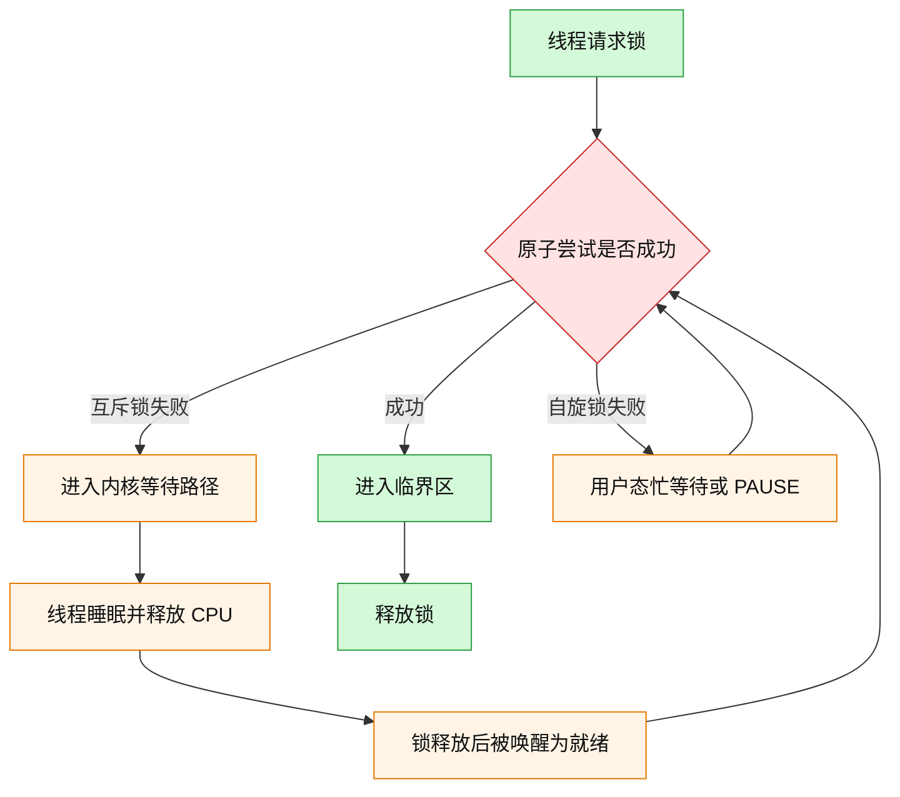
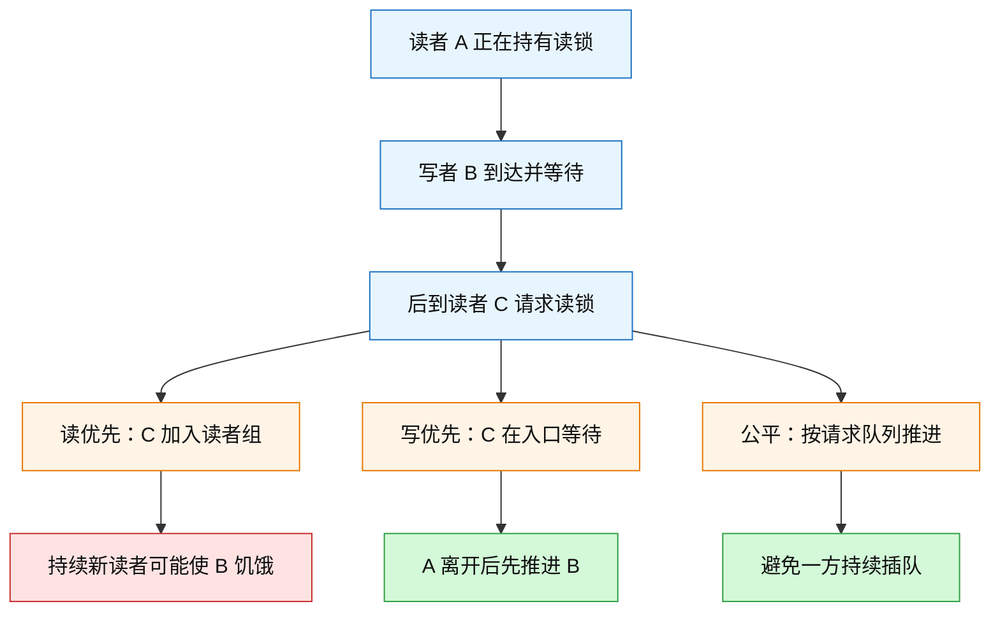
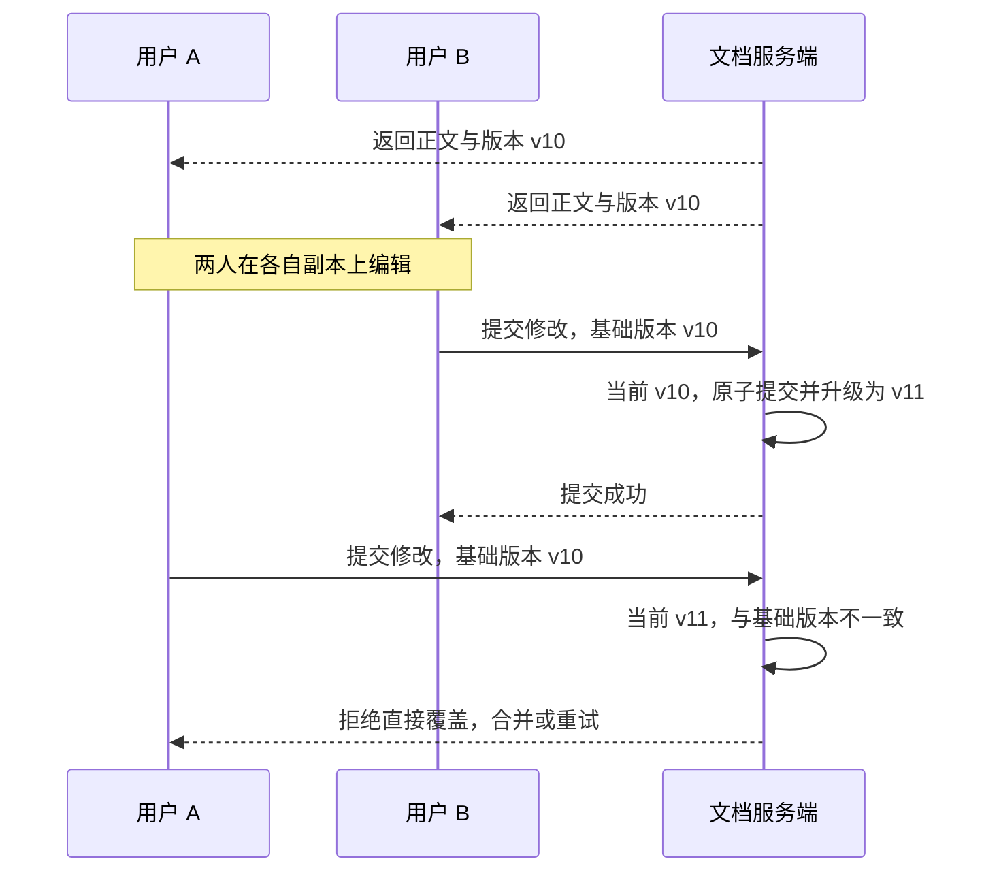
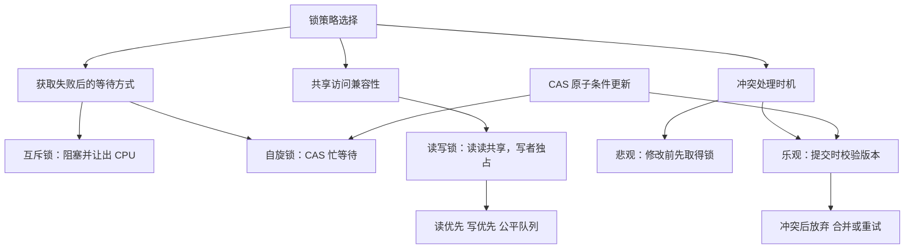

# 5.5 什么是悲观锁、乐观锁：等待、并发权限与冲突处理

### 1. Topic Overview

- What this is about: 文章从锁竞争失败后的两种等待方式——互斥锁的阻塞与自旋锁的忙等——讲起，再扩展到读写锁的读写兼容性和公平性，最后比较悲观锁“先取得排他资格再修改”与乐观锁“先工作、提交时再校验冲突”的不同策略。
- Why it matters: “锁”不是一个单一选项。选错等待方式会浪费上下文切换或 CPU，选错读写策略会压低并发或造成饥饿，选错冲突策略则可能让重试成本淹没收益。
- Difficulty level: 中等。难点是这些名称不都处在同一分类轴上，以及 `CAS` 既能实现自旋锁，也能实现乐观更新，不能只看底层指令就判断整个协议属于哪一类。
- Prerequisites: 线程的运行、睡眠、就绪状态；上下文切换；临界区和竞争条件；原子读—改—写的基本含义。
- Source: `materials/os/4_process/pessim_and_optimi_lock.md`，共 206 行。本文按原文技术内容的顺序覆盖“互斥锁与自旋锁 → 读写锁 → 乐观锁与悲观锁 → 总结 → CAS 读者问答”；末尾作者动态不属于本章知识范围。

本章路线：

1. 比较互斥锁和自旋锁在获取失败后的动作与成本。
2. 用读—读、读—写、写—写兼容关系理解读写锁。
3. 比较读优先、写优先与公平读写锁的吞吐和饥饿风险。
4. 用版本号运行一次乐观并发控制，并与悲观锁比较。
5. 区分 `CAS` 原子操作、基于 CAS 的自旋锁和基于版本校验的乐观更新。
6. 综合临界区时长、读写比例、冲突概率、重试成本与公平性选择方案。

### 2. Core Concepts

#### Schema 1: 用“失败后付什么成本”选择阻塞等待或自旋等待

- Definition: 互斥锁与自旋锁都要保证临界区在同一时刻只有一个持有者；差异主要出现在获取失败之后。互斥锁让失败线程阻塞并释放 CPU，由内核安排睡眠、唤醒和重新调度；自旋锁让失败线程继续在 CPU 上反复尝试，通常借助 `CAS` 和 `PAUSE`，不主动睡眠。
- Intuition: 阻塞像“拿号后去休息”，付出入队、睡眠、唤醒和调度成本；自旋像“站在门口不停看门开没开”，省下切换成本，却持续消耗处理器周期。
- Example: 如果持锁线程正在另一核上执行极短的临界区，很快就会释放，自旋可能比睡眠再唤醒便宜；如果持锁线程还要执行长计算或 I/O，等待者持续自旋只会烧 CPU，此时阻塞更合适。

#### Visual Model: 获取失败后，两种锁把线程送向哪里？



- How to read: 两条路径都要回到原子获取尝试；区别是等待期间 CPU 被让给别人，还是由当前线程继续消耗。
- Source anchor: `pessim_and_optimi_lock.md §互斥锁与自旋锁`。
- Boundary: 原文强调互斥锁竞争失败后的内核阻塞路径和两次线程切换；真实实现常有无竞争的用户态 fast path，不能理解为每次 `lock/unlock` 都必然发生系统调用或上下文切换。

自旋锁的抽象获取可以写成：

```text
while CAS(lock, 0, tid) fails:
    PAUSE
critical section
CAS(lock, tid, 0)
```

`CAS(lock, 0, tid)` 把“确认当前是 0”和“把它改成 tid”合成不可分割的原子动作，避免多个线程都先看到 0 后同时认为自己拿到了锁。

- Common mistakes:
  - 认为自旋“没有上下文切换”就等于“没有成本”；它用 CPU 时间支付等待成本。
  - 认为互斥锁每次加锁都必然造成两次切换；原文的两次切换针对竞争失败并真正阻塞、之后再恢复运行的路径。
  - 只看临界区代码行数，不看持锁者是否正在运行、核心数量、竞争程度和预计等待时间。
  - 忽略单核边界：原文指出单核必须有抢占式调度，才能把 CPU 交给持锁线程；即便可抢占，长时间自旋仍通常是不经济的。

#### Schema 2: 用“兼容矩阵 + 入口策略”运行读写锁

- Definition: 读写锁把访问分成共享读和独占写。没有写者持锁时，多个读者可以同时持有读锁；任何写者持有写锁时，其他读者和写者都必须等待。
- Intuition: 多个只看资料的人可以同时进阅览室；只要有人要改原稿，就必须暂时独占整个房间。
- Example: 读者 A 已在读，写者 B 到达并等待。此时后到读者 C 的命运取决于入口策略：读优先允许 C 加入，写优先阻止 C 插队，公平策略让请求按队列顺序推进。

| 当前持有情况 | 新读者 | 新写者 |
| --- | --- | --- |
| 无人持锁 | 可进入 | 可进入并独占 |
| 一个或多个读者 | 可并发读 | 阻塞 |
| 一个写者 | 阻塞 | 阻塞 |

#### Visual Model: B 已等待时，后到读者 C 会怎样？



- How to read: 三种实现的读写兼容规则相同，区别在“已有写者等待后，后来请求还能不能插队”。
- Source anchor: `pessim_and_optimi_lock.md §读写锁` 的读优先、写优先与公平读写锁。
- Boundary: 原文把公平方案描述为 FIFO 队列；工程上是否严格公平取决于具体实现和调度，连续相邻的读请求也可能被批量放行以保留读并发。

- Common mistakes:
  - 认为读写锁让读和写都并发；它只放宽读—读，读—写和写—写仍互斥。
  - 认为“读优先”只是性能标签；持续读请求会造成写者饥饿。
  - 认为写优先没有对称风险；持续写请求可能让读者长期得不到锁。
  - 认为读写锁天然公平；优先级与排队规则属于实现策略。

#### Schema 3: 用“修改前阻止 vs 提交时校验”区分悲观锁与乐观锁

- Definition: 悲观锁假定冲突概率较高，在修改共享数据前先取得锁，未取得者不能进入；原文把互斥锁、自旋锁和读写锁都归入这一类。乐观锁假定冲突较少，允许参与者先完成本地或候选修改，在提交时校验其读取以来共享版本是否变化；未变化则原子提交并升级版本，已变化则放弃、合并或重试。
- Intuition: 悲观方式先拿到唯一修改权再写；乐观方式让大家先各自写草稿，交卷时检查是不是基于同一份旧稿。
- Example: A、B 都下载文档版本 10。B 先携带“基于 v10”提交，服务器发现当前仍是 v10，于是接受并升级到 v11；A 后提交时仍携带 v10，服务器当前已是 v11，因此拒绝 A 的直接覆盖，要求处理冲突。

#### Visual Model: 版本号怎样把冲突留到提交时发现？



- How to read: 校验的对象不是“有没有人正在打开文档”，而是“提交所依据的旧版本是否仍是当前版本”。
- Source anchor: `pessim_and_optimi_lock.md §乐观锁与悲观锁` 的在线文档、版本号、SVN/Git 示例。
- Boundary: 原文口语化地说“先修改共享资源，再验证”。在线文档例子实际是先改本地副本，再由服务端原子地完成“比较版本 + 写入 + 升级版本”。若先覆盖权威共享值、再非原子校验，就可能已经破坏数据。

- Common mistakes:
  - 认为乐观锁完全不需要同步；提交阶段的版本比较与写入必须不可被并发插入，常由事务或原子条件更新保证。
  - 只看到“没有互斥锁”就断言一定快；冲突后整段工作可能要废弃并重做。
  - 冲突概率高或重试代价大时仍机械选择乐观方案。
  - 把原文“无锁编程”的宽泛说法与并发算法中的严格 `lock-free` 进展保证混为一谈；没有显式 mutex 不自动证明算法是 lock-free。

#### Schema 4: 用“原子操作 vs 整体协议”解释 CAS 为什么不决定乐观或悲观

- Definition: `CAS` 只是一个原子条件更新原语；高层协议如何使用它，才决定冲突是在进入共享修改前被阻止，还是在提交修改时被检测。
- Intuition: 同一把锤子既能钉门锁，也能装版本牌。工具相同，不代表整套流程相同。
- Example:
  - CAS 自旋锁：先用 `CAS(lock, 0, tid)` 争夺锁；失败者忙等；只有拿到锁后才能修改受保护数据。因此它仍是“修改前先排他”的悲观锁。
  - CAS 乐观更新：读取旧值与版本，计算候选新值，再用 CAS 检查旧值/版本是否仍匹配；匹配才提交，不匹配则重新读取或放弃。这是“提交时检测冲突”的乐观思路。

| 层级 | 问题 | 例子 |
| --- | --- | --- |
| 原子原语 | 一次条件更新是否不可分割？ | CAS |
| 等待策略 | 抢锁失败后阻塞还是忙等？ | mutex vs spinlock |
| 并发权限 | 哪些访问彼此兼容？ | read lock vs write lock |
| 冲突策略 | 修改前阻止还是提交时校验？ | pessimistic vs optimistic |

- Common mistakes:
  - “用了 CAS，所以一定是乐观锁。”
  - “自旋锁不睡眠，所以不算加锁。”
  - 只根据底层实现指令给高层并发协议分类。

#### Schema 5: 用五项成本模型选择锁，而不是按名称站队

- Definition: 选择方案时依次检查临界区/等待时长、读写比例、冲突概率、失败重试成本和公平性；无论采用哪种方案，都应在保证共享不变量的前提下缩小保护范围。
- Intuition: 不存在永远最快的锁，只有对当前访问模式总成本较低的协议。
- Example:

| 场景信号 | 更合适的起点 | 主要理由 |
| --- | --- | --- |
| 预计等待极短，持锁者能在另一核很快推进 | 自旋锁 | 避免睡眠、唤醒和调度成本 |
| 可能长时间持锁、执行 I/O 或竞争激烈 | 互斥锁阻塞 | 不让等待者持续烧 CPU |
| 读多写少且可明确区分读写 | 读写锁 | 保留读—读并发 |
| 某类请求不能长期被插队 | 公平入口或合适优先策略 | 控制饥饿风险 |
| 冲突低、加锁代价高、重试可接受 | 乐观版本校验 | 大多数操作不必先串行 |
| 冲突高或失败工作很昂贵 | 悲观锁 | 在昂贵修改前阻止冲突 |

- Common mistakes:
  - 只凭“高并发”三个字选择自旋或乐观锁，不量化等待和冲突。
  - 只优化无冲突快路径，忽略最坏情况下的 CPU 空耗、重试风暴或饥饿。
  - 把锁范围缩小到破坏原子不变量；粒度小的前提是正确性边界仍完整。

### 3. Deep Understanding

#### 3.1 这些锁名不在同一分类轴上

本文最容易混淆之处，是把五个名称看成互斥的五选一。实际上它们回答不同问题：

```text
等待轴：获取失败后，阻塞还是自旋？
权限轴：读与读、读与写、写与写能否同时？
冲突轴：修改前先阻止冲突，还是提交时再检测冲突？
公平轴：已有等待者出现后，后来者能否插队？
```

因此，一个读写锁内部既可能用阻塞互斥机制，也可能在某些短路径上自旋；但只要线程必须先取得读/写锁才能进入共享访问，按本文分类它仍属于悲观并发控制。

#### 3.2 乐观与悲观比较的是期望总成本

可以把文章的选择理由压缩成一个非精确的决策模型：

```text
悲观成本 ≈ 加锁与排队成本 + 被串行化的等待
乐观成本 ≈ 正常校验成本 + 冲突概率 × 一次失败的重试成本
```

这不是原文给出的测量公式，而是对其结论的结构化表达：只有冲突概率足够低、加锁成本较高且重试可接受时，乐观策略才可能占优。冲突概率一升高，多个参与者反复做完又作废，会形成重试放大。

#### 3.3 吞吐、公平与尾延迟不是同一个目标

读优先可以提高读吞吐，却可能让等待写者没有上界；写优先解决写饥饿，又可能反向伤害读者；公平排队限制插队，但可能牺牲一部分批量读吞吐。评价锁不能只问平均速度，还要问某类请求是否可能无限等待。

#### 3.4 缩小锁粒度必须守住完整不变量

原文最后建议锁住的代码范围尽可能小。准确执行方式是：先找出必须原子保持的共享不变量，再把无关计算、I/O 和可在锁外准备的工作移出去；不能把一个必须整体完成的读—改—写随意拆开。

### 4. Minimal Working Example

假设服务端保存：

```text
document = "hello"
version = 10
```

一次乐观提交流程：

| 步骤 | A | B | 服务端 |
| --- | --- | --- | --- |
| 1 | 读取 `hello, v10` | 读取 `hello, v10` | 当前 v10 |
| 2 | 本地改为 `hello A` | 本地改为 `hello B` | 仍是 v10 |
| 3 | 尚未提交 | 提交 `base=v10` | 校验成功，写入 B，版本变 v11 |
| 4 | 提交 `base=v10` | 已完成 | 校验失败，因为当前是 v11 |
| 5 | 合并 v11 后重试或放弃 | — | 不允许 A 静默覆盖 B |

提交端必须把下面的判断与写入作为一个原子事务：

```text
if request.base_version == current_version:
    write(request.new_content)
    current_version++
    return success
else:
    return conflict
```

若“比较版本”和“写入内容”之间还能被另一个提交插入，那么两个请求仍可能都通过旧版本检查，版本号就失去了保护作用。

### 5. Chapter Knowledge Map



### 6. Self-Test Questions

Recall:

1. 互斥锁与自旋锁获取失败后分别怎样等待，各自支付什么主要成本？
2. 读写锁允许哪一类访问并发，读优先和写优先分别可能饿死谁？
3. 悲观锁与乐观锁分别在什么时刻处理冲突？

Application / transfer:

4. 一个统计表 99.9% 是读取，但写入一旦到达必须在 100ms 内完成。只说“读多写少所以读优先”为什么不够？应额外选择什么入口性质？
5. 某业务一次计算要 2 秒，冲突率从 0.1% 上升到 30%。为什么原本合理的版本号乐观提交可能变差？

Explain like I am 5:

6. 用“先拿钥匙再改白板”和“各写草稿、交稿时核对版本”解释悲观与乐观两种做法。

### 7. Weak Point Detection

- Likely failure: 认为 `CAS` 天生属于乐观锁。Detection: 给出 CAS 自旋锁与 CAS 版本更新两段协议，让学习者按“修改前是否必须先拿锁”分类。
- Likely failure: 认为自旋不阻塞就没有成本。Detection: 持锁者执行 200ms I/O，让学习者预测等待线程的 CPU 行为。
- Likely failure: 只记“读多写少用读写锁”，忽略饥饿。Detection: 写者已经等待后不断加入新读者，追问写者何时能进入。
- Likely failure: 把本地候选修改当成已经覆盖共享权威数据。Detection: 要求指出在线文档中的编辑位置与原子提交位置。
- Likely failure: 认为版本号不一致只需再点一次提交。Detection: 一次失败工作成本很高时，让学习者计算冲突率上升带来的重试放大。
- Likely failure: 把“无显式 mutex”当成严格 lock-free。Detection: 追问系统在某线程暂停时是否仍保证其他线程持续完成操作。
