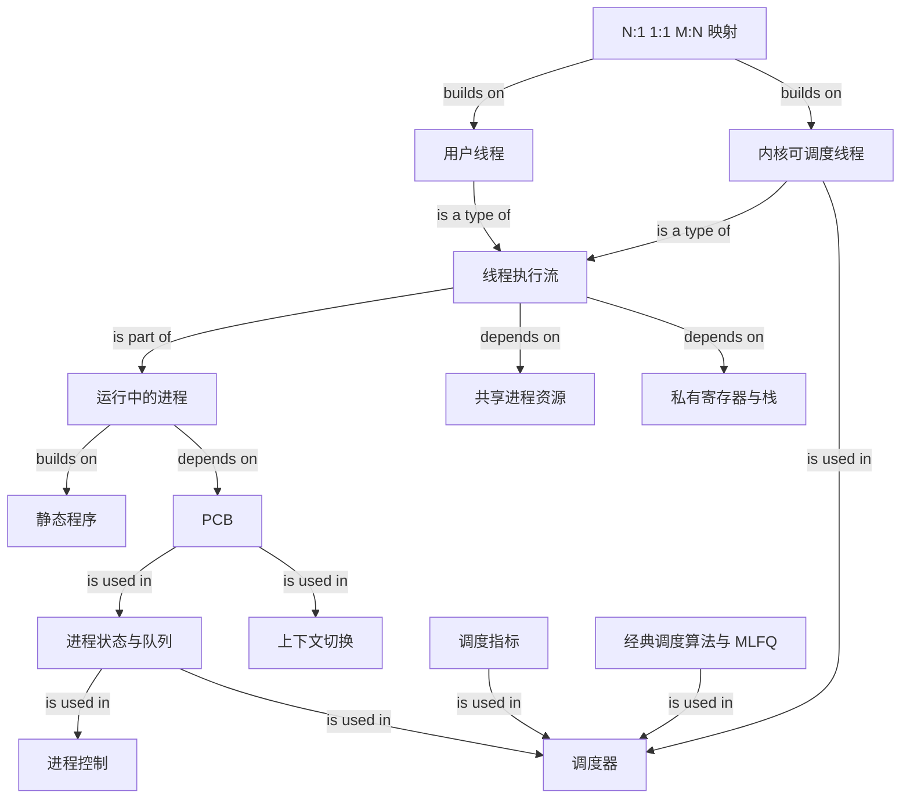

# 进程、线程与调度基础

### 1. Topic Overview

- What this is about: 本章从“静态程序如何成为正在运行的进程”出发，解释进程状态、PCB、进程控制与上下文切换，再引入线程、用户线程/内核线程/LWP，最后用调度指标和六类经典算法说明操作系统如何选择下一个执行者。
- Why it matters: 这是理解并发编程、系统调用阻塞、线程切换、CPU 利用率、响应延迟和调度算法的共同基础，也是回答“进程与线程有什么区别”“为什么上下文切换有成本”“某进程为什么还没运行”等面试题的主干。
- Difficulty level: 中等。真正的难点不是背定义，而是区分相邻边界：程序 vs 进程、就绪 vs 阻塞、阻塞 vs 挂起、CPU 上下文 vs 进程上下文、资源所有者 vs 调度单位、等待时间 vs 响应时间。
- Prerequisites: CPU、寄存器、程序计数器、内存与虚拟地址空间、I/O、中断、单核与多核。
- Source: `materials/os/4_process/process_base.md`，按原文顺序完整整理。
- Source boundary: 原文明确采用操作系统课程中的理论模型，而不是某个 Linux/Windows 版本的源码实现。五状态/七状态模型、PCB/TCB 和线程映射适合建立概念框架；具体内核的数据结构、调度实体与切换优化可能不同。

### 2. Core Concepts

#### Schema 1: 用“静态配方 → 运行实例 → 执行流”区分程序、进程和线程

- Definition: 程序是存储在磁盘上的静态代码与数据；进程是程序的一次运行实例，拥有运行状态和资源；线程是进程中的一条执行流。同一个程序可以启动为多个相互独立的进程，一个进程也可以包含多条线程。
- Intuition: 菜谱是程序；一次实际做菜是进程；洗菜、炒菜等可安排的执行路线是线程。菜谱本身不会占用 CPU，运行实例才会被操作系统管理。
- Example: 同一个播放器可执行文件启动两次，磁盘上仍是一份程序文件，但运行中存在两个进程。每个进程内部又可有读取、解码、播放线程。
- Common mistakes: 把可执行文件本身叫进程；认为一个程序只能对应一个进程；把线程当成进程之外的实体。

并发与并行也要在这一层分清：

- 并发：多个任务在一段时间内都取得进展；单核可通过快速交替产生并发。
- 并行：多个任务在同一时刻实际执行，通常需要多个执行核心。

#### Schema 2: 用“能不能立刻运行 + 是否在内存”判断进程状态

- Definition: 三个基本状态是运行、就绪和阻塞。运行态正在占用 CPU；就绪态已经具备运行条件，只差 CPU；阻塞态正在等待事件，即使马上给 CPU 也不能继续。创建态与结束态补成五状态；理论模型再用挂起维度表示进程主体暂不在内存，可形成就绪挂起与阻塞挂起。
- Intuition: “缺 CPU”是就绪，“缺事件”是阻塞，“暂不在内存”是挂起；这三个判断维度不能混成一个“没运行”。
- Example: 时间片用完是 `运行 → 就绪`；发起磁盘 I/O 并等待是 `运行 → 阻塞`；I/O 完成后是 `阻塞 → 就绪`，不是直接变运行，因为还需等待调度器选择。
- Common mistakes: 把就绪说成等待 I/O；认为阻塞进程获得 CPU 后就能运行；把 I/O 完成直接写成阻塞到运行；把挂起与阻塞当同义词。

状态转换主干：

```text
创建 -> 就绪 -> 运行 -> 结束
          ^      |
          |      +-- 时间片用完/被抢占 -> 就绪
          |      +-- 等待事件 ----------> 阻塞
          +------------- 事件完成 -------+
```

挂起边界：原文把换出到外存作为挂起的主要解释。应记住“阻塞/就绪描述运行条件，挂起描述驻留条件”。原文还将 `sleep` 与 `Ctrl+Z` 放入挂起示例；不同系统中的实际状态名和实现未必与课程七状态模型一一对应。

#### Schema 3: 用“PCB + 状态队列”理解进程如何被操作系统管理

- Definition: PCB（Process Control Block）是操作系统描述和管理一个进程的核心数据结构。它记录身份、状态/优先级、资源清单以及恢复执行所需的 CPU 上下文。具有相同等待条件或状态的 PCB 可组织进就绪队列、不同事件的阻塞队列等。
- Intuition: 进程暂停后并没有“消失”；PCB 像档案卡，既说明它是谁、拥有什么，也保存下次从哪里继续。
- Example: 进程因磁盘读取阻塞时，内核保存现场、修改 PCB 状态，并把 PCB 放进对应 I/O 事件的阻塞队列；事件完成后再移到就绪队列。
- Common mistakes: 把 PCB 等同于 PID；认为 PCB 只保存寄存器；把所有阻塞进程放进一个不区分事件的队列；认为进程代码本身会记录调度状态。

PCB 四类信息：

| 类别 | 典型内容 | 解决的问题 |
| --- | --- | --- |
| 描述信息 | 进程标识、用户标识 | 它是谁、属于谁 |
| 控制与管理 | 状态、优先级 | 当前能否运行、如何调度 |
| 资源清单 | 地址空间、打开文件、I/O 设备 | 它拥有什么 |
| CPU 相关 | 寄存器、程序计数器等 | 下次从哪里继续 |

“PCB 是进程存在的唯一标识”是原文表述；更稳妥的边界是：PID 是标识符，PCB 是内核中代表和管理进程的核心对象，进程存在期间必有相应的内核管理结构。

#### Schema 4: 用“改状态 + 搬队列 + 管资源”拆解进程控制

- Definition: 创建、终止、阻塞和唤醒并不是抽象口令，而是围绕 PCB、资源与队列执行的一组状态变更。
- Intuition: 控制一个进程，就是更新它的档案、把它放到正确队伍，并在生命周期边界分配或回收资源。
- Example:
  - 创建：申请并初始化 PCB，分配必要资源，插入就绪队列。
  - 终止：定位 PCB，停止执行，处理子进程，回收资源，从队列删除 PCB。
  - 阻塞：保存现场，改为阻塞态，插入特定事件的阻塞队列。
  - 唤醒：事件发生后移出阻塞队列，改为就绪态，再插入就绪队列。
- Common mistakes: 认为唤醒后立即运行；认为阻塞进程可以在等待事件尚未发生时自己变回就绪；只改状态却忘记移动队列。

原文在终止部分使用“孤儿进程由 1 号进程收养”的 Unix 风格例子。学习时抓住通用机制：父进程结束后，仍存活子进程需要被系统指定的新父级接管；具体接管者取决于系统实现与环境。

#### Schema 5: 用“保存旧现场 → 装载新现场”运行上下文切换模型

- Definition: CPU 上下文至少包含寄存器与程序计数器。上下文切换先保存旧任务的 CPU 上下文，再装载新任务的上下文，并从新程序计数器所指位置继续。任务可以是进程、线程或中断，因此对应不同切换类型。
- Intuition: 切换不是“重新执行程序”，而是保存书签和手边状态，换上另一本书的书签；切回时从原位置续读。
- Example: 进程 A 时间片耗尽，内核保存 A 的寄存器和 PC，调度进程 B，恢复 B 先前保存的寄存器和 PC，于是 B 看起来从暂停处连续运行。
- Common mistakes: 只说保存 PC、不保存寄存器；把上下文切换当成每次从 `main` 开始；认为切换本身完成了业务工作。

进程上下文比纯 CPU 上下文更宽。按原文理论模型，进程切换还涉及地址空间、栈、全局变量相关的内存管理上下文，以及内核栈等内核资源。常见触发包括：

- 时间片耗尽；
- 等待资源或主动睡眠；
- 更高优先级任务抢占；
- 硬件中断使 CPU 转去执行中断处理。

边界：中断上下文切换与“调度到另一个进程”不是同一件事；中断到来会先切入中断处理，返回时是否发生进程调度还取决于内核状态与调度决定。

#### Schema 6: 用“资源平台 vs 执行流”比较进程和线程

- Definition: 进程是资源拥有/分配的基本单位，线程是 CPU 调度的基本单位。同一进程的线程共享代码段、数据段、地址空间和打开文件等资源，但每个线程独有寄存器与栈，以保持独立控制流。
- Intuition: 进程像一间共享办公室，线程像其中的工作人员。办公室、文件柜和公共资料共享；每个人的当前思路与工作草稿必须私有。
- Example: 播放器的读取、解码、播放线程共享缓冲区和文件，但每个线程有自己的调用栈和程序执行位置。
- Common mistakes: 说线程共享所有内容；认为同进程线程拥有不同虚拟地址空间；说线程切换完全没有成本。

线程通常比进程开销小：

- 创建/终止时不必建立或回收一整套独立资源平台；
- 同进程线程切换不需切换整个地址空间，主要切换寄存器、栈等私有执行上下文；
- 共享内存使数据交换不必先复制到另一个进程的独立地址空间。

但共享也扩大故障影响。原文以 C/C++ 为例指出，一个线程发生未被处理的致命故障可能终止整个进程，其他线程也随之消失。不要把它泛化成“任何语言、任何线程异常都必然杀死进程”。

#### Schema 7: 用“内核看见几个调度实体”比较线程实现模型

- Definition: 用户线程由用户态线程库管理，TCB 在用户空间；内核线程由内核管理，TCB/调度信息在内核。LWP 是内核支持并可被调度的执行实体，可在用户线程与内核线程之间形成不同映射。
- Intuition: 真正决定并行能力和阻塞范围的关键，不是应用创建了几个“线程对象”，而是内核最终能独立调度几个执行实体。
- Example: N:1 模型有多个用户线程但只对应一个内核调度实体；若一个用户线程发起阻塞系统调用，整个映射可能无法继续，且不能在多个 CPU 核上同时执行。
- Common mistakes: 看到多个用户线程就断言一定能多核并行；认为用户线程切换必须进入内核；认为 1:1 只有收益没有内核管理成本。

| 模型 | 内核可独立调度的实体 | 主要收益 | 主要代价 |
| --- | --- | --- | --- |
| N:1 | 1 个 | 用户态切换快、管理开销小 | 一个阻塞可能影响全部；不能充分多核并行 |
| 1:1 | 与用户线程数对应 | 阻塞隔离，可真正多核并行 | 创建、终止、切换需要更多内核成本 |
| M:N | 多个但少于/不必等于用户线程数 | 兼顾用户态管理与多核并行 | 两级调度与实现更复杂 |

按原文模型继续展开：

- 用户线程的 TCB、创建、终止、同步和调度都由用户态线程库维护，切换时不必进入内核，因此很快；但在 N:1 模型中，内核只给整个进程一个可调度实体。某用户线程进入阻塞系统调用可能拖住全部用户线程；若运行库采用协作式调度，当前线程不主动让出时，其他用户线程也不能获得执行机会。
- 内核线程由操作系统创建、终止和调度。一个内核线程阻塞时，内核仍可调度同进程的其他内核线程，也可让它们在多核并行；代价是内核要维护上下文，线程操作与切换的系统成本更高。
- 原文把 LWP 描述为“内核支持的用户线程”：每个 LWP 与一个内核线程一一映射，拥有完成调度所需的最小执行上下文；用户线程再映射到一个或多个 LWP，形成 1:1、N:1、M:N 或组合模式。

边界：不同操作系统和资料对 LWP、用户线程、内核线程的命名并不完全统一。这里应掌握“用户态线程数 → 内核可独立调度实体数”的映射与取舍，不要把术语表述当成跨系统不变的数据结构。

#### Schema 8: 用“状态变化 + 时钟中断”判断调度时机与抢占性

- Definition: 调度器从就绪集合选择下一个运行实体。运行者阻塞、结束或就绪实体被选中时需要调度；抢占式系统还可借助时钟中断在时间片结束时夺回 CPU，非抢占式算法通常等待当前任务阻塞或结束。
- Intuition: 非抢占式像“办完或主动离开才换人”；抢占式像“定时器响就必须交出窗口”。
- Example: 进程发起 I/O 后进入阻塞态，CPU 不能空等，调度器立即从就绪队列选另一个任务。若只是时间片到期，则运行者通常回到就绪队列。
- Common mistakes: 认为非抢占式没有任何中断；把 `就绪 → 运行` 当成运行者主动完成的变化；认为抢占只发生在更高优先级任务到来时。

原文调度章节继续沿用“进程调度”的课程术语，但专门说明此处把进程视为只有主线程的进程；若进程有多个线程，实际调度对象仍应理解为线程/内核可见执行实体。

#### Schema 9: 用“系统效率、完成速度、首次反馈”区分调度指标

- Definition: 调度目标不是一个单一的“快”，而是多个可能冲突的指标。
- Intuition: 工厂关心机器别闲着和一天完成多少单；单个客户关心总共等多久、排队多久、第一次多久得到回应。
- Example: 一个交互任务很快输出“已收到”但最终完成较晚：响应时间可能很好，周转时间却不一定好。
- Common mistakes: 把等待时间算上阻塞 I/O；把响应时间当完成时间；认为提高吞吐量必然缩短每个任务的响应时间。

| 指标 | 含义 | 易混边界 |
| --- | --- | --- |
| CPU 利用率 | CPU 忙碌时间比例 | 高利用率不保证单个请求快 |
| 吞吐量 | 单位时间完成的任务数 | 偏爱短任务可能伤害长任务 |
| 周转时间 | 从提交/到达到完成的总时间 | 包含运行、就绪等待和阻塞等 |
| 等待时间 | 在就绪队列等待 CPU 的时间 | 不等于 I/O 阻塞时间 |
| 响应时间 | 提交到首次产生响应的时间 | 不等于最终完成时间 |

#### Schema 10: 用“选择规则 + 是否抢占 + 饥饿/切换代价”比较经典算法

- Definition: 调度算法要同时描述选谁、运行多久、何时换人以及会牺牲哪个指标。
- Intuition: 不能只背名字；要能给出具体队列时的选择结果，并指出它用什么代价换取什么收益。
- Example: 长任务先到、多个短任务后到时，FCFS 让短任务长等；SJF 优先短任务提高吞吐，但持续到达的短任务可能让长任务饥饿。
- Common mistakes: 认为 FCFS 对所有人都公平；认为 SJF 可准确预知未来服务时间；认为 RR 时间片越短越公平所以越好；忽略优先级饥饿。

| 算法 | 选择/运行规则 | 主要收益 | 主要问题 |
| --- | --- | --- | --- |
| FCFS | 选最早进入队列者，阻塞或结束才换 | 简单，利于长 CPU 作业 | 队首长作业拖累短作业 |
| SJF | 优先预计服务时间最短者 | 平均等待/吞吐表现好 | 长作业饥饿；服务时间难预知 |
| HRRN | 选响应比最高者 | 用等待增长兼顾长短作业 | 仍需估计服务时间，偏理论 |
| RR | 每个任务运行一个时间片 | 公平、交互响应较好 | 太短切换多，太长接近 FCFS |
| HPF | 选最高优先级者，可抢占或非抢占 | 表达任务重要性 | 低优先级饥饿；需动态老化 |
| MLFQ | 多级队列，高级短时间片；用完降级，高级到达可抢占 | 兼顾短任务响应与长任务进展 | 参数和行为更复杂 |

HRRN 的响应比：

```text
响应比 = (等待时间 + 要求服务时间) / 要求服务时间
       = 1 + 等待时间 / 要求服务时间
```

同等待时间下，短任务响应比更高；同服务时间下，等待越久响应比越高。因此它用“等待带来的老化”缓解长任务饥饿，但要求服务时间通常无法精确预知。

RR 的核心取舍：时间片过短，上下文切换占比上升；时间片过长，短任务的首次响应变慢并逐渐接近 FCFS。原文给出 `20ms~50ms` 作为教学性的常见折中，不能当作所有系统和负载的固定最佳值。

#### Schema 11: 用“新任务入高队列 + 用满时间片降级”运行 MLFQ

- Definition: 多级反馈队列设置多个从高到低的优先级队列，优先级越高通常时间片越短。新任务进入最高队列；若用满时间片仍未完成则降到下一队列；只有高队列为空才运行低队列，高队列新任务到来可抢占低队列任务。
- Intuition: 系统先假设新任务可能很短，给它快速响应；持续占用 CPU 的任务逐步获得更长时间片但更低优先级。
- Example: 新任务 A 在第一级短时间片内完成，快速离开；长任务 B 连续用满时间片后逐级下沉，但在低级队列获得更长运行片段。
- Common mistakes: 认为所有队列时间片相同；认为降级后永不再运行；忘记高优先级新任务会抢占低队列；把“用满时间片”误解为每次等待后都降级。

### 3. Deep Understanding

全章可以压缩成三个相互连接的模型。

第一条是“操作系统管理谁”：

```text
磁盘上的程序
-> 启动为拥有资源与状态的进程
-> 进程内有一个或多个执行线程
-> 内核调度可见的执行实体
```

第二条是“任务为什么离开或得到 CPU”：

```text
就绪 --调度选中--> 运行
运行 --时间片/抢占--> 就绪
运行 --等待事件----> 阻塞
阻塞 --事件完成----> 就绪
```

PCB/TCB 保存了状态与恢复现场，队列把当前条件相同的任务组织起来；调度器只从可运行集合选择。所以上下文切换是“机制”，调度算法是“策略”：前者回答怎么换，后者回答换给谁。

第三条是“共享与隔离的成本”：

```text
独立进程：资源隔离强、通信与切换更重
同进程线程：资源共享多、通信与切换更轻、故障与数据竞争影响面更大
```

线程模型进一步决定：内核到底能看见并独立调度多少执行实体。N:1 主要把调度留在用户态，换取低切换成本，却牺牲阻塞隔离和多核并行；1:1 把每个线程交给内核调度，换取并行和阻塞隔离，但增加内核管理成本；M:N 尝试折中。

调度算法没有无条件最优者。FCFS 简单却有队首阻塞效应；SJF 偏向短作业但会饿死长作业；HRRN 用等待时间增加优先级；RR 用时间片换交互公平；HPF 表达重要性但需要防饥饿；MLFQ 用任务实际耗用 CPU 的行为动态分类。选择算法，本质上是在利用率、吞吐量、周转、等待、响应和切换开销间取舍。

### 4. Minimal Working Example

场景：单核机器运行一个多线程播放器，进程 P 内有读取线程 R、解码线程 D、播放线程 V，同时还有另一个编辑器进程 E。

Reasoning flow:

1. 播放器文件和编辑器文件是静态程序；启动后 P、E 是两个运行实例。
2. R、D、V 是 P 内三条执行流，共享 P 的地址空间、视频文件和缓冲区，但各自有寄存器、PC 与栈。
3. 单核任一瞬间只能执行其中一个线程；一段时间内快速交替属于并发，不是并行。
4. R 发起磁盘 I/O 后，从运行态进入阻塞态；它不是“只差 CPU”，所以不能留在就绪队列。
5. 内核保存 R 的执行上下文，把它放入相应事件的阻塞队列，再调度 D、V 或 E。
6. 磁盘完成后，R 被唤醒到就绪态；它仍需等待调度，不能直接假设立刻运行。
7. 若在 D 与 V 之间切换，因为同属 P，地址空间保持共享，只需切换线程私有执行上下文；若从 D 切到 E，则还要切换进程级资源上下文。
8. 若采用 RR，时间片太短会让上述保存/恢复过于频繁；太长则可能让播放操作的响应变差。

### 5. Knowledge Graph



### 6. Self-Test Questions

Recall:

1. 程序、进程、线程分别是什么？单核快速交替为什么是并发而不是并行？
2. 就绪态和阻塞态都没有占用 CPU，它们的本质差别是什么？
3. PCB 中哪四类信息分别支持身份识别、调度管理、资源管理和断点恢复？

Application / transfer:

4. 线程 A 等待网络数据，数据到达后被唤醒。请写出 `运行 → ? → ? → 运行` 的状态链，并说明其中哪一步必须经过调度器。
5. 某运行库创建 100 个用户线程，却只映射到一个内核线程。判断它能否在 8 核上真正并行，以及其中一个线程执行阻塞系统调用可能影响谁。

Explain like I am 5:

6. 用“共享办公室与工作人员”解释为什么同进程线程切换通常更轻，但一个线程的致命错误可能影响同进程的其他线程。

### 7. Weak Point Detection

- 把程序文件、进程运行实例和线程执行流混在一起，说明管理层级尚未建立。
- 说单核多个任务“同时执行”，说明并发与并行边界不稳。
- 只要没运行就统称阻塞，说明没有用“缺 CPU vs 缺事件”判断状态。
- 把阻塞到运行画成直接箭头，说明遗漏了就绪队列与调度选择。
- 把挂起当阻塞同义词，说明没有区分运行条件与内存驻留条件。
- 把 PCB 当 PID 或只当寄存器备份，说明没有形成进程管理对象模型。
- 认为同进程线程共享栈和寄存器，说明共享/私有边界错误。
- 认为用户线程数量等于内核可并行数量，说明没有按内核可见调度实体分析。
- 把等待时间算入 I/O 阻塞时间，或把响应时间当完成时间，说明调度指标边界错误。
- 只会背算法名字，不能在具体队列上预测选择、抢占、降级或饥饿，说明算法尚未成为可运行 schema。
