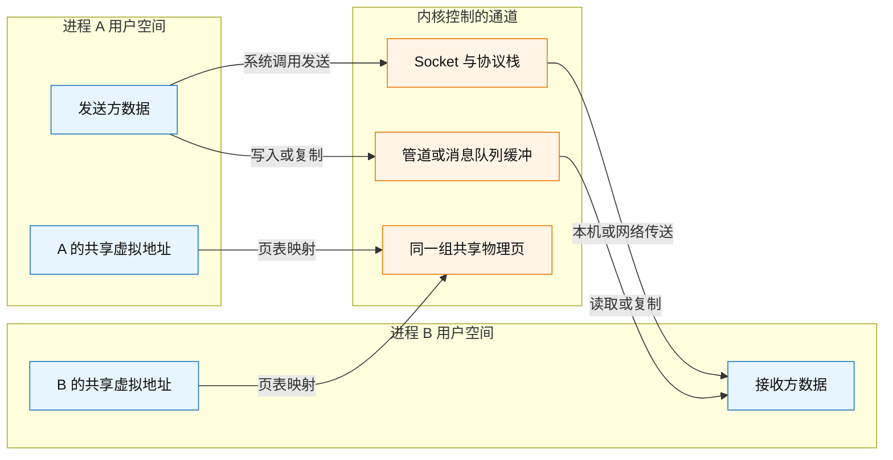
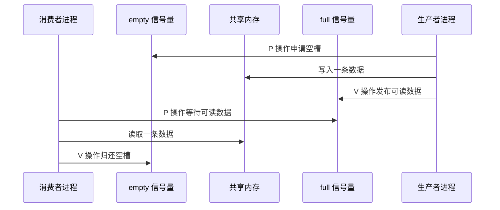
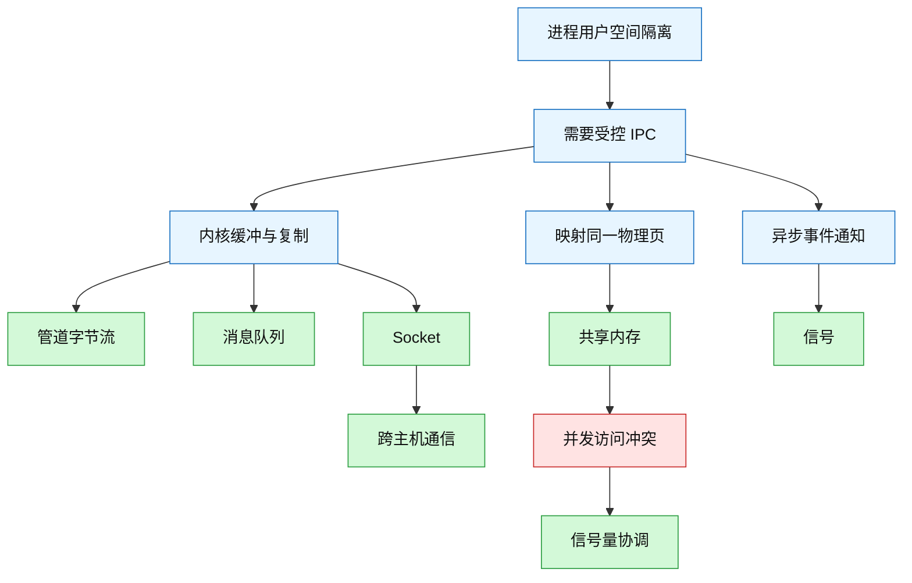
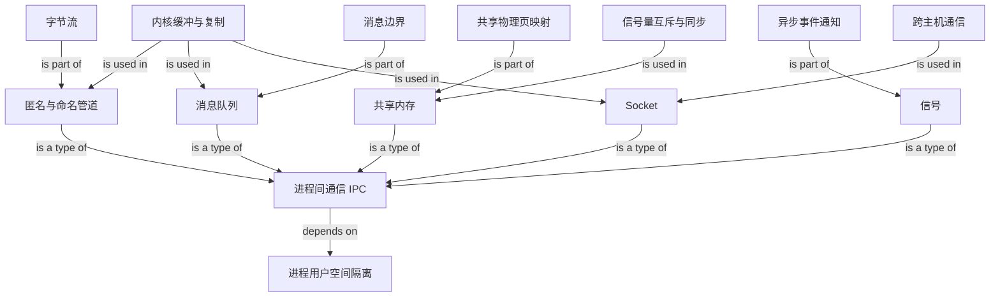

# 5.2 进程间通信：管道、消息队列、共享内存、信号量、信号与 Socket

### 1. Topic Overview

- What this is about: 解释相互隔离的进程为何需要 IPC（Inter-Process Communication），以及 Linux 中管道、消息队列、共享内存、信号量、信号和 Socket 的数据路径、适用范围与代价。
- Why it matters: 面试题通常不只问“有哪些方式”，还会继续追问数据放在哪里、是否复制、能否跨主机、是否保留消息边界，以及通信和同步如何配合。
- Difficulty level: 中等。名词不难，难点是不要把“传数据”“通知事件”“协调访问”混成同一种能力。
- Prerequisites: 进程拥有独立用户虚拟地址空间；用户态不能直接访问内核空间；文件描述符可在 `fork` 后继承；虚拟地址可通过页表映射到物理页；阻塞进程要等事件完成后回到就绪态。
- Source: `materials/os/4_process/process_commu.md`，按原文顺序通读：管道 → 消息队列 → 共享内存 → 信号量 → 信号 → Socket → 总结。

本章路线：

1. 先建立“进程隔离为什么逼出 IPC”的总模型。
2. 再按数据表示比较管道、消息队列和共享内存。
3. 把信号量单独看成协调机制，把信号看成异步通知机制。
4. 最后用 Socket 扩展到本机无关进程和跨主机通信，并形成选型框架。

### 2. Core Concepts

#### Schema 1: 用“隔离边界 → 受控通道”解释为什么需要 IPC

- Definition: 不同进程通常拥有彼此独立的用户虚拟地址空间，一个进程不能直接解引用另一个进程的普通用户地址。操作系统因此提供受控的内核对象、映射或协议端点，让数据或事件越过隔离边界。
- Intuition: 两间上锁的办公室不能直接拿对方桌上的文件；它们要通过走廊里的投递箱、公共白板或电话交换信息。隔离保护了进程，也使通信必须显式建立通道。
- Example: A 进程里的指针 `0x1000` 与 B 进程里的 `0x1000` 通常由各自页表映射到不同物理页。A 不能仅把这个数值告诉 B，就让 B 读到 A 的对象；双方必须使用管道、队列、共享映射或 Socket 等约定好的机制。
- Common mistakes:
  - 认为所有进程“共享内核空间”就等于用户代码可以直接读写任意内核地址。
  - 认为相同虚拟地址天然指向同一物理内存。
  - 只背 IPC 名称，不追踪数据究竟经过内核缓冲、共享物理页还是协议栈。

#### Visual Model: 不同 IPC 的数据到底走哪条路？



- How to read: 上两条路径通过内核对象搬运数据；共享内存则让两个用户虚拟地址落到同一物理页，映射建立后双方直接读写该页。
- Source anchor: `process_commu.md` 开头、`消息队列`、`共享内存` 与 `Socket`。
- Boundary: “借助内核”不都意味着每个字节必须在内核缓冲中复制；共享内存由内核建立和管理映射，但稳态读写直接访问共享页。

#### Schema 2: 用“内核字节流 + 两个端点”运行管道模型

- Definition: 管道是内核维护的有限缓冲区。`pipe(fd)` 返回读端 `fd[0]` 和写端 `fd[1]`；写入端产生无格式字节流，读取端按 FIFO 顺序消费。普通管道是单向的，双向通信通常需要两条管道或其他双工机制。
- Intuition: 管道像一根只规定流向、不规定“每封消息边界”的水管。读者看到的是字节序列，应用层自己决定怎样切分记录。
- Example: shell 执行 `ps auxf | grep mysql` 时，shell 先建立管道，再创建两个子进程，把前者标准输出接到写端，把后者标准输入接到读端；A 与 B 是兄弟进程，但都从 shell 获得了同一管道的相关文件描述符。
- Common mistakes:
  - 把匿名管道说成磁盘上的普通文件；它是内核中的管道对象，通常只在内存中存在。
  - 认为 `fork` 后父子进程得到两份互不相关的管道；复制的是描述符，底层仍引用同一个内核对象。
  - 认为管道保留消息边界或支持 `lseek`；它是顺序字节流。
  - 看到命名管道路径就认为数据写进了普通磁盘文件；路径用于命名和打开 FIFO，数据仍经过内核管道缓冲。

匿名管道与命名管道：

| 维度 | 匿名管道 | 命名管道 FIFO |
| --- | --- | --- |
| 如何找到通道 | 通过继承或传递文件描述符 | 通过文件系统路径打开 |
| 典型通信范围 | 有共同创建者、常见为亲缘进程 | 可用于互不相关的本机进程 |
| 生命周期 | 引用关闭后内核对象消失 | FIFO 名称留在文件系统，数据缓冲仍是临时的 |
| 数据模型 | 单向 FIFO 字节流 | 单向 FIFO 字节流 |

#### Visual Model: `fork` 后怎样形成一写一读？


- How to read: `pipe` 必须先于 `fork`，这样父子两边的描述符才引用同一个管道；随后关闭不用的一端，把混乱的四端状态收缩成明确的单向路径。
- Source anchor: `process_commu.md §管道`，`pipe(fd[2])`、`fork` 与关闭端点示例。
- Boundary: 原文把匿名管道概括为“只能用于父子关系”。这是最常见用法；更精确地说，通信进程必须设法持有引用同一管道的文件描述符，描述符也可通过更高级机制传递。

原文 FIFO 示例里 `echo "hello" > myPipe` 在没有读者时停住，更准确的解释是：默认阻塞模式下，写端 `open` 往往要等待读端打开，而不是必须等到“所有已写字节都被读完”后命令才能退出。管道读写是否阻塞还取决于端点是否存在、缓冲是否满/空和阻塞模式。

#### Schema 3: 用“消息边界 + 内核队列”比较消息队列与管道

- Definition: 消息队列是内核维护的消息集合；发送方提交一条有边界的消息，接收方稍后按约定读取，读取后该消息通常从队列移除。它不同于管道的无格式连续字节流。
- Intuition: 管道像连续水流，消息队列像一封封带边界的信件。发送者投递后可与接收者在时间上解耦，但邮局要保存、复制和限制信件。
- Example: A 把“订单号 + 操作类型”作为一条消息放入队列后返回；B 稍后读取完整消息。双方必须约定消息结构和类型，不能让发送方按结构 X 写、接收方按结构 Y 解码。
- Common mistakes:
  - 把消息队列说成共享内存上的普通链表；这里的队列对象和消息由内核管理。
  - 认为消息一定都是同一个固定长度；更稳妥的边界是每条消息有明确长度和上限，接收双方要约定格式。
  - 忽略两次复制：发送时用户态到内核态，接收时内核态到用户态。
  - 认为队列无容量限制或适合传输任意大对象。

管道与消息队列的关键差别：

| 问题 | 管道 | 消息队列 |
| --- | --- | --- |
| 数据边界 | 字节流，不保留应用消息边界 | 一条条消息，有边界和类型/格式约定 |
| 时间解耦 | 常见为生产者与消费者同时围绕流工作 | 发送后可由接收者稍后读取 |
| 内核开销 | 内核缓冲与读写 | 内核保存消息，发送与接收均有复制 |
| 大数据 | 缓冲有限，不适合随意塞大块数据 | 单条与队列总量均受限，也不适合大数据 |

#### Schema 4: 用“不同虚拟地址 → 同一物理页”解释共享内存

- Definition: 内核把 A、B 各自地址空间中的某段虚拟地址映射到同一组物理页。映射建立后，一方写共享页，另一方读取同一物理数据，无需把每条消息再次复制进内核队列再复制出来。
- Intuition: 不是把 A 的整个地址空间交给 B，而是在两间办公室之间建立一块受控公共白板。
- Example: A 在共享区写入一帧图像，B 直接从共享区处理它；这比把整帧先复制进消息队列、再复制到 B 更适合大块高频数据。
- Common mistakes:
  - 认为两个进程必须使用相同虚拟地址；虚拟地址可不同，只要映射到同一物理页。
  - 认为共享内存自动解决并发写入；它只提供共同数据区，不保证访问顺序与复合操作原子性。
  - 认为共享内存完全不需要内核或系统调用；创建、映射和权限管理仍由内核完成，稳态数据访问才不需要逐条经内核复制。
  - 把 Cache coherence 当成应用级同步；硬件可维护缓存副本一致性，但不能自动让 `read-modify-write` 临界区正确。

#### Schema 5: 用“传数据 vs 管秩序”区分共享内存与信号量

- Definition: 共享内存承载数据；信号量是计数与等待/唤醒机制，主要协调谁何时可以使用资源。经典 P 操作申请资源，V 操作释放资源或通知条件完成，两者要求原子执行。
- Intuition: 公共白板负责放数据，门口的令牌负责控制谁能进去。令牌不替代白板，白板也不会自动排队。
- Example 1 — 互斥: 信号量初值为 `1`。A 执行 P 后进入共享区；B 再执行 P 时等待；A 完成后 V，B 才能继续。它表达“同时最多一个访问者”。
- Example 2 — 同步: 信号量初值为 `0`。消费者先 P 会等待；生产者写好数据后 V，消费者再读取。它表达“先生产，后消费”。
- Common mistakes:
  - 把信号量当作保存业务消息的容器。
  - 只对共享内存加锁，却没有定义“数据已生产”的顺序条件；互斥和同步回答的问题不同。
  - P 成功后忘记 V，导致其他参与者永久等待。
  - 把教材中的负计数值当成所有 API 都可直接观察到的实现；这是经典语义模型，具体内核实现可把等待者另存在队列中。

#### Visual Model: 共享内存为什么还要信号量？



- How to read: 共享内存承担数据搬运；`empty/full` 信号量只建立容量约束和“先写后读”的顺序。若还有多个生产者或消费者，通常还需互斥保护共享索引。
- Source anchor: `process_commu.md §共享内存` 与 `§信号量` 的互斥、生产者/消费者示例。
- Boundary: 图把文章的一只同步信号量扩成了常见的有界缓冲区模型，用来显式区分数据、容量与顺序；实际实现还要处理退出、错误和唤醒语义。

#### Schema 6: 用“异步事件通知”定位信号，而不是把它当数据通道

- Definition: 信号向进程或线程通知某类异步事件。接收方可以采用默认动作、安装处理函数捕捉，或对允许的信号忽略/阻塞。`SIGKILL` 与 `SIGSTOP` 不能被捕捉、阻塞或忽略。
- Intuition: 信号像火警铃：它擅长告诉你“某件事发生了”，不擅长运送一大箱业务数据。
- Example: 终端按 `Ctrl+C` 通常向前台进程组发送 `SIGINT`；`kill -TERM <pid>` 请求目标终止；子进程状态变化可使父进程收到 `SIGCHLD`。
- Common mistakes:
  - 混淆 signal 与 semaphore：信号传事件，信号量协调资源数量和顺序。
  - 认为 `kill` 命令必然杀进程；它的本质是发送指定信号，具体动作取决于信号和处置方式。
  - 在信号处理函数中调用任意不安全函数；异步信号处理有严格的可重入/async-signal-safe 限制。
  - 把普通信号当可靠消息队列；传统非实时信号可能合并，携带数据能力也有限。

原文称信号为“唯一的异步通信机制”，应理解为本章分类中专门面向异步事件通知的机制，而不是断言 Linux 中其他 I/O/IPC 永远不能异步使用。

#### Schema 7: 用“通信域 + 数据语义”选择 Socket

- Definition: Socket 是内核提供的通信端点。`socket(domain, type, protocol)` 中，`domain` 决定地址/协议族，`type` 决定字节流、数据报等语义，`protocol=0` 通常表示让内核选择与前两者匹配的默认协议。
- Intuition: 先决定“打本地内线还是跨主机电话”，再决定“连续通话还是一封封独立电报”。
- Example:
  - `AF_INET + SOCK_STREAM`: 典型为 IPv4 TCP 字节流。
  - `AF_INET + SOCK_DGRAM`: 典型为 IPv4 UDP 数据报。
  - `AF_UNIX/AF_LOCAL + SOCK_STREAM` 或 `SOCK_DGRAM`: 同一主机上的本地 Socket。
- Common mistakes:
  - 说 Socket 只能跨主机；Unix domain socket 专用于本机 IPC。
  - 把 TCP 监听 socket 与 `accept` 返回的已连接 socket 当成同一个职责；前者接收连接请求，后者服务某条已建立连接。
  - 认为 UDP 有 `listen/accept` 或必须先建立连接；无连接数据报常用 `sendto/recvfrom`。
  - 认为每个 UDP socket 都必须显式 `bind`；未显式绑定时，内核通常可在首次发送时分配本地地址和临时端口，但服务端要在已知端口接收就需显式绑定。

三种编程模型：

| 模型 | 关键调用链 | 数据语义 | 关键边界 |
| --- | --- | --- | --- |
| TCP | server: `socket → bind → listen → accept → read/write`; client: `socket → connect → read/write` | 可靠有序字节流，不保留应用消息边界 | `accept` 返回已连接 socket；一次 `write` 不保证对应一次 `read` |
| UDP | 常见为 `socket → bind`，用 `sendto/recvfrom` 传对端地址 | 无连接数据报，保留报文边界 | 不保证可靠、有序或不重复；发送端可隐式绑定 |
| Unix domain | 接口类似流/数据报 Socket，地址通常是本地路径或 Linux 抽象命名空间 | 本机字节流或数据报 | 不走外部网络路由，通常比本机 TCP/UDP 更轻；并非所有端点都必须绑定路径 |

`protocol` 参数并非“已经废弃”；常见 TCP/UDP 组合写 `0` 即可选择默认协议，但在某些协议族或原始套接字中仍有区分作用。

#### Schema 8: 用“五个问题”做 IPC 选型

- Definition: 不按“哪个最快”单点选型，而是依次问通信范围、数据规模与频率、数据语义、同步要求、生命周期/故障边界。
- Intuition: 每种 IPC 都在复制成本、结构化程度、耦合、适用范围和编程复杂度之间取舍。
- Example: 同机两个进程高频交换大图像并需严格一写一读：共享内存承载图像，信号量或其他同步原语协调所有权；若要跨主机，则改用 Socket，并在应用层设计消息协议。
- Common mistakes:
  - 一律选择共享内存，却忽略同步、生命周期和崩溃恢复复杂度。
  - 为少量单向 shell 流使用复杂队列或共享内存。
  - 用信号承载大批业务数据。
  - 因为 Socket 能做所有场景，就忽略本地专用机制的简单性或成本优势。

五个选型问题：

1. 是否跨主机？跨主机优先考虑 Socket；同机才比较全部本地 IPC。
2. 数据是字节流、独立消息，还是大块共享对象？分别倾向管道/流 Socket、消息队列/数据报、共享内存。
3. 数据量和频率多大？大块高频数据更在意复制次数；小量控制信息更在意简单和边界清楚。
4. 只要通知，还是还要传数据、保证顺序或互斥？信号、信号量与数据通道的角色不同。
5. 参与者是否有亲缘关系、是否需要长期存在、崩溃后由谁清理？这决定描述符继承、命名对象和恢复策略。

### 3. Deep Understanding

本章不是六个孤立名词，而是一条由隔离和性能取舍推动的设计链。

第一层是隔离：进程拥有独立用户地址空间，默认不能直接读写对方数据。操作系统必须提供受控入口。管道、消息队列与 Socket 把数据放入内核管理的通道；共享内存则由内核修改映射关系，让双方看到同一物理页。

第二层是数据表示：

```text
管道 / TCP Socket       -> 连续字节流，应用自己分帧
消息队列 / UDP 数据报   -> 有消息或报文边界
共享内存               -> 共同数据结构，没有天然消息协议
信号                   -> 小型事件通知，不是大数据通道
信号量                 -> 访问资格与执行顺序，不承载业务数据
```

第三层是复制与协调的交换：消息队列通过内核消息获得边界、生命周期和时间解耦，却付出用户态/内核态复制与容量限制。共享内存减少稳态数据复制，却把序列化、互斥、同步、所有权、异常退出后的恢复交给应用。性能越靠近“直接共同读写”，正确性责任通常越多地落到通信双方。

第四层是范围：匿名管道最适合已有描述符关系的进程；FIFO 和 Unix domain socket 能让无亲缘本机进程通过名字会合；Internet socket 进一步把端点扩到不同主机。Socket 统一了本机与网络接口，但字节流或数据报仍需要应用层协议定义“消息是什么”。

关键因果链：



- How to read: 隔离先产生通信需求；不同机制在复制、映射和通知之间分路；共享映射消除了逐条复制，却进一步产生访问竞争，因此需要同步。
- Source anchor: 全章，尤其开头、`共享内存`、`信号量`、`Socket` 与总结。
- Boundary: 图强调主用途，不代表机制只能这样组合；例如 Socket 也可只传控制消息，消息队列也需要权限与同步语义。

### 4. Minimal Working Example

场景：同一台机器上，采集进程 P 每秒产生大型图像，分析进程 C 必须按顺序处理，且不能读到只写了一半的图像。

Reasoning flow:

1. P、C 的普通用户地址空间相互隔离，C 不能直接使用 P 的普通指针。
2. 内核为双方建立共享内存映射；P、C 的虚拟地址可不同，但指向同一组物理页。
3. 共享区设计为多个固定槽位，并维护读写索引。
4. `empty` 信号量记录空槽数，`full` 信号量记录完整图像数；若多个参与者会同时修改索引，再用互斥量保护索引临界区。
5. P 先 P(`empty`)，取得空槽；写完完整图像并发布必要的内存可见性后，再 V(`full`)。
6. C 先 P(`full`)，因此不会读取半成品；处理结束后 V(`empty`)，让槽位可复用。
7. 图像数据没有经历“P 用户区 → 内核消息 → C 用户区”的逐帧双复制；信号量只传递资格和顺序，不传图像本身。
8. 若 C 在另一台主机，共享物理页不再成立，应换成 Socket，并明确帧长度、分片、重试、背压和故障处理协议。

选择结果：同机大块高频数据使用“共享内存 + 同步原语”；跨机则使用“Socket + 应用层消息协议”。

### 5. Chapter Knowledge Map



### 6. Self-Test Questions

Recall:

1. 为什么两个进程即使使用相同虚拟地址，也不能默认直接读写同一份数据？
2. 管道、消息队列和共享内存在数据表示与复制路径上分别有什么核心差别？
3. 信号、信号量分别解决什么问题？为什么名字相近却不能互换？

Application / transfer:

4. 两个无亲缘关系的本机进程每分钟只交换几条有明确边界的小命令，你会优先比较哪些 IPC？请说明为什么不必默认上共享内存。
5. 一个服务要把每秒数百 MB 的数据交给另一台机器处理。共享内存为什么不适用？选择 Socket 后还必须由应用协议明确哪些边界？

Explain like I am 5:

6. 用“上锁办公室、公共白板、门口令牌、电话”解释进程隔离、共享内存、信号量和 Socket 的分工。

### 7. Weak Point Detection

- 只罗列六种 IPC，却说不出数据在哪里、经过几次用户态/内核态边界，说明尚未形成数据路径模型。
- 把相同虚拟地址当成共享数据，说明“虚拟地址 → 页表 → 物理页”的隔离前置 schema 不稳。
- 把管道当消息队列，说明没有区分字节流和消息边界。
- 说 `fork` 复制了两条管道，说明没有区分“复制文件描述符”和“共享底层内核对象”。
- 说共享内存天然线程/进程安全，说明把数据可见性与同步正确性混在一起。
- 把信号量当业务数据容器，或把信号当计数器，说明“数据、协调、通知”三类能力未分开。
- 认为 `accept` 后仍用监听 socket 传输所有连接数据，说明 TCP 两类 socket 的职责边界不稳。
- 认为 UDP 必须建立连接或每个端点都必须显式绑定，说明把 TCP 编程模型机械套到 UDP。
- 一看到“最快”就无条件选择共享内存，说明没有考虑同步复杂度、通信范围、消息边界、生命周期和故障恢复。
