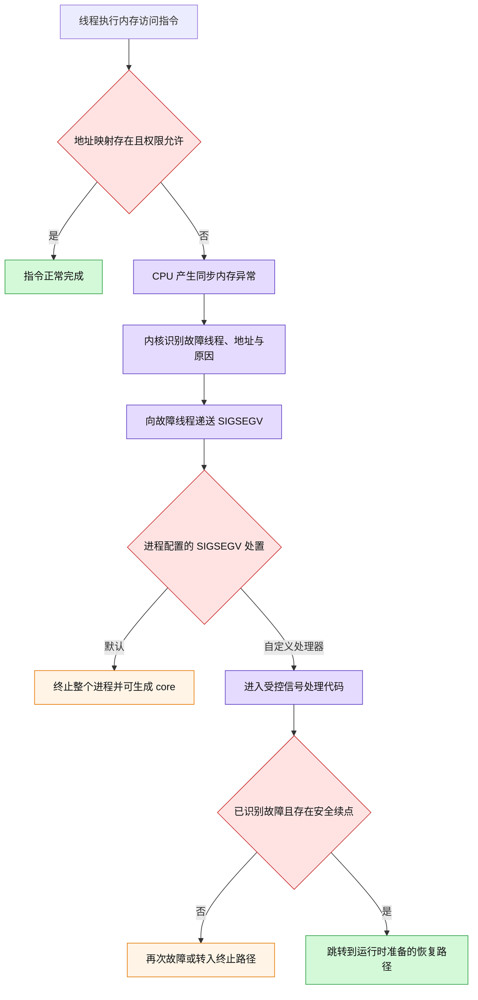
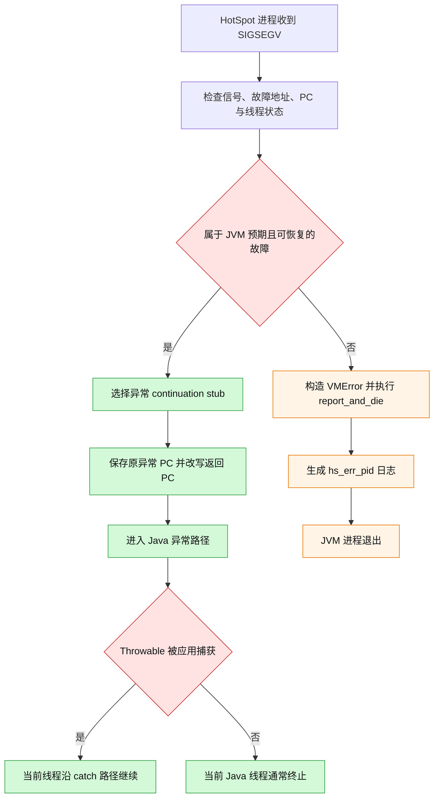
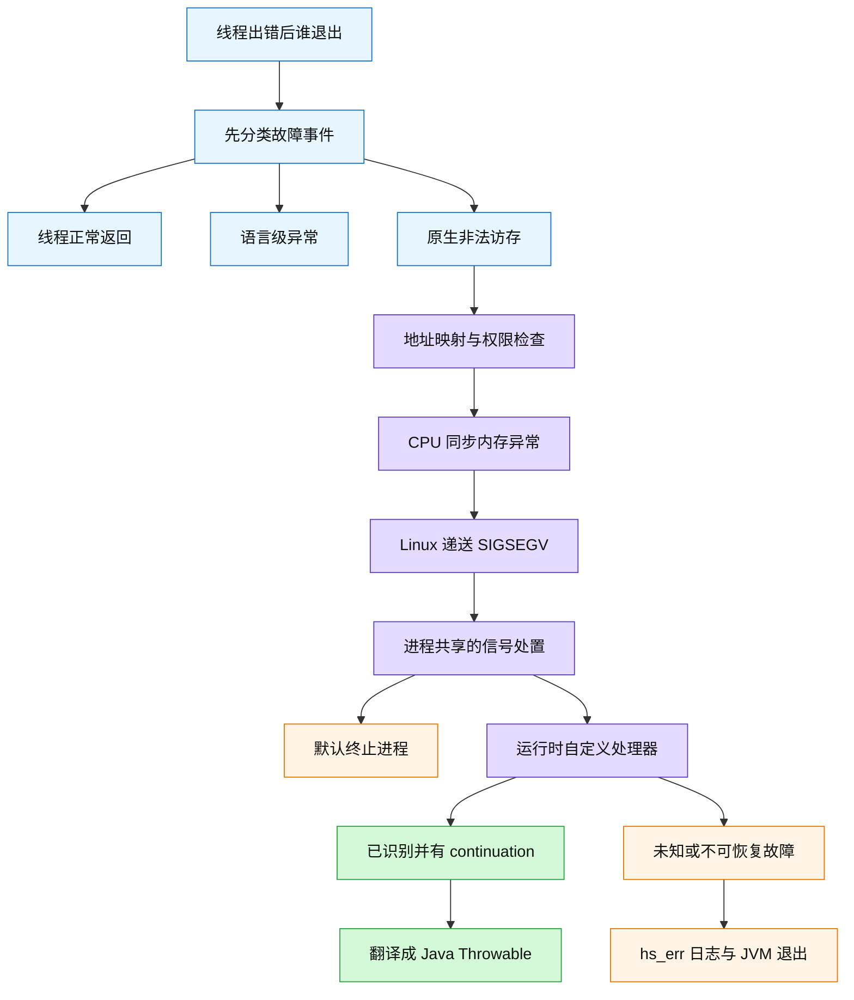

# 线程故障为何可能终止进程：SIGSEGV 与 JVM 故障翻译

### 1. Topic Overview

- **主题**：回答“一个线程出错时，为什么有时只结束该线程，有时却终止整个进程”，并追踪 Linux `SIGSEGV` 与 HotSpot JVM 的不同处置路径。
- **来源**：`materials/os/4_process/thread_crash.md`，原文标题“5.7 线程崩溃了，进程也会崩溃吗？”。
- **为什么重要**：面试题表面在比较 C/C++ 与 Java，真正考查的是“故障类型、操作系统信号、运行时处理、最终影响范围”四层边界。
- **难度**：中等。难点不在背 `SIGSEGV`，而在区分“故障发生在哪一层”与“谁最终退出”。
- **前置知识**：同进程线程共享地址空间；每线程有私有寄存器与栈；虚拟地址要经过映射和权限检查；信号有默认、捕捉、忽略等处置。
- **来源范围**：文章讨论的是 Linux 上的非法内存访问和 HotSpot Java 8 的典型处理，不是在证明“所有 C/C++ 线程异常都会杀死进程”或“所有 Java 线程错误都不会杀死 JVM”。

文章顺序可以压缩成五个学习节点：

1. 先澄清“线程崩溃”到底是哪类事件。
2. 非法访存怎样变成 `SIGSEGV`，默认处置为何终止进程。
3. 自定义信号处理器能改变什么，不能安全承诺什么。
4. HotSpot 怎样把部分已识别故障翻译成 Java 异常。
5. JVM 无法识别或恢复时，怎样生成 `hs_err_pid...log` 并退出。

### 2. Core Concepts

#### 2.1 Schema：先分“故障类型”，再判断影响范围

**定义**

“线程崩溃”不是一个精确的操作系统事件。判断结局前，至少要问三件事：

1. 发生的是线程正常返回、语言级异常，还是 CPU 检测到的本地内存故障？
2. 哪一层有机会处理：应用代码、语言运行时、JVM，还是内核信号默认动作？
3. 处理失败后的默认影响范围是当前线程，还是整个进程？

| 场景 | 首先处理它的层 | 常见结局 |
| --- | --- | --- |
| 线程函数正常 `return` | 线程库 / 语言运行时 | 当前线程结束，进程中其他线程可继续 |
| Java 代码抛出可处理的 `Exception` / `Error` | JVM + Java 异常机制 | 被捕获则继续；未捕获通常终止当前 Java 线程，JVM 可继续 |
| C/C++ 线程执行非法内存访问 | CPU + 内核信号机制 | Linux 产生同步故障并递送 `SIGSEGV`；默认动作终止整个进程 |
| JVM 或 JNI 发生未被 HotSpot 识别的致命本地故障 | HotSpot 致命错误路径 | 生成崩溃报告并终止 JVM 进程 |

**直觉**

不要从语言名称直接猜结局。要沿着下面的决策链判断：

```text
发生了什么事件
-> 哪一层认识它
-> 该层是否建立了受控恢复路径
-> 没有恢复时默认终止谁
```

**例子**

- Java `NullPointerException` 是 Java 语义中的可抛出对象，不等于应用直接获得了一个任意的原生坏指针后继续执行。
- C 中 `*p = 1` 且 `p == NULL` 是一次真实的非法内存访问；若没有受控运行时接管，Linux 的默认 `SIGSEGV` 动作会终止进程。

**常见错误**

- 把“线程函数结束”也叫线程崩溃，然后推出进程必然退出。
- 只背“C 会崩，Java 不会崩”，不说明故障层和处理层。
- 认为 Java 线程未捕获异常后仍会从出错指令之后自动继续。
- 认为只要错误最初发生在一个线程，操作系统就一定只删除那个线程。

#### 2.2 Schema：运行“非法访存 -> 同步故障 -> SIGSEGV -> 进程处置”

**定义**

当线程执行一条内存访问指令时，CPU/MMU 会检查该虚拟地址是否有有效映射、当前访问是否符合页权限。访问未映射页、向只读页写入或违反其他保护规则，会产生同步硬件异常；Linux 内核把这类用户态内存故障通常转换为发给故障线程的 `SIGSEGV`。

`SIGSEGV` 的产生点属于某个线程，但信号处置配置属于进程共享状态；其默认动作是终止进程，通常还可产生 core dump。因此“信号递送给故障线程”与“最终只终止故障线程”不是同一句话。

**例子**

原文列出三类 C 例子：

1. 向字符串字面量所在的只读区域写入。
2. 访问当前进程没有权限的地址。
3. 解引用 `NULL` 等未映射地址。

它们的共同结构不是“C 语法错误”，而是“某条已执行的内存指令违反当前地址映射或权限”。其中原文把 `0xC0000fff` 视为内核空间，是旧式 32 位地址布局下的示例，不应当当成所有架构和现代系统上的固定边界。

#### Visual Model: 一条非法访存指令怎样演化成进程终止？



- **How to read**：左半段说明故障如何进入内核；右半段说明真正决定结局的是信号处置以及是否存在预先设计、可证明安全的恢复点。
- **Source anchor**：`thread_crash.md` 第 26-75、77-122、247-254 行。
- **Boundary**：图把原文重复的 `kill` 步骤改成了两条不同来源：外部 `kill` 是显式系统调用，非法访存则由 CPU 同步异常触发，无需另一个进程先执行 `kill`。

**为什么共享地址空间很重要**

同进程线程共享代码、数据、堆、映射和多数进程资源。非法写入如果在触发保护异常之前已经改坏共享状态，其他线程也可能读到损坏数据。操作系统又不知道应用层不变量，也不能自动替用户撤销这条线程此前的全部副作用；因此默认把不可恢复的进程级执行环境终止掉，是保守且定义明确的故障边界。

但要注意：这是安全直觉，不是完整机制。精确回答还必须补上“同步故障被转换为 `SIGSEGV`，该信号的默认动作终止进程”。

**常见错误**

- 说成“内核直接发现 C 线程崩了，所以杀掉其进程”，跳过 CPU 异常与信号处置。
- 认为 `kill -9` 中的 `kill` 就是“杀死”动作本身；其实 `kill` 系统调用用于发送信号，`-9` 指 `SIGKILL`。
- 认为同一进程线程共享栈；实际上每个线程有自己的栈，只是这些栈都映射在同一进程地址空间中。
- 认为所有越界访问都会立即 `SIGSEGV`；若坏地址碰巧仍处在可写映射内，可能先静默破坏数据，稍后才暴露。

#### 2.3 Schema：区分信号处理、受控恢复与优雅退出

**定义**

普通信号到达后，进程可采用默认动作、捕捉并执行处理器，或在允许时忽略；也可暂时阻塞信号，让它保持 pending 后再递送。`SIGKILL` 和 `SIGSTOP` 不能被捕捉、忽略或阻塞。

安装 `SIGSEGV` 处理器不等于任意段错误都能安全恢复：

- 若处理器直接返回，而导致故障的地址或程序计数器没有被修复，CPU 往往会重试同一指令并再次故障。
- 原文 `signal(SIGSEGV, SIG_IGN)` 示例用的是 `raise(SIGSEGV)`，即程序主动给自己产生信号；它不等价于忽略真实硬件非法访存。对真实同步 `SIGSEGV` 直接忽略或从处理器普通返回，不是通用恢复方案。
- `sigsetjmp` / `siglongjmp` 只有在运行时预先设计了恢复边界、严格控制可执行操作并维护状态一致性时才有意义，不能当成 C/C++ 段错误的万能补丁。

**例子：优雅停止 Java 服务**

```text
SIGTERM
-> JVM 获得正常终止机会
-> 运行关闭钩子、释放资源
-> 进程退出
```

`kill <pid>` 默认发送 `SIGTERM`，适合请求优雅终止；`kill -9 <pid>` 发送不可捕捉的 `SIGKILL`，进程没有执行用户态清理逻辑的机会。

**常见错误**

- 把 `SIGTERM` 与 `SIGKILL` 都叫作“kill 信号”。
- 把“捕捉到了信号”直接等同于“可以从原故障点继续”。
- 用 `printf`、内存分配等任意函数写复杂信号处理器，忽略异步信号安全限制。
- 认为 JVM 能处理 `SIGSEGV`，所以 JNI 的任意野指针都不会导致 JVM 崩溃。

#### 2.4 Schema：把 HotSpot 看成“故障分类器 + 异常翻译器”

**定义**

Java 的 `NullPointerException` 和 `StackOverflowError` 是语言级 `Throwable`。HotSpot 在 Linux 上可以利用受控的底层故障机制实现部分检查：例如隐式空指针检查和栈保护页触发 `SIGSEGV`。JVM 的信号处理器会结合信号编号、故障地址、故障时的 PC 和线程状态判断该故障是不是它预期并认识的情况。

如果已识别，JVM 不会简单“忽略 `SIGSEGV`”，而是建立一个 continuation stub，把保存的程序计数器改到运行时恢复入口，再由 Java 异常机制抛出相应 `Throwable`。如果无法识别或无法安全恢复，则进入 `VMError::report_and_die`，记录崩溃信息并终止整个 JVM。

**例子**

- Java 代码在 HotSpot 预期的隐式空指针检查点触发故障：JVM 识别上下文，转成 `NullPointerException`；若 Java 代码捕获它，线程可走异常处理路径，若未捕获则该线程通常终止，但 JVM 中其他线程仍可继续。
- JNI 写坏任意地址或 JVM 自身发生未知 native crash：处理器无法把它匹配到合法恢复点，进入 fatal error 路径，整个 JVM 退出。

#### Visual Model: HotSpot 收到 SIGSEGV 后为什么有两种结局？



- **How to read**：分水岭不是“信号是不是 `SIGSEGV`”，而是 HotSpot 能否把故障上下文匹配到一个已知语义和安全续点。
- **Source anchor**：`thread_crash.md` 第 150-176、178-254 行。
- **Boundary**：原文分析的是 Linux 上 Java 8 HotSpot 的简化关键路径；JVM 版本、平台和具体检查实现可以变化，不能把代码片段当成所有 JVM 的固定实现。

**常见错误**

- 说 JVM “屏蔽”或“忽略”了所有 `SIGSEGV`。
- 把 `stub != NULL` 理解成“原故障指令已经修好”，而不是“存在运行时准备的异常续点”。
- 认为捕获 `NullPointerException` 后一定从发生空指针访问的下一行继续；真正控制流遵循 Java 的异常查找和 `catch` 语义。
- 认为没有看到 `hs_err_pid` 就能证明进程从未崩溃；日志路径、写盘条件和启动参数都可能影响文件位置或是否成功落盘。

#### 2.5 Schema：按“识别 -> 改写控制流 -> 翻译异常 / 致命退出”读源码

原文摘录的 `JVM_handle_linux_signal` 可以按五个问题读，不需要逐行背诵：

1. **是否有更外层的崩溃保护？** `ThreadCrashProtection::check_crash_protection` 可能使用 `siglongjmp` 回到预设边界。
2. **故障地址是否落在线程栈的受保护范围？** 若是并且线程处于 Java 状态，选择 `STACK_OVERFLOW` 的 continuation。
3. **是否属于可由隐式检查翻译的空指针故障？** 若是，选择 `IMPLICIT_NULL` continuation。
4. **是否已经得到 `stub`？** 得到后保存异常 PC，并把上下文中的 PC 改成 stub 地址，返回到运行时异常路径。
5. **都不认识怎么办？** 创建 `VMError`，执行 `report_and_die`，生成诊断信息后退出。

这里最重要的控制流变量是 `stub`：

```text
stub != NULL
-> JVM 知道下一步跳到哪里
-> 把本地故障翻译成受管理的 Java 异常

stub == NULL
-> 没有已证明安全的续点
-> report_and_die
```

原文代码围绕 Java 8 OpenJDK/HotSpot 做了删减，并把 native 函数放在 `java` 代码块中展示。学习时应理解分支结构，而不是把这段简化代码直接当成可编译源码。

### 3. Deep Understanding

#### 3.1 同一个“空指针”为什么能有不同结局？

| 层级 | C/C++ 原生访问 | Java / HotSpot 受管理访问 |
| --- | --- | --- |
| 语言语义 | 坏指针解引用可能触发未定义行为 | 空引用访问必须表现为 `NullPointerException` |
| CPU / MMU | 对映射和权限做检查 | 最终仍在同一硬件保护机制上执行 |
| 内核 | 将真实非法访问转换为同步 `SIGSEGV` | 同样可把受控保护页故障转换为 `SIGSEGV` |
| 运行时 | 普通 native 程序通常没有完整故障翻译器 | HotSpot 知道哪些 PC/地址属于隐式检查或栈保护 |
| 最终控制流 | 默认信号动作终止进程 | 已识别则转 Java 异常；未识别仍终止 JVM |

所以准确结论不是“Java 不会内存崩溃”，而是：**HotSpot 为部分高频、语义明确的故障建立了受控翻译路径，把底层信号变成语言级异常；它不能安全解释的本地故障仍是进程级致命错误。**

#### 3.2 共享地址空间解释风险，信号默认动作解释机制

```text
共享地址空间
-> 一个线程可能破坏全进程共享状态
-> 操作系统不知道怎样回滚应用不变量
-> 不适合自动假设“删掉该线程即可安全继续”

同步内存异常
-> Linux 生成 SIGSEGV
-> 进程级信号处置生效
-> 默认动作终止进程
```

面试时两条都要说：第一条回答“为什么只杀线程不一定安全”，第二条回答“Linux 实际怎样让进程退出”。

#### 3.3 故障隔离比事后续命更可靠

若系统真的要求某个工作单元崩溃而其他单元继续，单靠线程和 `SIGSEGV` 处理器不是稳健隔离方案。进程边界能提供独立地址空间；监督进程还可重启失败 worker。JVM 的信号翻译之所以可行，是因为它只处理运行时事先认识的窄场景，而不是宣称任意内存破坏都可恢复。

### 4. Minimal Working Example

#### 场景 A：C 线程解引用空指针

```c
void *worker(void *arg) {
    int *p = NULL;
    *p = 1;
    return NULL;
}
```

执行流：

```text
worker 执行 store
-> 地址无有效用户映射
-> CPU 同步异常
-> Linux 向 worker 所在线程递送 SIGSEGV
-> 未安装受控处理器
-> 默认动作终止整个进程
```

关键点：不是 `return NULL` 终止了进程，而是程序根本到不了 `return`。

#### 场景 B：Java 空引用访问

```java
try {
    Object x = null;
    x.toString();
} catch (NullPointerException e) {
    System.out.println("recovered at Java level");
}
```

概念执行流：

```text
空引用访问
-> JVM 执行显式检查，或识别隐式故障
-> 构造并抛出 NullPointerException
-> 查找匹配 catch
-> 当前线程从 catch 路径继续
```

关键点：继续的是异常处理路径，不是让原来的坏内存指令若无其事地成功。

#### 场景 C：JVM 中的未知 native crash

```text
JNI 野指针 / JVM 内部未知故障
-> SIGSEGV
-> HotSpot 无法匹配已知 continuation
-> VMError::report_and_die
-> 尝试写 hs_err_pid...log
-> 整个 JVM 退出
```

这条路径说明“Java 进程不会因为线程故障崩溃”只能用于受管理且被运行时识别的异常场景，不能绝对化。

### 5. Chapter Knowledge Map



### 6. Self-Test Questions

Recall:

1. 为什么“`SIGSEGV` 被递送给故障线程”不等于“只终止该线程”？
2. `SIGTERM` 与 `SIGKILL` 在用户态清理机会方面有什么区别？
3. HotSpot 中 `stub != NULL` 表示什么？

Application / transfer:

4. 一个 C worker 写空指针，另一个 Java worker 抛出未捕获 `NullPointerException`。在常见默认配置下，分别判断整个进程和当前线程的结局，并说明处理层。
5. JNI 中出现野指针并触发 `SIGSEGV`。为什么“JVM 能把 NPE 转成 Java 异常”不足以推出这次 JVM 也能继续？

Explain like I am 5:

6. 用“共享办公室、总闸和专业维修员”的比喻解释：为什么普通线程弄坏共享空间时整间办公室会被关闭，而 JVM 有时能把一种已知故障引导到安全通道。

### 7. Weak Point Detection

- **术语绝对化**：不区分线程返回、Java 异常、同步内存故障，就直接回答“会”或“不会”。
- **递送范围与终止范围混淆**：认为信号发给某线程就只能杀该线程。
- **共享地址空间替代机制**：只说线程共享内存，却说不出 CPU 异常、`SIGSEGV` 和默认动作。
- **忽略等于恢复**：看到 `SIG_IGN` 示例便认为真实段错误可以安全跳过。
- **JVM 全能错觉**：认为 HotSpot 捕捉 `SIGSEGV` 后所有 JNI/JVM native bug 都能变成 Java 异常。
- **异常继续位置混淆**：认为 `catch` 后会从故障指令下一条继续，而忽略异常控制流。
- **日志绝对化**：把是否看见 `hs_err_pid` 文件当成 JVM 是否崩溃的唯一可靠证据。
- **平台常数错觉**：把原文的 32 位地址边界、Java 8 HotSpot 代码和默认栈信息当成跨平台固定事实。
