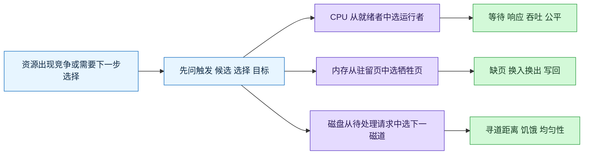
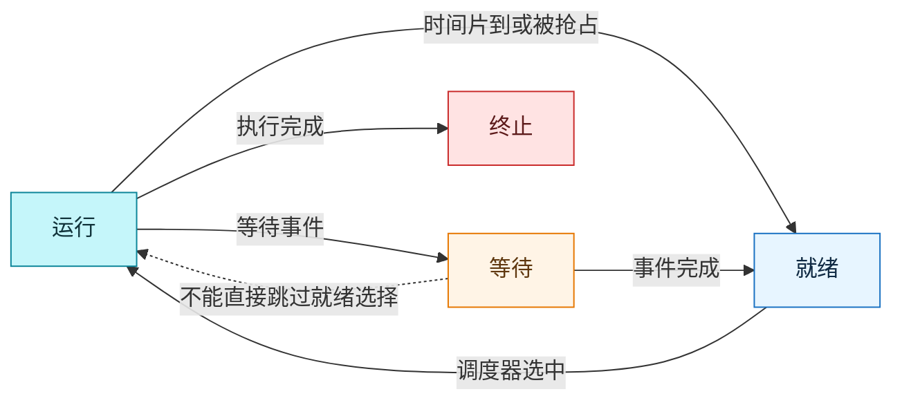
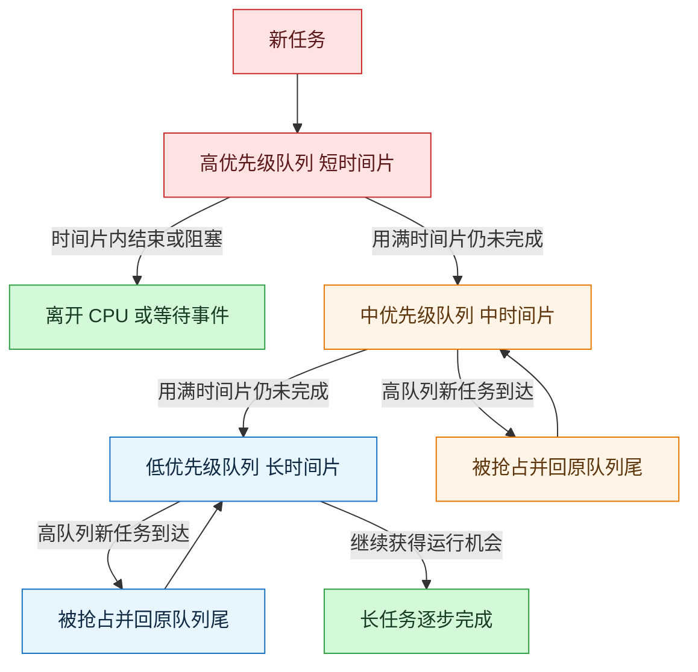
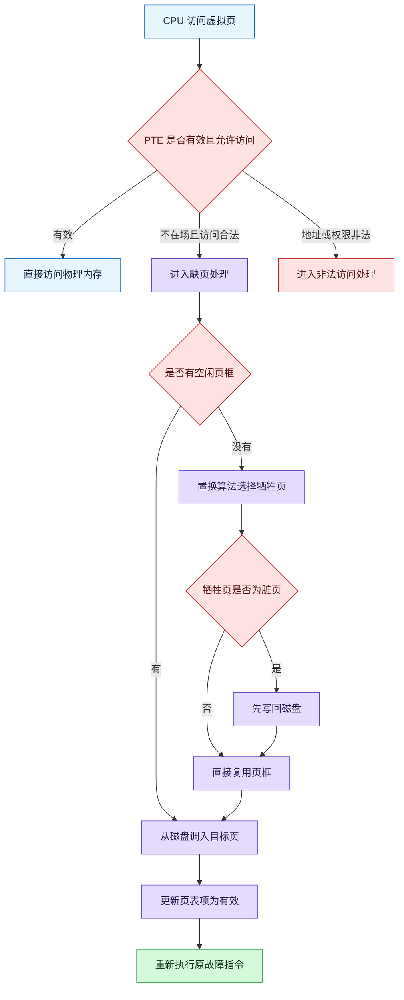
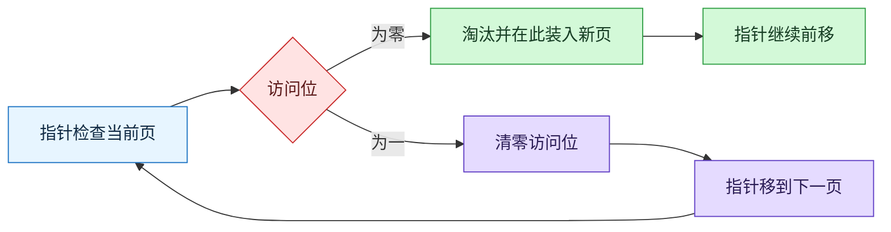
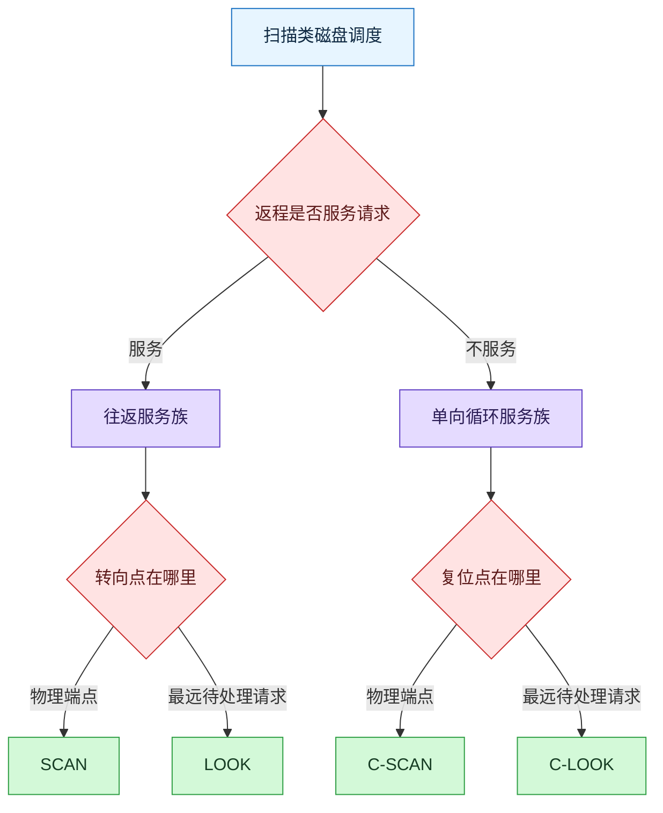
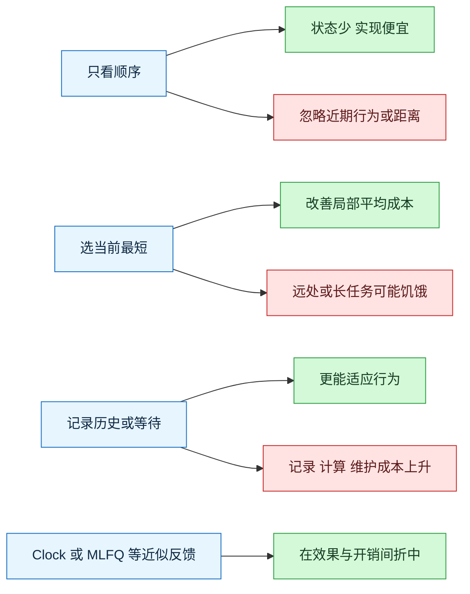
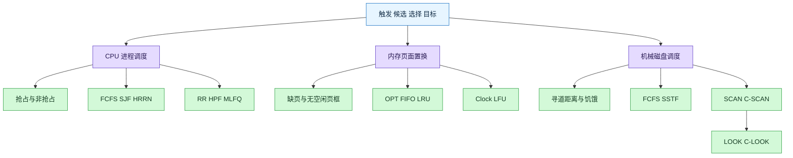

# OS 三类调度算法：进程调度、页面置换与磁盘调度

### 1. Topic Overview

- What this is about: 本章讨论三种“资源不够直接满足所有请求时，下一步选谁”的机制：CPU 从就绪进程中选运行者，内存从驻留页中选牺牲页，机械磁盘从待处理 I/O 请求中选下一磁道。
- Why it matters: 三类算法名字很多，但面试与做题真正考的是能否识别触发条件、候选集合、选择规则、运行轨迹和代价。把它们压缩成同一个选择框架后，不必把十几种算法背成孤立清单。
- Difficulty level: 中等。难点主要在相邻边界：调度发生不等于一定抢占；缺页不等于一定置换；FIFO 的“最早进入”不等于 LRU 的“最久没访问”；SCAN 的物理端点不等于 LOOK 的最远请求。
- Prerequisites: 进程的运行/就绪/等待状态，时间片与上下文切换，虚拟页/物理页框/页表项/缺页异常，机械磁盘的磁道与磁头。
- Source: `materials/os/5_schedule/schedule.md`，按原文顺序完整整理。
- Source boundary: 原文用经典教学模型解释算法。文中的 RR `20ms~50ms` 是教学性的常见折中而非所有系统的固定最佳值；磁盘调度部分针对有机械寻道成本的磁盘；原文的 `Lock` 和 `SSF` 分别按标准术语记为 `Clock` 和 `SSTF`。

#### Roadmap

1. 统一选择框架：触发条件 -> 候选集合 -> 选择对象 -> 优化目标。
2. CPU 调度边界：四个状态变化、抢占式与非抢占式。
3. CPU 算法组一：FCFS、SJF、HRRN。
4. CPU 算法组二：RR、HPF、MLFQ。
5. 页面置换入口：缺页、无空闲页、脏页写回与原指令重试。
6. 页面算法组一：OPT、FIFO、LRU。
7. 页面算法组二：Clock、LFU 与老化。
8. 磁盘调度入口：寻道成本、FCFS、SSTF。
9. 单向/往返扫描：SCAN、C-SCAN。
10. 端点优化：LOOK、C-LOOK 与算法选型。

### 2. Core Concepts

#### Schema 1: 用“触发—候选—选择—目标”统一三类调度

- Definition: 看到任何调度算法，先回答四问：什么时候必须作决定；允许从哪些对象中选；最终选出的对象是什么；希望优化哪个成本或指标。
- Intuition: 调度器像一个“下一步选择器”。三类算法的外壳相同，变化的是资源、候选对象和代价函数。
- Example: CPU 空闲时，从就绪队列选一个进程以改善响应/等待等指标；缺页且内存已满时，从物理内存中的驻留页选一个牺牲页以减少后续换入换出；磁头面前有多个请求时，从待处理磁道请求中选下一项以减少寻道并兼顾公平。
- Common mistakes: 把页面置换说成“选要调入的页”，忽略真正需要算法决定的是淘汰谁；把磁盘调度说成 CPU 选择进程；只背算法名而说不出候选集合。

| 调度域 | 典型触发 | 候选集合 | 选择结果 | 主要目标 |
| --- | --- | --- | --- | --- |
| CPU | CPU 空闲，或抢占条件出现 | 就绪进程/线程 | 下一个运行者 | 利用率、吞吐、等待、响应、公平 |
| 页面 | 缺页且无空闲物理页框 | 当前驻留的可替换物理页 | 牺牲页 | 降低缺页、换入换出和写回成本 |
| 机械磁盘 | 存在多个未完成 I/O 请求 | 待处理的磁道请求 | 下一个服务的磁道 | 缩短寻道、避免饥饿、改善响应均匀性 |

#### Visual Model: 三类调度究竟各自选择什么



- How to read: 从共同的四问框架向右分叉；先定位“选什么”，再比较该类内部的算法。
- Source anchor: `schedule.md` 的“进程调度算法”“内存页面置换算法”“磁盘调度算法”。
- Boundary: 这是统一认知框架，不表示三类算法共享同一套具体指标。

#### Schema 2: 先判定调度发生点，再判断是否抢占当前进程

- Definition: CPU 调度可能出现在运行 -> 等待、运行 -> 就绪、等待 -> 就绪、运行 -> 终止四类变化附近。非抢占式只在当前进程结束或主动/被动阻塞而不再占用 CPU 后换人；抢占式还允许把仍可运行的当前进程移回就绪态，让更合适的进程运行。
- Intuition: “发生一次选择”与“强行拿走 CPU”是两件事。进程结束或阻塞后，CPU 本来就空出来；时间片耗尽或更高优先级进程就绪时，才涉及从仍能运行者手中抢走 CPU。
- Example: A 等磁盘而进入等待态，CPU 必须选别人，但不是因为别人抢走了 A；B 的时间片到而从运行态回到就绪态，则属于典型抢占；等待中的高优先级 H 被 I/O 唤醒到就绪态后，是否立即抢占当前 L，要看算法是否抢占。
- Common mistakes: 把等待 -> 就绪理解成进程立刻运行；认为只要调度器被调用就一定发生抢占；把 I/O 等待时间算作就绪队列等待时间。

#### Visual Model: 状态变化怎样触发 CPU 选择



- How to read: 先看当前运行者是否仍可继续；等待者被唤醒后只能进入候选集合，是否立即运行还要经过调度与抢占规则。
- Source anchor: `schedule.md`“进程调度算法”开头的四种状态变化。

原文强调：调度算法能改变的是进程在就绪队列中的等待与获得 CPU 的时机，不能缩短进程自身必需的 CPU burst 或 I/O 服务时间。

#### Schema 3: 用“到达顺序、服务时间、等待老化”区分 FCFS、SJF、HRRN

- Definition:
  - FCFS: 选择最早进入就绪队列的进程，采用非抢占式运行，直到其结束或阻塞。
  - SJF: 选择预计服务时间最短的进程，偏向短作业与吞吐表现。
  - HRRN: 计算响应比并选最高者，用等待增长给长期等待的作业“老化加权”。
- Intuition: 三者逐步增加信息量。FCFS 只看“谁先来”；SJF 看“谁最快做完”；HRRN 同时看服务时间和已经等待了多久。
- Example: P 等待 8 秒、服务 4 秒，Q 等待 1 秒、服务 1 秒。HRRN 中 `P=(8+4)/4=3`，`Q=(1+1)/1=2`，所以先选 P；仅用 SJF 会选 Q。
- Common mistakes: 把 FCFS 的开始时刻当等待时长；认为 SJF 能准确知道真实服务时间；把 HRRN 的“响应比”误作响应时间。

```text
HRRN 响应比 = (等待时间 + 要求服务时间) / 要求服务时间
            = 1 + 等待时间 / 要求服务时间
```

| 算法 | 主要收益 | 主要代价/失败模式 |
| --- | --- | --- |
| FCFS | 简单，长 CPU 作业一旦开始可连续运行 | 队首长作业让后续短作业久等 |
| SJF | 偏向短作业，提高吞吐并常能降低平均等待 | 服务时间难预知；长作业可能饥饿 |
| HRRN | 同时照顾短服务时间与长等待时间 | 仍需估计服务时间；每次调度要计算比值 |

#### Schema 4: 用“多久换人、重要性、行为反馈”区分 RR、HPF、MLFQ

- Definition:
  - RR: 每个进程最多运行一个时间片；未完成则回就绪队列尾，提前阻塞或结束则立即换人。
  - HPF: 选最高优先级进程；优先级可静态或动态，算法可抢占或非抢占。
  - MLFQ: 设置多个由高到低的队列，高队列时间片更短；新进程进入最高队列，用完整个时间片仍未完成则降级；高队列有任务时优先运行并可抢占低队列。
- Intuition: RR 把所有人当作同等重要；HPF 明确表达谁更重要；MLFQ 不预先知道任务长短，而是根据任务实际耗用 CPU 的行为动态分类。
- Example: 交互短任务通常能在 MLFQ 顶层短时间片内结束或很快得到响应；持续占用 CPU 的长任务会逐级下降，但在低层获得更长时间片继续推进。
- Common mistakes: RR 每轮不先取当前队首；认为 RR 时间片越短越好；把 `nice` 老化等动态优先级机制与静态优先级混为一谈；认为 MLFQ 中被抢占的低层任务会回最高队列。

#### Visual Model: MLFQ 怎样用行为反馈分类任务



- How to read: 用满时间片表明任务更偏 CPU 密集，因而逐级下降；高层到来时，低层任务只是回原层队尾，不自动升到顶层。
- Source anchor: `schedule.md`“多级反馈队列调度算法”。
- Boundary: 原文没有展开周期性 priority boost；不要把其他 MLFQ 实现中的额外规则擅自加入本章做题。

RR 的核心取舍是：时间片过短，上下文切换占比上升；时间片过长，交互任务等待首次响应的时间变长，行为逐渐接近 FCFS。原文的 `20ms~50ms` 只能当作示例范围。

HPF 的饥饿问题可用动态优先级/老化缓解：运行越久可降低优先级，等待越久可提高优先级。抢占式 HPF 会在更高优先级进程就绪时挂起当前进程；非抢占式 HPF 要等当前进程结束或阻塞。

#### Schema 5: 先走完整缺页链，再决定是否需要页面置换

- Definition: CPU 访问虚拟页，页表项不在场时触发缺页异常；内核确认访问合法并找到磁盘后备页。若有空闲页框，直接调入；只有没有空闲页框时，页面置换算法才从当前驻留页中选牺牲页。牺牲页若为脏页要先写回，随后更新页表、装入新页并重试原故障指令。
- Intuition: “缺页”是入口，“内存已满”才是置换开关。页面置换不是每次缺页都发生。
- Example: `Load M` 查到 PTE 无效；若有空闲页框 F，直接把 M 的页调入 F，不淘汰任何页；若无空闲页框，算法选 V，V 若修改过先写回磁盘，再把 M 装入 V 原来的页框，最终把 M 的 PTE 标为有效并重新执行 `Load M`。
- Common mistakes: 把所有缺页都等同于页面置换；忘记脏页写回；修复 PTE 后继续下一条指令而不是重试原故障指令；把 PTE 无效一律解释成非法地址。

页表项中与本章直接相关的字段：

| 字段 | 本章中的作用 |
| --- | --- |
| 状态/有效位 | 页面当前是否在物理内存中 |
| 访问字段/访问位 | 给 LRU 近似、Clock 或频率策略提供历史信息 |
| 修改位/脏位 | 决定淘汰时是否必须写回磁盘 |
| 硬盘地址 | 不在场时定位后备存储中的页面 |

#### Visual Model: 缺页何时才进入页面置换



- How to read: 先分合法缺页与非法访问，再分有无空闲页框；只有右侧“没有空闲页框”分支需要牺牲页算法。
- Source anchor: `schedule.md`“内存页面置换算法”及缺页处理的六个步骤。

#### Schema 6: 用“未来、进入时间、最近访问”区分 OPT、FIFO、LRU

- Definition:
  - OPT: 淘汰未来最晚才会再次访问、或以后不再访问的页。
  - FIFO: 淘汰进入内存时间最早、驻留最久的页。
  - LRU: 淘汰从现在向过去看，最长时间没有被访问的页。
- Intuition: 三者使用不同证据。OPT 看未来，因而最理想但无法在线实现；FIFO 只看入场顺序，不知道页最近是否很热；LRU 用最近历史近似未来局部性。
- Example: A 最早进入内存，但刚刚被频繁访问；B 后进入，但很久没用。FIFO 选 A，LRU 选 B。若已知未来 B 马上会访问、C 很久以后才访问，OPT 会选 C。
- Common mistakes: 把 FIFO 的“驻留最久”当 LRU 的“最久没访问”；把 OPT 当真实系统可预知的算法；认为精确 LRU 只需偶尔更新一次链表。

| 算法 | 决策依据 | 主要价值 | 主要问题 |
| --- | --- | --- | --- |
| OPT | 完整未来访问序列 | 给出理论比较基准 | 在线系统无法预知未来 |
| FIFO | 进入内存的先后 | 实现简单 | 不识别刚被使用的老页，表现可能差 |
| LRU | 最近一次访问距离现在多久 | 利用时间局部性，近似 OPT | 精确维护每次访问顺序的成本高 |

原文示例在 3 个物理页框下给出：OPT 共 7 次缺页、4 次实际置换；FIFO 共 10 次缺页、7 次置换；LRU 共 9 次缺页、6 次置换。要注意“缺页次数”包含最初装入空闲页框，而“置换次数”只统计内存已满后的淘汰。

#### Schema 7: 用“第二次机会”和“频率老化”理解 Clock、LFU

- Definition:
  - Clock: 页框组成环形链表，指针从最老候选开始。访问位为 0 就淘汰；为 1 就清零并跳到下一页，直到找到 0。
  - LFU: 淘汰累计访问次数最少的页；可周期性衰减计数，使久远历史的高频不永久压过当前热点。
- Intuition: Clock 用一个访问位给近期访问过的页一次“第二次机会”，以更低成本近似 LRU；LFU 关心使用频率，但必须处理“过去很热、现在已冷”的历史污染。
- Example: 指针依次看到 `A:1, B:1, C:0`，会把 A、B 的访问位清零并越过，最终淘汰 C。若下一轮仍未访问 A，A 就会以 0 成为候选。
- Common mistakes: Clock 看到 1 就永久保留该页；清零访问位后不移动指针；LFU 只看累计次数且永不衰减；把原文的 `Lock` 当成另一种算法。

#### Visual Model: Clock 的第二次机会循环



- How to read: 访问位 1 只换来一次越过机会，同时会被清零；若之后没有再次访问，下一圈就可能被淘汰。
- Source anchor: `schedule.md`“时钟页面置换算法”。

#### Schema 8: 先把磁盘问题化成“当前磁头到各请求的距离”

- Definition: 对机械磁盘，寻道时间通常是访问开销的重要部分。磁盘调度通过重排待处理请求，减少磁头移动，并在吞吐、公平与饥饿之间取舍。
- Intuition: CPU 调度是在时间线上排进程；机械磁盘调度是在磁道轴上排访问路径。
- Example: 请求为 `98, 183, 37, 122, 14, 124, 65, 67`，初始磁头在 53。FCFS 完全按到达顺序，总移动 640 个磁道；SSTF 每步选当前最近者，得到 `65, 67, 37, 14, 98, 122, 124, 183`，总移动 236 个磁道。
- Common mistakes: SSTF 一次性按离初始 53 的距离排序，而不是每移动一步后重新计算；只看到总距离更短就断言无代价；把原文 `SSF` 当标准缩写，标准常写 `SSTF`。

| 算法 | 下一请求的选择方式 | 主要问题 |
| --- | --- | --- |
| 磁盘 FCFS | 按请求到达顺序 | 简单公平，但磁头可能大幅来回移动 |
| SSTF | 每一步选择离当前磁头最近的请求 | 局部距离小，但远处请求可能长期饥饿 |

#### Schema 9: 用“是否往返服务”区分 SCAN 与 C-SCAN

- Definition:
  - SCAN: 磁头沿一个方向处理请求直到该方向物理端点，再反向并在返程继续处理请求。
  - C-SCAN: 只在固定方向服务；到物理端点后快速回到另一端，回程不处理请求，然后继续同方向扫描。
- Intuition: SCAN 像普通电梯，来回都接客；C-SCAN 像只允许一个方向上车的环线，到终点空车复位，使不同磁道的等待频率更均匀。
- Example: 仍从 53 出发。SCAN 若先向小磁道走，路径为 `37, 14, 0, 65, 67, 98, 122, 124, 183`；C-SCAN 若向大磁道走，路径为 `65, 67, 98, 122, 124, 183, 199, 0, 14, 37`，其中 `199 -> 0` 不服务请求。
- Common mistakes: SCAN 到最远请求就立即反向，那其实是 LOOK；C-SCAN 回程仍服务请求；忘记题目给定的初始方向。

#### Visual Model: 四种扫描算法的两个判断轴



- How to read: 第一问决定 SCAN 族还是 C-SCAN 族；第二问决定是否省掉跑到没有请求的物理端点。
- Source anchor: `schedule.md`“扫描算法”“循环扫描算法”“LOOK 与 C-LOOK 算法”。

#### Schema 10: 用“最远请求代替物理端点”从 SCAN 推导 LOOK

- Definition:
  - LOOK: 保留 SCAN 的往返服务，但走到当前方向最远的待处理请求就转向，不再空跑到磁盘端点。
  - C-LOOK: 保留 C-SCAN 的单向服务；走到当前方向最远请求后，直接跳到另一端最远的待处理请求，跳转途中不服务。
- Intuition: LOOK 名字表示磁头先“看”当前方向还有没有请求；没有就不必继续空走。
- Example: 若当前方向最后一个请求在 183、物理端点在 199，LOOK/C-LOOK 都不必为完成这一轮而额外走到 199；区别仍在于反向途中是否服务。
- Common mistakes: 认为 LOOK 与 C-LOOK 的唯一区别是转向位置；忽略 C-LOOK 的跳转途中不服务；说 LOOK 永远不反向。

| 算法 | 服务方向 | 走到哪里才转向/复位 | 饥饿与均匀性 |
| --- | --- | --- | --- |
| SCAN | 往返都服务 | 物理端点 | 避免 SSTF 的局部饥饿，中间磁道更常被经过 |
| C-SCAN | 固定方向服务 | 物理端点后回另一端 | 响应频率更均匀，复位路径不服务 |
| LOOK | 往返都服务 | 最远待处理请求 | 避免到物理端点的无效移动 |
| C-LOOK | 固定方向服务 | 最远待处理请求后跳到另一侧请求端 | 保留循环均匀性并减少端点空跑 |

### 3. Deep Understanding

#### 三类算法共享的机制：信息越多，决策可能越好，但维护成本也越高

- FCFS/FIFO 只保留进入顺序，状态少、实现简单，却忽略当前代价或最近行为。
- SJF/SSTF 利用“当前看起来最便宜”的局部信息，可改善平均性能，但连续的新短任务/近请求可能导致远方对象饥饿。
- HRRN/动态优先级用等待时间老化，显式修复长期等待。
- LRU/LFU 利用历史行为预测未来，信息更丰富，但每次访问的记录和维护成本更高。
- Clock 用单个访问位近似精确 LRU，展示了系统设计中常见的“牺牲一点理论精度，换取可实现性”。
- MLFQ 用实际 CPU 使用行为推断任务类型，也属于在线反馈近似。
- SCAN/C-SCAN 通过限制移动方向，牺牲一步局部最短，换取全局公平和可预测性。

#### Visual Model: 从简单规则到反馈近似



- How to read: 每增加一种信息，通常同时带来更好的适应性和更高的实现成本；算法没有脱离负载与目标的绝对最优。
- Source anchor: 三类算法各节的优缺点综合。

#### 三个不能混淆的“最早/最短/最久”

1. 最早进入：FCFS/FIFO，依据到达或装入顺序。
2. 当前最短：SJF/SSTF，依据预计服务时间或当前寻道距离。
3. 最久未用：LRU，依据最近一次访问离现在多久。

#### 公平性修复的共同思路

- CPU 长作业被 SJF/优先级压制：让等待时间提高机会，例如 HRRN 或动态优先级老化。
- 远磁道被 SSTF 压制：限制方向并完成一趟扫描，例如 SCAN/C-SCAN。
- 历史高频页长期占优：周期性衰减 LFU 计数，让旧历史逐渐失效。

### 4. Minimal Working Example

#### Example A: CPU 调度先选证据

就绪任务 `A/B/C` 的服务时间为 `8/2/1`，都在同一时刻到达：

- FCFS: 若队列为 A -> B -> C，则执行 A -> B -> C。
- SJF: 执行 C -> B -> A；若短任务持续到达，A 有饥饿风险。
- HRRN: 初始等待都为 0，响应比都为 1，必须再用规定的 tie-break；等待拉开后再重算。

#### Example B: 页面置换先区分缺页与置换

当前有 3 个页框，已驻留 A、B、C；访问 D：

1. D 不在场，触发合法缺页。
2. 3 个页框均占用，所以需要选择牺牲页。
3. 若 Clock 指针依次看到 `A:1, B:1, C:0`，先清 A、B 的位，再淘汰 C。
4. C 若为脏页先写回；装入 D，更新 PTE。
5. CPU 重试访问 D 的原指令。

#### Example C: 磁盘算法先固定当前位置与方向

当前磁头在 53，请求为 `14, 37, 65, 67, 98`：

- SSTF: 每一步重新从当前位置算距离，先选 65，再选 67。
- SCAN 若先向小磁道方向: 先 37、14，继续到物理端点 0，再反向处理 65、67、98。
- LOOK 若先向小磁道方向: 到最远待处理请求 14 就反向，不必继续到 0。

### 5. Chapter Knowledge Map



### 6. Self-Test Questions

#### Recall

1. 哪四类进程状态变化附近可能发生 CPU 调度？其中哪些场景不需要强行抢走仍可运行进程的 CPU？
2. 为什么“发生缺页”不能直接推出“发生页面置换”？
3. Clock 遇到访问位为 1 的页时做哪两个动作？

#### Application / Transfer

1. P 等待 8 秒、服务 4 秒，Q 等待 1 秒、服务 1 秒。计算 HRRN 响应比并选择下一个运行者；再说明 SJF 会不会作出同样选择。
2. 磁头在 53，请求为 `14, 37, 65, 67, 98`，初始方向向小磁道。分别写出 SCAN 与 LOOK 的路径，并指出它们唯一关键差别。

#### Explain Like I Am 5

1. 用“电梯”解释 SCAN 与 C-SCAN 为什么一个返程接人、另一个返程不接人，以及这样做各自想换来什么。

### 7. Weak Point Detection

- 说不出算法从哪个候选集合中选什么，说明仍在背名字而没有统一选择 schema。
- 把等待 -> 就绪直接画成等待 -> 运行，说明“具备运行条件”与“已获得 CPU”边界不稳。
- RR 时间线不先读当前队首，或把完成事件合并成同时发生，说明队列过程仍需逐轮展开。
- 把等待时间算成开始时刻，说明缺少 `等待时间 = 开始运行时刻 - 到达时刻` 的时间轴。
- 把缺页、页面调入和页面置换当同一事件，说明没有检查空闲页框分支。
- 混淆 FIFO 与 LRU，说明没有明确“装入时间”和“最近访问时间”是两条不同时间线。
- Clock 只清访问位不移动指针，或看到 1 就永远保留，说明第二次机会循环不可运行。
- SSTF 从头到尾都按初始磁头排序，说明没有在每一步更新当前位置。
- 混淆 SCAN/LOOK 或 C-SCAN/C-LOOK，说明没有分别判断“返程是否服务”和“是否走到物理端点”。
- 把机械磁盘寻道结论直接照搬到 SSD，说明忘记了本节依赖物理磁头移动这一前提。
