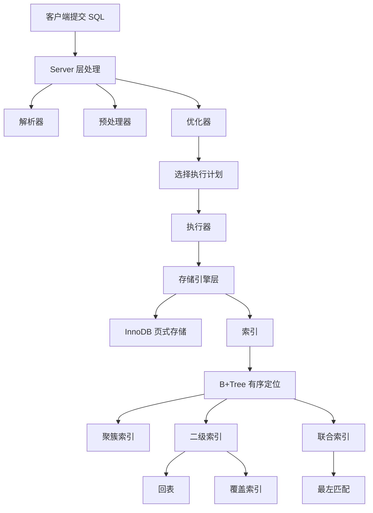

# MySQL Knowledge Map

```mermaid
graph TD
    A[客户端提交 SQL] --> B[Server 层处理]
    B --> C[解析器]
    B --> D[预处理器]
    B --> E[优化器]
    E --> F[选择执行计划]
    F --> G[执行器]
    G --> H[存储引擎层]
    H --> I[InnoDB 页式存储]
    H --> J[索引]
    J --> K[B+Tree 有序定位]
    K --> L[聚簇索引]
    K --> M[二级索引]
    M --> N[回表]
    M --> O[覆盖索引]
    K --> P[联合索引]
    P --> Q[最左匹配]
```
