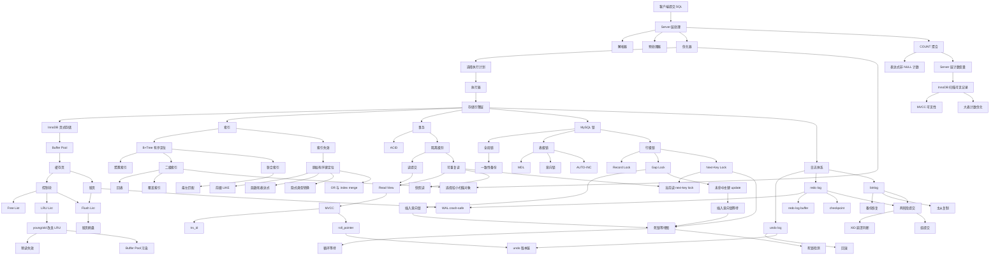

# MySQL Knowledge Map

<!-- study-agent-visual-contract:v1 -->
## Visual Contract

- This file is the global cross-topic and cross-chapter knowledge map.
- Use Mermaid for this global map.
- Keep chapter maps and concept-local diagrams canonical inside their notes; do not duplicate them here.
<!-- /study-agent-visual-contract:v1 -->
