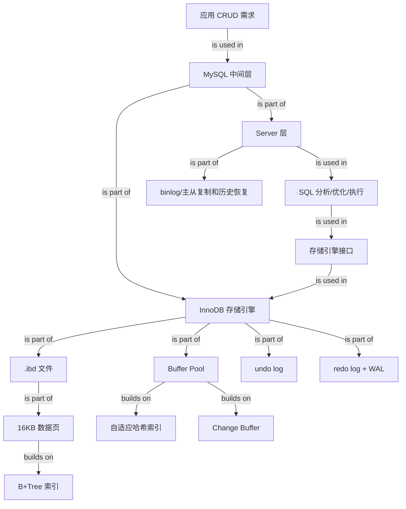

# MySQL Architecture Knowledge Graph

```mermaid
graph TD
    A[应用 CRUD 需求] -->|is used in| B[MySQL 中间层]
    B -->|is part of| C[Server 层]
    B -->|is part of| D[InnoDB 存储引擎]
    C -->|is used in| E[SQL 分析/优化/执行]
    E -->|is used in| F[存储引擎接口]
    F -->|is used in| D
    D -->|is part of| G[.ibd 文件]
    G -->|is part of| H[16KB 数据页]
    H -->|builds on| I[B+Tree 索引]
    D -->|is part of| J[Buffer Pool]
    J -->|builds on| K[自适应哈希索引]
    J -->|builds on| L[Change Buffer]
    D -->|is part of| M[undo log]
    D -->|is part of| N[redo log + WAL]
    C -->|is part of| O[binlog/主从复制和历史恢复]
```
