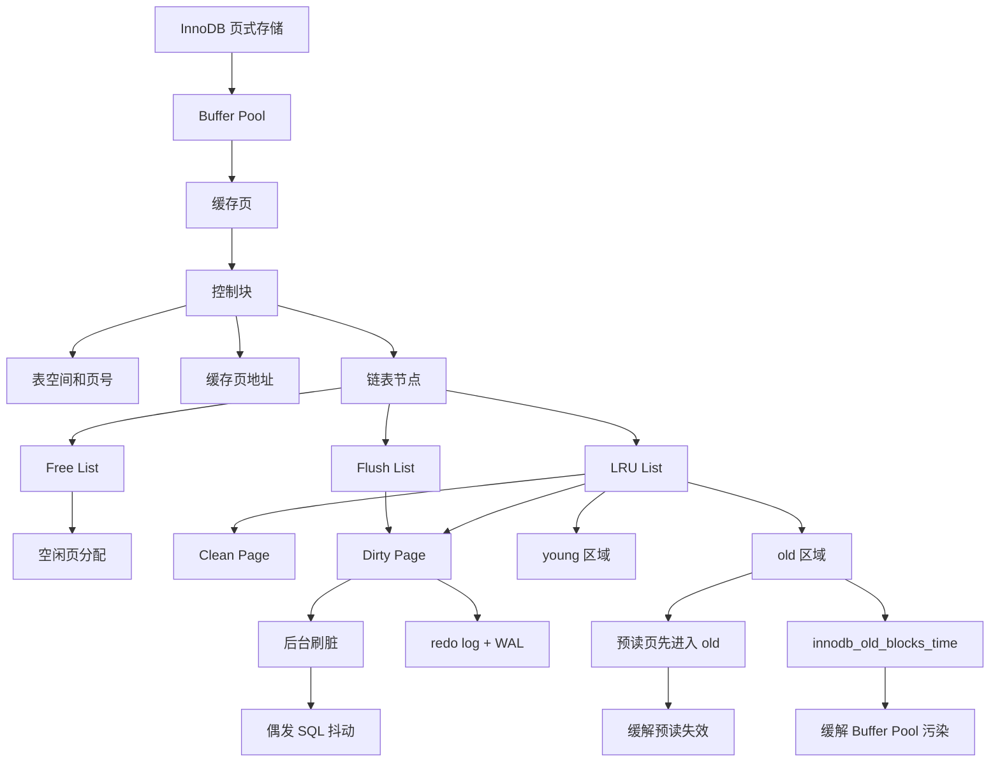

# MySQL Buffer Pool Knowledge Graph

```mermaid
graph TD
    A[InnoDB 页式存储] --> B[Buffer Pool]
    B --> C[缓存页]
    C --> D[控制块]
    D --> E[表空间和页号]
    D --> F[缓存页地址]
    D --> G[链表节点]
    G --> H[Free List]
    G --> I[LRU List]
    G --> J[Flush List]
    H --> K[空闲页分配]
    I --> L[Clean Page]
    I --> M[Dirty Page]
    J --> M
    M --> N[后台刷脏]
    M --> O[redo log + WAL]
    I --> P[young 区域]
    I --> Q[old 区域]
    Q --> R[预读页先进入 old]
    R --> S[缓解预读失效]
    Q --> T[innodb_old_blocks_time]
    T --> U[缓解 Buffer Pool 污染]
    N --> V[偶发 SQL 抖动]
```
