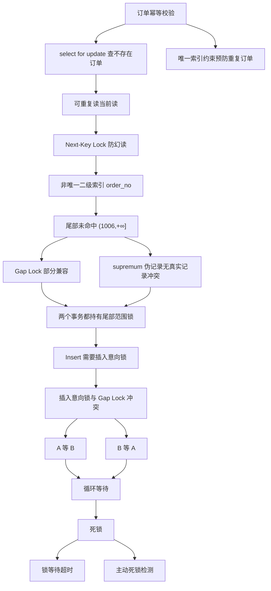

# MySQL Deadlock Graph

```mermaid
graph TD
    A[订单幂等校验] --> B[select for update 查不存在订单]
    B --> C[可重复读当前读]
    C --> D[Next-Key Lock 防幻读]
    D --> E[非唯一二级索引 order_no]
    E --> F["尾部未命中 (1006,+∞]"]
    F --> G[Gap Lock 部分兼容]
    F --> H[supremum 伪记录无真实记录冲突]
    G --> I[两个事务都持有尾部范围锁]
    H --> I
    I --> J[Insert 需要插入意向锁]
    J --> K[插入意向锁与 Gap Lock 冲突]
    K --> L[A 等 B]
    K --> M[B 等 A]
    L --> N[循环等待]
    M --> N
    N --> O[死锁]
    O --> P[锁等待超时]
    O --> Q[主动死锁检测]
    A --> R[唯一索引约束预防重复订单]
```
