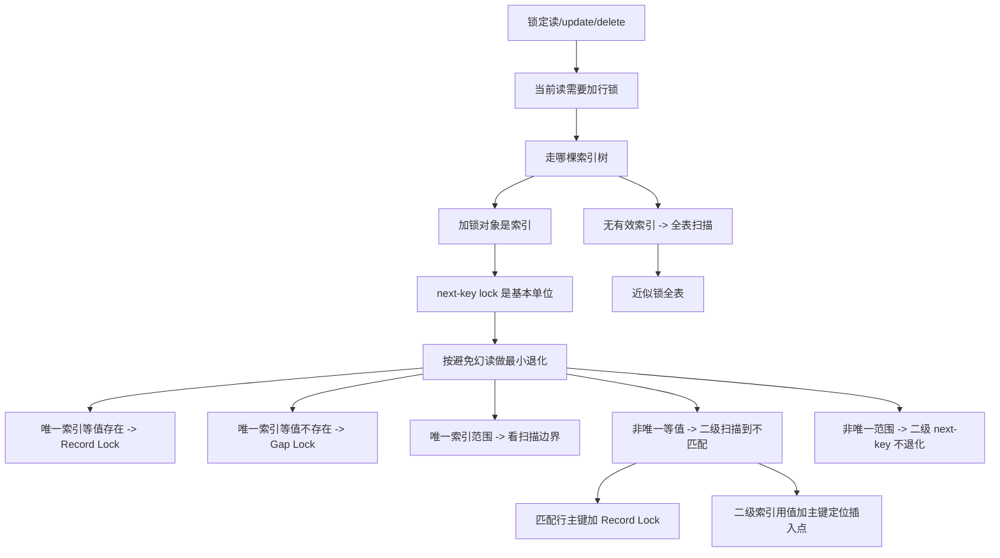

# MySQL How To Lock Graph

```mermaid
graph TD
    A[锁定读/update/delete] --> B[当前读需要加行锁]
    B --> C[走哪棵索引树]
    C --> D[加锁对象是索引]
    D --> E[next-key lock 是基本单位]
    E --> F[按避免幻读做最小退化]
    F --> G[唯一索引等值存在 -> Record Lock]
    F --> H[唯一索引等值不存在 -> Gap Lock]
    F --> I[唯一索引范围 -> 看扫描边界]
    F --> J[非唯一等值 -> 二级扫描到不匹配]
    J --> K[匹配行主键加 Record Lock]
    J --> L[二级索引用值加主键定位插入点]
    F --> M[非唯一范围 -> 二级 next-key 不退化]
    C --> N[无有效索引 -> 全表扫描]
    N --> O[近似锁全表]
```
