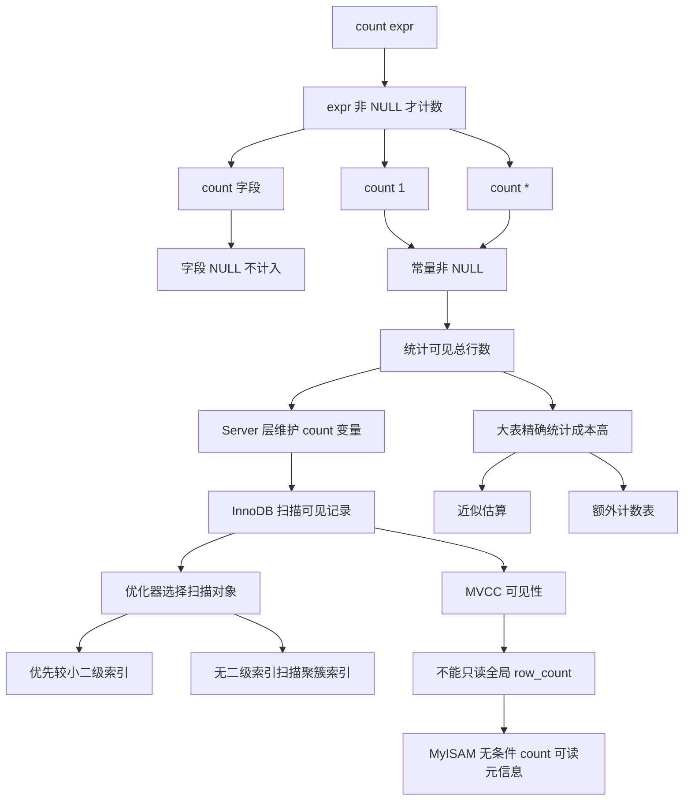

# MySQL COUNT Knowledge Graph

```mermaid
graph TD
    A[count expr] --> B[expr 非 NULL 才计数]
    B --> C[count 字段]
    B --> D[count 1]
    B --> E[count *]
    C --> F[字段 NULL 不计入]
    D --> G[常量非 NULL]
    E --> G
    G --> H[统计可见总行数]
    H --> I[Server 层维护 count 变量]
    I --> J[InnoDB 扫描可见记录]
    J --> K[优化器选择扫描对象]
    K --> L[优先较小二级索引]
    K --> M[无二级索引扫描聚簇索引]
    J --> N[MVCC 可见性]
    N --> O[不能只读全局 row_count]
    O --> P[MyISAM 无条件 count 可读元信息]
    H --> Q[大表精确统计成本高]
    Q --> R[近似估算]
    Q --> S[额外计数表]
```
