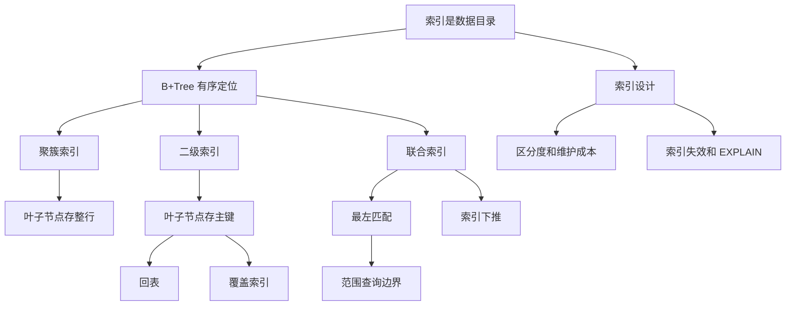

# MySQL Index Interview Knowledge Graph

```mermaid
graph TD
    A[索引是数据目录] --> B[B+Tree 有序定位]
    B --> C[聚簇索引]
    B --> D[二级索引]
    C --> E[叶子节点存整行]
    D --> F[叶子节点存主键]
    F --> G[回表]
    F --> H[覆盖索引]
    B --> I[联合索引]
    I --> J[最左匹配]
    J --> K[范围查询边界]
    I --> L[索引下推]
    A --> M[索引设计]
    M --> N[区分度和维护成本]
    M --> O[索引失效和 EXPLAIN]
```
