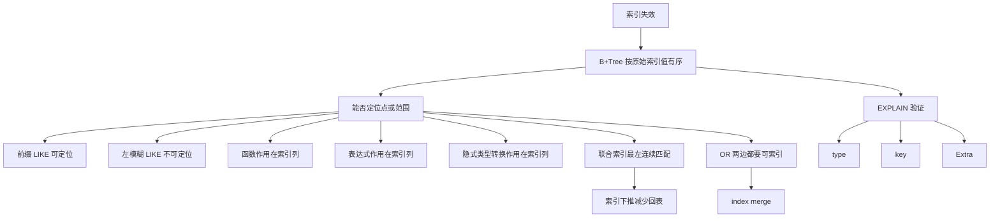

# MySQL 索引失效知识图谱

```mermaid
graph TD
    A[索引失效] --> B[B+Tree 按原始索引值有序]
    B --> C[能否定位点或范围]
    C --> D[前缀 LIKE 可定位]
    C --> E[左模糊 LIKE 不可定位]
    C --> F[函数作用在索引列]
    C --> G[表达式作用在索引列]
    C --> H[隐式类型转换作用在索引列]
    C --> I[联合索引最左连续匹配]
    I --> J[索引下推减少回表]
    C --> K[OR 两边都要可索引]
    K --> L[index merge]
    B --> M[EXPLAIN 验证]
    M --> N[type]
    M --> O[key]
    M --> P[Extra]
```
