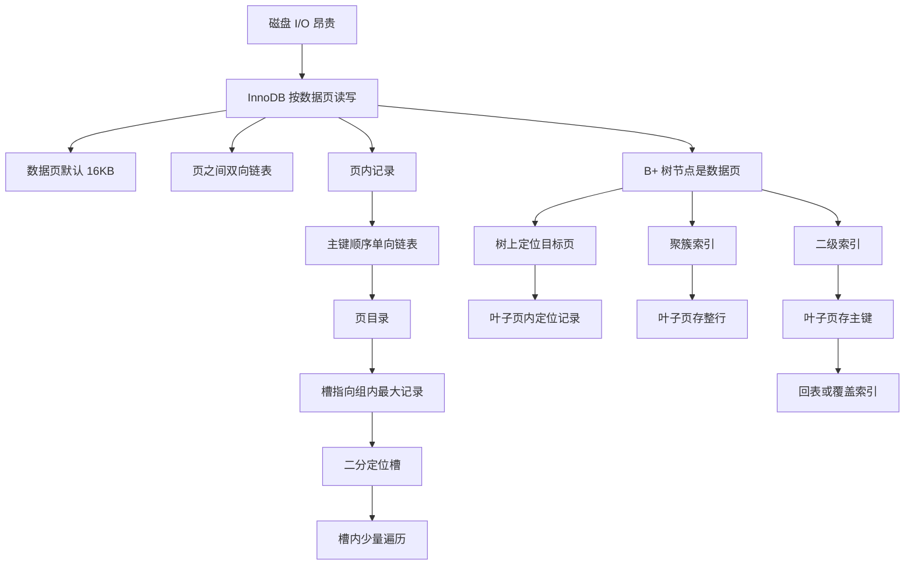

# MySQL Page-Oriented B+Tree Knowledge Graph

```mermaid
graph TD
    A[磁盘 I/O 昂贵] --> B[InnoDB 按数据页读写]
    B --> C[数据页默认 16KB]
    B --> D[页之间双向链表]
    B --> E[页内记录]
    E --> F[主键顺序单向链表]
    F --> G[页目录]
    G --> H[槽指向组内最大记录]
    H --> I[二分定位槽]
    I --> J[槽内少量遍历]
    B --> K[B+ 树节点是数据页]
    K --> L[树上定位目标页]
    L --> M[叶子页内定位记录]
    K --> N[聚簇索引]
    K --> O[二级索引]
    N --> P[叶子页存整行]
    O --> Q[叶子页存主键]
    Q --> R[回表或覆盖索引]
```
