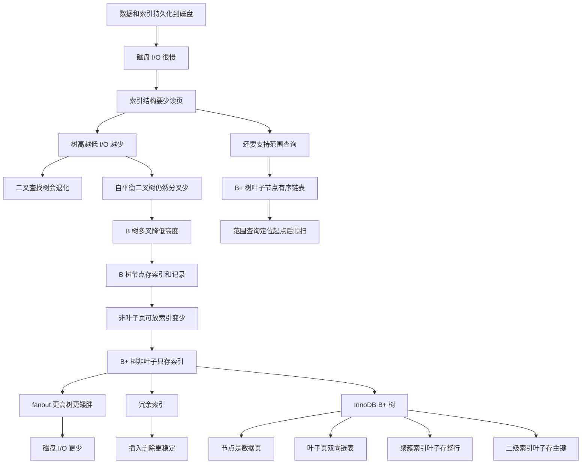

# MySQL Why B+Tree Index Knowledge Graph

```mermaid
graph TD
    A[数据和索引持久化到磁盘] --> B[磁盘 I/O 很慢]
    B --> C[索引结构要少读页]
    C --> D[树高越低 I/O 越少]
    C --> E[还要支持范围查询]
    D --> F[二叉查找树会退化]
    D --> G[自平衡二叉树仍然分叉少]
    G --> H[B 树多叉降低高度]
    H --> I[B 树节点存索引和记录]
    I --> J[非叶子页可放索引变少]
    J --> K[B+ 树非叶子只存索引]
    K --> L[fanout 更高树更矮胖]
    L --> M[磁盘 I/O 更少]
    K --> N[冗余索引]
    N --> O[插入删除更稳定]
    E --> P[B+ 树叶子节点有序链表]
    P --> Q[范围查询定位起点后顺扫]
    K --> R[InnoDB B+ 树]
    R --> S[节点是数据页]
    R --> T[叶子页双向链表]
    R --> U[聚簇索引叶子存整行]
    R --> V[二级索引叶子存主键]
```
