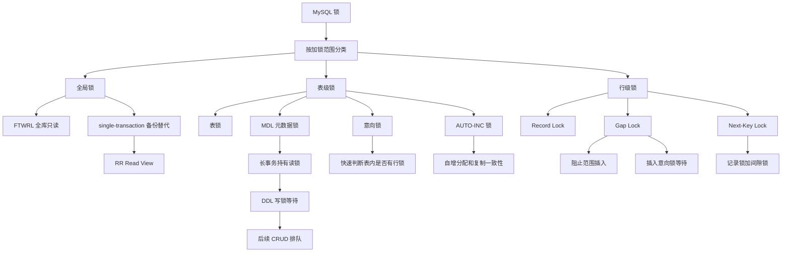

# MySQL Lock Graph

```mermaid
graph TD
    A[MySQL 锁] --> B[按加锁范围分类]
    B --> C[全局锁]
    B --> D[表级锁]
    B --> E[行级锁]
    C --> F[FTWRL 全库只读]
    C --> G[single-transaction 备份替代]
    G --> H[RR Read View]
    D --> I[表锁]
    D --> J[MDL 元数据锁]
    J --> K[长事务持有读锁]
    K --> L[DDL 写锁等待]
    L --> M[后续 CRUD 排队]
    D --> N[意向锁]
    N --> O[快速判断表内是否有行锁]
    D --> P[AUTO-INC 锁]
    P --> Q[自增分配和复制一致性]
    E --> R[Record Lock]
    E --> S[Gap Lock]
    E --> T[Next-Key Lock]
    S --> U[阻止范围插入]
    T --> V[记录锁加间隙锁]
    S --> W[插入意向锁等待]
```
