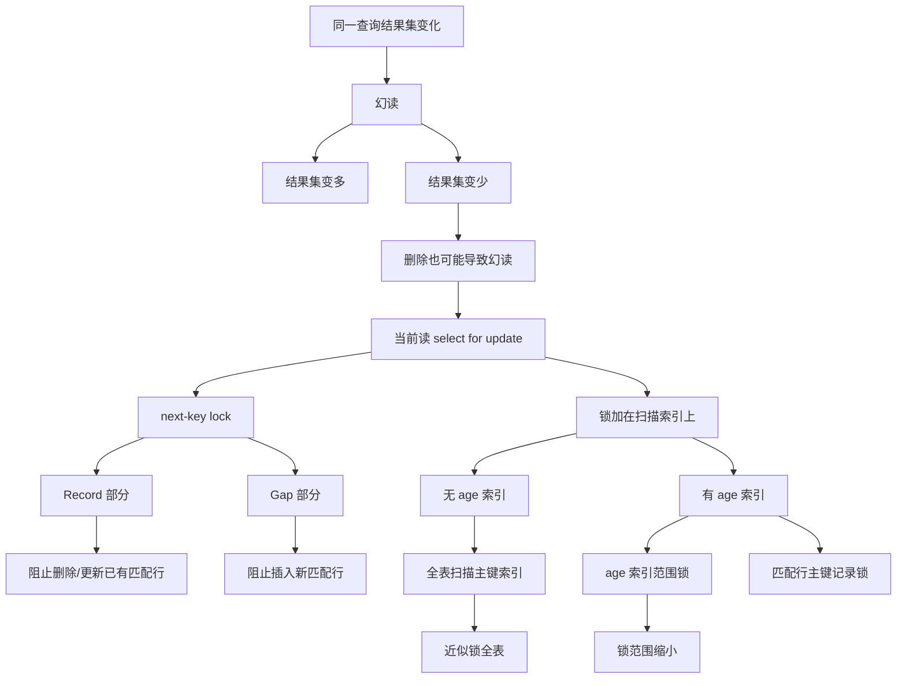

# MySQL lock phantom graph

```mermaid
graph TD
    A[同一查询结果集变化] --> B[幻读]
    B --> C[结果集变多]
    B --> D[结果集变少]
    D --> E[删除也可能导致幻读]
    E --> F[当前读 select for update]
    F --> G[next-key lock]
    G --> H[Record 部分]
    G --> I[Gap 部分]
    H --> J[阻止删除/更新已有匹配行]
    I --> K[阻止插入新匹配行]
    F --> L[锁加在扫描索引上]
    L --> M[无 age 索引]
    M --> N[全表扫描主键索引]
    N --> O[近似锁全表]
    L --> P[有 age 索引]
    P --> Q[age 索引范围锁]
    P --> R[匹配行主键记录锁]
    Q --> S[锁范围缩小]
```
