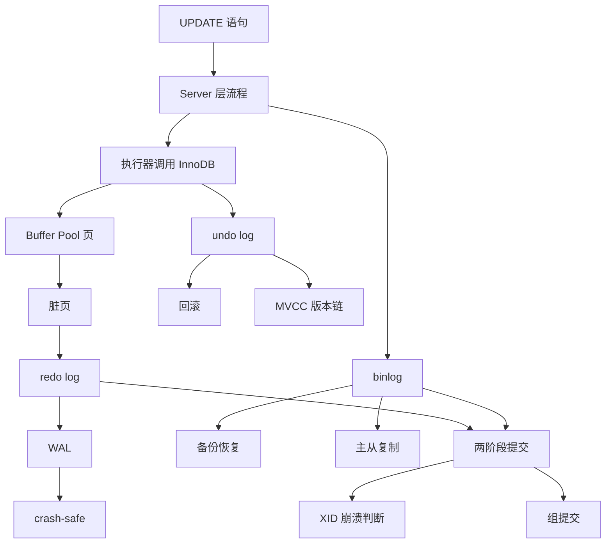

# MySQL how_update Knowledge Graph

```mermaid
graph TD
    A[UPDATE 语句] --> B[Server 层流程]
    B --> C[执行器调用 InnoDB]
    C --> D[Buffer Pool 页]
    D --> E[脏页]
    C --> F[undo log]
    F --> G[回滚]
    F --> H[MVCC 版本链]
    E --> I[redo log]
    I --> J[WAL]
    J --> K[crash-safe]
    B --> L[binlog]
    L --> M[备份恢复]
    L --> N[主从复制]
    I --> O[两阶段提交]
    L --> O
    O --> P[XID 崩溃判断]
    O --> Q[组提交]
```
