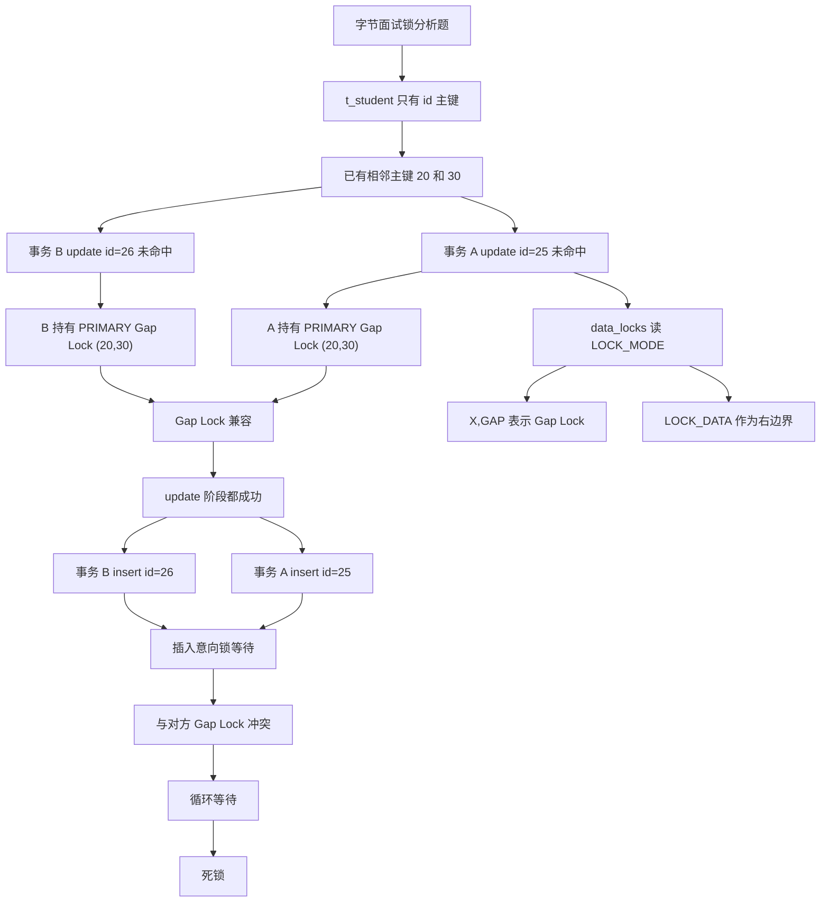

# MySQL Show Lock Graph

```mermaid
graph TD
    A[字节面试锁分析题] --> B[t_student 只有 id 主键]
    B --> C["已有相邻主键 20 和 30"]
    C --> D[事务 A update id=25 未命中]
    C --> E[事务 B update id=26 未命中]
    D --> F["A 持有 PRIMARY Gap Lock (20,30)"]
    E --> G["B 持有 PRIMARY Gap Lock (20,30)"]
    F --> H[Gap Lock 兼容]
    G --> H
    H --> I[update 阶段都成功]
    I --> J[事务 A insert id=25]
    I --> K[事务 B insert id=26]
    J --> L[插入意向锁等待]
    K --> L
    L --> M[与对方 Gap Lock 冲突]
    M --> N[循环等待]
    N --> O[死锁]
    D --> P[data_locks 读 LOCK_MODE]
    P --> Q["X,GAP 表示 Gap Lock"]
    P --> R[LOCK_DATA 作为右边界]
```
