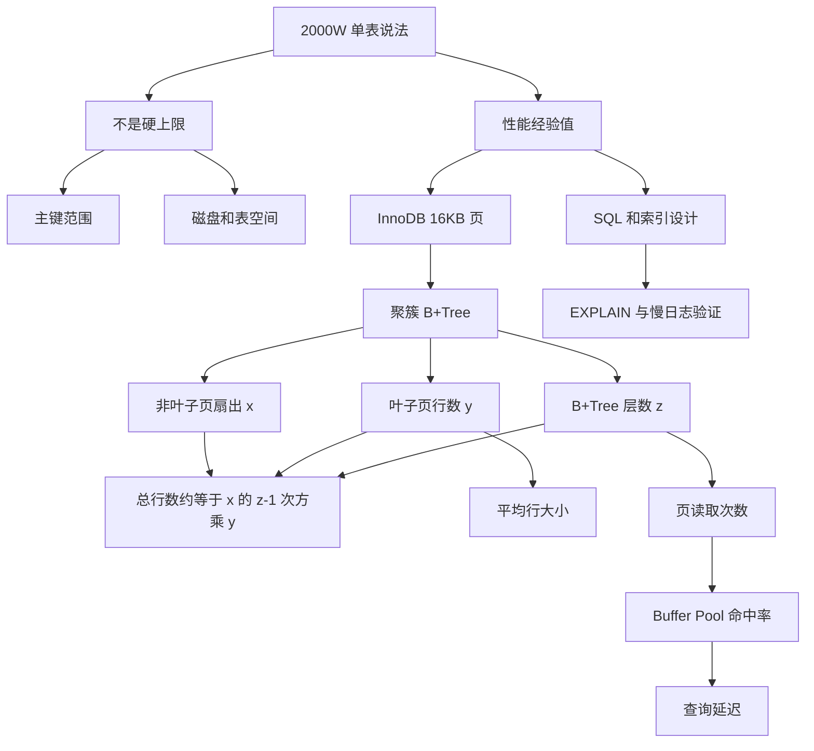

# MySQL 单表 2000W 经验值知识图谱

```mermaid
graph TD
    A[2000W 单表说法] --> B[不是硬上限]
    A --> C[性能经验值]
    B --> D[主键范围]
    B --> E[磁盘和表空间]
    C --> F[InnoDB 16KB 页]
    F --> G[聚簇 B+Tree]
    G --> H[非叶子页扇出 x]
    G --> I[叶子页行数 y]
    G --> J[B+Tree 层数 z]
    H --> K[总行数约等于 x 的 z-1 次方乘 y]
    I --> K
    J --> K
    I --> L[平均行大小]
    J --> M[页读取次数]
    M --> N[Buffer Pool 命中率]
    N --> O[查询延迟]
    C --> P[SQL 和索引设计]
    P --> Q[EXPLAIN 与慢日志验证]
```
