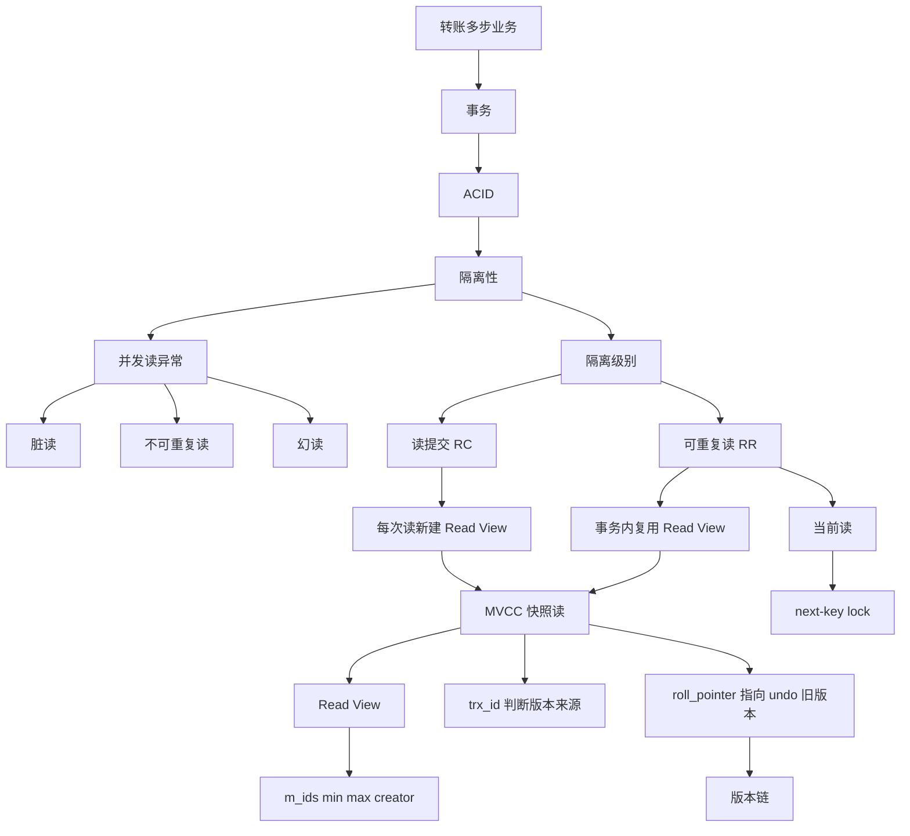

# MySQL Transaction MVCC Knowledge Graph

```mermaid
graph TD
    A[转账多步业务] --> B[事务]
    B --> C[ACID]
    C --> D[隔离性]
    D --> E[并发读异常]
    E --> F[脏读]
    E --> G[不可重复读]
    E --> H[幻读]
    D --> I[隔离级别]
    I --> J[读提交 RC]
    I --> K[可重复读 RR]
    J --> L[每次读新建 Read View]
    K --> M[事务内复用 Read View]
    L --> N[MVCC 快照读]
    M --> N
    N --> O[Read View]
    O --> P[m_ids min max creator]
    N --> Q[trx_id 判断版本来源]
    N --> R[roll_pointer 指向 undo 旧版本]
    R --> S[版本链]
    K --> T[当前读]
    T --> U[next-key lock]
```
