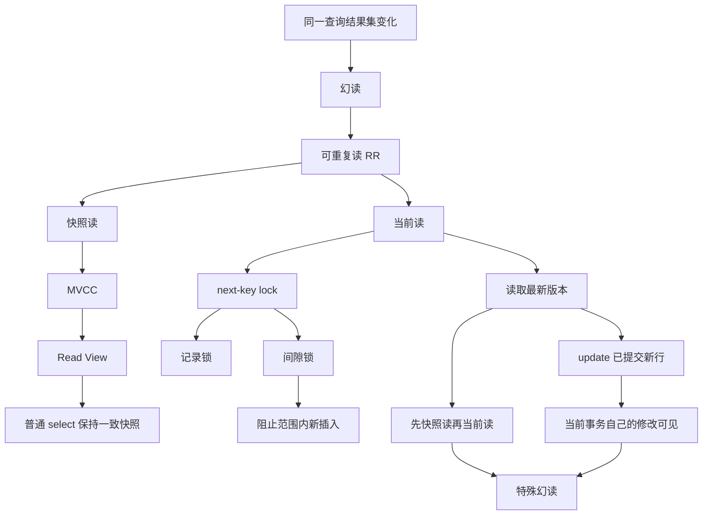

# MySQL Transaction Phantom Knowledge Graph

```mermaid
graph TD
    A[同一查询结果集变化] --> B[幻读]
    B --> C[可重复读 RR]
    C --> D[快照读]
    C --> E[当前读]
    D --> F[MVCC]
    F --> G[Read View]
    G --> H[普通 select 保持一致快照]
    E --> I[读取最新版本]
    E --> J[next-key lock]
    J --> K[记录锁]
    J --> L[间隙锁]
    L --> M[阻止范围内新插入]
    I --> N[先快照读再当前读]
    I --> O[update 已提交新行]
    O --> P[当前事务自己的修改可见]
    N --> Q[特殊幻读]
    P --> Q
```
