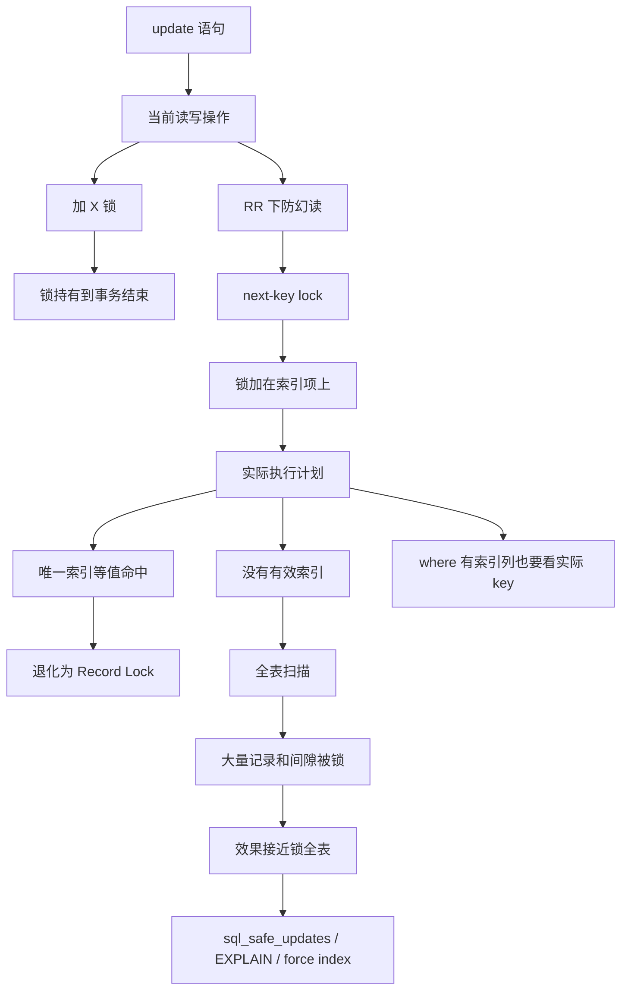

# MySQL update no-index lock graph

```mermaid
graph TD
    A[update 语句] --> B[当前读写操作]
    B --> C[加 X 锁]
    C --> D[锁持有到事务结束]
    B --> E[RR 下防幻读]
    E --> F[next-key lock]
    F --> G[锁加在索引项上]
    G --> H[实际执行计划]
    H --> I[唯一索引等值命中]
    I --> J[退化为 Record Lock]
    H --> K[没有有效索引]
    K --> L[全表扫描]
    L --> M[大量记录和间隙被锁]
    M --> N[效果接近锁全表]
    H --> O[where 有索引列也要看实际 key]
    N --> P[sql_safe_updates / EXPLAIN / force index]
```
