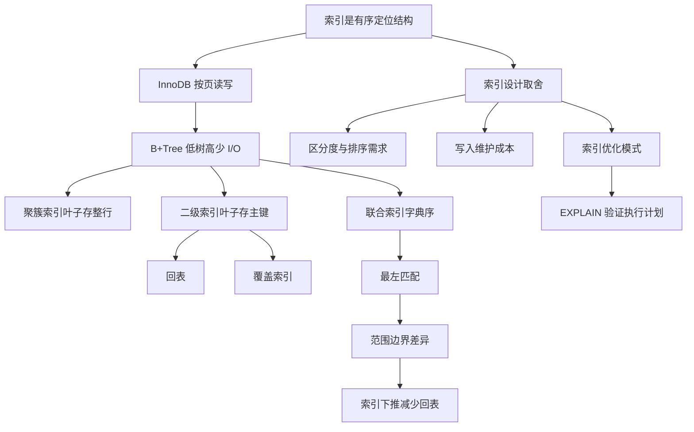

# MySQL 索引常见面试题

### 1. Topic Overview

- What this is about: 从面试角度理解 MySQL 索引的原理、分类、B+Tree、回表、覆盖索引、联合索引、索引设计、索引失效和 EXPLAIN。
- Why it matters: 索引题不是背名词。面试官通常会沿着一条链追问：为什么快 -> 树里存什么 -> SQL 怎么利用有序性 -> 为什么失效 -> 如何用 EXPLAIN 验证。
- Difficulty level: beginner to intermediate.
- Prerequisites:
  - MySQL Server 层和存储引擎层的分工。
  - InnoDB 按页读写，页通常是磁盘 I/O 的基本单位。
  - B+Tree 是有序、多叉、低高度的索引结构。
  - 基本 SQL: `WHERE`, `ORDER BY`, `GROUP BY`, `LIKE`, `BETWEEN`。

Learning roadmap:

1. 索引是有序定位结构。
2. 用四个问题分类索引。
3. 用页级 I/O 理解 B+Tree 为什么适合 InnoDB。
4. 区分聚簇索引、二级索引、回表、覆盖索引。
5. 用“全局有序 / 局部有序”理解联合索引和最左匹配。
6. 处理范围查询、`>=`、`BETWEEN`、`LIKE 'x%'` 的边界差异。
7. 用 ICP、区分度、排序需求和维护成本设计索引。
8. 用 EXPLAIN 验证索引是否真的用上。

### 2. Core Concepts

#### Schema 1: Index as Ordered Locator

- Definition: 索引是存储引擎用来快速定位数据的数据结构。
- Intuition: 像书的目录。目录不存正文全部内容，但能帮你快速找到正文位置。
- Example:

```sql
select * from product where id = 5;
```

如果 `id` 是主键索引，InnoDB 可以沿 B+Tree 的有序 key 定位目标页，而不是从头扫描很多数据页。

- Common mistakes:
  - 只说“索引能加快查询”，但说不出靠什么加快。
  - 忽略索引成本：占空间，写入时还要维护有序结构。

#### Schema 2: Four Questions for Index Classification

分类索引时，不要把名词混在一起。每个维度是在问一个不同问题：

| Question | Classification | Examples |
| --- | --- | --- |
| 这个索引用什么结构存？ | 数据结构 | B+Tree, Hash, Full-text |
| 叶子节点放什么？ | 物理存储 | 聚簇索引, 二级索引 |
| 字段有什么约束？ | 字段特性 | 主键索引, 唯一索引, 普通索引, 前缀索引 |
| 由几个字段组成？ | 字段个数 | 单列索引, 联合索引 |

Example:

```sql
UNIQUE KEY uk_email(email)
```

通常可以同时是：

- B+Tree 索引：按数据结构看。
- 二级索引：按物理存储看，因为不是聚簇索引。
- 唯一索引：按字段特性看，因为 `UNIQUE`。
- 单列索引：按字段个数看，因为只有 `email`。

- Common mistakes:
  - 把“唯一索引”和“二级索引”当成互斥关系。
  - 被问物理存储时回答字段约束。

#### Schema 3: Storage Engine, Page, and B+Tree Bridge

- Definition: InnoDB 负责真正存取数据和索引；InnoDB 主要按页读写；B+Tree 通过低高度的页跳转减少 I/O。
- Intuition:

```text
执行器 -> InnoDB -> B+Tree 页 -> 叶子页 -> 数据或主键
```

- Example:

```sql
select * from product where id = 5;
```

可能经历：

```text
根节点页 -> 中间节点页 -> 叶子节点页
```

树高低，读的页就少。

- Common mistakes:
  - 以为查一行就只从磁盘读一行。
  - 只说 B+Tree 是 `O(log n)`，不连接到页和磁盘 I/O。

#### Schema 4: Why InnoDB Usually Uses B+Tree

B+Tree 的优势要按对比回答：

| Compared with | B+Tree advantage |
| --- | --- |
| Hash | B+Tree 保序，支持范围查询和排序；Hash 适合等值查询但不保序。 |
| Binary tree | B+Tree 扇出高、树高低，一次页读取能比较很多 key，I/O 少。 |
| B Tree | B+Tree 数据集中在叶子节点，非叶子节点能放更多 key；叶子节点有序相连，范围扫描方便。 |

Example:

```sql
where id between 10 and 100
```

B+Tree 可以先定位 `10` 附近的叶子节点，再沿叶子链表扫到 `100`。

- Common mistakes:
  - 说 Hash 快，所以应该用 Hash，忽略数据库常见的范围查询和排序。
  - 说 B+Tree 快，但不说明“低树高 + 少页读 + 叶子链表”。

#### Schema 5: Clustered Index, Secondary Index, Back-to-Table Lookup, Covering Index

- Definition:
  - 聚簇索引：叶子节点存整行数据。
  - 二级索引：叶子节点存索引列和主键值。
  - 回表：通过二级索引拿到主键，再去聚簇索引查整行。
  - 覆盖索引：查询需要的列都在二级索引里，不需要回表。

Example:

```sql
CREATE TABLE product (
  id int NOT NULL,
  product_no varchar(20),
  name varchar(255),
  price decimal(10, 2),
  PRIMARY KEY (id),
  KEY idx_product_no_name(product_no, name)
);
```

Needs back-to-table lookup:

```sql
select * from product where product_no = '0002';
```

Can be covered:

```sql
select id, product_no, name
from product
where product_no = '0002';
```

Reason: 二级索引里有 `product_no`, `name`，并且叶子记录带主键 `id`。

- Common mistakes:
  - 以为任何二级索引查询都要回表。
  - 以为二级索引叶子节点存完整行。

#### Schema 6: Composite Index Leftmost Prefix

- Definition: 联合索引按字典序排序。比如 `(a,b,c)` 是先按 `a` 排序，`a` 相同再按 `b`，`a,b` 都相同再按 `c`。
- Intuition:
  - `a` 是全局有序。
  - `b` 只有在 `a` 固定的小范围内有序。
  - `c` 只有在 `a,b` 固定的小范围内有序。

Example:

```text
(1, 5)
(1, 9)
(2, 3)
(2, 8)
(3, 1)
```

`a` 全局有序，`b` 不全局有序。

Works well:

```sql
where a = 2 and b = 8
```

Usually not good for positioning:

```sql
where b = 8
```

- Common mistakes:
  - 背“最左匹配”，但不能用“全局有序 / 局部有序”解释。
  - 以为 WHERE 里字段顺序必须和索引顺序一样。实际优化器可调整条件顺序，关键是是否提供左前缀。

#### Schema 7: Composite Index Range Boundary

范围查询不是一句“后面的列都失效”就能讲完。要看边界是否包含一个固定左列的小组。

Case A:

```sql
where a > 1 and b = 2
```

`a > 1` 形成扫描范围。这个范围跨多个不同的 `a` 值，`b` 不全局有序，所以 `b=2` 通常不能继续缩小索引边界，只能扫描时过滤。

Case B:

```sql
where a >= 1 and b = 2
```

起始边界包含 `a=1`。在 `a=1` 这一小段里，`b` 有序，所以 `b=2` 有机会参与起始边界定位。

Case C:

```sql
where a between 2 and 8 and b = 2
```

MySQL 的 `BETWEEN` 包含边界。起点包含 `a=2` 小段，在这一段里 `b` 有序，所以 `b=2` 有机会参与起点定位。

Case D:

```sql
where name like 'j%' and age = 22
```

`like 'j%'` 可以转为范围 `['j','k')`，因为前缀确定。`like '%j'` 前缀不确定，通常无法定位起点。

- Common mistakes:
  - 把所有范围查询都机械理解为“一遇到范围后面全部不能用”。
  - 不区分 `>` 和 `>=` 的边界差异。
  - 不区分 `like 'j%'` 和 `like '%j'`。

#### Schema 8: Index Condition Pushdown

- Definition: ICP 允许 MySQL 在扫描二级索引时，先判断索引里已有字段的条件，过滤掉不满足的记录，减少回表。
- Intuition: ICP 不能改变原始扫描范围，但能减少“哪些记录要回表”。

Example:

```sql
KEY idx_a_b(a, b);

select * from t where a > 1 and b = 2;
```

`a > 1` 形成扫描范围。`b=2` 不能作为主要边界定位，但如果使用 ICP，可以在二级索引里先判断 `b=2`，满足才回表。

- Common mistakes:
  - 以为 ICP 让 `b=2` 重新变成边界条件。
  - 说 ICP 减少二级索引扫描范围，而不是减少回表次数。

#### Schema 9: Index Design Tradeoff

索引设计不是“看到字段就建”，而是看查询收益是否超过维护成本。

Good candidates:

- 经常出现在 `WHERE` 的字段。
- 经常用于 `ORDER BY` / `GROUP BY` 的字段。
- 区分度高的字段，如 `user_id`, `email`。
- 能形成覆盖索引的字段组合。

Bad candidates:

- 很少用于查询、排序、分组的字段。
- 大量重复值且过滤能力弱的字段，如分布均匀的 `gender`。
- 表很小。
- 频繁更新的字段，因为更新数据行时还要维护相关 B+Tree。

Composite index order:

- 从区分度看，`user_id` 通常比 `status` 更适合靠前。
- 从查询模式看，`where status=1 order by create_time` 可能适合 `(status, create_time)`，因为它同时支持过滤和排序。

- Common mistakes:
  - 只看区分度，忽略 `ORDER BY`。
  - 只看查询速度，忽略写入维护成本。

#### Schema 10: Index Optimization Patterns

索引优化不是一个单独技巧，而是一组围绕“少扫、少回表、少排序、少维护”的模式。

| Optimization pattern | What it reduces | Example |
| --- | --- | --- |
| 覆盖索引 | 减少回表 | `(user_id, status)` 覆盖 `select id, user_id, status ...` |
| 联合索引支持排序 | 减少 filesort | `(status, create_time)` 支持 `where status=1 order by create_time` |
| 前缀索引 | 减少索引项大小 | 对长字符串建 `name(10)` |
| 自增短主键 | 减少页分裂和二级索引体积 | `bigint auto_increment primary key` |
| 索引列尽量 `NOT NULL` | 降低统计和值比较复杂度 | 常用过滤列设为 `NOT NULL` |
| 避免索引失效写法 | 保留有序定位能力 | `age = 19` 优于 `age + 1 = 20` |
| ICP | 减少回表 | 二级索引扫描时先判断索引内条件 |

How to choose:

1. 如果慢在回表多，优先考虑覆盖索引或 ICP。
2. 如果慢在排序，优先考虑让联合索引同时服务 `WHERE` 和 `ORDER BY`。
3. 如果索引太大，考虑前缀索引或缩短主键。
4. 如果写入慢，减少低收益索引，避免频繁更新字段建索引。
5. 优化后用 EXPLAIN 验证，而不是只凭感觉。

Example:

```sql
select id, user_id, status
from orders
where user_id = 42 and status = 1;
```

If the index is:

```sql
KEY idx_user_status(user_id, status)
```

This can be a covering index because the secondary index contains `user_id`, `status`, and the primary key `id`.

Another example:

```sql
select *
from orders
where status = 1
order by create_time;
```

`KEY idx_status_create_time(status, create_time)` can reduce extra sorting because inside the `status=1` group, `create_time` is already ordered.

- Common mistakes:
  - 把“优化索引”理解成“多建索引”。
  - 只记优化名词，不知道它减少的是扫描、回表、排序还是维护成本。
  - 建了索引后不看 EXPLAIN 验证 `key`, `type`, `Extra`。

#### Schema 11: Index Invalidations and EXPLAIN Verification

Common invalidation patterns:

```sql
where name like '%Tom';
where age + 1 = 20;
where lower(name) = 'tom';
where b = 2; -- index is (a,b)
where indexed_col = 1 or non_indexed_col = 2;
```

Core reason: SQL 写法让 MySQL 不能直接利用原始有序 key 定位。

Use EXPLAIN to verify:

| Field | Meaning |
| --- | --- |
| `possible_keys` | 可能使用的索引，不代表实际使用。 |
| `key` | 实际选择的索引。`NULL` 表示没选索引。 |
| `key_len` | 用了索引多少长度，可辅助判断联合索引用到几列。 |
| `rows` | 估计扫描行数。 |
| `type` | 访问方式。`ALL` 最差，`range/ref/const` 通常更好。 |
| `Extra` | 额外信息，如 `Using index`, `Using index condition`, `Using filesort`。 |

Important `Extra` values:

- `Using index`: 覆盖索引。
- `Using index condition`: 索引下推。
- `Using filesort`: 不能直接利用索引顺序完成排序，需要额外排序。

- Common mistakes:
  - 看到 `possible_keys` 有值就以为用了索引。
  - 不看 `key`、`type`、`Extra`。

### 3. Deep Understanding

This chapter has one causal chain:

```text
索引是有序定位结构
-> InnoDB 按页读写
-> B+Tree 用低树高减少页读取
-> 聚簇/二级索引决定叶子节点存什么
-> 二级索引产生回表或覆盖索引
-> 联合索引按左到右排序
-> SQL 是否能利用有序性决定能否高效定位
-> 索引优化减少扫描、回表、排序和维护成本
-> EXPLAIN 验证真实执行计划
```

Key boundaries:

- `key` 实际用了索引，`possible_keys` 只是候选。
- 二级索引不是一定回表；覆盖索引可以不回表。
- 范围查询不是一律让后列完全没用；`>=`、`BETWEEN`、`LIKE 'x%'` 有边界细节。
- ICP 是过滤优化，不是边界定位优化。
- 区分度是索引顺序的重要因素，但不是唯一因素；排序和查询模式也重要。
- 索引优化要说清楚“减少了什么成本”：扫描、回表、排序、空间或写入维护。

### 4. Minimal Working Example

```sql
CREATE TABLE orders (
  id bigint NOT NULL,
  user_id bigint NOT NULL,
  status tinyint NOT NULL,
  create_time datetime NOT NULL,
  amount decimal(10, 2) NOT NULL,
  PRIMARY KEY (id),
  KEY idx_user_status(user_id, status),
  KEY idx_status_create_time(status, create_time)
) ENGINE = InnoDB;
```

Execution reasoning:

1. Primary key lookup:

```sql
select * from orders where id = 100;
```

Uses clustered index. Leaf node stores the full row.

2. Secondary index plus possible back-to-table lookup:

```sql
select * from orders where user_id = 42 and status = 1;
```

Can use `idx_user_status` to find matching primary keys. Because `select *` needs `create_time`, `amount`, and other full-row columns, it may need back-to-table lookup.

3. Covering index:

```sql
select id, user_id, status
from orders
where user_id = 42 and status = 1;
```

`idx_user_status` contains `user_id`, `status`, and primary key `id`, so it can be covered.

4. Filtering plus ordering:

```sql
select *
from orders
where status = 1
order by create_time;
```

`idx_status_create_time(status, create_time)` can first locate the `status=1` group, then read rows already ordered by `create_time`, reducing filesort.

5. Expression invalidation:

```sql
select * from orders where user_id + 1 = 43;
```

The index is ordered by original `user_id`, not by `user_id + 1`. Prefer rewriting to:

```sql
select * from orders where user_id = 42;
```

### 5. Knowledge Graph



### 6. Self-Test Questions

Recall:

1. InnoDB 主键索引和二级索引的叶子节点分别存什么？
2. 为什么 B+Tree 比 Hash 更适合作为 MySQL 的通用索引结构？
3. EXPLAIN 里 `possible_keys` 和 `key` 的区别是什么？
4. 覆盖索引、ICP、联合索引排序分别主要减少什么成本？

Application / transfer:

1. 有索引 `KEY idx_a_b(a,b)`，为什么 `where a > 1 and b = 2` 中 `b=2` 通常不能继续缩小扫描边界？ICP 又能帮什么？
2. 有查询 `where status=1 order by create_time`，为什么 `(status, create_time)` 可能比单独 `status` 索引更好？
3. 如果一个查询慢在大量回表，你会优先考虑哪类索引优化？为什么？

Explain like I am 5:

1. 用“书的目录”和“页码”解释索引、二级索引、回表和覆盖索引。

### 7. Weak Point Detection

Likely failure patterns:

- Missing prerequisite: 不清楚存储引擎、页、B+Tree 之间的关系。
- Surface-level memorization: 能背“最左匹配”，但不能解释全局有序和局部有序。
- Boundary confusion: 把 `>`, `>=`, `BETWEEN`, `LIKE 'x%'` 都当成同一种范围查询。
- Concept priority issue: 说 Hash 主要问题是空间，而不是不保序。
- Procedure confusion: 把 ICP 说成减少扫描边界，而不是减少回表。
- Design overgeneralization: 只按区分度排联合索引，不考虑 `ORDER BY`。
- Optimization label memorization: 只背“前缀索引、覆盖索引、ICP”，但说不出分别减少什么成本。
- Verification gap: 看到 `possible_keys` 就以为用了索引，不看 `key`, `type`, `Extra`。

Recommended review prompts:

- Why does `where b=2` usually not use `(a,b,c)` for efficient positioning?
- Why can `where a>=1 and b=2` use `b` differently from `where a>1 and b=2`?
- What is the difference between `Using index`, `Using index condition`, and `Using filesort`?
- For each optimization pattern, say whether it mainly reduces scan rows, back-to-table lookups, sorting, index size, or write maintenance.
