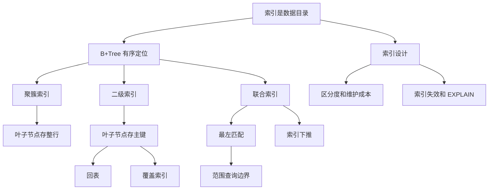

# 索引常见面试题笔记

## 1. Topic Overview

- Topic: MySQL 索引常见面试题。
- Why it matters: 索引题通常从基本定义追问到 B+Tree、回表、覆盖索引、联合索引、索引失效和 EXPLAIN。
- Difficulty level: beginner to intermediate.
- Prerequisites: MySQL 两层架构、InnoDB 页式存储、B+Tree 基本有序查找思想、SQL WHERE/ORDER BY/GROUP BY。

## 2. Core Concepts

### Concept: 索引是数据目录

- Definition: 索引是帮助存储引擎快速获取数据的数据结构。
- Intuition: 像书的目录，先定位页码，再去正文。
- Example: `where id = 5` 可以沿索引结构定位目标记录。
- Common mistakes: 只说“索引能加快查询”，但不能解释它靠什么加快。

### Concept: 索引分类

- Definition: 可以按数据结构、物理存储、字段特性、字段个数分类。
- Intuition: 同一个索引名称可能来自不同分类维度。
- Example: 主键索引既是按字段特性的分类，也通常是 InnoDB 的聚簇索引。
- Common mistakes: 把聚簇索引、唯一索引、联合索引混在同一个维度比较。

### Concept: InnoDB B+Tree 索引

- Definition: InnoDB 常用 B+Tree 组织索引，非叶子节点存 key，叶子节点存数据或主键值。
- Intuition: 多叉树降低树高，叶子链表支持范围扫描。
- Example: 千万级数据通常只需要 3-4 层树高，查询磁盘 I/O 次数较少。
- Common mistakes: 只背 B+Tree，不说磁盘 I/O 和范围查询优势。

### Concept: 聚簇索引、二级索引、回表、覆盖索引

- Definition: 聚簇索引叶子节点存整行数据；二级索引叶子节点存主键值。
- Intuition: 二级索引像“目录里的页码”，拿到主键后可能还要回主键索引取整行。
- Example: `select * where product_no='0002'` 可能回表；`select id where product_no='0002'` 可覆盖。
- Common mistakes: 以为二级索引叶子节点也存完整行。

### Concept: 联合索引与最左匹配

- Definition: 联合索引按第一列排序，第一列相同再按第二列排序，以此类推。
- Intuition: 后面的列不是全局有序，只在前缀列相同的小范围内有序。
- Example: `(a,b,c)` 可支持 `a=1 and b=2`，通常不支持单独 `b=2`。
- Common mistakes: 机械背“最左匹配”，但不能用“有序性”解释为什么。

### Concept: 索引设计与优化

- Definition: 根据查询条件、排序分组、字段区分度、更新频率、覆盖索引需求设计索引。
- Intuition: 索引是空间和写入成本换查询速度。
- Example: `where status=1 order by create_time` 可考虑 `(status, create_time)`。
- Common mistakes: 看到字段就建索引，不考虑维护成本和选择性。

### Concept: 索引失效与 EXPLAIN

- Definition: SQL 写法或优化器判断可能导致索引用不上或效果差。
- Intuition: 是否用索引要看执行计划，不只看表上有没有索引。
- Example: `like '%xx'`、索引列函数计算、违背最左匹配、OR 一边无索引都可能失效。
- Common mistakes: 只背失效场景，不会读 `key`、`key_len`、`type`、`Extra`。

## 3. Deep Understanding

- 索引的本质是把数据按某个 key 组织成便于定位的结构。
- InnoDB 使用 B+Tree，是因为节点扇出大、树高低、叶子有序链表适合范围查询。
- 聚簇索引决定整行数据的物理组织方式，二级索引依赖主键定位整行。
- 联合索引能不能用，取决于查询条件是否还能利用索引 key 的有序性。
- 优化索引不是“多建索引”，而是减少扫描行数、减少回表、减少排序、降低维护成本。

## 4. Minimal Working Example

```sql
CREATE TABLE product (
  id int NOT NULL,
  product_no varchar(20),
  name varchar(255),
  price decimal(10, 2),
  PRIMARY KEY (id),
  KEY idx_product_no (product_no),
  KEY idx_product_no_name (product_no, name)
);

SELECT * FROM product WHERE product_no = '0002';
SELECT id FROM product WHERE product_no = '0002';
```

- 第一条查询通过二级索引找到主键后，若需要整行数据，可能回表。
- 第二条查询只要 `id`，而二级索引叶子节点已经有主键值，所以可形成覆盖索引。

## 5. Knowledge Graph



## 6. Self-Test Questions

Recall:

1. 索引的本质是什么？
2. InnoDB 主键索引和二级索引的叶子节点分别存什么？
3. 覆盖索引为什么可以减少 I/O？

Application:

1. 表上有联合索引 `(a,b,c)`，`where b=2 and c=3` 为什么通常用不好这个索引？
2. `select * from order where status=1 order by create_time` 应该怎样设计索引，为什么？

Explain like I am 5:

1. 用“书的目录”解释为什么索引能加快查询。

## 7. Weak Point Detection

- 容易把不同分类维度混起来，比如把“唯一索引”和“二级索引”当成互斥关系。
- 容易背诵 B+Tree 优点，但不能连接到磁盘 I/O、树高和范围查询。
- 容易把“使用了联合索引”误解成“联合索引所有字段都用于缩小扫描范围”。
- 容易只说索引失效场景，不会结合 EXPLAIN 验证。
