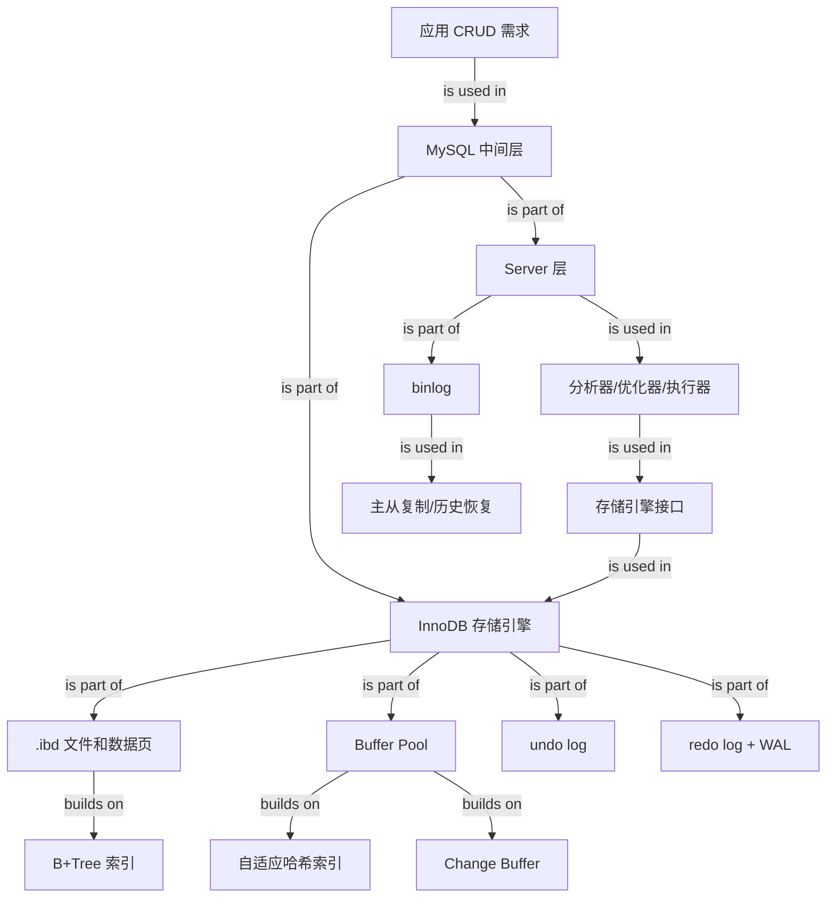

# MySQL 的架构是怎么样的？

Source: 微信文章《面试官：MySQL 的架构是怎么样的？》，小林coding，作者靓仔白，2024-12-16。
URL: https://mp.weixin.qq.com/s/tHyUw0ZDyijEwTYEfhPG6g

### 1. Topic Overview

- What this is about: 这章从“应用为什么不直接读写大文件”出发，解释 MySQL 为什么要作为应用和数据之间的中间层，并把 MySQL 拆成 Server 层、InnoDB 存储引擎层、页/B+Tree、Buffer Pool、日志、binlog 和主从复制。
- Why it matters: 面试题问“MySQL 架构”时，不是让你背一堆组件名，而是要你能说清楚一条 SQL 如何从客户端进入 Server 层，再通过 InnoDB 的接口落到数据页、索引页和日志上。
- Difficulty level: 基础到中级。它把之前学过的页、B+Tree、Buffer Pool、undo/redo/binlog、主从复制放进同一个架构视图里。
- Prerequisites: 文件/表的关系；InnoDB 页是常见 16KB I/O 单位；B+Tree 索引；Buffer Pool；undo log、redo log、binlog 的基本用途。

学习路线：

1. 先把 MySQL 看成应用和数据之间的中间层。
2. 再看 InnoDB 如何用页和 B+Tree 组织磁盘数据。
3. 再看 Buffer Pool、自适应哈希索引、Change Buffer 如何减少 I/O。
4. 再看 undo log、redo log、binlog 分别保护什么。
5. 最后用 Server 层 + 存储引擎层串起一次查询和一次更新。

### 2. Core Concepts

#### 2.1 用“中间层”理解 MySQL

- Definition: MySQL 是位于应用和磁盘数据之间的软件层。它把大量持久化数据组织成表，并向应用提供创建、读取、更新、删除等操作。
- Intuition: 应用直接管理一堆大文件时，查找、更新、一致性和并发都会变得困难；MySQL 把这些麻烦集中到一个专门系统里处理。
- Example: 网站应用需要保存用户数据。直接写文件当然可以，但当数据量很大、还要按条件查询和更新时，应用自己维护文件结构会很痛苦；交给 MySQL 后，应用通过 SQL 操作表。
- Common mistakes:
  - 只说“MySQL 是数据库”，但说不出它在应用和数据之间解决了什么问题。
  - 把 MySQL 当成普通文件读写工具，忽略它还要负责索引、缓存、事务、日志和复制。

#### 2.2 用页和 B+Tree 定位数据

- Definition: InnoDB 表的数据和索引最终落在磁盘文件中，常见表数据文件是 `.ibd`。直接读写大文件太慢，所以 InnoDB 把数据拆成页，常见页大小是 16KB。B+Tree 索引用有序的页结构帮助快速定位目标数据页。
- Intuition: 页是磁盘读写的最小批量单位；B+Tree 像多层目录，先缩小页范围，再到叶子页里找记录。
- Example: 主键索引可以把主键范围和页位置组织成树。查询 `id = 100` 时，不需要从头扫完整个 `.ibd` 文件，而是沿 B+Tree 从根页走到叶子页。
- Common mistakes:
  - 以为查询一行就从磁盘只读一行。实际常见单位是页。
  - 把 B+Tree 理解成抽象内存树，忘了它的节点本质上也是页。

#### 2.3 主键索引和辅助索引

- Definition: 主键索引按主键组织数据；辅助索引可以按其他列组织查找路径，例如按用户名建立索引。
- Intuition: 主键索引回答“按主键怎么找到行”；辅助索引回答“按其他字段怎么先找到候选行或主键”。
- Example: 用户表按 `id` 建主键索引，也可以按 `name` 建辅助索引。查 `name = 'xiaobai'` 时，辅助索引能先定位名字匹配的记录位置，再按需要取完整行。
- Common mistakes:
  - 认为一个表只能有主键索引。
  - 认为辅助索引叶子里一定直接有完整行。InnoDB 二级索引通常存二级索引键和主键值；是否回表取决于查询列是否被覆盖。

#### 2.4 Buffer Pool：InnoDB 自己维护的页缓存

- Definition: Buffer Pool 是 InnoDB 进程内缓存，缓存的是数据页、索引页，也可能包含 undo 页、插入缓存、自适应哈希索引、锁信息等相关结构。
- Intuition: 磁盘慢，内存快。读数据时先找 Buffer Pool；命中就不读盘，未命中才把磁盘页读入缓存。
- Example: 第一次查某个用户可能需要从磁盘读索引页和数据页；第二次查相邻或相同页时，页已经在 Buffer Pool 中，速度会明显更快。
- Common mistakes:
  - 把 Buffer Pool 和 Server 层查询缓存混为一谈。查询缓存缓存 SQL 结果，MySQL 8.0 已移除；Buffer Pool 是 InnoDB 的页缓存。
  - 只说“缓存数据”，漏掉它缓存的是页，不是只缓存单行。

#### 2.5 自适应哈希索引：热点页上的 O(1) 快路径

- Definition: Adaptive Hash Index 是 InnoDB 根据访问模式自动建立的哈希结构，用热点查询值映射到对应页或页内位置，减少反复走 B+Tree 的成本。
- Intuition: B+Tree 是通用路径，适合有序范围；哈希是热点等值查询的快路径。
- Example: 如果 `name = 'xiaobai'` 被频繁查询，InnoDB 可能为这类热点访问建立哈希入口，让后续查询更快到达相关页。
- Common mistakes:
  - 认为自适应哈希索引替代了 B+Tree。它只是热点访问优化，不能替代 B+Tree 的有序范围能力。
  - 认为所有查询都会使用哈希索引。它是自适应生成的，不是每条 SQL 都走。

#### 2.6 Change Buffer：延后合并辅助索引页写入

- Definition: Change Buffer 是 Buffer Pool 的一部分，用来暂存部分辅助索引页的变更，等相关索引页后来被读入 Buffer Pool 时再合并，减少立即读入索引页的随机 I/O。
- Intuition: 写辅助索引时，如果目标索引页不在内存，立刻读盘再改会很贵；先记下“以后要怎么改”，等页自然读进来再合并。
- Example: 更新一行数据后，主键索引页已经被修改，但某个辅助索引页不在 Buffer Pool。InnoDB 可以先把对辅助索引的变更记录到 Change Buffer，之后该辅助索引页被读入时再 merge。
- Common mistakes:
  - 以为 Change Buffer 适用于所有索引页。更精确地说，它主要优化部分二级索引页写入，不是主键聚簇索引页的通用替代写法。
  - 以为 Change Buffer 是磁盘日志。它是页缓存体系中的写优化结构，和 redo log 的 crash-safe 目标不同。

#### 2.7 undo log：回滚和旧版本

- Definition: undo log 记录数据被修改前的信息或反向操作，用来支持事务回滚，也服务 MVCC 版本链。
- Intuition: 要保证“要么都成功，要么都失败”，就必须知道怎么把已经改过的行恢复回去。
- Example: 把 `name` 从 `jay` 改为 `xiaolin` 前，InnoDB 需要保留旧值相关信息。事务失败时，可以根据 undo log 回滚。
- Common mistakes:
  - 只把 undo log 当成“崩溃恢复日志”。它主要解决回滚和 MVCC 旧版本，不是已提交事务脏页丢失时的重做日志。

#### 2.8 redo log + WAL：保护已提交事务的脏页

- Definition: redo log 记录 InnoDB 数据页的物理修改，用来在崩溃后重做已提交但还没刷回数据页的变更。WAL 的核心是先写日志，再延后刷数据页。
- Intuition: 数据页分散在磁盘各处，同步随机写很贵；redo log 顺序写更快。先顺序写日志保护结果，再让脏页慢慢刷盘。
- Example: 一个事务更新了多个页。InnoDB 先修改 Buffer Pool 中的页并写 redo log。事务提交后，即使数据页还没刷盘，只要 redo log 已持久化，崩溃后也能重做。
- Common mistakes:
  - 认为 redo log 保证所有内存变更永不丢。更准确：它保护已经按提交规则完成持久化要求的事务。
  - 认为有 redo log 就不需要 undo log 或 binlog。三者目标不同。

#### 2.9 InnoDB 存储引擎：内存结构 + 磁盘文件 + 接口函数

- Definition: InnoDB 由内存中的 Buffer Pool、自适应哈希索引、redo log buffer 等，以及磁盘上的 `.ibd`、undo log、redo log 等文件共同组成，并向 Server 层提供接口函数，例如插入行、更新行、创建表、删除表等。
- Intuition: InnoDB 是真正管理数据怎么存、怎么找、怎么改、怎么恢复的一层。
- Example: `INSERT` 最终会变成 Server 层调用存储引擎写入行的接口；`UPDATE` 最终会调用更新行的接口。
- Common mistakes:
  - 认为 SQL 语句直接操作磁盘文件。SQL 先由 Server 层处理，之后通过存储引擎接口操作数据。
  - 把 InnoDB 和 MySQL 整体等同。MySQL 还包括 Server 层；InnoDB 是最常用的存储引擎。

#### 2.10 Server 层：SQL 和存储引擎之间的中间层

- Definition: Server 层负责连接管理、SQL 分析、优化、执行协调，并通过存储引擎接口调用 InnoDB。
- Intuition: Server 层不亲自管理页和 B+Tree，它负责理解 SQL、决定怎么执行、调度存储引擎干活。
- Example: 一条 `select * from user where id = 1` 进入 MySQL 后，连接管理模块处理连接；分析器判断 SQL 语法；优化器选择主键索引；执行器按执行计划调用 InnoDB 接口取数据。
- Common mistakes:
  - 把“解析 SQL”和“读取磁盘页”放在同一层。
  - 以为优化器一定选择你建好的索引。优化器按成本选择执行计划。

#### 2.11 binlog：Server 层的变更历史

- Definition: binlog 是 Server 层记录数据库变更操作的日志，可用于数据恢复和主从复制。它和 InnoDB 的 redo log 不在同一层，目标也不同。
- Intuition: redo log 像引擎内部的 crash-safe 账本；binlog 像 Server 层的变更历史档案。
- Example: 误删表后，需要用备份 + binlog 做按时间点恢复；主从复制也依赖主库 binlog 传到从库回放。
- Common mistakes:
  - 认为 redo log 可以替代 binlog 做任意历史恢复。redo log 循环写，不保存完整历史；binlog 追加保存变更历史。
  - 认为 binlog 属于 InnoDB。binlog 位于 Server 层，因此可以服务不同存储引擎。

#### 2.12 查询/更新总流程

- Definition: 查询和更新都先经过 Server 层，再由执行器调用 InnoDB。读路径关注页定位和缓存命中；写路径关注 Buffer Pool 脏页、undo log、redo log、Change Buffer 和 binlog。
- Intuition: 一条 SQL 的执行不是一个组件完成的，而是一条链：连接 -> 分析 -> 优化 -> 执行 -> 引擎接口 -> 页/缓存/日志。
- Example:
  - 读：客户端发 SQL -> Server 层分析/优化 -> 执行器调用 InnoDB -> InnoDB 查 Buffer Pool 和 B+Tree 页 -> 返回记录。
  - 写：客户端发 UPDATE -> Server 层分析/优化 -> InnoDB 修改 Buffer Pool 页 -> 写 undo/redo -> Server 层记录 binlog -> 提交时协调持久化。
- Common mistakes:
  - 只会孤立背组件名，不能按一次 SQL 的时间顺序串起来。
  - 把读路径和写路径混在一起，例如查询也说写 undo/redo，或者更新漏掉 binlog。

### 3. Deep Understanding

这章最重要的不是记住组件清单，而是建立三个架构轴：

1. 定位轴：`.ibd` 大文件 -> 16KB 页 -> B+Tree 索引 -> 主键索引/辅助索引。
2. 性能轴：磁盘慢 -> Buffer Pool 缓存页 -> 自适应哈希索引优化热点读 -> Change Buffer 延后部分辅助索引写。
3. 可靠性/复制轴：事务回滚靠 undo log；已提交脏页崩溃恢复靠 redo log + WAL；历史恢复和主从复制靠 Server 层 binlog。

把这三条轴放到两层架构里：

- Server 层：面向 SQL。负责连接、分析、优化、执行协调、binlog。
- InnoDB 层：面向数据页、索引页、缓存和事务恢复。负责 `.ibd`、B+Tree、Buffer Pool、undo/redo、Change Buffer、Adaptive Hash Index。

关键边界：

- Buffer Pool 不是 Server 查询缓存。
- 自适应哈希索引不是 B+Tree 的替代品。
- Change Buffer 不是 redo log。
- undo log 解决回滚/旧版本，redo log 解决 crash-safe，binlog 解决历史恢复/复制。
- Server 层和存储引擎层通过接口解耦，所以 MySQL 可以支持 InnoDB、MyISAM、Memory 等不同引擎。

### 4. Minimal Working Example

场景：应用执行：

```sql
update user set name = 'xiaolin' where id = 1;
```

Reasoning flow:

1. 客户端先和 MySQL 建立连接，并把 SQL 发给 Server 层。
2. Server 层分析 SQL，确认语法和执行目标，再由优化器选择主键索引路径。
3. 执行器按执行计划调用 InnoDB 的接口，让 InnoDB 找到 `id = 1` 的记录。
4. InnoDB 沿主键 B+Tree 定位目标页；如果页不在 Buffer Pool，就从磁盘读入。
5. 修改前生成 undo log，用于失败回滚或旧版本读取。
6. InnoDB 修改 Buffer Pool 中的数据页，这个页变成脏页。
7. InnoDB 写 redo log，保护已提交事务在数据页未刷盘时也能崩溃恢复。
8. Server 层记录 binlog，用于历史恢复和主从复制。
9. 提交阶段需要保证 redo log 和 binlog 的状态协调一致。

一句话压缩：

> Server 层负责把 SQL 变成执行计划并调用引擎；InnoDB 负责页、索引、缓存和事务日志；binlog 在 Server 层保存变更历史。

### 5. Knowledge Graph



### 6. Self-Test Questions

Recall:

1. MySQL 的两层架构分别是什么？各自主要负责什么？
2. InnoDB 为什么要把 `.ibd` 大文件拆成页？B+Tree 在这里解决什么问题？
3. undo log、redo log、binlog 分别位于什么层，解决什么问题？

Application / transfer:

1. 一个 `select * from user where id = 1` 进入 MySQL 后，Server 层和 InnoDB 层各做哪些事？
2. 一个 `update user set name='x' where id=1` 为什么既要改 Buffer Pool，又要写 undo log、redo log 和 binlog？

Explain-like-I-am-5:

1. 用“前台接单 + 仓库找货 + 账本留痕”的比喻解释 Server 层、InnoDB、redo/binlog 的分工。

### 7. Weak Point Detection

- 失败模式 1：只背组件名，不能按 SQL 执行顺序串起来。
- 失败模式 2：把 Server 层和 InnoDB 层混成一个黑盒。
- 失败模式 3：把 Buffer Pool、查询缓存、自适应哈希索引都说成“缓存”，但分不清缓存对象。
- 失败模式 4：把 undo log、redo log、binlog 都说成“恢复日志”，但说不清回滚、crash-safe、历史恢复/复制的区别。
- 失败模式 5：认为 B+Tree 直接定位“某一行”，漏掉“先定位页，再在页内找记录”的页级视角。
