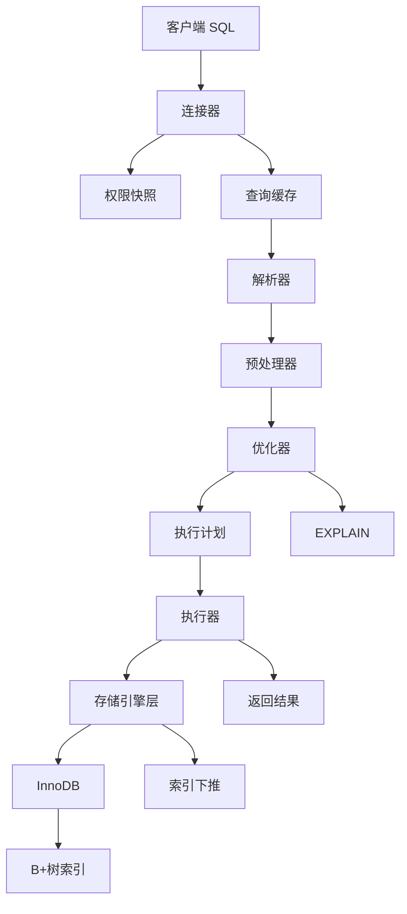

# MySQL Base Notes: SELECT 语句执行流程

## 1. Topic Overview

这份笔记回答一个基础问题：

> 执行一条 `SELECT` 语句时，MySQL 内部发生了什么？

它的重要性在于：很多 MySQL 面试题都不是孤立知识点，而是在考你能不能把 SQL 从客户端到存储引擎的完整路径讲清楚。

- 难度：基础到中级。
- 前置知识：知道 SQL 是查询语句；知道 MySQL 通常使用 InnoDB 存储引擎；知道索引能加速查询。
- 学习目标：形成一个稳定 schema：**Server 层负责处理 SQL 和制定方案，存储引擎层负责真正存取数据。**

学习路线：

1. MySQL 两层架构。
2. `SELECT` 的主流程：连接器、查询缓存、解析器、预处理器、优化器、执行器。
3. 执行器和存储引擎如何交互。
4. 主键查询、全表扫描、索引下推三个例子。

---

## 2. Core Concepts

### 2.1 MySQL 两层架构

#### Definition

MySQL 可以先粗略分成两层：

- **Server 层**：负责连接、权限、SQL 解析、SQL 优化、执行协调。
- **存储引擎层**：负责数据和索引的存储、读取、修改。最常用的是 InnoDB。

#### Intuition

Server 层像“大脑和调度员”，决定这条 SQL 怎么处理。  
存储引擎层像“仓库管理员”，按照 Server 层的要求去找真实数据。

#### Example

```sql
select * from product where id = 1;
```

Server 层判断这是一条查询 `product` 表的 SQL，并决定可以走主键索引。  
InnoDB 存储引擎根据主键索引真正找到 `id = 1` 的那行数据。

#### Common Mistakes

- 错误：认为解析器、优化器会直接读取磁盘数据。
- 正确：解析器和优化器在 Server 层；真正读数据的是存储引擎。

---

### 2.2 连接器

#### Definition

连接器负责客户端进入 MySQL 的第一关：

1. 建立 TCP 连接。
2. 校验用户名和密码。
3. 读取并保存该用户的权限。

#### Intuition

连接器像门卫：先确认你是谁，再决定你进来之后能做什么。

#### Example

```bash
mysql -h 127.0.0.1 -u root -p
```

如果密码错误，连接器拒绝连接。  
如果密码正确，连接器读取 `root` 用户当前权限，并把权限绑定到这个连接上。

#### Common Mistakes

- 错误：管理员修改权限后，旧连接立刻使用新权限。
- 正确：权限通常在连接建立时读取；旧连接继续用旧权限，新连接才读取新权限。

#### Related Parameters

- `wait_timeout`：空闲连接多久后断开，常见默认值是 8 小时。
- `max_connections`：MySQL 允许的最大连接数。

#### Long Connection Issue

长连接可以减少反复建立连接的开销，但可能导致内存长期占用。常见处理方式：

- 定期断开长连接。
- MySQL 5.7+ 客户端可调用 `mysql_reset_connection()` 重置连接状态。

---

### 2.3 查询缓存

#### Definition

查询缓存是 MySQL 8.0 之前 Server 层的一个功能：把完整 SQL 作为 key，把查询结果作为 value。

#### Intuition

如果别人问过一模一样的问题，就直接拿旧答案返回。

#### Example

```sql
select * from product where id = 1;
```

如果查询缓存里刚好有完全相同 SQL 的结果，MySQL 可以直接返回缓存结果。

#### Common Mistakes

- 错误：把查询缓存和 InnoDB Buffer Pool 混为一谈。
- 正确：查询缓存是 Server 层的 SQL 结果缓存；Buffer Pool 是 InnoDB 的数据页缓存。

#### Why Removed

查询缓存很容易失效。只要表发生更新，相关缓存就会被清空。对更新频繁的业务表来说，维护缓存的成本可能高于收益。  
所以 MySQL 8.0 删除了查询缓存。

---

### 2.4 解析器

#### Definition

解析器负责理解 SQL 字符串的语法结构，主要做两件事：

1. 词法分析：识别 `select`、`from`、表名、字段名等 token。
2. 语法分析：判断 SQL 是否符合 MySQL 语法，并构建语法树。

#### Intuition

解析器像语法老师，只检查句子结构对不对。

#### Example

```sql
select * form product;
```

这里 `from` 写成了 `form`，解析器会报语法错误。

#### Common Mistakes

- 错误：认为解析器检查表是否存在。
- 正确：解析器只检查语法；表和字段是否存在主要由后面的预处理阶段检查。

---

### 2.5 预处理器

#### Definition

预处理器负责做语义层面的基础检查和展开：

- 检查表是否存在。
- 检查字段是否存在。
- 把 `select *` 展开成真实列名。

#### Intuition

解析器确认“句子语法正确”，预处理器确认“句子里提到的东西真实存在”。

#### Example

```sql
select * from not_exist_table;
```

这条 SQL 语法没问题，所以解析器能通过。  
但是表不存在，预处理器会报错。

#### Common Mistakes

- 错误：把语法错误和表不存在错误都归给解析器。
- 正确：语法错误归解析器；表和字段存在性检查归预处理阶段。

---

### 2.6 优化器

#### Definition

优化器负责生成执行计划：决定用哪个索引、用不用索引、表连接顺序等。

#### Intuition

优化器像导航软件：同一个目的地可能有多条路，它根据成本选择一条看起来更划算的路。

#### Example

```sql
select * from product where id = 1;
```

如果 `id` 是主键，优化器通常会选择主键索引。

可以用 `EXPLAIN` 查看执行计划：

```sql
explain select * from product where id = 1;
```

重点看：

- `type`：访问类型，例如 `const`、`ALL`。
- `key`：实际使用的索引。
- `Extra`：额外信息，例如 `Using index condition`。

#### Common Mistakes

- 错误：以为有索引就一定会用索引。
- 正确：优化器按成本选择执行计划，有时可能认为全表扫描更划算。

---

### 2.7 执行器

#### Definition

执行器负责按照优化器给出的执行计划真正执行 SQL，并调用存储引擎接口获取记录。

#### Intuition

优化器决定路线，执行器负责按路线走。

#### Example

```sql
select * from product where id = 1;
```

如果执行计划是主键索引查询：

1. 执行器调用存储引擎接口。
2. InnoDB 根据主键 B+ 树定位记录。
3. InnoDB 返回记录给执行器。
4. 执行器判断条件并返回结果给客户端。

#### Common Mistakes

- 错误：执行器自己去磁盘里找数据。
- 正确：执行器通过存储引擎 API 获取数据。

---

### 2.8 三种典型执行方式

#### A. 主键索引查询

```sql
select * from product where id = 1;
```

条件命中唯一主键，优化器可选择 `const` 访问类型。  
存储引擎通过主键 B+ 树快速定位一条记录。

重点：

- 查找目标明确。
- 通常只需要很少的引擎访问。
- 成本低。

#### B. 全表扫描

```sql
select * from product where name = 'iphone';
```

如果 `name` 没有索引，优化器可能选择 `ALL`，即全表扫描。

执行方式：

1. 执行器让存储引擎读第一条记录。
2. Server 层判断 `name = 'iphone'` 是否成立。
3. 再读下一条。
4. 直到所有记录读完。

重点：

- 每条记录都可能被读出来检查。
- 数据量大时成本高。

#### C. 索引下推

索引下推，全称 Index Condition Pushdown，简称 ICP。

例子：

```sql
select * from t_user
where age > 20 and reward = 100000;
```

假设有联合索引：

```sql
(age, reward)
```

由于 `age > 20` 是范围查询，联合索引的后续列 `reward` 不能继续用于精确定位范围。  
但是 `reward` 仍然在二级索引记录里。

没有索引下推时：

1. InnoDB 找到 `age > 20` 的二级索引记录。
2. 立刻回表拿完整行。
3. Server 层再判断 `reward = 100000`。
4. 如果不符合，刚才的回表就浪费了。

有索引下推时：

1. InnoDB 找到 `age > 20` 的二级索引记录。
2. InnoDB 先在索引里判断 `reward = 100000`。
3. 不符合就跳过，不回表。
4. 符合才回表拿完整行。

重点：

- 索引下推把一部分条件判断从 Server 层“下推”到存储引擎层。
- 它主要减少二级索引查询中的回表次数。
- `EXPLAIN` 的 `Extra` 出现 `Using index condition`，说明使用了 ICP。

---

## 3. Deep Understanding

### 3.1 Parser vs Preprocessor

这两个阶段很容易混。

```sql
select * form product;
```

这是语法错误，因为 `from` 写错了。解析器报错。

```sql
select * from not_exist_table;
```

这不是语法错误，句子结构是对的。只是表不存在，所以预处理阶段报错。

压缩 schema：

> 解析器管语法，预处理器管对象是否存在。

---

### 3.2 Optimizer vs Executor

优化器不真正取数据，它只制定计划。  
执行器才按计划调用存储引擎接口。

压缩 schema：

> 优化器选路线，执行器走路线，存储引擎拿数据。

---

### 3.3 Server Layer vs Storage Engine Layer

判断一个问题属于哪一层，可以看它问的是：

- SQL 怎么被理解、检查、优化、调度：Server 层。
- 数据页、索引结构、行记录、磁盘文件：存储引擎层。

例子：

- 查询缓存：Server 层。
- 解析器：Server 层。
- 优化器：Server 层。
- B+ 树索引结构：InnoDB 存储引擎层。
- Buffer Pool：InnoDB 存储引擎层。

---

### 3.4 Query Cache vs Buffer Pool

查询缓存和 Buffer Pool 名字都像“缓存”，但层次不同。

- 查询缓存：缓存 SQL 的查询结果，MySQL 8.0 已删除。
- Buffer Pool：缓存 InnoDB 的数据页和索引页，仍然是 InnoDB 核心机制。

压缩 schema：

> 查询缓存缓存结果；Buffer Pool 缓存页。

---

## 4. Minimal Working Example

以这条 SQL 为例：

```sql
select * from product where id = 1;
```

完整流程：

1. 客户端发送 SQL 给 MySQL。
2. 连接器检查连接、用户名、密码、权限。
3. 查询缓存阶段：MySQL 8.0 已删除；旧版本可能检查缓存。
4. 解析器做词法分析和语法分析。
5. 预处理器检查 `product` 表和字段是否存在，并展开 `*`。
6. 优化器发现 `id = 1` 可以走主键索引，生成执行计划。
7. 执行器按照执行计划调用 InnoDB。
8. InnoDB 通过主键 B+ 树找到记录。
9. 执行器检查记录符合条件，把结果返回客户端。

一句话版本：

> 连接进来，SQL 被解析和优化，执行器调用 InnoDB，InnoDB 找到数据后返回。

---

## 5. Knowledge Graph



---

## 6. Self-Test Questions

### Recall

1. MySQL 的两层架构分别是什么？各自负责什么？
2. 解析器和预处理器的区别是什么？
3. 为什么 MySQL 8.0 删除了查询缓存？

### Application

1. `select * from test;` 中 `test` 表不存在，这个错误更可能发生在哪个阶段？为什么？
2. `EXPLAIN` 结果里 `type = ALL`、`key = NULL` 通常说明什么？

### Explain Like I Am 5

1. 用“前台和仓库”的比喻解释 Server 层和存储引擎层。

---

## 7. Weak Point Detection

学习这块时常见弱点：

- 把 Server 层和存储引擎层混成一个黑盒。
- 分不清解析器和预处理器。
- 以为优化器一定会使用已有索引。
- 不理解执行器是通过存储引擎接口拿数据，而不是自己读磁盘。
- 把查询缓存和 Buffer Pool 混为一谈。
- 只背流程名，不能用一条 SQL 串起来解释。
