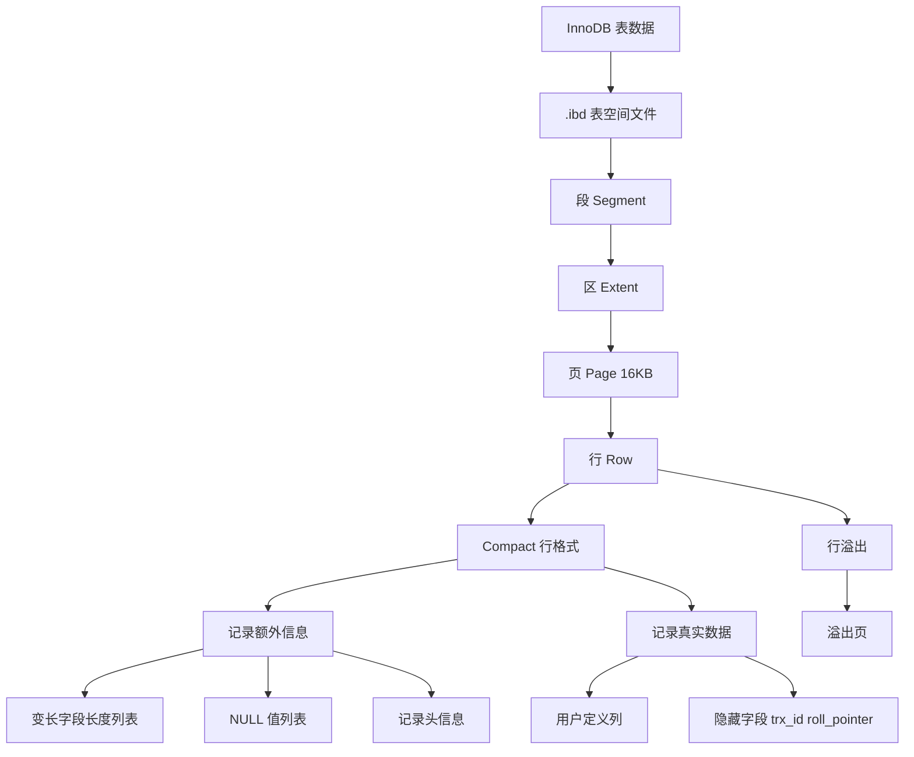

# MySQL Base Notes: InnoDB 一行记录怎么存储

## 1. Topic Overview

这份笔记回答一个基础问题：

> InnoDB 中一行数据到底存在哪里？一行记录内部又长什么样？

它的重要性在于：很多看似分散的问题，其实都依赖同一个 schema：

- `NULL` 值会不会占空间？
- `varchar(n)` 的 `n` 最大是多少？
- 为什么一页是 16KB，但一行可能超过 16KB？
- 行溢出后数据放在哪里？

难度：基础到中级。  
前置知识：知道表由多行记录组成；知道 InnoDB 是 MySQL 常用存储引擎。

学习目标：

> 建立从文件到行的层级 schema：表空间文件 -> 段 -> 区 -> 页 -> 行。

---

## 2. Core Concepts

### 2.1 数据文件存放位置

#### Definition

MySQL 的数据目录可以通过下面命令查看：

```sql
SHOW VARIABLES LIKE 'datadir';
```

每个 database 通常对应数据目录下的一个子目录。  
每张 InnoDB 表的数据和索引通常放在自己的 `.ibd` 文件中。

#### Intuition

数据库不是抽象地“飘在内存里”，最终要落到磁盘文件中。

#### Example

假设数据库名是 `my_test`，表名是 `t_order`，可能看到：

```text
/var/lib/mysql/my_test/t_order.ibd
```

这个 `.ibd` 文件可以理解为这张表的独立表空间文件。

#### Common Mistakes

- 错误：认为表数据只是一堆普通行顺序写在文件里。
- 正确：InnoDB 会按表空间、段、区、页、行等层级组织数据。

---

### 2.2 表空间层级：段、区、页、行

#### Definition

InnoDB 的逻辑存储结构可以压缩为：

```text
表空间 tablespace
  -> 段 segment
    -> 区 extent
      -> 页 page
        -> 行 row
```

#### Intuition

这像一本书：

- 表空间像整本书。
- 段像不同章节。
- 区像一组连续页。
- 页像书页。
- 行像书页里的具体句子。

#### Key Points

- **行 row**：一条表记录。
- **页 page**：InnoDB 读写磁盘的基本单位，默认 16KB。
- **区 extent**：连续的 64 个 16KB 页，大小约 1MB。
- **段 segment**：由多个区组成，例如数据段、索引段、回滚段。

#### Why Page Exists

如果每次只读一行，磁盘 I/O 太碎。  
InnoDB 以页为单位读写，一次至少把一个页读入内存。

#### Common Mistakes

- 错误：认为查询一行时磁盘只读取那一行。
- 正确：InnoDB 通常以页为单位读写，一页默认 16KB。

---

### 2.3 为什么有区 extent

#### Definition

一个区由连续的页组成。默认页大小是 16KB，一个区通常是 64 个页，所以是 1MB。

#### Intuition

B+ 树叶子页之间需要顺序扫描。如果相邻页在磁盘上离得很远，就会产生很多随机 I/O。  
用区分配空间，可以让相邻页更可能物理连续，从而提升范围查询效率。

#### Common Mistakes

- 错误：页之间逻辑相邻就一定物理相邻。
- 正确：逻辑相邻不等于物理相邻；区的设计是为了改善连续性。

---

### 2.4 InnoDB 行格式

#### Definition

行格式就是一条记录内部的存储结构。常见行格式：

- Redundant：很旧，基本不重点使用。
- Compact：紧凑格式，理解它最重要。
- Dynamic：MySQL 5.7 以后常见默认格式。
- Compressed：压缩格式。

#### Intuition

同样是一行逻辑数据，落到磁盘时还需要额外信息帮助 InnoDB 正确读取它。

#### Compact 行格式总结构

```text
记录的额外信息
  -> 变长字段长度列表
  -> NULL 值列表
  -> 记录头信息

记录的真实数据
  -> 用户定义列
  -> 隐藏列
```

#### Common Mistakes

- 错误：认为行记录只存用户定义的字段。
- 正确：行记录还包含变长字段长度、NULL 标记、记录头、隐藏列等额外信息。

---

### 2.5 变长字段长度列表

#### Definition

对于 `VARCHAR`、`TEXT`、`BLOB` 等变长字段，InnoDB 需要额外记录它们实际占用多少字节。  
这些长度信息放在“变长字段长度列表”里。

#### Intuition

如果一个字段长度不固定，读取时必须先知道它有多长，否则不知道该读几个字节。

#### Example

表：

```sql
CREATE TABLE t_user (
  id INT NOT NULL,
  name VARCHAR(20),
  phone VARCHAR(20),
  age INT,
  PRIMARY KEY (id)
) ENGINE = InnoDB DEFAULT CHARSET = ascii ROW_FORMAT = COMPACT;
```

记录：

```text
id = 1, name = 'a', phone = '123', age = 18
```

因为字符集是 ascii，一个字符占 1 字节：

- `name = 'a'` 占 1 字节。
- `phone = '123'` 占 3 字节。

变长字段长度列表按变长列的逆序保存，所以是：

```text
03 01
```

#### Common Mistakes

- 错误：认为 `varchar(20)` 每次都占 20 个字符的空间。
- 正确：`varchar` 是变长字段，真实数据占多少字节，需要额外记录。

---

### 2.6 NULL 值列表

#### Definition

如果表中存在允许为 `NULL` 的列，Compact 行格式会用 NULL 值列表记录哪些列是 `NULL`。  
真实数据部分不会存放这些 `NULL` 值本身。

#### Intuition

`NULL` 表示“没有值”。与其在真实数据区放一个空值，不如用 bit 标记哪一列为空。

#### Example

同样的表：

```text
id INT NOT NULL
name VARCHAR(20) NULL
phone VARCHAR(20) NULL
age INT NULL
```

记录：

```text
id = 2, name = 'bb', phone = '1234', age = NULL
```

`age` 是 NULL，所以 NULL 值列表里对应 `age` 的 bit 为 1。  
在材料例子中，`age` 为 NULL 时 NULL 值列表可表示为：

```text
0x04
```

如果所有可空列都不为 NULL，则是：

```text
0x00
```

#### Key Points

- NULL 值列表至少按整字节存储，不足 8 bit 高位补 0。
- 如果表里所有字段都是 `NOT NULL`，则不需要 NULL 值列表。
- 这也是设计表时常建议字段尽量 `NOT NULL` 的原因之一。

#### Common Mistakes

- 错误：认为 NULL 一定在真实数据区占一个固定值。
- 正确：Compact 行格式用 NULL 值列表标记 NULL，真实数据区不存 NULL 本身。

---

### 2.7 记录头信息

#### Definition

记录头信息保存 InnoDB 管理这条记录所需的元信息。

重点字段：

- `delete_mask`：记录是否被删除。
- `next_record`：下一条记录的位置。
- `record_type`：记录类型，例如普通记录、B+ 树非叶子节点记录、最小记录、最大记录。

#### Intuition

记录头像每条记录的“管理标签”，告诉 InnoDB 这条记录是否删除、下一条在哪里、属于什么类型。

#### Common Mistakes

- 错误：执行 `DELETE` 后记录立刻物理消失。
- 正确：InnoDB 可能先用 `delete_mask` 标记删除，之后再由后台或整理过程真正清理。

---

### 2.8 记录真实数据和隐藏字段

#### Definition

真实数据部分除了用户定义的列，还可能包含 InnoDB 隐藏字段：

- `row_id`：没有主键也没有唯一非空索引时，InnoDB 自动生成的行 ID，6 字节。
- `trx_id`：事务 ID，记录这行由哪个事务生成，6 字节。
- `roll_pointer`：回滚指针，指向旧版本记录，7 字节。

#### Intuition

用户看到的是业务字段，InnoDB 还需要额外字段支持事务、MVCC、版本回滚。

#### Common Mistakes

- 错误：认为没有主键时 InnoDB 就没办法组织行。
- 正确：如果没有合适主键，InnoDB 会生成隐藏 `row_id`。

---

### 2.9 `varchar(n)` 的最大值

#### Definition

`varchar(n)` 的 `n` 表示最多存储多少个字符，不是字节数。  
但 InnoDB 行大小限制按字节计算。

核心限制：

```text
除 TEXT、BLOB 等大对象外，一行中所有列的总字节数不能超过 65535 字节。
```

注意：这个 65535 包含变长字段长度列表和 NULL 值列表等 storage overhead。

#### Example: 单个 varchar 字段

假设：

- 只有一个字段 `name VARCHAR(n)`。
- 字符集是 ascii，一个字符 1 字节。
- 字段允许 NULL。

开销：

- 变长字段长度列表：因为最大长度超过 255，需要 2 字节。
- NULL 值列表：1 字节。

所以最大真实数据长度：

```text
65535 - 2 - 1 = 65532
```

因此在这个特定条件下：

```sql
VARCHAR(65532)
```

可以成立。

如果是 UTF-8，1 个字符最多可能占 3 字节，则最大字符数大约是：

```text
65532 / 3 = 21844
```

#### Common Mistakes

- 错误：`varchar(n)` 的 `n` 是字节数。
- 正确：`n` 是字符数；真正占用多少字节取决于字符集。

---

### 2.10 行溢出

#### Definition

InnoDB 页默认 16KB，但某些字段可能很大。一条记录如果不能完整放进一个数据页，就会发生行溢出，部分数据放到溢出页。

#### Intuition

数据页像一个固定大小的盒子。太大的字段放不下，就把大部分内容放到另一个盒子里，当前记录只留一个地址。

#### Compact 行格式

发生行溢出时：

- 真实数据处保存该列的一部分数据。
- 剩余数据放到溢出页。
- 真实数据处用 20 字节保存指向溢出页的地址。

#### Dynamic / Compressed 行格式

更彻底：

- 真实数据处只保存 20 字节指针。
- 实际数据全部放到溢出页。

#### Common Mistakes

- 错误：一页 16KB，所以一行最大也只能 16KB。
- 正确：一行逻辑上可以更大，超出部分可放到溢出页。

---

## 3. Deep Understanding

### 3.1 为什么先学页，再学行格式

行不是孤立存在的。InnoDB 管理磁盘的基本单位是页。  
理解“页默认 16KB”后，才能理解：

- 为什么读取一行可能读入整页。
- 为什么行太大会溢出到溢出页。
- 为什么 B+ 树索引节点本质上也是页。

压缩 schema：

> 行在页里，页是 InnoDB I/O 的基本单位。

---

### 3.2 为什么 `VARCHAR` 需要长度列表

定长字段可以按固定偏移读取。  
变长字段不能，因为每条记录里同一个字段的实际长度可能不同。

所以 InnoDB 需要保存：

- 字段真实数据。
- 字段真实数据占了多少字节。

压缩 schema：

> 变长字段 = 数据本身 + 长度信息。

---

### 3.3 为什么 NULL 可以节省真实数据空间

如果一个字段是 `NULL`，它没有真实值。Compact 行格式用 bit 标记它为空，而不是在真实数据区写一个值。  
但是 NULL 值列表本身也有开销，所以如果所有列都 `NOT NULL`，可以省掉 NULL 值列表。

压缩 schema：

> NULL 不进真实数据区，但需要 NULL 位图记录。

---

### 3.4 `65535` 不是单个字段的无脑上限

`65535` 是一行的总限制，而且包含额外开销。  
算 `varchar(n)` 最大值时必须考虑：

1. 字符集：一个字符最多几个字节。
2. 是否允许 NULL：是否需要 NULL 值列表。
3. 变长字段长度列表：长度用 1 字节还是 2 字节。
4. 是否还有其他列。

压缩 schema：

> varchar 最大值 = 行总字节限制 - 行格式额外开销 - 其他字段字节。

---

## 4. Minimal Working Example

表：

```sql
CREATE TABLE t_user (
  id INT NOT NULL,
  name VARCHAR(20),
  phone VARCHAR(20),
  age INT,
  PRIMARY KEY (id)
) ENGINE = InnoDB DEFAULT CHARSET = ascii ROW_FORMAT = COMPACT;
```

记录：

```text
id = 1
name = 'a'
phone = '123'
age = 18
```

这行记录大致包含：

1. 变长字段长度列表：

```text
phone 长度 = 3
name 长度 = 1
逆序保存 -> 03 01
```

2. NULL 值列表：

```text
name、phone、age 都不为 NULL -> 0x00
```

3. 记录头信息：

```text
delete_mask、next_record、record_type 等
```

4. 真实数据：

```text
id, name, phone, age
trx_id
roll_pointer
```

如果没有显式主键或合适唯一索引，还会有隐藏的 `row_id`。

---

## 5. Knowledge Graph



---

## 6. Self-Test Questions

### Recall

1. InnoDB 的表空间层级从大到小是什么？
2. Compact 行格式中“记录的额外信息”包含哪三部分？
3. `trx_id` 和 `roll_pointer` 分别大致用于什么？

### Application

1. 如果一张表所有列都是 `NOT NULL`，Compact 行格式还需要 NULL 值列表吗？为什么？
2. `VARCHAR(100)` 在 ascii 和 UTF-8 字符集下，最大字节数一样吗？为什么？

### Explain Like I Am 5

1. 用“盒子放不下就留下地址”的比喻解释行溢出。

---

## 7. Weak Point Detection

学习这块时常见弱点：

- 分不清表空间、段、区、页、行的层级。
- 认为 MySQL 读取一行时只读那一行，而忽略页是 I/O 基本单位。
- 把 `varchar(n)` 的 `n` 当成字节数。
- 忘记 65535 是一行总字节限制，不是单列无脑上限。
- 不知道 NULL 值列表本身也有空间开销。
- 不理解行溢出时真实数据区保存的是数据片段或 20 字节指针。
