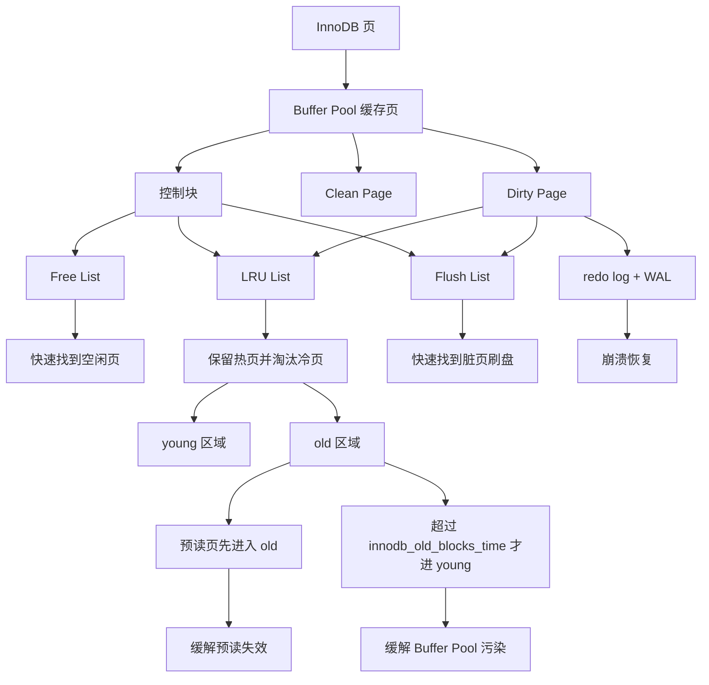

# 揭开 Buffer Pool 的面纱

### 1. Topic Overview

- What this is about: 本章解释 InnoDB 为什么需要 Buffer Pool、Buffer Pool 以什么单位缓存数据、如何用链表管理缓存页、为什么简单 LRU 不够，以及脏页什么时候刷回磁盘。
- Why it matters: 面试里问 Buffer Pool，重点不是背“缓存提高性能”，而是能把读页、改页、脏页、LRU 淘汰、预读失效、Buffer Pool 污染和 WAL 串起来。
- Difficulty level: 中等。难点在于区分“页状态”和“链表角色”，以及区分“预读失效”和“Buffer Pool 污染”这两个相近但不同的问题。
- Prerequisites: InnoDB 页是磁盘和内存交互的基本单位，默认 16KB；B+Tree 只能先定位到页，再在页内定位记录；redo log + WAL 保护脏页延迟落盘。

### 2. Core Concepts

#### Schema 1: 用“页”而不是“行”理解 Buffer Pool

- Definition: Buffer Pool 是 InnoDB 启动时向操作系统申请的一片连续内存，默认大小为 `128MB`，可通过 `innodb_buffer_pool_size` 调整。它按页划分缓存空间，默认每页 16KB，Buffer Pool 中的页叫缓存页。
- Intuition: InnoDB 不是“查一行就只读一行”。索引先帮你定位到磁盘页，页加载到 Buffer Pool 后，再通过页内结构找到具体记录。
- Example: 查询 `id = 10`，如果这条记录所在的数据页已经在 Buffer Pool，直接从内存读；如果不在，就从磁盘把整个页读入 Buffer Pool，再在页内找 `id = 10`。
- Common mistakes:
  - 以为 Buffer Pool 只缓存数据行。
  - 以为索引可以直接定位到磁盘上的某一条记录。
  - 只说 Buffer Pool 缓存数据页，漏掉索引页、undo 页、插入缓存、自适应哈希索引、锁信息等也可能在其中。

#### Schema 2: 用控制块和链表管理缓存页状态

- Definition: InnoDB 为每个缓存页创建控制块，记录表空间、页号、缓存页地址、链表节点等信息。控制块在 Buffer Pool 前部，后面才是缓存页，中间可能有碎片空间。
- Intuition: Buffer Pool 是一大块连续内存，但管理时不能每次都线性扫描。控制块像每个缓存页的管理卡片，链表通过这些卡片快速找到空闲页、脏页和可淘汰页。
- Example:
  - Free List 管理空闲页。要从磁盘加载新页时，从 Free 链表拿一个空闲缓存页。
  - Flush List 管理脏页。后台线程遍历 Flush 链表，把脏页刷回磁盘。
  - LRU List 管理已经使用的干净页和脏页，用于保留热数据、淘汰冷数据。
- Common mistakes:
  - 把 Free、Flush、LRU 三条链表当成互斥分类。脏页既在 LRU 链表中，也在 Flush 链表中。
  - 只记链表名字，不知道它们分别解决“找空页”“找脏页”“找淘汰页”三个问题。

#### Schema 3: 用改良 LRU 区分预读失效和 Buffer Pool 污染

- Definition: 简单 LRU 会把最近访问的页移动到链表头部，空间不够时淘汰尾部页。InnoDB 没有直接使用简单 LRU，而是把 LRU 分成 young 区域和 old 区域，并加入 old 区域停留时间判断。
- Intuition: 热数据不是“刚进来”就算热，而是“真的被访问并且不是短时间批量扫过一次”才算热。
- Example:
  - 预读失效: MySQL 提前把相邻页读进来，但这些页之后没被访问。如果简单 LRU 把它们放到头部，就会挤掉真正热的页。
  - 解决方式: 预读页先放 old 区域头部，真正被访问后才进入 young 区域。
  - Buffer Pool 污染: `select * from t_user where name like "%xiaolin%"` 可能结果很少，但因为索引失效而全表扫描，扫描页被逐一访问，如果都进入 young 区域，就会替换热点页。
  - 解决方式: 只有“被访问”且“在 old 区域停留超过 `innodb_old_blocks_time`，默认 1000ms”才进入 young 区域。
- Common mistakes:
  - 把预读失效和 Buffer Pool 污染说成同一个问题。
  - 以为只要访问一次就应该进入 young 区域。
  - 以为结果集小就不会污染 Buffer Pool；真正关键是扫描了多少页。

#### Schema 4: 用脏页刷盘触发点解释偶发慢 SQL

- Definition: 更新数据时，InnoDB 先修改 Buffer Pool 中的数据页并标记为脏页，不会每次都立刻写回磁盘。之后由后台线程或特定压力条件批量刷盘。
- Intuition: Buffer Pool 把随机写数据页推迟了，redo log 用 WAL 保证即使脏页还没落盘，崩溃后也能恢复已提交修改。
- Example: 一个 update 改了内存页，磁盘页还是旧值；只要 redo log 已安全记录，MySQL 崩溃后能重放修改。脏页通常在 redo log 快满、Buffer Pool 空间不足且要淘汰脏页、MySQL 空闲、正常关闭前等时机刷盘。
- Common mistakes:
  - 认为事务提交时数据页一定已经落盘。
  - 认为有 redo log 就不需要刷脏页。
  - 看到偶发慢 SQL 只查 SQL 本身，漏掉脏页刷新造成的抖动。

### 3. Deep Understanding

Buffer Pool 的核心链路是：

```text
磁盘页
-> 加载到 Buffer Pool 缓存页
-> 控制块记录页身份和链表位置
-> 读命中直接读内存，读未命中先读磁盘页
-> 更新先改缓存页并标脏
-> redo log 保护脏页延迟落盘
-> Free / Flush / LRU 链表分别解决空闲页、脏页、淘汰页管理
```

两个容易混淆的 LRU 问题要分开：

- 预读失效: 页被提前读入，但后来没有真正被访问。解决重点是让预读页先待在 old 区域，不要抢 young 区域的热数据位置。
- Buffer Pool 污染: 大量页被扫描并访问一次。解决重点是提高进入 young 区域的门槛，要求在 old 区域停留超过 `innodb_old_blocks_time`。

三个状态也要分清：

- Free Page: 未使用，位于 Free 链表。
- Clean Page: 已使用但未修改，位于 LRU 链表。
- Dirty Page: 已使用且已修改，磁盘版本和内存版本不一致；同时位于 LRU 链表和 Flush 链表。

### 4. Minimal Working Example

场景：执行

```sql
select * from t_user where name like "%xiaolin%";
```

推理流：

1. `like "%xiaolin%"` 没有固定左前缀，通常无法用 B+Tree 快速定位起点。
2. InnoDB 可能进行全表扫描，扫描大量数据页。
3. 每个被读到的磁盘页都以页为单位进入 Buffer Pool，不是只把匹配的几行放进来。
4. 即使最终结果集只有几行，扫描过程也可能访问大量页。
5. 如果简单 LRU 把这些只访问一次的页都放到链表头部，原来的热点页会被挤走。
6. InnoDB 用 old/young 区域和 `innodb_old_blocks_time` 限制这些短时间扫描页进入 young 区域，从而降低 Buffer Pool 污染。

### 5. Knowledge Graph



### 6. Self-Test Questions

Recall:

1. 为什么查询一条记录时，InnoDB 可能要把整个页加载到 Buffer Pool？
2. Free List、Flush List、LRU List 分别管理什么？
3. 脏页为什么同时在 LRU 链表和 Flush 链表中？

Application or transfer:

1. 一个查询结果集只有 3 行，但它做了全表扫描，为什么仍可能污染 Buffer Pool？
2. 为什么预读页先进入 old 区域，而不是直接进入 young 区域？

Explain-like-I-am-5:

1. 用“书架、书页、便签卡片”的比喻解释 Buffer Pool、缓存页和控制块。

### 7. Weak Point Detection

- 如果你说“查一行就缓存一行”，说明页级 I/O 单位没有稳定。
- 如果你说“脏页只在 Flush 链表”，说明页状态和管理链表的关系没有稳定。
- 如果你把预读失效和 Buffer Pool 污染都说成“大量无用页进缓存”，说明触发原因和解决门槛还没分开。
- 如果你说“事务提交等于数据页落盘”，说明 Buffer Pool、redo log、WAL 和刷脏页边界需要复习。
