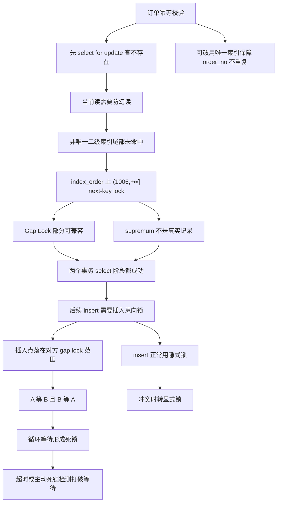

# MySQL 死锁了，怎么办？

### 1. Topic Overview

- What this is about: 本章用订单幂等校验案例解释 MySQL/InnoDB 死锁如何发生，尤其是 `select ... for update` 查不存在记录、非唯一二级索引尾部 next-key lock、插入意向锁等待之间如何形成循环等待。
- Why it matters: 线上死锁不是只靠背“互斥、占有且等待、不可抢占、循环等待”。面试或排障时要能画出等待图：谁持有什么锁，谁在等什么锁，为什么这些锁兼容或冲突。
- Difficulty level: 偏难。难点在于：两个事务的 `select ... for update` 可以同时成功，但后续 `insert` 反而互相等待；以及普通 insert、唯一键冲突、隐式锁、显式锁的边界不同。
- Prerequisites: 可重复读、当前读、Record Lock、Gap Lock、Next-Key Lock、插入意向锁、二级索引排序、`performance_schema.data_locks` 的 `LOCK_MODE`。
- Source: `materials/mysql/lock/deadlock.md`.

Source order roadmap:

1. 订单幂等校验案例：先 `select ... for update` 查订单是否存在，不存在再插入。
2. 可重复读下为什么需要 next-key lock 防幻读。
3. 案例中的 `order_no` 是非唯一二级索引，`order_no = 1007/1008` 都不存在，且位于当前最大值 `1006` 之后。
4. `select ... for update` 在 `index_order` 上加 `(1006,+∞]` 的 X 型 next-key lock。
5. 两个事务的 gap 部分可兼容；因为右端是 supremum pseudo-record，不是真实记录，所以这两个尾部 next-key lock 可以共存。
6. 后续 `insert` 需要插入意向锁；插入点落在对方持有的 gap 范围里，插入意向锁与 gap lock 冲突，于是互相等待，形成死锁。
7. 文章补充 insert 的隐式锁机制，以及遇到 gap lock 或唯一键冲突时如何转成显式锁。
8. 处理和预防：锁等待超时、主动死锁检测，以及用唯一索引保障订单号不重复。

### 2. Core Concepts

#### Schema 1: 用等待图解释幂等校验死锁

- Definition: 死锁不是“有锁就死”，而是两个或多个事务形成循环等待。本章案例里，事务 A 和事务 B 都先持有同一尾部范围 `(1006,+∞]` 的 next-key lock，随后各自插入时都等待对方释放该范围的 gap 部分。
- Intuition: 两个人都站在同一段空地边上，说“这段空地先别插人”。这两个禁止插入的标识可以共存；但当两个人又都想真正往空地里插一个点时，就都要等对方先撤掉禁止插入标识。
- Example: A 查 `order_no=1007 for update`，B 查 `order_no=1008 for update`。两条记录都不存在，且都在最大 `1006` 之后，于是 A、B 都能持有 `index_order` 上 `(1006,+∞]` 的 next-key lock。A 插入 1007 时等待 B 的 gap lock；B 插入 1008 时等待 A 的 gap lock，形成循环等待。
- Common mistakes:
  - 以为两个事务在 `select ... for update` 阶段就一定互相阻塞。
  - 只说“next-key lock 冲突”，漏掉本例中尾部 supremum 不是实际记录，所以两个尾部 next-key lock 可以共存。
  - 只看到 insert 被阻塞，没画出 A 等 B、B 等 A 的循环等待。

#### Schema 2: 区分 Gap Lock 兼容和插入意向锁冲突

- Definition: Gap Lock 的作用是阻止区间插入，所以 gap lock 之间可以兼容；insert 在插入前会尝试获取插入意向锁，如果插入点落在别人持有的 gap lock 范围内，就会等待。
- Intuition: 多个事务可以同时声明“这个区间不能插入”，因为声明目标一致；但真正想把一条记录插进这个区间时，就和这些声明冲突。
- Example: A 和 B 都持有 `(1006,+∞]` 的 gap 部分，因此两个 `select ... for update` 不互相挡。A 插入 1007、B 插入 1008 时，都要在同一尾部间隙里拿插入意向锁，于是都被对方的 gap lock 挡住。
- Common mistakes:
  - 认为 X 型 Gap Lock 之间一定互斥。
  - 把插入意向锁当成表级意向锁。文章强调插入意向锁是一种特殊的间隙锁，主要用于并发插入前表示插入点。
  - 认为 `LOCK_STATUS=WAITING` 表示锁已经拿到了。等待状态只是锁结构生成了，还没有成功获取。

#### Schema 3: 用 `data_locks` 读出锁种和锁范围

- Definition: `LOCK_TYPE=RECORD` 表示行级锁，不等于 Record Lock；要看 `LOCK_MODE` 区分具体类型。`X` 表示 X 型 next-key lock，`X, REC_NOT_GAP` 表示 X 型记录锁，`X, GAP` 表示 X 型间隙锁。
- Intuition: `LOCK_TYPE` 先告诉你锁层级，`LOCK_MODE` 才告诉你具体行锁种类。对于 next-key lock 或 gap lock，`LOCK_DATA` 常可看作右边界；`supremum pseudo-record` 表示 `+∞`。
- Example: A 执行 `select id from t_order where order_no = 1007 for update` 后，在 `INDEX_NAME=index_order` 上看到 `LOCK_MODE=X` 且 `LOCK_DATA=supremum pseudo-record`，结合表中最大 `order_no=1006`，可推导范围为 `(1006,+∞]`。
- Common mistakes:
  - 把 `LOCK_TYPE=RECORD` 直接翻译成“记录锁”。
  - 只看 `LOCK_DATA=supremum`，不知道左边界要结合当前索引里最后一个值。
  - 忽略锁是在二级索引 `index_order` 上，而不是只在主键索引上。

#### Schema 4: 用隐式锁解释 insert 正常情况和冲突情况

- Definition: 普通 insert 正常执行时通常不生成显式锁结构，而是用插入记录上的 `trx_id` 隐藏列形成隐式锁。只有遇到可能冲突时，隐式锁才会转成显式锁。
- Intuition: 没人争抢时，不必把所有锁都登记出来；一旦别人要插入同一唯一值，或插入点被 gap lock 保护，InnoDB 才把冲突关系显式化。
- Example: 事务 A 插入唯一二级索引 `order_no=1006` 成功且未提交，此时先由隐式锁保护。事务 B 也插入 `order_no=1006`，发现唯一二级索引冲突，B 想加 S 型 next-key lock；A 的隐式锁转成 X 型记录锁，X 和 S 冲突，B 阻塞。
- Common mistakes:
  - 认为 insert 一执行就一定能在 `data_locks` 里看到显式锁。
  - 忽略隐式锁可以在冲突时转为显式 X 记录锁。
  - 把普通非唯一二级索引相同值插入和唯一二级索引冲突混成一类。

#### Schema 5: 区分主键冲突和唯一二级索引冲突

- Definition: 插入重复主键失败后，会在已存在的聚簇索引记录上加 S 型记录锁；插入重复唯一二级索引值失败后，会在已存在的二级索引记录上加 S 型 next-key lock。
- Intuition: 主键冲突定位到聚簇索引的一条记录；唯一二级索引冲突发生在二级索引上，文章强调它会加 S 型 next-key lock，甚至读已提交下也是少数会加 gap 的场景。
- Example: 插入已有 `id=5`，在主键记录 `id=5` 上加 `S, REC_NOT_GAP`。插入已有唯一 `order_no=1001`，在 `index_order` 上加 S 型 next-key lock，范围可表现为 `(-∞,1001]`。
- Common mistakes:
  - 认为所有唯一冲突都只加记录锁。
  - 忽略唯一二级索引冲突是在二级索引记录上加锁。
  - 看到插入失败就以为事务不会再持有任何锁。

#### Schema 6: 把“解决死锁”和“预防死锁”分开

- Definition: 锁等待超时和主动死锁检测是在死锁发生后打破循环等待；业务上用唯一索引保证订单号不重复，是从设计上减少这种 `select ... for update` 再 insert 的死锁风险。
- Intuition: 数据库可以帮你发现并回滚一个事务，但更好的业务设计是减少需要互相等待的流程。
- Example: `innodb_lock_wait_timeout` 默认 50 秒，超时后回滚等待事务；`innodb_deadlock_detect=on` 默认开启，检测到死锁后主动回滚死锁链中的一个事务。订单幂等可以把 `order_no` 设成唯一索引，用唯一性保证不重复，并处理重复插入异常。
- Common mistakes:
  - 把死锁检测当成业务层面的彻底预防。
  - 只靠 `select ... for update` 防重复订单，不给真正的业务唯一键建唯一约束。
  - 忽略发生死锁后应用要能重试或处理回滚。

### 3. Deep Understanding

本章最重要的机制链：

```text
订单幂等校验
-> 先查不存在的 order_no for update
-> 可重复读当前读需要防幻读
-> 非唯一二级索引尾部未命中
-> 在 index_order 上加 (1006,+∞] next-key lock
-> 两个事务的尾部 gap 锁可以共存
-> 后续 insert 需要插入意向锁
-> 插入意向锁与对方 gap lock 冲突
-> A 等 B，B 等 A
-> 循环等待，形成死锁
```

为什么两个 `select ... for update` 没互相挡住？

- Gap Lock 的目的只是禁止插入，gap lock 之间兼容。
- 本例的 next-key lock 右端是 `supremum pseudo-record`，不是真实记录，所以没有真实记录上的 X/X 冲突。
- 如果 next-key lock 的右端是真实记录，相同范围的 X 型 next-key lock 可能因为记录锁部分冲突而阻塞。

为什么 insert 阶段会挡住？

- insert 要在目标插入点申请插入意向锁。
- 插入点 `1007` 和 `1008` 都落在 `(1006,+∞)` 里。
- 插入意向锁与已有 gap lock 冲突，所以 A 插入时要等 B 的 gap lock，B 插入时要等 A 的 gap lock。

为什么用唯一索引能改善业务设计？

- 订单号不重复是业务不变量，应该落到数据库唯一约束上。
- 先查再插的流程需要用锁保护“目前不存在”，很容易扩大成范围锁。
- 唯一索引把“不重复”交给数据库约束；重复插入时处理异常即可。不过唯一索引冲突本身也有锁等待和异常语义，需要应用层正确处理。

### 4. Minimal Working Example

表结构：

```sql
CREATE TABLE `t_order` (
  `id` int NOT NULL AUTO_INCREMENT,
  `order_no` int DEFAULT NULL,
  `create_date` datetime DEFAULT NULL,
  PRIMARY KEY (`id`),
  KEY `index_order` (`order_no`) USING BTREE
) ENGINE=InnoDB;
```

已有最大 `order_no = 1006`，`order_no` 是非唯一二级索引。

事务 A：

```sql
begin;
select id from t_order where order_no = 1007 for update;
insert into t_order(order_no, create_date) values(1007, now());
```

事务 B：

```sql
begin;
select id from t_order where order_no = 1008 for update;
insert into t_order(order_no, create_date) values(1008, now());
```

执行流：

1. A 查询 `1007` 不存在，走 `index_order`，在尾部加 `(1006,+∞]` 的 X 型 next-key lock。
2. B 查询 `1008` 不存在，也在尾部加 `(1006,+∞]` 的 X 型 next-key lock。
3. 两个查询都能成功，因为 gap lock 之间兼容，且 `+∞` 是伪记录。
4. A 插入 `1007`，需要插入意向锁；插入点在 B 的 gap lock 范围里，A 等 B。
5. B 插入 `1008`，需要插入意向锁；插入点在 A 的 gap lock 范围里，B 等 A。
6. A 等 B，B 等 A，循环等待成立，发生死锁。

### 5. Knowledge Graph



### 6. Self-Test Questions

Recall:

1. 本章案例里，`order_no=1007 for update` 为什么锁的是 `index_order` 上的 `(1006,+∞]`？
2. 为什么 Gap Lock 之间可以兼容，但插入意向锁会被 Gap Lock 阻塞？
3. `LOCK_TYPE=RECORD` 和 `LOCK_MODE=X` 分别告诉你什么？

Application or transfer:

1. 如果两个事务都先查询不存在的尾部订单号并持有 `(1006,+∞]`，为什么它们查询时不阻塞，插入时却死锁？
2. 如果把 `order_no` 改成唯一索引，两个事务插入相同 `order_no` 时，为什么第二个事务可能等待第一个事务提交？

Explain like I am 5:

1. 用“大家都贴了禁止插入牌子，但又都想往里面放东西”的比喻解释本章死锁。

### 7. Weak Point Detection

- 如果说“`select ... for update` 一定互相阻塞”，说明没有理解 gap lock 兼容和 supremum 伪记录边界。
- 如果说“Gap Lock 之间互斥”，说明还没理解 Gap Lock 只是 purely inhibitive。
- 如果不能画出 A 等 B、B 等 A，说明只看到阻塞，没有形成死锁等待图。
- 如果把插入意向锁当成表级意向锁，说明需要回到插入意向锁的定义。
- 如果说 insert 一定有显式锁结构，说明没有理解隐式锁和冲突时显式化。
- 如果只靠死锁检测回答“如何避免”，说明没有区分事后打破等待和业务设计预防。
