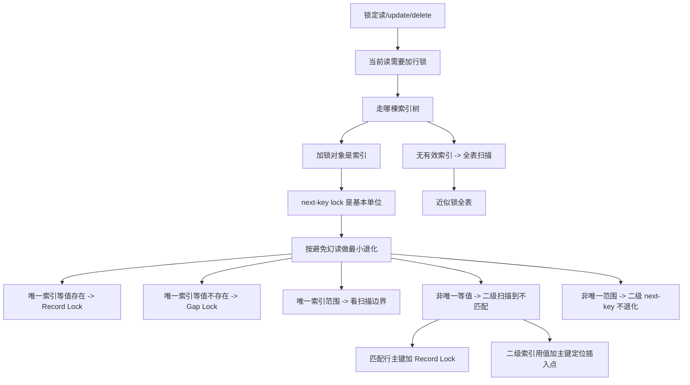

# MySQL 是怎么加行级锁的

### 1. Topic Overview

- What this is about: 本章解释 InnoDB 在可重复读隔离级别下，锁定读、`update`、`delete` 到底会在索引上加什么行级锁，以及 next-key lock 什么时候退化成 Record Lock 或 Gap Lock。
- Why it matters: 面试里问“这条 SQL 会锁哪些范围”时，不能只背 Record/GAP/Next-Key 名字，而要能从 SQL 条件、索引类型、扫描路径和幻读防护目标推导锁范围。
- Difficulty level: 偏难。难点不是锁名，而是“唯一索引/非唯一索引、等值/范围、记录存在/不存在、是否走索引”组合后，锁范围会变化。
- Prerequisites: InnoDB 行锁、事务提交释放锁、快照读和当前读、B+Tree 有序索引、主键索引和二级索引、Record Lock / Gap Lock / Next-Key Lock。
- Source: `materials/mysql/lock/how_to_lock.md`.

Source order roadmap:

1. 哪些 SQL 会加行级锁：锁定读、`update`、`delete`。
2. 行级锁种类：Record Lock、Gap Lock、Next-Key Lock。
3. 总规则：加锁对象是索引，基本单位是 next-key lock，能用更小锁避免幻读时会退化。
4. 唯一索引等值查询：记录存在退化成记录锁；记录不存在退化成间隙锁。
5. 唯一索引范围查询：扫描到的索引项加锁，边界处按 `>`、`>=`、`<`、`<=` 和记录是否存在决定是否退化。
6. 非唯一索引等值查询：二级索引要扫描到第一个不匹配项；匹配行还要在主键索引上加记录锁。
7. 非唯一索引范围查询：二级索引 next-key lock 不退化；匹配行主键索引加记录锁。
8. 没有有效索引的锁定语句：全表扫描会让每条索引记录都加 next-key lock，效果接近锁全表。

### 2. Core Concepts

#### Schema 1: 用索引扫描路径推导 InnoDB 行锁范围

- Definition: InnoDB 行锁不是直接“锁 SQL 条件”，而是锁扫描到的索引记录和索引间隙；默认以 next-key lock 为基本单位，再按是否足够避免幻读退化成记录锁或间隙锁。
- Intuition: 先画出 SQL 会走哪棵 B+Tree，再看它扫描到哪些索引项。锁不是凭空加在不存在的行上，而是附着在已有索引记录或特殊边界记录上。
- Example: `where id = 2 for update` 且主键 `id=2` 不存在，已有相邻记录 `id=1` 和 `id=5`。InnoDB 在主键索引找到第一条大于 2 的记录 `id=5`，在它上面加 Gap Lock，锁住 `(1,5)`，阻止别人插入 `id=2`。
- Common mistakes:
  - 认为行锁直接锁“where 条件”，而不是锁索引。
  - 看到 `for update` 就一律说 next-key lock，不考虑退化。
  - 忘记“不存在的记录”不能加 Record Lock，只能通过相邻索引间隙阻止插入。

#### Schema 2: 区分快照读、锁定读和写操作

- Definition: 普通 `select` 是快照读，不加行级锁；`select ... lock in share mode` 和 `select ... for update` 是锁定读；`update`、`delete` 会加 X 型行锁。
- Intuition: 普通读靠 MVCC 看旧版本；当前读和写操作要读最新并保护后续修改，所以需要加锁。
- Example: `select * from user where id = 1` 不锁行；`select * from user where id = 1 for update` 在事务里对相关索引范围加 X 锁；`update user set age=20 where id=1` 也会加 X 锁。
- Common mistakes:
  - 说所有 `select` 都不加任何锁，漏掉锁定读。
  - 忘记锁定读需要在事务里使用；事务提交后锁释放。
  - 把 S/X 兼容关系和 Record/GAP/Next-Key 范围边界混在一起。

#### Schema 3: 唯一索引等值查询的退化规则

- Definition: 唯一索引等值查询时，记录存在则 next-key lock 退化成 Record Lock；记录不存在则在第一条大于目标值的索引记录上退化成 Gap Lock。
- Intuition: 唯一索引已经保证目标值最多一条。存在时，只要防止这条记录被改删即可；不存在时，只要防止目标值被插入即可。
- Example: `id = 1 for update` 且 `id=1` 存在，锁 `id=1` 记录本身；`id = 2 for update` 且相邻记录是 `1` 和 `5`，锁 `(1,5)` 间隙。
- Common mistakes:
  - 认为查询不存在的行也能加记录锁。
  - 对 `id=2` 不存在的场景说要锁住 `id=5` 记录本身；实际上 `id=5` 删除不影响 `id=2` 查询结果是否出现。
  - 忽略唯一约束本身已经阻止插入重复 `id=1`。

#### Schema 4: 唯一索引范围查询看扫描终点和边界包含性

- Definition: 唯一索引范围查询会对扫描到的索引项加 next-key lock；某些边界上，如果记录锁或间隙锁已经足够避免幻读，next-key lock 会退化。
- Intuition: 范围查询不是只锁条件里的最终结果，还会锁扫描过程遇到的边界，因为边界决定未来是否能插入新的满足条件记录。
- Example:
  - `id > 15 for update` 扫到 `20` 和 supremum，锁 `(15,20]` 与 `(20,+∞]`。
  - `id >= 15 for update` 且 `15` 存在，`id=15` 这一步含等值命中，退化成 Record Lock，之后继续锁 `(15,20]` 与 `(20,+∞]`。
  - `id < 5 for update` 且 `5` 存在，扫描到不满足条件的 `5` 时退化成 `(1,5)` Gap Lock，不锁 `id=5` 本身。
- Common mistakes:
  - 把 `<` 和 `<=` 当成完全一样；当边界值存在时，`<=` 会包含边界记录，`<` 不包含。
  - 忽略 supremum pseudo-record，导致漏掉最后一个开区间。
  - 只看返回结果，不看扫描终止记录。

#### Schema 5: 非唯一索引等值查询必须锁住“同值后方的可能插入点”

- Definition: 非唯一索引等值查询是扫描过程：匹配的二级索引记录加 next-key lock，匹配行的主键索引加 Record Lock，扫描到第一个不匹配的二级索引记录时退化成 Gap Lock。
- Intuition: 非唯一索引允许多个相同值。只锁已经存在的同值记录不够，因为别人还能在同值后面插入新记录，导致下一次等值查询多出一行。
- Example: `age = 22 for update` 且 `age=22,id=10` 存在，二级索引上锁 `(21,22]`，主键索引上锁 `id=10`，还要在下一个不匹配的 `age=39,id=20` 上锁 `(22,39)` 间隙，防止插入新的 `age=22,id=12`。
- Common mistakes:
  - 以为非唯一索引等值命中后可以像唯一索引一样只加记录锁。
  - 忽略二级索引叶子按“二级索引值 + 主键值”排序。
  - 漏掉匹配行的主键索引记录锁。

#### Schema 6: 用“二级索引值 + 主键值”判断插入是否被 Gap Lock 阻塞

- Definition: 二级索引中，同一个二级索引值下还会按主键值排序；判断插入是否被间隙锁阻塞，要定位新记录在二级索引 B+Tree 中的位置，再看插入位置的下一条记录是否带有间隙锁。
- Intuition: `age=39` 不是一个单点，二级索引里实际排序键更像 `(age,id)`。所以相同 `age` 下，不同 `id` 的插入位置可能落在不同锁边界前后。
- Example: 已有 `age=39,id=20` 上有 Gap Lock。如果插入 `age=39,id=3`，插入位置的下一条是 `(39,20)`，会被阻塞；如果插入 `age=39,id=21`，下一条记录不存在，可能不被这个锁阻塞。
- Common mistakes:
  - 只看 `age` 值，忽略主键值决定二级索引内的精确位置。
  - 误读 `LOCK_DATA: 39,20`，只理解成 `age=39`，看不到 `id=20` 是边界的一部分。
  - 认为 Gap Lock 的文字范围就能直接回答所有边界值插入问题。

#### Schema 7: 非唯一索引范围查询不按唯一索引规则退化

- Definition: 非唯一索引范围查询时，二级索引上扫描到的记录通常都加 next-key lock，不像唯一索引范围查询那样在等值边界上退化成记录锁或间隙锁；匹配记录对应的主键索引仍加 Record Lock。
- Intuition: 非唯一索引不能证明“这个值只有这一条”。为了避免同值或范围内新增记录造成幻读，需要持续保护二级索引范围。
- Example: `age >= 22 for update` 会在二级索引上锁 `(21,22]`、`(22,39]`、`(39,+∞]`，并在匹配行 `id=10`、`id=20` 的主键索引上加记录锁。
- Common mistakes:
  - 把 `age >= 22` 中的 `age=22` 边界当成唯一索引的 `id>=15` 一样退化成记录锁。
  - 只描述二级索引锁，漏掉主键索引锁。
  - 不知道非唯一索引的重复值风险来自“还可以插入另一个相同值”。

#### Schema 8: 无有效索引的锁定语句会放大成近似锁全表

- Definition: 锁定读、`update`、`delete` 如果没有使用索引，InnoDB 需要全表扫描，扫描到的每条索引记录都会加 next-key lock，效果接近把整张表锁住。
- Intuition: 行锁的粒度取决于扫描路径。如果 SQL 找不到窄索引范围，只能扫描大量记录，锁也会跟着扩大。
- Example: `update user set name='x' where age_no_index = 20` 如果没有可用索引，可能扫描全表并对大量索引记录加锁，其他事务的插入、更新、删除都可能被阻塞。
- Common mistakes:
  - 认为 InnoDB 行锁天然不会影响全表。
  - 线上直接执行缺索引的 `update/delete/for update`，没有先用 `EXPLAIN` 检查执行计划。
  - 只说“慢”，没有意识到它还会造成大范围阻塞。

#### Schema 9: 用 `performance_schema.data_locks` 验证锁类型

- Definition: `performance_schema.data_locks` 可以观察事务持有哪些锁；`LOCK_MODE` 中 `X` 表示 next-key lock，`X, REC_NOT_GAP` 表示记录锁，`X, GAP` 表示间隙锁。
- Intuition: 先用规则推导，再用系统表验证。`LOCK_TYPE=RECORD` 表示行级锁，不等于 Record Lock；真正的锁种类要看 `LOCK_MODE`。
- Example: 唯一索引存在值 `id=1 for update`，行锁可能显示 `X, REC_NOT_GAP`；唯一索引不存在值 `id=2 for update`，在右边界记录上可能显示 `X, GAP`。
- Common mistakes:
  - 把 `LOCK_TYPE=RECORD` 直接翻译成“记录锁”。
  - 忽略非唯一索引的 `LOCK_DATA` 可能同时显示二级索引值和主键值。
  - 只看输出，不先画索引扫描路径。

### 3. Deep Understanding

本章的核心机制链是：

```text
SQL 是否会加锁
-> 走哪棵索引树
-> 扫描到哪些索引记录和边界
-> 默认加 next-key lock
-> 判断为了避免幻读是否可以退化
-> 得到 Record / Gap / Next-Key 的具体范围
```

为什么“避免幻读”是退化规则的判断标准？

- 如果只锁更小范围也能保证同一事务下再次执行当前读时结果集不变，就不需要更大的 next-key lock。
- 唯一索引等值命中时，唯一约束保证不会插入第二条同值记录，记录锁足够。
- 唯一索引等值未命中时，没有记录可锁，只要锁住目标值会落入的间隙即可。
- 非唯一索引等值命中时，同值记录可能继续插入，所以需要锁到第一个不匹配的二级索引记录形成后方间隙保护。

几个边界要特别稳定：

- 加锁对象是索引，不是抽象的 SQL 条件。
- `LOCK_TYPE=RECORD` 表示行级锁，锁种类看 `LOCK_MODE`。
- 二级索引锁范围要用“二级索引值 + 主键值”判断插入位置。
- `update/delete/for update` 缺索引不是只会慢，还可能扩大锁范围。
- 文章实验基于 MySQL 8.0.26 和可重复读隔离级别；版本和隔离级别不同，细节可能变化。

### 4. Minimal Working Example

#### Example A: 唯一索引等值查询，不存在记录

已有主键记录：

```text
id: 1, 5, 10, 15, 20
```

事务 A：

```sql
begin;
select * from user where id = 2 for update;
```

推导流程：

1. 这是锁定读，会加 X 型行锁。
2. 条件走主键索引，主键是唯一索引。
3. `id=2` 不存在；B+Tree 定位到第一条大于 2 的记录 `id=5`。
4. 不存在的 `id=2` 不能加记录锁。
5. 为避免之后插入 `id=2` 造成幻读，只需在 `id=5` 这个右边界上加 Gap Lock，范围是 `(1,5)`。
6. 其他事务插入 `id=3/4` 会被阻塞；删除 `id=5` 本身不是当前查询 `id=2` 的幻读关键，所以不需要 next-key lock 锁住 `id=5`。

#### Example B: 非唯一索引等值查询，存在记录

已有二级索引 `index_age(age)`，并有：

```text
(age=21,id=5), (age=22,id=10), (age=39,id=20)
```

事务 A：

```sql
begin;
select * from user where age = 22 for update;
```

推导流程：

1. 条件走非唯一二级索引 `age`。
2. 扫描到 `(22,10)`，二级索引上加 `(21,22]` next-key lock。
3. 这条记录符合条件，还要在主键索引 `id=10` 上加 Record Lock，防止该行被改删。
4. 因为 `age` 非唯一，必须继续扫描到第一个不匹配的 `(39,20)`。
5. 在 `(39,20)` 上加 `(22,39)` Gap Lock，防止别人插入新的 `age=22,id=12`，避免下次查询 `age=22` 多出一行。

### 5. Knowledge Graph



### 6. Self-Test Questions

Recall:

1. 哪些 SQL 属于会加行级锁的锁定读或写操作？
2. `LOCK_MODE = X`、`X, REC_NOT_GAP`、`X, GAP` 分别对应什么？
3. 为什么 InnoDB 行锁说“锁索引”，而不是直接锁 SQL 条件？

Application or transfer:

1. 主键已有 `1、5、10`，`select * from user where id = 3 for update` 会锁哪个范围？为什么？
2. 非唯一索引 `age` 已有 `(21,5)、(22,10)、(39,20)`，`age=22 for update` 为什么还要锁到 `age=39` 前面的间隙？

Explain like I am 5:

1. 用“书架目录”的比喻解释：为什么找一本不存在的书时，不能锁住那本书，只能锁住它应该插入的位置。

### 7. Weak Point Detection

- 如果说“`for update` 一定加 next-key lock”，说明还没建立退化规则。
- 如果说“不存在的记录也能加记录锁”，说明没有理解锁附着在索引记录上。
- 如果只看返回结果，不看扫描到的终止边界，范围查询会判断错误。
- 如果非唯一索引等值命中后只锁匹配记录，说明没看到同值新记录插入会造成幻读。
- 如果判断二级索引插入边界时只看 `age`，不看 `id`，说明还没建立“二级索引值 + 主键值”的定位模型。
- 如果觉得缺索引只是性能问题，说明漏掉了全表扫描带来的大范围加锁风险。
