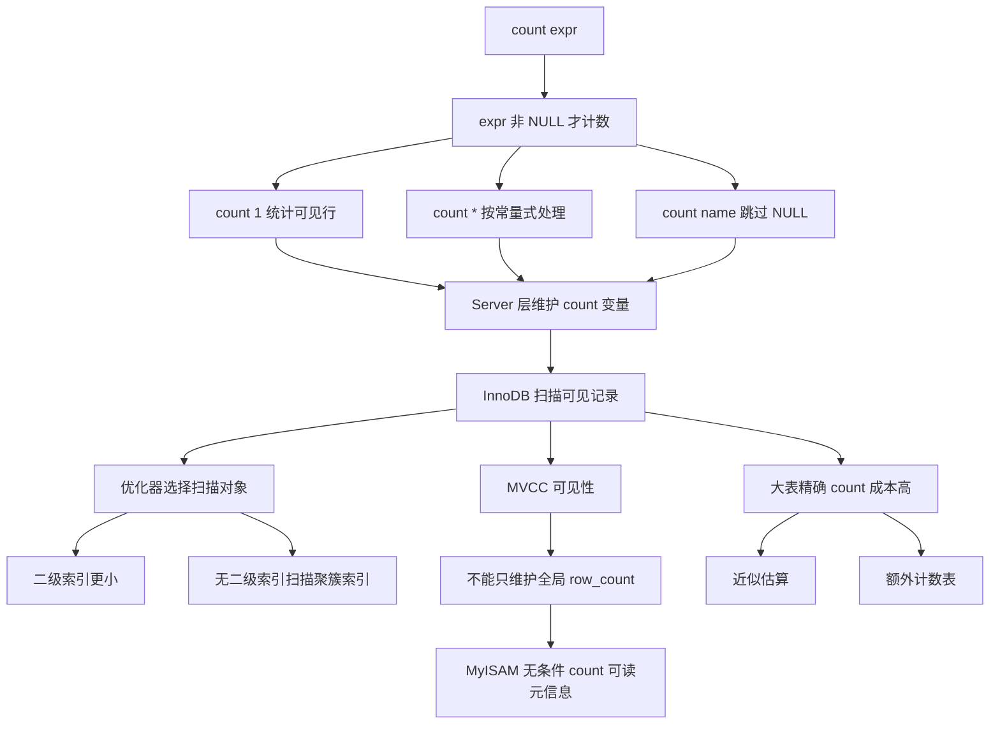

# MySQL COUNT: count(*) 和 count(1) 有什么区别？

### 1. Topic Overview

- What this is about: 理解 `count(*)`、`count(1)`、`count(主键)`、`count(字段)` 的语义和 InnoDB 执行差异。
- Why it matters: 面试里常见误区是把 `count(*)` 当成 `select *`，以为它会读取所有字段；真实重点是 `count()` 统计的是参数表达式不为 `NULL` 的记录数，以及 InnoDB 会选择更便宜的索引扫描对象。
- Difficulty level: 中等。需要同时区分 SQL 语义、Server 层聚合、InnoDB 索引扫描、MVCC 可见性和大表计数优化。
- Prerequisites: MySQL Server 层/存储引擎层边界、InnoDB 聚簇索引和二级索引、B+Tree 页扫描、MVCC 的基本含义。
- Source: `materials/mysql/index/count.md`.

Roadmap:

1. 先建立 `count()` 的语义：统计参数不为 `NULL` 的行。
2. 再比较 `count(主键)`、`count(1)`、`count(*)`、`count(字段)` 的执行路径。
3. 解释为什么 InnoDB 通常要扫描，而 MyISAM 无条件 `count(*)` 可以直接读元信息。
4. 最后讨论大表计数的优化：近似值或额外计数表。

### 2. Core Concepts

#### Schema 1: 用非 NULL 表达式理解 COUNT

- Definition: `count(expr)` 统计的是符合查询条件的记录中，`expr` 这个参数表达式不为 `NULL` 的记录数量。
- Intuition: `count()` 不是“看参数长得像什么就扫描什么”，而是对每一条候选记录问一句：这个表达式结果是不是 `NULL`？不是就加 1。
- Example:
  - `count(name)`：统计 `name` 不为 `NULL` 的行数。
  - `count(1)`：`1` 永远不是 `NULL`，所以统计符合条件的总行数。
  - `count(*)`：在 `count()` 里，`*` 不是读取所有列；MySQL 会按类似常量参数处理，和 `count(1)` 基本一样。
- Common mistakes:
  - 把 `count(*)` 和 `select *` 混为一谈，以为它要读取整行所有字段。
  - 忘记 `count(字段)` 会跳过该字段为 `NULL` 的行。
  - 以为所有 `count()` 都是在统计“表总行数”，忽略 `where` 和 `NULL` 语义。

#### Schema 2: 用扫描对象解释 COUNT 性能差异

- Definition: InnoDB 做精确 `count()` 时，Server 层维护计数变量，并循环从 InnoDB 读取记录或索引记录；优化器倾向选择扫描成本更低的对象。
- Intuition: 计数不是凭空得到的。InnoDB 要看一批可见记录，区别在于它扫描聚簇索引还是更小的二级索引，以及是否需要读取某个字段值。
- Example:
  - `count(id)`：如果 `id` 是主键，需要判断 `id` 是否为 `NULL`；主键本身非空，但执行理解上仍是字段参数。
  - `count(1)`：不用读取具体字段值，只要读到一条符合条件的记录，常量 `1` 就非 `NULL`，计数加 1。
  - `count(*)`：与 `count(1)` 基本同路，MySQL 会把它按常量表达式处理。
  - 有多个二级索引时，MySQL 可优先扫描 `key_len` 更小的二级索引，因为二级索引记录通常比聚簇索引完整行更小。
- Common mistakes:
  - 只背“`count(1)` 比 `count(*)` 快”，但本章源文强调 InnoDB 对二者没有性能差异。
  - 忽略二级索引扫描比聚簇索引扫描更轻，因为二级索引叶子记录通常只含索引列和主键值。
  - 以为有二级索引就不需要扫描任何记录；实际上是扫描更小的索引树。

#### Schema 3: 区分 count(字段) 的语义成本

- Definition: `count(字段)` 统计该字段不为 `NULL` 的行；如果字段不是索引字段，通常需要扫描表并读取字段值来判断是否为 `NULL`。
- Intuition: `count(字段)` 多了一个字段值判断，而且语义不是“总行数”。如果你真正想统计总行数，使用 `count(*)` 更清楚。
- Example:
  - `select count(name) from t_order;` 统计 `name` 非空的记录。
  - 如果 `name` 是普通非索引字段，执行代价可能比 `count(*)` 更高。
  - 如果业务必须频繁统计 `name` 非空数量，可以考虑给 `name` 建二级索引，让扫描对象更小。
- Common mistakes:
  - 用 `count(nullable_col)` 统计总行数，导致漏掉 `NULL` 行。
  - 为了“性能”随意把 `count(*)` 改成 `count(字段)`，语义反而变了。

#### Schema 4: 用 MVCC 解释 InnoDB 为什么不能只存一个总行数

- Definition: MyISAM 在无 `where` 的 `count(*)` 下可以直接读表级元信息里的 `row_count`；InnoDB 支持事务和 MVCC，不同事务视图下“应该看到多少行”可能不同，所以精确计数通常要扫描可见记录。
- Intuition: InnoDB 的“总行数”不是一个全局唯一答案，而是和当前事务能看见哪些版本有关。
- Example:
  - 表里原本有 100 行。
  - 会话 A 插入一些行但还没提交，会话 B 删除一些行或处在不同事务视图中。
  - 两个会话同一时刻执行 `count(*)`，由于可见性不同，结果可能不同。
- Common mistakes:
  - 只说“InnoDB 没有保存行数”，但说不出根因是事务隔离和 MVCC 可见性。
  - 以为 MyISAM 总是比 InnoDB 的所有 `count()` 都快；带 `where` 条件后，两者都需要扫描满足条件的记录。

#### Schema 5: 大表 COUNT 优化要先选精确还是近似

- Definition: 对大表频繁做精确 `count(*)` 代价高，可以根据业务要求选择近似估算或维护额外计数表。
- Intuition: 优化 count 的第一问不是“换成 `count(1)` 行不行”，而是“业务到底需要精确值还是大概值”。
- Example:
  - 只展示搜索结果大概数量：可以用 `show table status` 或 `explain` 的估算行数。
  - 必须展示精确订单总数：可以维护单独计数表，在插入或删除时同步更新计数。
- Common mistakes:
  - 对 1200W+ 大表反复执行精确 `count(*)`，把慢归咎于 `*`，而不是归咎于精确扫描本身。
  - 用估算值处理强一致计费、库存、订单数量等不能容忍误差的场景。
  - 维护计数表时忘记新增、删除和事务一致性成本。

### 3. Deep Understanding

本章的关键链条是：

```text
count(expr) 统计 expr 非 NULL
-> Server 层维护 count 变量
-> InnoDB 提供符合条件且当前事务可见的记录或索引记录
-> 优化器选择扫描成本更低的索引树
-> count(*) 和 count(1) 基本同路
-> count(字段) 语义不同，可能需要读取字段并排除 NULL
```

性能比较不能只看 SQL 字面写法：

- `count(*)` 不等于读取所有列；它和 `count(1)` 基本一致。
- `count(1)` 与 `count(*)` 往往是统计总行数的清晰写法，其中 `count(*)` 更常见，也更能表达“统计行数”。
- `count(主键)` 通常也能统计总行数，因为主键非空，但它仍是字段参数，概念上比常量参数多一层字段值判断。
- `count(字段)` 的语义是统计字段非空值，不一定是总行数。

InnoDB 和 MyISAM 的差异来自一致性模型：

- MyISAM 用表级锁维护一个行数元信息，所以无条件 `count(*)` 可以 `O(1)` 读取。
- InnoDB 要支持并发事务，每个事务的可见行集合可能不同，所以不能只靠一个全局行数给出精确答案。
- 一旦带 `where` 条件，MyISAM 也不能只读总行数元信息，也要扫描并判断哪些行满足条件。

### 4. Minimal Working Example

表结构简化为：

```sql
create table t_order (
  id bigint primary key,
  name varchar(64) null,
  status tinyint not null,
  key idx_status(status)
) engine = InnoDB;
```

Reasoning flow:

1. `select count(*) from t_order;`
   - 目标：统计可见总行数。
   - Server 层：读到一条可见记录就加 1。
   - InnoDB/优化器：可能选择较小的二级索引 `idx_status` 扫描，而不是扫描包含整行的聚簇索引。

2. `select count(1) from t_order;`
   - 目标：统计可见总行数。
   - `1` 永远非 `NULL`。
   - 执行路径和 `count(*)` 基本相同。

3. `select count(id) from t_order;`
   - 目标：统计 `id` 非空数量。
   - 主键 `id` 非空，所以结果等于总行数。
   - 但它是字段参数，理解上仍要判断字段值非 `NULL`。

4. `select count(name) from t_order;`
   - 目标：统计 `name` 非空数量。
   - `name` 为 `NULL` 的行不会被计入。
   - 如果 `name` 没有索引，可能需要扫描并读取普通字段值，成本更高。

Compressed interview answer:

> 在 InnoDB 里，`count(*)` 和 `count(1)` 基本没有性能差异，都会统计可见行数，优化器会尽量选择更小的二级索引扫描。`count(主键)` 通常也能统计总行数，但属于字段参数；`count(字段)` 统计的是字段非 NULL 数量，语义不同，如果字段没索引还可能更慢。InnoDB 不能像 MyISAM 一样直接维护一个准确总行数，核心原因是事务和 MVCC 下不同会话可见的行数可能不同。

### 5. Knowledge Graph



### 6. Self-Test Questions

Recall:

1. `count(expr)` 到底统计什么？
2. 为什么 `count(*)` 不等于读取所有字段？
3. InnoDB 为什么不能像 MyISAM 一样只维护一个全局准确行数？

Application / transfer:

1. 表有 `id` 主键、`name` 可空普通字段、`idx_status(status)` 二级索引。`count(*)` 和 `count(name)` 的语义和扫描成本可能有什么区别？
2. 一个 1200W 行表频繁要展示“搜索结果约多少条”，为什么可以考虑 `explain` 或 `show table status`，而订单精确数量不适合只用估算？

Explain-like-I-am-5:

1. 为什么 `count(*)` 不是“把每一行的所有列都拿出来数一遍”？

### 7. Weak Point Detection

- 如果把 `count(*)` 说成读取所有字段，说明把 `select *` 的语义迁移错了。
- 如果说 `count(字段)` 等于总行数，说明没有建立“字段为 `NULL` 会跳过”的语义边界。
- 如果只说“`count(1)` 比 `count(*)` 快”，说明没有读到本章对 InnoDB 二者等价处理的核心结论。
- 如果解释 InnoDB 必须扫描时只说“它没有 row_count”，但不提 MVCC 可见性，说明根因没有稳定。
- 如果优化大表 `count(*)` 时第一反应只是换 SQL 写法，而不是先问“精确还是近似”，说明优化决策 schema 还没形成。
