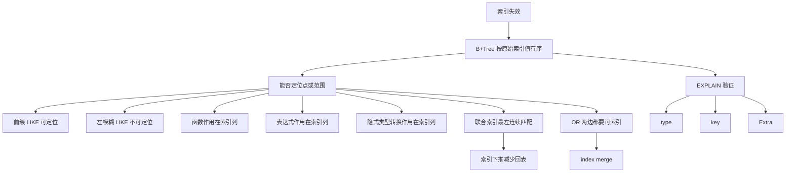

# 索引失效有哪些？

### 1. 主题概览

- 本章讨论的问题：为什么明明给字段建了索引，SQL 执行时还是可能走全表扫描。
- 本章结论：索引失效的核心不是“索引坏了”，而是查询条件让 MySQL 无法利用 B+Tree 中**按原始索引值排序**的结构来快速定位。
- 为什么重要：索引优化不是只会建索引，还要会判断 SQL 是否能真正使用索引，并能用 `EXPLAIN` 验证。
- 难度：中等。难点在于把 6 个失效场景统一到同一个判断标准：**条件是否保留了索引列的原始有序性和可定位性**。
- 前置概念：InnoDB B+Tree 索引、聚簇索引、二级索引、回表、覆盖索引、联合索引最左匹配、`EXPLAIN` 的 `type`、`key`、`Extra`。

### 2. 核心概念

#### 图式 1：索引能否定位，看条件是否保留原始有序键

- 定义：B+Tree 索引按索引列的原始值排序。一个条件能走索引，通常要能根据原始键值定位到某个点或某个连续范围。
- 直觉：索引像按字典顺序排好的目录。你能从开头字母找范围，但如果你把目录项先加工、计算、截断，或者从后缀找，就很难直接定位。
- 例子：
  - `name like '林%'` 可以从“林”这个前缀定位一段范围。
  - `name like '%林'` 不知道从哪里开始定位，只能扫描更多数据。
  - `id = 9` 可以直接定位。
  - `id + 1 = 10` 不能直接用原始 `id` 的有序值定位，应该改写为 `id = 10 - 1`。
- 常见错误：
  - 只背“函数、表达式、like 会失效”，但不知道为什么。
  - 认为只要 where 条件里出现了索引列，就一定能走索引。

#### 图式 2：聚簇索引、二级索引、回表、覆盖索引

- 定义：
  - InnoDB 聚簇索引的叶子节点存放完整行数据。
  - InnoDB 二级索引的叶子节点存放索引列值和主键值。
  - 如果通过二级索引找到主键后，还要回到聚簇索引取完整行，这叫回表。
  - 如果查询所需字段都在二级索引里，就可以覆盖索引，避免回表。
- 例子：
  - `select * from t_user where id = 1`：主键索引定位后直接取完整行。
  - `select * from t_user where name = '林某'`：先走 `name` 二级索引拿主键，再回表取完整行。
  - `select id from t_user where name = '林某'`：二级索引叶子里已有 `name` 和主键 `id`，可以覆盖。
- 常见错误：
  - 以为所有索引叶子节点都直接存完整行。
  - 以为二级索引查询一定要回表，忽略覆盖索引。

#### 图式 3：前缀可定位，前导通配不可定位

- 定义：`like 'xx%'` 保留了索引列从左开始的前缀，可以在 B+Tree 上定位范围；`like '%xx'` 或 `like '%xx%'` 没有固定左前缀，通常无法用索引定位。
- 例子：
  - `where name like '林%'`：可以走 `range` 类型索引扫描。
  - `where name like '%林'`：通常 `type = ALL`，走全表扫描。
- 原因：B+Tree 是按完整字符串从左到右排序，后缀相同的数据可能分散在不同位置。
- 常见错误：
  - 说所有 `LIKE` 都不能用索引。
  - 只记 “% 在左边会失效”，但解释不出“没有起点”。

#### 图式 4：不要在索引列上做函数或表达式计算

- 定义：如果查询条件对索引列本身使用函数或表达式，MySQL 往往不能用原始索引值直接定位。
- 例子：
  - `where length(name) = 6`：对索引列 `name` 使用函数，通常索引失效。
  - `where id + 1 = 10`：对索引列 `id` 做表达式计算，通常索引失效。
  - `where id = 10 - 1`：计算发生在常量一侧，索引列保持原始形态，可以走索引。
- 例外：MySQL 8.0 支持函数索引，例如对 `length(name)` 的结果建立索引后，相关条件可以走函数索引。
- 常见错误：
  - 以为 MySQL 会自动把所有简单表达式改写成可走索引形式。
  - 忽略函数到底作用在索引列上，还是作用在常量参数上。

#### 图式 5：隐式类型转换要看函数作用在哪一边

- 定义：MySQL 遇到字符串和数字比较时，会把字符串转成数字。如果被转换的是索引列，就相当于对索引列做了函数，可能导致索引失效。
- 例子：
  - `phone` 是 `varchar` 且有索引：`where phone = 1300000001` 会把 `phone` 转成数字，相当于 `CAST(phone AS signed int)`，索引可能失效。
  - `id` 是整型且有索引：`where id = '1'` 会把字符串常量 `'1'` 转成数字，相当于 `id = CAST('1' AS signed int)`，索引列没被函数包住，可以走索引。
- 常见错误：
  - 认为只要类型不一致就一定索引失效。
  - 不区分“转换索引列”和“转换输入参数”。

#### 图式 6：联合索引必须从最左连续匹配

- 定义：联合索引 `(a, b, c)` 先按 `a` 排序；`a` 相同再按 `b` 排序；`a、b` 都相同再按 `c` 排序。因此索引定位必须从最左列开始连续匹配。
- 可以匹配：
  - `where a = 1`
  - `where a = 1 and b = 2`
  - `where a = 1 and b = 2 and c = 3`
- 不能直接从联合索引高效定位：
  - `where b = 2`
  - `where c = 3`
  - `where b = 2 and c = 3`
- 特殊情况：
  - `where a = 1 and c = 3` 可以用 `a` 定位，但 `b` 缺失导致连续匹配中断。
  - MySQL 5.6 后的索引下推可以在扫描索引时用 `c = 3` 过滤，减少回表，但它不是把 `c` 变成完整定位条件。
- 常见错误：
  - 只背“最左匹配”，不知道联合索引内部是全局有序/局部有序。
  - 把索引下推误解成“跳过 b 后 c 也能完整定位”。

#### 图式 7：OR 两边都要有可用索引

- 定义：`OR` 表示任一条件满足即可。如果一边能走索引，另一边不能走索引，MySQL 可能选择全表扫描，因为无索引那边仍然要扫描全表。
- 例子：
  - `where id = 1 or age = 18`，`id` 有索引、`age` 无索引：可能全表扫描。
  - 如果 `age` 也有索引，可能出现 `index merge`：分别扫描两个索引，再合并结果集。
- 常见错误：
  - 以为 OR 中只要有一个条件有索引就够了。
  - 不知道 `index merge` 是多个索引结果集合并，不等于联合索引。

### 3. 深度理解

索引失效可以统一成一条因果链：

```text
B+Tree 按原始索引值有序
-> 查询条件必须能用原始值定位点或范围
-> 条件破坏原始值、左前缀、最左连续顺序或 OR 两边可索引性
-> MySQL 无法通过索引快速缩小扫描范围
-> 可能退化为全表扫描或扫描大量索引/数据页
```

因此，本章不是让你背 6 条规则，而是形成一个判断动作：

> 看到一个 SQL，先问：这个条件是否还能用索引 B+Tree 的原始有序键来定位？如果不能，就要警惕索引失效；再用 `EXPLAIN` 看 `type`、`key`、`Extra` 验证。

### 4. 最小工作例子

假设：

```sql
CREATE TABLE t_user (
  id int primary key,
  name varchar(100),
  phone varchar(20),
  age int,
  key idx_name(name),
  key idx_phone(phone),
  key idx_a_b_c(age, name, phone)
);
```

几个典型判断：

```sql
select * from t_user where name like '林%';
```

能根据 `name` 的左前缀定位范围，通常可以走索引。

```sql
select * from t_user where name like '%林';
```

没有固定左前缀，无法确定从索引哪里开始，通常不能高效走索引。

```sql
select * from t_user where length(name) = 6;
```

函数作用在索引列上，索引里存的是原始 `name`，不是 `length(name)`。

```sql
select * from t_user where phone = 1300000001;
```

`phone` 是字符串索引列，数字比较会让 MySQL 把 `phone` 转成数字，相当于对索引列做函数。

```sql
select * from t_user where age = 18 or id = 1;
```

如果 `age` 没有单独索引，OR 的一边无法走索引，整体可能全表扫描。

### 5. 知识图谱



### 6. 自测问题

- 回忆：为什么 `name like '林%'` 可能走索引，而 `name like '%林'` 通常不行？
- 回忆：为什么 `where id + 1 = 10` 通常不能走索引，而 `where id = 10 - 1` 可以？
- 回忆：`phone` 是 `varchar` 索引列时，为什么 `phone = 1300000001` 可能索引失效？
- 应用：联合索引 `(a, b, c)` 下，`where a = 1 and c = 3` 能完整使用三列定位吗？索引下推在这里做了什么？
- 应用：`where id = 1 or age = 18` 中只有 `id` 有索引时，为什么可能全表扫描？
- 通俗解释：用“字典目录”的比喻解释索引失效。

### 7. 薄弱点检测

- 失败表现：只会背 6 条索引失效规则。
  - 可能问题：没有形成“原始有序键能否定位”的统一图式。
- 失败表现：说所有 `LIKE` 都不能走索引。
  - 可能问题：没有区分左前缀和前导通配。
- 失败表现：看到类型不一致就说一定失效。
  - 可能问题：没有判断隐式转换作用在索引列还是常量参数。
- 失败表现：把索引下推说成“跳过中间列后还能完整使用联合索引”。
  - 可能问题：混淆了定位边界和减少回表。
- 失败表现：OR 中有一个索引列就认为一定走索引。
  - 可能问题：没有理解 OR 任一条件满足时，无索引分支仍可能迫使全表扫描。
