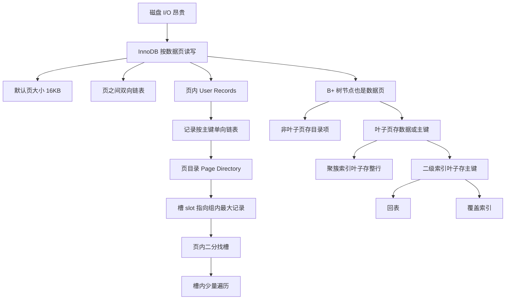

# 从数据页角度看 B+ 树

### 1. Topic Overview

- What this is about: 从 InnoDB 数据页的角度理解 B+ 树索引。重点不是背“B+ 树很快”，而是看清楚页内记录怎么找、多个页之间怎么找、聚簇索引和二级索引的叶子页分别存什么。
- Why it matters: 很多索引题的底层答案都落在“页”。如果不知道 B+ 树节点本质上是数据页，就容易把 B+ 树当成抽象内存结构，无法解释磁盘 I/O、页目录、回表和覆盖索引。
- Difficulty level: beginner to intermediate.
- Prerequisites:
  - InnoDB 是常用 MySQL 存储引擎。
  - InnoDB 主要按页读写，默认数据页大小是 16KB。
  - 记录按行存储，但读取通常不是一行一行从磁盘读。
  - B+ 树是有序、多叉、低高度的数据结构。

Learning roadmap:

1. 先理解页是 InnoDB 读写的基本单位。
2. 再理解一个数据页内部如何用页目录定位记录。
3. 再理解 B+ 树如何把“页内找记录”扩展成“先找记录所在的页”。
4. 最后用叶子页存放内容区分聚簇索引、二级索引、回表和覆盖索引。

### 2. Core Concepts

#### Schema 1: Page as the I/O and Search Unit

- Definition: InnoDB 的数据按数据页读写，默认一个数据页是 16KB。查询一条记录时，通常不是只把这一行从磁盘读入内存，而是把这条记录所在的数据页整体读入内存。
- Intuition: 页像一本书的一页。你要看某一句话时，不会只撕出那一句话，而是翻到这一整页。
- Example:
  - 查一条主键记录。
  - InnoDB 先定位包含这条记录的数据页。
  - 把该页读入内存。
  - 再在页内找具体记录。
- Common mistakes:
  - 以为数据库 I/O 的最小单位是一行。
  - 只记住“16KB”，但不能解释为什么页会影响索引效率。

#### Schema 2: Data Page Layout

- Definition: InnoDB 数据页由多个区域组成，源文强调数据页包括七个部分，其中和学习主线最相关的是 File Header、User Records 和 Page Directory。
- Intuition:
  - File Header 让页和页之间能连起来。
  - User Records 存真实用户记录。
  - Page Directory 是页内目录，用来加速在一个页内找记录。
- Example:
  - File Header 中有指向上一个数据页和下一个数据页的指针。
  - 多个页可以逻辑上形成双向链表，即使物理磁盘位置不连续。
- Common mistakes:
  - 把页目录理解成另一个独立索引树。
  - 忽略页之间可以逻辑连续而不要求物理连续。

#### Schema 3: Page Directory as an In-Page Index

- Definition: 一个数据页内，用户记录按主键顺序组成单向链表。为了避免每次都从头遍历，InnoDB 把记录分组，并在页目录中保存每组最后一条记录的地址偏移量。每个偏移量叫一个槽 slot。
- Intuition: 页目录就是“页内小目录”。目录项不指向每一条记录，而是指向每个记录组的最大记录。
- Example:
  - 一个页内有 5 个槽，槽编号 0 到 4。
  - 要找主键 11。
  - 先二分槽：如果 2 号槽最大主键是 8，说明 11 在后面。
  - 再看 3 号槽最大主键是 12，说明 11 在 3 号槽这个组里。
  - 找到目标组后，通过上一组最大记录的下一条记录，进入本组最小记录，再在组内顺着单向链表找 11。
- Important details:
  - 页目录存的是每组最后一条记录的地址偏移量。
  - 每组最后一条记录的记录头会保存该组记录数，字段是 `n_owned`。
  - 第一个分组只能有 1 条记录。
  - 最后一个分组只能有 1-8 条记录。
  - 其他分组只能有 4-8 条记录。
- Common mistakes:
  - 以为页目录直接保存每条记录的位置。
  - 以为槽内记录很多，所以页内查找一定退化成大范围 O(n) 遍历。
  - 忘记槽指向的是组内最大记录，因此要借助前一个槽找到本组起点。

#### Schema 4: B+Tree as a Directory of Data Pages

- Definition: 当数据量超过一个页时，只靠页内目录不够。InnoDB 用 B+ 树索引来定位记录所在的数据页。InnoDB B+ 树中的每个节点都是一个数据页。
- Intuition: 页目录解决“一个页内怎么找记录”；B+ 树解决“很多页中先找哪一页”。两者都是利用有序范围减少扫描。
- Example:
  - 查主键 6。
  - 从根节点页开始，在页内用二分定位应该走向哪个子页。
  - 到中间节点页后，再二分定位更具体的子页。
  - 到叶子节点页后，再用页目录定位记录所在槽，最后在槽内遍历少量记录。
- Common mistakes:
  - 把 B+ 树节点想成一个普通对象，忘记节点本身就是页。
  - 只说 B+ 树 `O(log n)`，不说它减少的是页级磁盘 I/O。
  - 把“页内二分找槽”和“树上逐层找页”混成一件事。

#### Schema 5: Why B+Tree Is Shallow and Range-Friendly

- Definition: B+ 树适合数据库索引，因为它是矮胖结构，能减少磁盘 I/O 次数；并且叶子节点按索引键排序并相连，适合范围查询。
- Intuition:
  - 矮胖：一层能分很多叉，树高低，读的页少。
  - 有序相连：定位范围起点后，可以沿叶子页继续扫。
- Example:
  - `where id between 10 and 100`
  - 先沿 B+ 树定位到 `10` 所在或附近的叶子页。
  - 再沿有序叶子页向后扫描到 `100`。
- Common mistakes:
  - 只说 B+ 树快，不解释“快”对应的是页读次数少。
  - 忽略叶子页之间的有序链接对范围查询的价值。

#### Schema 6: Clustered vs Secondary Index by Leaf Page Content

- Definition:
  - 聚簇索引：叶子节点存放实际数据，也就是完整用户记录。
  - 二级索引：叶子节点存放主键值，而不是完整用户记录。
- Intuition: 判断聚簇还是二级，不看它是不是唯一，不看它叫什么名字，而看叶子页里放的是整行还是主键。
- Example:
  - 主键索引通常是聚簇索引，叶子页就是表数据。
  - 普通非主键字段索引是二级索引，叶子页保存索引字段和主键值。
- InnoDB 选择聚簇索引键的顺序:
  - 有主键时，默认使用主键。
  - 没有主键时，选择第一个不包含 NULL 的唯一列。
  - 两者都没有时，自动生成隐式自增 id。
- Common mistakes:
  - 以为一个表可以有多个聚簇索引。
  - 把“唯一索引”和“聚簇索引”直接画等号。
  - 以为二级索引叶子页也存整行。

#### Schema 7: Back-to-Table Lookup vs Covering Index

- Definition:
  - 回表：先用二级索引找到主键值，再用主键去聚簇索引查完整数据行。
  - 覆盖索引：查询需要的数据已经能从二级索引拿到，不需要再查聚簇索引。
- Intuition: 二级索引像“副目录”。副目录可以告诉你主键位置；如果你要的信息副目录里已经有，就不用再翻正文。
- Example:
  - 二级索引叶子页只有主键值和索引列。
  - `select *` 通常需要完整行，所以可能要回表。
  - 如果只查询二级索引已经包含的列和主键，就可以覆盖。
- Common mistakes:
  - 以为用了二级索引就一定要回表。
  - 以为覆盖索引是一种新索引类型，而不是一种查询命中状态。

### 3. Deep Understanding

这章的关键因果链是：

```text
磁盘 I/O 很贵
-> InnoDB 按 16KB 数据页读写
-> 一个页内有很多行
-> 页内记录按主键单向链表组织
-> 单向链表直接遍历慢
-> 页目录把记录分组并保存槽
-> 页内可以先二分找槽，再少量遍历
-> 数据很多时需要很多页
-> B+ 树把每个节点做成数据页
-> 非叶子页存目录项，叶子页存数据或主键
-> 树上先找页，页内再找记录
```

边界要分清：

- 页内页目录解决的是“一个数据页内部如何找记录”。
- B+ 树解决的是“很多数据页里如何找到目标页”。
- 聚簇索引和二级索引都可以是 B+ 树，区别是叶子节点存什么。
- 回表不是“索引失效”，而是二级索引先定位主键，再去聚簇索引拿缺失列。

### 4. Minimal Working Example

假设查主键 `id = 6`：

```text
1. 从 B+ 树根节点页开始。
2. 在根节点页内用目录项判断 6 落在哪个子页范围。
3. 进入下一层非叶子节点页。
4. 继续通过目录项定位叶子页。
5. 到达叶子数据页。
6. 在叶子页中通过页目录二分找到目标槽。
7. 在槽内顺着单向链表找少量记录。
8. 找到 id = 6 的完整记录。
```

如果查的是二级索引字段：

```text
1. 先走二级索引 B+ 树。
2. 在二级索引叶子页拿到主键值。
3. 如果查询列不在二级索引里，再走聚簇索引 B+ 树。
4. 在聚簇索引叶子页拿到完整行。
```

### 5. Knowledge Graph



### 6. Self-Test Questions

Recall:

1. InnoDB 默认数据页大小是多少？为什么查询一行通常不是只读这一行？
2. 页目录里的槽 slot 存的是什么？
3. 聚簇索引和二级索引的叶子节点分别存什么？

Application / transfer:

1. 为什么页内记录已经按主键组成单向链表，还需要页目录？
2. 为什么说 B+ 树节点本身是数据页，可以帮助解释索引减少磁盘 I/O？

Explain-like-I-am-5:

1. 用“书页 + 目录”的比喻解释：页目录和 B+ 树分别帮我们找什么？

### 7. Weak Point Detection

- 如果只会说“B+ 树快”，但说不出页、槽、树高和 I/O，说明还是抽象背诵。
- 如果把页目录和 B+ 树混为一谈，说明“页内查找”和“页间查找”的层级边界不稳。
- 如果说二级索引叶子节点存完整行，说明聚簇索引和二级索引的叶子内容边界不稳。
- 如果说覆盖索引是一种独立索引类型，说明“索引结构”和“查询是否被覆盖”的分类维度混淆。
