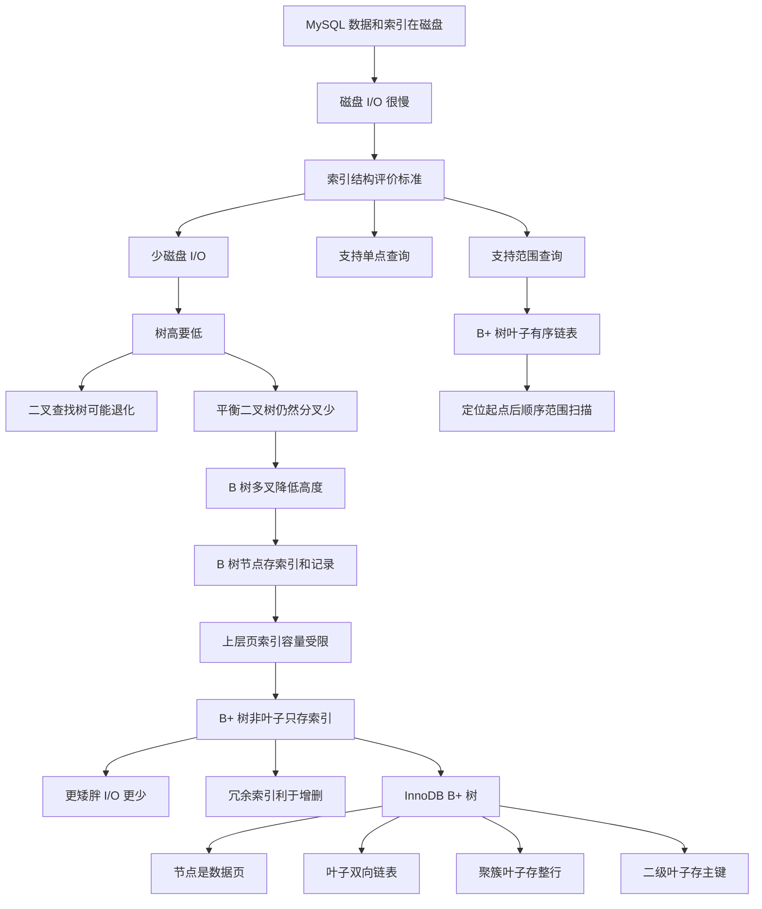

# 为什么 MySQL 采用 B+ 树作为索引

### 1. Topic Overview

- What this is about: 从磁盘 I/O、单点查询、插入删除、范围查询和 InnoDB 数据页模型出发，解释为什么 MySQL/InnoDB 默认采用 B+ 树作为索引结构。
- Why it matters: 面试里问“为什么用 B+ 树”时，不能只回答“B+ 树查询快”。数据库索引结构的核心评价标准是：能不能少读磁盘页，能不能支持范围查询，能不能稳定维护有序结构。
- Difficulty level: beginner to intermediate.
- Prerequisites:
  - 数据和索引持久化在磁盘上。
  - 磁盘 I/O 远慢于内存访问。
  - InnoDB 按数据页组织 B+ 树节点，页默认 16KB。
  - 聚簇索引叶子页存完整用户记录，二级索引叶子页存主键值。

Learning roadmap:

1. 先建立索引结构选择的评价标准：少磁盘 I/O + 支持单点和范围查询。
2. 用这个标准淘汰有序数组、二叉查找树、自平衡二叉树。
3. 理解 B 树为什么比二叉树更适合磁盘索引。
4. 理解 B+ 树相对 B 树的三类优势：更矮胖、增删更稳定、范围查询更顺。
5. 回到 InnoDB：B+ 树节点是数据页，叶子页双向链表，索引类型决定叶子页内容。

### 2. Core Concepts

#### Schema 1: Index Structure Evaluation Lens

- Definition: 判断一种结构是否适合 MySQL 索引时，核心不是只看算法时间复杂度，而是看它能不能用尽量少的磁盘 I/O 完成查询，并且同时支持单点查询和范围查询。
- Intuition: 数据库索引不是纯内存结构。磁盘很慢，树每高一层，通常就多一次页读取，所以“树高”和“范围扫描路径”比抽象比较次数更关键。
- Example:
  - 磁盘读写最小单位是扇区，常见扇区大小是 512B。
  - 操作系统通常按块读写，Linux 块大小常见是 4KB。
  - InnoDB 数据页默认是 16KB。
  - 查询经过索引时，会把索引页、数据页从磁盘读入内存。磁盘 I/O 次数越多，耗时越大。
- Common mistakes:
  - 只说 B+ 树时间复杂度是 `O(log n)`，不说磁盘 I/O。
  - 只考虑等值查询，忽略数据库大量范围查询。
  - 把“数据结构课里的快”直接等同于“数据库里适合”。

#### Schema 2: Why Ordered Array Is Not Enough

- Definition: 有序数组适合二分查找，但不适合磁盘上的动态索引结构，因为插入新元素可能要移动大量后续元素。
- Intuition: 二分查找解决“查”，但有序数组让“插入维护有序”变得很贵。
- Example:
  - 在有序数组中查数字 3，可以通过二分每次缩小一半范围，时间复杂度是 `O(log n)`。
  - 但插入一个新元素时，后面的元素可能都要后移。如果这些移动发生在磁盘上，代价很高。
- Common mistakes:
  - 只看到二分查询快，忽略数据库索引还要支持频繁插入、删除和更新。

#### Schema 3: Binary Search Tree Failure Under Disk I/O

- Definition: 二叉查找树把有序数组的二分思想变成非线性结构，插入比数组灵活，但极端插入顺序会退化成链表。
- Intuition: 二叉查找树的问题不是“不能查”，而是高度不稳定。数据库里树高越高，页读越多。
- Example:
  - 每次插入的元素都是当前最大值，二叉查找树会向一边倾斜，变成链表。
  - 查找复杂度从 `O(log n)` 退化到 `O(n)`。
  - 如果访问每个节点都对应一次磁盘 I/O，那么链表式高度会让查询非常慢。
- Common mistakes:
  - 只说二叉查找树会退化，不把退化连接到“树高 = I/O 次数”。
  - 忽略二叉查找树也不适合范围查询。

#### Schema 4: Balanced Binary Tree Still Too Tall

- Definition: AVL、红黑树等自平衡二叉树能避免退化，维持 `O(log n)`，但本质仍是二叉树，每个节点最多两个子节点，数据量大时高度仍然偏高。
- Intuition: 平衡解决“歪”，没有解决“瘦”。数据库希望树矮胖，因为每下一层都可能是一次磁盘 I/O。
- Example:
  - 一棵高度为 5 的平衡二叉树，访问最底层节点可能需要 5 次磁盘 I/O。
  - 如果改成 M 叉树，同样节点数量下，分叉数越大，树高越低。
- Common mistakes:
  - 认为红黑树很强，所以一定适合数据库索引。
  - 只看内存里的旋转和平衡，不看磁盘页读次数。

#### Schema 5: B Tree Lowers Height but Wastes Upper-Level Reads

- Definition: B 树是多叉树，一个节点可以有多个索引和多个子节点，因此比二叉树更矮，更适合磁盘检索。但 B 树每个节点都可能同时包含索引和记录数据。
- Intuition: B 树解决了“树太高”，但上层节点携带记录数据会挤占索引容量。查询底层目标时，很多非目标记录会被读入内存但没有用。
- Example:
  - 3 阶 B 树节点最多有 2 个数据和 3 个子节点。
  - 查询索引 9 时，可能从根节点比较 `(4, 8)`，再到子节点 `(10, 12)`，最后到 9。
  - 高度为 3，查询中可能发生 3 次磁盘 I/O。
- Common mistakes:
  - 以为 B 树已经是多叉树，所以一定和 B+ 树一样适合 MySQL。
  - 忽略 B 树非叶子节点里记录数据会降低每页可容纳的索引数量。

#### Schema 6: B+ Tree Is More Page-Efficient Than B Tree

- Definition: B+ 树的非叶子节点只存索引，不存实际记录；实际数据只在叶子节点。这样同样大小的页里，非叶子节点可以放更多索引，分叉更多，树更矮胖，底层查询的磁盘 I/O 更少。
- Intuition: 非叶子页像纯目录。目录越纯粹，一页能放的目录项越多，越能减少层数。
- Example:
  - B 树上层节点既有索引又有记录。
  - B+ 树上层节点只放索引。
  - 如果页大小固定，B+ 树上层页能容纳更多 key，fanout 更高。
- Common mistakes:
  - 只说 B+ 树比 B 树快，不说明“非叶子节点不存记录 -> 每页索引更多 -> 树更矮 -> I/O 更少”。
  - 误以为 B+ 树每次都比 B 树单点查询平均更快。源文指出 B 树某些单点查询可能更早命中，但 B+ 树整体更稳定、更适合数据库页模型。

#### Schema 7: B+ Tree Handles Insert/Delete More Stably

- Definition: B+ 树有冗余索引，所有真实记录都在叶子节点。删除叶子节点中的记录时，很多情况下可以少动或不动非叶子节点，结构变化比 B 树小。
- Intuition: 非叶子节点是冗余目录，叶子节点才是数据主存放点。目录的冗余让维护更稳定。
- Example:
  - B+ 树删除一个叶子记录时，可能直接在叶子节点删除，非叶子节点变化很小。
  - B 树删除根节点或非叶子节点中的数据时，可能涉及复杂树形变化。
  - B+ 树插入可能发生节点分裂，但通常只涉及一条路径，并且能自动保持平衡。
- Common mistakes:
  - 把 B+ 树的冗余索引只理解成空间浪费，而忽略它换来了维护稳定性。

#### Schema 8: B+ Tree Range Query Advantage

- Definition: B+ 树所有叶子节点按索引顺序构成链表。范围查询可以先定位起点叶子节点，再沿叶子链表顺序扫描到终点。
- Intuition: 等值查询靠树定位；范围查询靠“定位起点 + 叶子链表顺扫”。
- Example:
  - 查询 12 月 1 日到 12 月 12 日的订单。
  - 先从根节点定位到 12 月 1 日所在叶子节点。
  - 然后沿叶子链表向右遍历到 12 月 12 日。
- Common mistakes:
  - 只说 B+ 树支持范围查询，不说叶子节点链表。
  - 把范围查询误解为每个范围内的值都要重新从根节点查一次。

#### Schema 9: InnoDB's B+ Tree Details

- Definition: InnoDB 使用 B+ 树作为索引结构，节点内容是数据页，默认页大小是 16KB；叶子节点之间用双向链表连接；根据索引类型不同，叶子节点内容不同。
- Intuition: 前面讲的是结构选择，落到 InnoDB 就要回到“页”。
- Example:
  - 聚簇索引叶子节点存完整用户记录。
  - 二级索引叶子节点存主键值，不存完整行。
  - 表数据物理上只保存一份，所以聚簇索引只能有一个；二级索引可以多个。
- Common mistakes:
  - 忘记 InnoDB B+ 树节点是数据页。
  - 忘记 InnoDB 叶子节点是双向链表，不只是单向链表。

### 3. Deep Understanding

这章的核心不是“B+ 树在数据结构课上很优秀”，而是这条选择链：

```text
MySQL 数据和索引在磁盘上
-> 磁盘 I/O 很慢
-> 索引结构要尽量减少页读次数
-> 树高越低，页读通常越少
-> 二叉树分叉太少，数据大时树高偏高
-> B 树变成多叉树，降低高度
-> 但 B 树非叶子节点也存记录，挤占索引容量
-> B+ 树非叶子节点只存索引，fanout 更高，更矮胖
-> B+ 树叶子节点有序链表，范围查询更顺
-> B+ 树冗余索引让插入删除更稳定
-> InnoDB 采用 B+ 树作为索引结构
```

三个面试回答支点：

- 磁盘 I/O：B+ 树非叶子节点不存记录，一页能放更多索引，树更矮胖。
- 范围查询：叶子节点有序链表，定位起点后顺序扫描。
- 维护成本：冗余索引让插入删除更稳定，很多删除可以主要在叶子层处理。

边界：

- B 树不是“差结构”，它也适合磁盘检索，只是不如 B+ 树适合数据库大量范围查询和页模型。
- B 树单点查询某些情况下可能更快命中，因为记录可能在非叶子节点；但 B+ 树查询路径更稳定，非叶子节点目录更纯。
- InnoDB 的 B+ 树要结合数据页理解，不能只画抽象树。

### 4. Minimal Working Example

回答“为什么 MySQL 采用 B+ 树作为索引”时，可以这样组织：

```text
1. MySQL 数据和索引在磁盘上，磁盘 I/O 很慢，所以索引结构要尽量减少磁盘 I/O。
2. 二叉查找树可能退化；平衡二叉树虽然不退化，但分叉少，数据量大时树高仍然高。
3. B 树是多叉树，能降低树高，但节点里既存索引又存记录，非叶子节点会读入很多当前查询不需要的记录数据。
4. B+ 树非叶子节点只存索引，一页能放更多索引，树更矮胖，磁盘 I/O 更少。
5. B+ 树所有真实数据在叶子节点，叶子节点有序链表，范围查询可以定位起点后顺序扫描。
6. InnoDB 中 B+ 树节点是数据页，叶子页双向链表；聚簇索引叶子页存整行，二级索引叶子页存主键。
```

### 5. Knowledge Graph



### 6. Self-Test Questions

Recall:

1. 判断索引结构是否适合 MySQL，除了时间复杂度，还必须考虑什么？
2. 为什么平衡二叉树仍然不适合作为数据库索引的主要结构？
3. B+ 树和 B 树在非叶子节点存储内容上有什么区别？

Application / transfer:

1. 为什么 B+ 树非叶子节点只存索引会减少磁盘 I/O？
2. 查询 `where create_time between '2026-12-01' and '2026-12-12'` 时，B+ 树叶子链表如何发挥作用？

Explain-like-I-am-5:

1. 用“目录页”和“正文页”的比喻解释为什么 B+ 树比 B 树更适合数据库索引。

### 7. Weak Point Detection

- 如果只回答“B+ 树是多叉平衡树，所以快”，说明缺少磁盘 I/O 视角。
- 如果说红黑树也 `O(log n)` 所以同样适合 MySQL，说明没有把二叉树高度和页读次数联系起来。
- 如果说 B 树完全不能范围查询，说明过度简化；更准确是 B 树范围查询通常要树遍历，涉及更多节点 I/O，不如 B+ 树叶子链表顺扫。
- 如果说 B+ 树一定单点查询比 B 树快，说明忽略源文中 B 树可能在非叶子节点提前命中的边界。
- 如果忘记 InnoDB B+ 树节点是数据页、页默认 16KB，说明没有把新章节和上一章“从数据页角度看 B+ 树”连起来。
