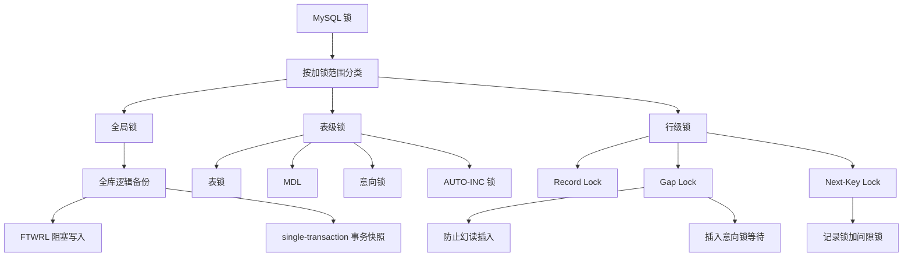

# MySQL 有哪些锁

### 1. Topic Overview

- What this is about: 本章按“加锁范围”梳理 MySQL 锁：全局锁、表级锁、行级锁，并解释它们各自保护什么、阻塞什么、什么时候释放。
- Why it matters: 面试里问“有哪些锁”不是让你背名称，而是看你能不能把一致性、并发性能、备份、DDL、事务和幻读放进同一个判断框架。
- Difficulty level: 中等。难点在于区分锁的层级、兼容关系和释放时机，尤其是 MDL、意向锁、Gap Lock、Next-Key Lock、插入意向锁。
- Prerequisites: MySQL Server 层和存储引擎层、InnoDB 行锁、事务提交、MVCC 快照读、当前读、幻读、B+Tree 有序范围。
- Source: `materials/mysql/lock/mysql_lock.md`.

Source order roadmap:

1. 按范围分三类：全局锁、表级锁、行级锁。
2. 全局锁：`flush tables with read lock`、全库逻辑备份、`mysqldump --single-transaction`。
3. 表级锁：表锁、MDL、意向锁、AUTO-INC 锁。
4. 行级锁：Record Lock、Gap Lock、Next-Key Lock。
5. 插入意向锁：插入点遇到间隙锁时的等待锁。

### 2. Core Concepts

#### Schema 1: 按加锁范围判断锁的保护边界

- Definition: MySQL 可以按锁影响的范围分成全局锁、表级锁、行级锁。
- Intuition: 先问“这把锁保护谁”，再问“它阻塞谁”。全局锁保护整个库，表级锁保护一张表或表级元信息，行级锁保护某条记录或某个索引区间。
- Example: 全局锁会让整个库只读；表锁会限制某张表；`select ... for update where id = 1` 只锁相关记录或索引范围。
- Common mistakes:
  - 把“全局/表/行”当成锁名字清单，而不是作用范围。
  - 一上来背 S 锁、X 锁，忘记先判断锁的层级。
  - 认为锁越细一定越好，忽略备份、DDL、自增分配等场景需要更粗的保护。

#### Schema 2: 用一致性备份选择全局锁或事务快照

- Definition: 全局锁通过 `flush tables with read lock` 让整个数据库只读，常用于全库逻辑备份；InnoDB 可用 `mysqldump --single-transaction` 通过 RR 事务快照备份。
- Intuition: 备份想要的是“同一时刻的数据切面”。全局锁靠阻塞写入拿到一致性；事务快照靠 MVCC 看到同一个 Read View。
- Example: 先备份用户表，期间有人下单扣库存，后备份商品表。如果没有一致性保护，可能出现用户余额没扣、库存减少的错误快照。
- Common mistakes:
  - 只说全局锁能备份，漏掉它会让业务写入停滞。
  - 认为 `--single-transaction` 适用于所有引擎。它依赖支持事务和 RR 的存储引擎，比如 InnoDB。

#### Schema 3: 用 MDL 解释 DDL 为什么会卡住后续查询

- Definition: MDL 是元数据锁，CRUD 自动加 MDL 读锁，表结构变更加 MDL 写锁；显式事务里 MDL 通常到事务提交才释放。
- Intuition: MySQL 要避免“你正在读一张表，别人把表结构改了”。所以读表和改结构需要在元数据层协调。
- Example: 事务 A 开启后执行 `select` 不提交，持有 MDL 读锁；线程 C 执行 `alter table` 等 MDL 写锁；因为写锁等待优先级高，后续新的 CRUD 也会排队阻塞。
- Common mistakes:
  - 以为普通 `select` 不加任何锁。普通 `select` 不加行锁，但会涉及 MDL。
  - 忽略长事务会让 MDL 持有时间变长，从而放大 DDL 风险。

#### Schema 4: 用意向锁连接表锁和行锁

- Definition: InnoDB 给记录加 S/X 行锁前，会先在表级加意向共享锁或意向独占锁。
- Intuition: 意向锁像表级提示牌，告诉想加表锁的人：这张表里已经有人在锁某些行，不用逐行扫描检查。
- Example: `select ... for update` 会先加意向独占锁，再对读取的记录加独占锁。意向锁之间不冲突，它主要和显式表锁冲突。
- Common mistakes:
  - 把意向锁理解成“准备插入”的插入意向锁。二者不是同一种锁。
  - 认为意向锁会和普通行锁直接冲突。文章强调它不和行级 S/X 锁冲突。

#### Schema 5: 用自增锁模式权衡连续性、并发和复制一致性

- Definition: AUTO-INC 锁是特殊表锁，用于给 `AUTO_INCREMENT` 字段分配递增值；不同 `innodb_autoinc_lock_mode` 会改变锁释放时机和并发效果。
- Intuition: 自增分配要在“连续、并发、复制一致性”之间取舍。
- Example: `innodb_autoinc_lock_mode = 2` 申请到自增值后就释放轻量锁，并发最好；但配合 `binlog_format=statement` 时，主库并发执行、从库顺序重放，可能让自增 id 分配结果不同。配合 row 格式记录实际行值可避免这个问题。
- Common mistakes:
  - 只记 mode 数字，不解释释放时机。
  - 只谈性能，不谈 statement binlog 下的主从不一致风险。

#### Schema 6: 用 Record/Gap/Next-Key 区分锁住记录、间隙、范围加端点

- Definition: Record Lock 锁一条记录；Gap Lock 锁两个记录之间的空隙，不包含记录本身；Next-Key Lock = Record Lock + Gap Lock，锁一个左开右闭范围。
- Intuition: 记录锁保护“已有行”，间隙锁保护“还不存在但可能插入的位置”，临键锁同时保护间隙和端点记录。
- Example:
  - `id = 1 for update` 可能给 `id=1` 加 X 型记录锁。
  - `(3,5)` 的间隙锁阻止插入 `id=4`。
  - `(3,5]` 的 next-key lock 阻止插入 `id=4`，也阻止修改 `id=5`。
- Common mistakes:
  - 把 Gap Lock 当成锁住两端记录。
  - 以为间隙锁之间互斥。文章强调间隙锁之间兼容，因为目的只是阻止插入幻影记录。
  - 忘记 next-key lock 中的记录锁部分仍然要遵守 S/X 兼容关系。

#### Schema 7: 用插入意向锁解释 insert 为什么等待

- Definition: 插入意向锁是插入记录时遇到已有间隙锁而生成的等待锁；它不是表级意向锁，而是一种特殊的行级间隙锁。
- Intuition: 间隙锁锁住区间，插入意向锁表达“我想在这个区间的某个点插入”。如果该点落在别人持有的间隙锁中，就要等待。
- Example: 事务 A 持有 `(3,5)` 间隙锁，事务 B 插入 `id=4`，B 会生成等待状态的插入意向锁，直到 A 提交释放间隙锁。
- Common mistakes:
  - 看到“意向”二字就把插入意向锁和表级意向锁混为一谈。
  - 以为等待状态的锁表示已经成功拿到锁。文章提醒：等待状态只是生成了锁结构，未成功获取。

### 3. Deep Understanding

这章的核心不是“锁名字越多越好”，而是三条机制链：

1. 一致性链：备份、DDL、事务读取、幻读防护，本质上都是在保护某个一致性边界。
2. 并发链：锁范围越粗，并发越差，但判断更简单；锁范围越细，并发更好，但必须依赖索引、事务和兼容规则精确控制。
3. 阻塞链：要判断一个操作为什么卡住，先定位锁层级，再看兼容关系，最后看释放时机。

几个关键边界：

- 普通 `select` 不加行锁，但会自动加 MDL 读锁。
- `select ... for update` 是锁定读，要在事务里使用，事务提交后行锁释放。
- 意向锁是表级锁，但它是为了快速协调表锁和行锁，不是为了直接锁某一行。
- Gap Lock 只在可重复读隔离级别下存在，主要用于防止幻读。
- 插入意向锁不是表级意向锁，而是特殊的间隙锁。

### 4. Minimal Working Example

#### Example A: 全库逻辑备份

```text
1. 备份用户表。
2. 用户下单，扣余额并扣库存。
3. 备份商品表。
```

如果没有一致性保护，备份可能记录“余额没扣、库存已扣”的错误组合。

两种处理方式：

- 不支持事务的引擎：用全局锁让整个库只读。
- InnoDB：用 `mysqldump --single-transaction` 开启事务快照，备份期间业务仍可写入，备份看到的是同一个 Read View。

#### Example B: 行级锁范围

已有记录 `id=3` 和 `id=5`：

```sql
begin;
select * from t where id = 5 for update;
```

如果只是 Record Lock，重点保护 `id=5` 这条已有记录。

如果有 `(3,5)` Gap Lock，重点阻止别人插入 `id=4`。

如果有 `(3,5]` Next-Key Lock，同时阻止插入 `id=4`，也保护 `id=5` 不被冲突修改。

### 5. Knowledge Graph



### 6. Self-Test Questions

Recall:

1. MySQL 按加锁范围分成哪三类？
2. CRUD 和 DDL 分别会自动申请哪种 MDL？
3. Record Lock、Gap Lock、Next-Key Lock 分别锁住什么？

Application or transfer:

1. 一个长事务执行过 `select` 后不提交，为什么可能导致后续 `alter table` 和新的查询都卡住？
2. 为什么 `innodb_autoinc_lock_mode = 2` 搭配 row 格式 binlog 更安全？

Explain like I am 5:

1. 用“门、房间、座位”的比喻解释全局锁、表级锁和行级锁有什么不同。

### 7. Weak Point Detection

- 如果把所有锁混成一张清单，说明“按保护范围分类”的 schema 没建立。
- 如果说普通 `select` 完全无锁，说明 MDL 和行锁边界不清。
- 如果把意向锁和插入意向锁混在一起，说明“表级提示牌”和“插入点等待”边界不清。
- 如果把 Gap Lock 说成锁住已有记录，说明“间隙”和“记录”边界不清。
- 如果说 next-key lock 只是间隙锁，说明漏掉了它的 Record Lock 部分。
