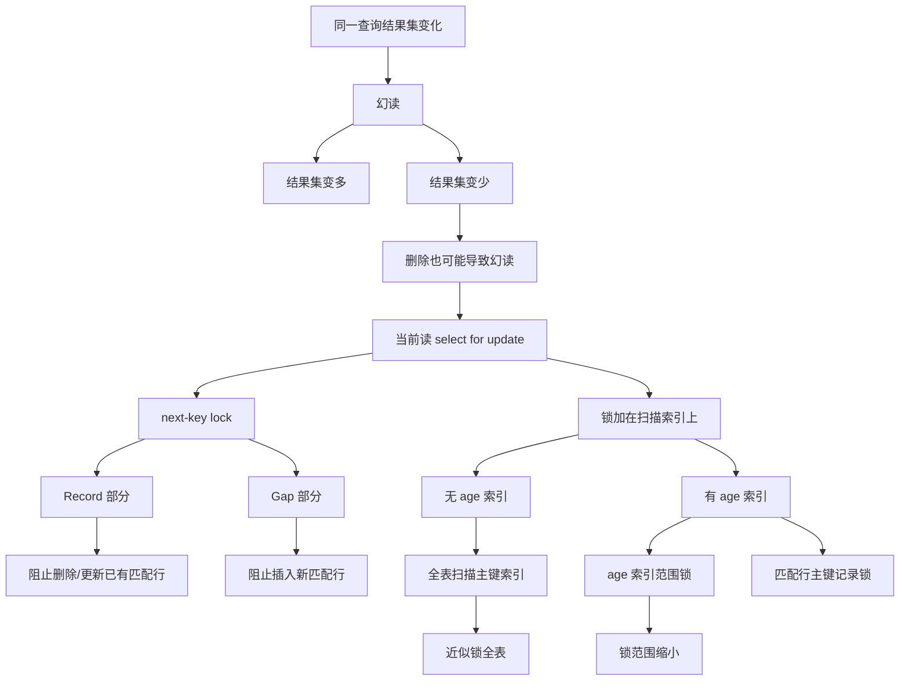

# MySQL 记录锁 + 间隙锁可以防止删除操作而导致的幻读吗？

### 1. Topic Overview

- What this is about: 本章用实验说明，在 InnoDB 可重复读隔离级别下，当前读语句通过记录锁 + 间隙锁，也可以防止删除操作导致的幻读。
- Why it matters: 很多人只把幻读理解成“别人插入新行导致多一行”，但同一查询条件下结果集变少也属于幻读。当前读的锁不仅要阻止插入，也要阻止已有匹配记录被删除或更新出结果集。
- Difficulty level: 中等偏难。难点在于区分“删除导致的幻读”和“插入导致的幻读”，以及理解有无 `age` 索引时，锁范围为什么完全不同。
- Prerequisites: 幻读定义、快照读 vs 当前读、Record Lock / Gap Lock / Next-Key Lock、主键索引和二级索引、全表扫描会放大锁范围、`performance_schema.data_locks` 的基本字段。
- Source: `materials/mysql/lock/lock_phantom.md`.

Source order roadmap:

1. 幻读定义：同一事务内，同一查询在不同时间产生不同结果集；5 行变 6 行是幻读，5 行变 4 行也是幻读。
2. InnoDB RR 下避免幻读的两类机制：快照读靠 MVCC，当前读靠 next-key lock。
3. 实验问题：事务 A 执行 `select ... where age > 20 for update` 后，事务 B 删除 `id = 2` 是否会被阻塞。
4. 无 `age` 索引时：事务 A 全表扫描主键索引，对整张表的主键范围加 next-key lock，删除被阻塞。
5. 用 `performance_schema.data_locks` 看锁：`LOCK_TYPE=RECORD` 代表行级锁，不等于 Record Lock；锁类型要看 `LOCK_MODE`。
6. 有 `age` 索引时：`age` 索引锁住 `(19,+∞]` 范围，主键索引锁住匹配行的记录；不会把整张表锁住。
7. 总结：加锁语句一定要检查是否走索引，全表扫描会把锁范围扩大成近似锁全表。

### 2. Core Concepts

#### Schema 1: 把删除导致的结果集变少也识别为幻读

- Definition: 幻读关注的是同一事务内、同一查询条件返回的行集合是否变化。集合变多或变少都属于结果集变化。
- Intuition: “幻读”不是只指突然多出一行。假设第一次 `age > 20` 返回 6 行，第二次因为别人删除了其中一行只返回 5 行，这也是同一条件下结果集变化。
- Example: 事务 A 第一次执行 `select * from t_user where age > 20;` 返回 6 行。事务 B 删除其中一行并提交。事务 A 第二次执行同一查询返回 5 行。结果集少了一行，也属于幻读。
- Common mistakes:
  - 只把“插入导致多一行”叫幻读。
  - 把删除导致的结果集变少归到普通不可重复读里，而不看查询条件返回的是一组行。
  - 只看单行内容是否变化，忽略集合边界变化。

#### Schema 2: 用 Record 部分防删除，用 Gap 部分防插入

- Definition: 当前读的 next-key lock = Record Lock + Gap Lock。Record Lock 保护已有记录不被更新或删除；Gap Lock 保护两个索引记录之间的位置不被插入新记录。
- Intuition: 如果要让 `age > 20` 的结果集稳定，既要防止别人插入新的 `age > 20`，也要防止别人删除当前已经满足条件的行。
- Example: 事务 A 执行 `select * from t_user where age > 20 for update`，命中 `id=2`。事务 B 执行 `delete from t_user where id = 2` 会等待，因为事务 A 已经锁住了这条匹配记录。
- Common mistakes:
  - 认为 Gap Lock 只能防插入，所以当前读不能防删除。
  - 只说 next-key lock 防插入，漏掉 next-key lock 中的记录锁部分也保护已有记录。
  - 忘记 `select ... for update` 加的是 X 型锁，其他事务对匹配记录的更新和删除会被阻塞。

#### Schema 3: 无条件索引时，全表扫描会把锁铺满主键索引

- Definition: 如果 `where age > 20 for update` 没有可用 `age` 索引，InnoDB 只能全表扫描；锁是在遍历索引时加的，不是只对最终输出结果加锁。
- Intuition: 扫描路径决定锁范围。没有窄索引路径时，当前读要扫过很多主键索引记录，锁也跟着覆盖很多主键记录和间隙。
- Example: 文章中的无 `age` 索引实验里，事务 A 在主键索引上加了从 `(-∞,1]` 到 `(9,+∞]` 的 10 个 X 型 next-key lock，相当于把整个主键索引范围覆盖住。其他事务的增删改都会被阻塞，直到 A 提交。
- Common mistakes:
  - 以为查询条件是 `age > 20`，就只锁年龄大于 20 的行。
  - 说“这是表锁”。更准确是主键索引上的大量 next-key lock 形成了锁全表效果。
  - 忘记锁要到事务提交或回滚才释放。

#### Schema 4: 用 `data_locks` 区分行级锁输出和具体锁模式

- Definition: `performance_schema.data_locks` 可以观察锁；`LOCK_TYPE=RECORD` 表示行级锁，不等于 Record Lock。具体是 next-key lock、记录锁还是间隙锁，要看 `LOCK_MODE`。
- Intuition: 输出字段名字容易误导。`RECORD` 是粒度层级；`X`、`X, REC_NOT_GAP`、`X, GAP` 才是具体锁模式。
- Example:
  - `LOCK_MODE = X`：X 型 next-key lock。
  - `LOCK_MODE = X, REC_NOT_GAP`：X 型 Record Lock。
  - `LOCK_MODE = X, GAP`：X 型 Gap Lock。
  - 对 next-key lock 或 Gap Lock，文章给出经验：`LOCK_DATA` 可看作锁范围右边界，左边界是上一条索引记录。
- Common mistakes:
  - 看到 `LOCK_TYPE=RECORD` 就说这是 Record Lock。
  - 不看 `INDEX_NAME`，不知道锁加在主键索引还是二级索引。
  - 只看锁输出，不先画索引排序和扫描路径。

#### Schema 5: 有 `age` 索引后，锁范围变成二级索引范围 + 主键记录

- Definition: `age` 建索引后，`where age > 20 for update` 可以走 `age` 二级索引。InnoDB 会在 `age` 索引上锁住满足范围的 next-key 区间，同时在主键索引上锁住匹配行的主键记录。
- Intuition: 二级索引用来保护范围和防止新 `age > 20` 插入；主键记录锁用来保护已经命中的真实行不被删改。
- Example: 文章中 `age` 索引的 next-key lock 化简为 `(19,+∞]`；主键索引上对 `id=2,3,5,6,7,8` 加 X 型记录锁。这样仍能阻塞删除匹配行，但不会像无索引时那样锁住整张表。
- Common mistakes:
  - 只描述 `age` 索引范围锁，漏掉匹配行还要在主键索引加记录锁。
  - 以为建了索引就完全不阻塞其他写；实际上满足锁范围的插入、删除、更新仍会被阻塞。
  - 忽略非唯一二级索引中相同 `age` 值会按主键继续排序。

### 3. Deep Understanding

本章的机制链是：

```text
幻读 = 同一查询条件结果集变化
-> 结果集变多或变少都算
-> 当前读 select ... for update 需要保护最新结果集
-> next-key lock = 记录锁 + 间隙锁
-> 记录锁部分阻止已有匹配行被删除/更新
-> 间隙锁部分阻止范围内插入新匹配行
-> 锁加在扫描到的索引上
-> 没有 age 索引: 全表扫描主键索引, 近似锁全表
-> 有 age 索引: 锁 age 范围 + 匹配行主键记录, 锁范围缩小
```

关键边界：

- “可以防止删除导致的幻读”不是靠 Gap Lock 单独完成，而是靠 next-key lock 中的记录锁部分保护已有记录。
- `select ... for update` 是当前读，所以用锁保护结果集；普通 `select` 是快照读，主要靠 MVCC。
- 锁范围不是由最终返回行直接决定，而是由索引扫描路径决定。
- 有索引后锁范围通常变窄，但不是零锁；匹配范围和匹配主键记录仍会被保护。

### 4. Minimal Working Example

表 `t_user` 只有主键索引，事务 A：

```sql
begin;
select * from t_user where age > 20 for update;
```

如果没有 `age` 索引：

1. `select ... for update` 是当前读，会加 X 型锁。
2. `age > 20` 没有可用索引，只能扫描主键索引。
3. 扫描过程中对主键索引大量记录加 next-key lock。
4. 事务 B 删除 `id = 2` 会等待，因为 `id=2` 的记录被锁住。
5. 事务 B 插入新记录也可能等待，因为相应间隙被锁住。
6. 事务 A 提交后锁才释放。

如果建立 `age` 索引：

```sql
create index idx_age on t_user(age);
begin;
select * from t_user where age > 20 for update;
```

推导：

1. 查询可以走 `idx_age`。
2. `age` 索引上锁住 `age > 20` 对应范围，文章化简为 `(19,+∞]`。
3. 命中的真实行还要在主键索引上加记录锁，例如 `id=2,3,5,6,7,8`。
4. 删除这些匹配行会被阻塞。
5. 但不会像无索引全表扫描那样把主键索引所有范围都覆盖住。

### 5. Knowledge Graph



### 6. Self-Test Questions

Recall:

1. 为什么第一次查 6 行、第二次查 5 行也算幻读？
2. `LOCK_TYPE=RECORD` 和 Record Lock 是同一个意思吗？具体锁模式要看哪个字段？
3. next-key lock 中的 Record 部分和 Gap 部分分别防什么？

Application / transfer:

1. 事务 A 执行 `select * from t_user where age > 20 for update` 后，事务 B 删除命中的 `id=2` 为什么会等待？
2. 同一条查询在没有 `age` 索引和有 `age` 索引时，锁范围为什么不同？

Explain-like-I-am-5:

1. 用“守门员守住已有座位和空座位”的比喻解释：为什么记录锁 + 间隙锁既能防别人删掉已有座位，也能防别人塞进新座位？

### 7. Weak Point Detection

Likely failure patterns:

- 只把幻读理解成新增行，不能接受删除导致结果集变少也算幻读。
- 只说 Gap Lock 防插入，漏掉 Record Lock 防删除/更新已有记录。
- 把 `LOCK_TYPE=RECORD` 误读为 Record Lock。
- 看到 `age > 20` 就以为锁只加在输出行上，忘记全表扫描时锁跟扫描路径走。
- 有 `age` 索引后只说锁 `age` 范围，漏掉匹配行的主键记录锁。
