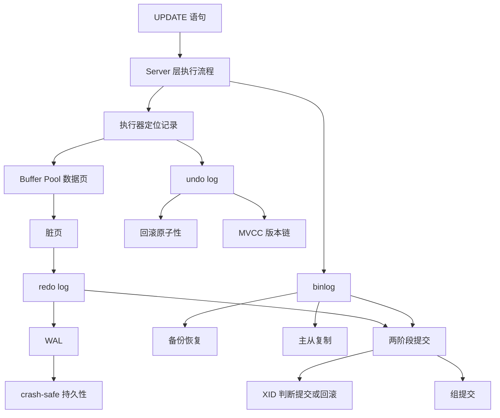

# MySQL 日志：执行一条 UPDATE 语句期间发生了什么？

### 1. Topic Overview

- What this is about: 本章用一条 `UPDATE t_user SET name = 'xiaolin' WHERE id = 1;` 串起 MySQL 更新流程、undo log、Buffer Pool、redo log、binlog、两阶段提交、组提交和磁盘 I/O 参数。
- Why it matters: 面试里问“update 怎么执行”“undo/redo/binlog 区别”“为什么要两阶段提交”“主从不一致怎么避免”，本质都在考你能不能把一次更新从内存修改、事务恢复、备份复制到提交一致性讲成一条链。
- Difficulty level: 中等偏难。难点不是背三个日志，而是把每种日志的职责、所属层次、刷盘时机、崩溃恢复结果和一致性边界区分开。
- Prerequisites: MySQL Server 层与 InnoDB 层、事务 ACID、Buffer Pool 页缓存、脏页、MVCC、Read View、`trx_id`、`roll_pointer`、主从复制的基本概念、操作系统 Page Cache。
- Source: `materials/mysql/log/how_update.md`.

Source order roadmap:

1. `UPDATE` 先走查询语句相似的 Server 层流程：连接器、解析器、预处理器、优化器、执行器。
2. 更新比查询多出三类日志：undo log、redo log、binlog。
3. undo log 负责回滚和 MVCC 版本链。
4. Buffer Pool 负责把磁盘页缓存在内存中，更新先改缓存页并形成脏页。
5. redo log 配合 WAL 让脏页可以延迟落盘，同时保证已提交事务 crash-safe。
6. binlog 属于 Server 层，用于备份恢复和主从复制。
7. 一条 update 的完整执行链把 undo、redo、binlog 串起来。
8. redo log 和 binlog 通过两阶段提交保持一致。
9. 两阶段提交带来刷盘和锁竞争成本，组提交用批量刷盘降低成本。
10. 磁盘 I/O 高时，可以通过组提交参数、`sync_binlog`、`innodb_flush_log_at_trx_commit` 做性能与数据安全权衡。

### 2. Core Concepts

#### Schema 1: 用三类日志分清 UPDATE 的三种安全目标

- Definition: `undo log` 负责把未提交修改撤回，`redo log` 负责让已提交修改在崩溃后恢复，`binlog` 负责记录逻辑变更用于备份恢复和主从复制。
- Intuition: 一次 update 有三种不同的“怕”：怕事务中途失败回不去，怕提交后宕机丢了，怕备份/从库不知道发生过什么。三种日志分别解决三种怕。
- Example: 把 `name` 从 `jay` 更新成 `xiaolin`。undo log 记录旧值 `jay` 用于回滚；redo log 记录数据页被改成新状态用于崩溃恢复；binlog 记录这次表数据变更用于从库重放或时间点恢复。
- Common mistakes:
  - 把 undo log 和 redo log 都说成“恢复日志”，但说不出一个回到旧值、一个重做到新值。
  - 把 binlog 当成 InnoDB 特有日志。
  - 认为有 binlog 就不需要 redo log，忽略 binlog 不负责 InnoDB crash-safe。

#### Schema 2: undo log 是回滚链，也是 MVCC 版本链

- Definition: InnoDB 在更新前先把回滚所需信息写入 undo log。更新、删除、插入各自记录不同的反向操作信息；记录版本里的 `trx_id` 和 `roll_pointer` 可以把 undo log 串成版本链。
- Intuition: update 不是直接把旧数据扔掉，而是先把“怎么回去”存起来。这个“回去的路径”不只给 rollback 用，也给快照读寻找旧版本用。
- Example:
  - insert 一行时，undo log 记主键值，回滚时删除这行。
  - delete 一行时，undo log 记完整旧记录，回滚时插回去。
  - update 一列时，undo log 记被更新列的旧值，回滚时改回旧值。
- Common mistakes:
  - 只说 undo log 用于回滚，漏掉它也是 MVCC 的旧版本来源。
  - 把 `trx_id` 和 `roll_pointer` 背成隐藏字段名，却说不出 `trx_id` 表示谁改的，`roll_pointer` 指向旧版本。
  - 认为快照读复制整张表，而不是沿版本链找可见版本。

#### Schema 3: Buffer Pool 让数据页先在内存里变脏

- Definition: InnoDB 以页为磁盘和内存交互单位，默认 16KB。读取时把页加载到 Buffer Pool；更新时先修改 Buffer Pool 中的页，并把页标记为脏页，之后再由后台线程刷回磁盘。
- Intuition: 数据库不想每改一行就随机写磁盘。它先在内存页里改，攒到合适时机再刷盘，但这会带来断电后脏页丢失的风险。
- Example: 查询 `id = 1` 时，即使只要一条记录，InnoDB 也会加载整页到 Buffer Pool，然后通过页目录定位记录。更新记录后，所在页内存版本和磁盘版本不一致，这个页就是脏页。
- Common mistakes:
  - 认为数据库只把目标行读进内存，而不是读整个页。
  - 只看到 Buffer Pool 提升性能，漏掉它让 redo log 成为必要。
  - 把 Server 层查询缓存和 InnoDB Buffer Pool 混在一起。

#### Schema 4: redo log + WAL 把随机写改成先顺序写日志

- Definition: redo log 是 InnoDB 物理日志，记录某个数据页的某个位置做了什么修改。WAL 表示先写 redo log，再在合适时机把脏页刷回磁盘。
- Intuition: 真正的数据页落盘可能很慢、很随机；redo log 可以追加顺序写。只要提交时 redo log 安全落盘，崩溃后就能把脏页修改重做回来。
- Example: 事务提交时可以先保证 redo log 持久化，不必等待 Buffer Pool 脏页马上刷回磁盘。MySQL 重启后用 redo log 恢复已提交修改。
- Common mistakes:
  - 说 redo log 记录 SQL 语句。它是物理日志，不是 SQL 逻辑日志。
  - 认为 update 完成就必须把数据页同步写回磁盘。
  - 忘记 undo 页面本身被修改后，也需要对应 redo log 保护。

#### Schema 5: redo log 刷盘参数是在安全和性能之间选位置

- Definition: redo log 先进入 redo log buffer，再按时机刷新。`innodb_flush_log_at_trx_commit` 控制提交时 redo log 从 buffer 到文件、再到磁盘的策略，常见值是 0、1、2。
- Intuition: 1 最安全但每次提交都刷盘；0 最快但 MySQL 进程崩溃也可能丢约 1 秒事务；2 折中，把日志写到操作系统 Page Cache，MySQL 进程崩溃不易丢，但操作系统宕机或断电可能丢。
- Example:
  - `1`: 提交时 redo log 直接持久化到磁盘，异常重启后数据不丢。
  - `0`: 提交时留在 redo log buffer，由后台线程约每秒写盘。
  - `2`: 提交时 write 到 redo log 文件，即进入 Page Cache，fsync 由后台约每秒做。
- Common mistakes:
  - 把 write 到文件等同于 fsync 到磁盘。
  - 只背 0/1/2 数字，不说崩溃类型：MySQL 进程崩溃、OS 崩溃、断电的区别。
  - 只说性能，不说丢失窗口。

#### Schema 6: binlog 是 Server 层的全量变更历史

- Definition: binlog 记录数据库表结构变更和表数据修改，不记录普通查询。它是 Server 层日志，所有存储引擎都可使用，主要用于备份恢复和主从复制。
- Intuition: redo log 像 InnoDB 的局部重做材料，循环写，只保留还没落盘的脏页相关日志；binlog 像数据库变更历史账本，追加写，可以拿来重放。
- Example: 如果整个数据库被误删，redo log 不能恢复完整历史，因为旧 redo 会被覆盖；应使用 binlog 做恢复。主从复制也通过主库写 binlog、从库接收 relay log、再回放来实现。
- Common mistakes:
  - 认为 redo log 可以用来恢复任意历史数据。
  - 不区分 binlog 的 STATEMENT、ROW、MIXED：STATEMENT 记录 SQL，ROW 记录行最终变化，MIXED 自动选择。
  - 以为从库越多越好，忽略主库 log dump 线程和网络带宽成本。

#### Schema 7: sync_binlog 控制 binlog 的 write 和 fsync

- Definition: 事务执行时先写入每个线程自己的 binlog cache，提交时把完整事务写入 binlog 文件。`sync_binlog` 控制多久 fsync 到磁盘。
- Intuition: binlog 写文件不等于落到磁盘。write 只是进入文件系统 Page Cache，fsync 才是真正持久化。
- Example:
  - `sync_binlog = 0`: 每次提交只 write，不主动 fsync，操作系统决定何时落盘。
  - `sync_binlog = 1`: 每次提交 write 后马上 fsync，最安全但 I/O 高。
  - `sync_binlog = N`: 每次提交 write，累计 N 个事务后 fsync。
- Common mistakes:
  - 把 binlog cache 和 redo log buffer 混为一谈。
  - 认为 `sync_binlog=1` 没有性能代价。
  - 只调大 `sync_binlog`，不说明主机掉电时可能丢 N 个事务的 binlog。

#### Schema 8: 两阶段提交用 binlog 对齐 redo log

- Definition: 开启 binlog 时，MySQL 用内部 XA 保证 redo log 和 binlog 一致。提交拆为 redo prepare、写并刷 binlog、redo commit。恢复时遇到 prepare 状态 redo log，会用 XID 去 binlog 查找，binlog 有则提交，没有则回滚。
- Intuition: redo log 决定主库崩溃后数据怎么恢复，binlog 决定从库和备份怎么重放。如果两者半成功，主库和从库可能一新一旧。两阶段提交就是让二者要么都算成功，要么都算失败。
- Example:
  - redo 已刷、binlog 未写时崩溃：恢复后 binlog 找不到 XID，回滚。
  - redo prepare 已刷、binlog 已写，但 redo commit 标记未写时崩溃：恢复后 binlog 找到 XID，提交。
- Common mistakes:
  - 说两阶段提交是为了 undo log 和 redo log 一致。
  - 忘记处于 prepare 的 redo log 既可能提交也可能回滚，关键看 binlog 里有没有同一 XID。
  - 忽略 binlog 写成功被当作事务提交成功的重要标志。

#### Schema 9: 组提交把很多事务的刷盘合成一批

- Definition: 两阶段提交在“双 1”配置下刷盘成本高。组提交把多个事务组织成队列，在 flush、sync、commit 阶段分批处理，减少 fsync 次数，并降低长时间大锁竞争。
- Intuition: 10 个事务各刷一次盘，成本接近 10 次；如果排成一组刷一次盘，成本接近 1 次。代价是有时会故意等一小段时间来凑批。
- Example: 组提交中，flush 阶段可支撑 redo log 组提交，sync 阶段支撑 binlog 组提交，commit 阶段调用引擎提交事务接口。`binlog_group_commit_sync_delay` 和 `binlog_group_commit_sync_no_delay_count` 控制等待时间和凑批数量。
- Common mistakes:
  - 以为组提交改变事务语义。它优化刷盘和队列，不改变提交一致性目标。
  - 只说 binlog 组提交，漏掉 MySQL 5.7 对 redo log 组提交的优化。
  - 忽略故意等待可能增加单条语句响应时间。

### 3. Deep Understanding

本章的主因果链：

```text
UPDATE 要修改一行
-> 执行器先通过执行计划定位记录
-> InnoDB 需要事务保护
-> 更新前写 undo log，保留旧值和版本链
-> 数据页在 Buffer Pool 中被修改，成为脏页
-> redo log 记录页级修改，允许脏页延迟落盘并保证 crash-safe
-> Server 层写 binlog，保留可备份、可复制的变更历史
-> 提交时 redo log 和 binlog 必须一致
-> 两阶段提交用 redo prepare + binlog + redo commit 对齐两份日志
-> 高并发提交会产生刷盘成本
-> 组提交和刷盘参数在安全性、性能、响应时间之间做权衡
```

关键边界：

- undo log vs redo log: undo 记录旧值或反向操作，服务回滚和 MVCC；redo 记录新状态的物理页修改，服务崩溃恢复。
- redo log vs binlog: redo 属于 InnoDB，循环写，物理日志，服务 crash-safe；binlog 属于 Server 层，追加写，常用于备份恢复和主从复制。
- Buffer Pool vs redo log: Buffer Pool 让更新先在内存完成，redo log 让这些内存修改即使未刷脏页也不丢。
- write vs fsync: write 到文件通常只是进入 OS Page Cache，fsync 才是持久化到磁盘。
- crash-safe vs 历史恢复: redo log 保证已提交事务崩溃后不丢；误删库这种历史恢复要靠 binlog。
- 两阶段提交的恢复判断: prepare 状态 redo log 不是自动提交，也不是自动回滚，而是看 binlog 中是否有同一 XID。

### 4. Minimal Working Example

SQL:

```sql
UPDATE t_user SET name = 'xiaolin' WHERE id = 1;
```

执行流：

1. Server 层处理 SQL：连接器校验身份，解析器识别 `UPDATE`、表名和字段，预处理器检查表字段，优化器发现 `id` 是主键索引，执行器开始执行。
2. 执行器调用 InnoDB，通过主键索引树找 `id = 1` 的聚簇索引记录。
3. 如果该页不在 Buffer Pool，先把磁盘页加载到 Buffer Pool；如果已经在，直接使用缓存页。
4. 执行器比较更新前后记录。如果值没有变化，后续真实更新可以跳过；如果变化，把旧记录和新记录传给 InnoDB。
5. InnoDB 开启事务。更新前先写 undo log，把 `name` 的旧值记下来。undo log 写在 Buffer Pool 的 Undo 页面里，而 Undo 页面被改动也需要 redo log 保护。
6. InnoDB 修改 Buffer Pool 中的数据页，把页标记为脏页，并生成 redo log 写入 redo log buffer。
7. 更新记录本身算完成，但数据页不会立刻刷回磁盘。后续后台线程在合适时机刷脏页。
8. Server 层记录本语句对应的 binlog，先放进 binlog cache。
9. 事务提交时进入两阶段提交：
   - prepare 阶段：redo log 写入 XID，并把事务状态设为 prepare，然后刷盘。
   - commit 阶段：binlog 写入 XID 并刷盘，然后调用引擎提交接口，把 redo log 状态设为 commit。
10. 如果崩溃发生在 redo prepare 后、binlog 前，恢复时 binlog 找不到 XID，事务回滚。
11. 如果崩溃发生在 binlog 后、redo commit 前，恢复时 binlog 找到 XID，事务提交。

### 5. Knowledge Graph



### 6. Self-Test Questions

Recall:

1. undo log、redo log、binlog 分别属于哪一层，主要解决什么问题？
2. 为什么 Buffer Pool 中的脏页可以不立刻刷回磁盘？
3. `innodb_flush_log_at_trx_commit = 0/1/2` 的安全性和性能差异是什么？

Application / transfer:

1. 如果 redo log 已经 prepare 并刷盘，但 binlog 还没写入时宕机，MySQL 重启后应该提交还是回滚？为什么？
2. 如果业务抱怨 MySQL 写入磁盘 I/O 很高，你可以调哪些日志相关参数？每个参数牺牲的风险是什么？

Explain-like-I-am-5:

1. 用“草稿纸、保险箱、流水账”的比喻解释 undo log、redo log、binlog 的区别。

### 7. Weak Point Detection

Likely failure patterns:

- 把三种日志都说成“用于恢复”，但不能说清回滚、崩溃恢复、备份/复制三个目标。
- 把 redo log 说成记录 SQL，而不是物理页修改。
- 把 binlog 当成 InnoDB 层日志，或认为 binlog 自己就能保证 crash-safe。
- 把 write 到文件误认为已经 fsync 到磁盘。
- 不理解 `innodb_flush_log_at_trx_commit = 2` 为什么 MySQL 进程崩溃和操作系统宕机风险不同。
- 解释两阶段提交时只背 prepare/commit，不会判断两个崩溃点：binlog 没有 XID 则回滚，有 XID 则提交。
- 只说组提交提升性能，漏掉它通过队列和批量 fsync 降低 I/O 与锁竞争，但可能增加等待时间。
