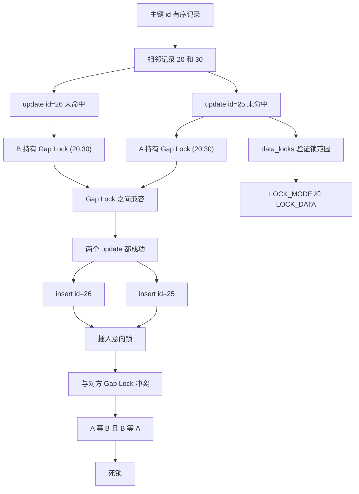

# 字节面试：加了什么锁，导致死锁的？

### 1. Topic Overview

- What this is about: 本章用一个字节面试题，分析两个事务分别执行 `update ... where id=25/26` 后再 `insert id=25/26`，为什么会因为 Gap Lock 和插入意向锁形成死锁。
- Why it matters: 这类题不是问“会不会死锁”这么简单，而是要求能从 `performance_schema.data_locks` 读出锁类型、锁范围、等待状态，并画出谁持有锁、谁在等待谁。
- Difficulty level: 中等偏难。难点是：`update` 没匹配到行也会加锁；两个事务持有同一个 Gap Lock 不冲突；真正互斥发生在后续 `insert` 的插入意向锁与对方 Gap Lock。
- Prerequisites: 主键索引有序范围、当前读/写操作加锁、Gap Lock、插入意向锁、`performance_schema.data_locks` 的 `LOCK_TYPE`/`LOCK_MODE`/`LOCK_DATA`/`LOCK_STATUS`。
- Source: `materials/mysql/lock/show_lock.md`.

Source order roadmap:

1. 准备表 `t_student`，只有 `id` 是主键索引，其余字段普通字段。
2. 实验环境：MySQL 8.0.26，可重复读 RR。
3. Time 1：事务 A 执行 `update ... where id = 25`，未命中，但在主键索引上加 `(20,30)` Gap Lock。
4. Time 2：事务 B 执行 `update ... where id = 26`，也未命中，也加 `(20,30)` Gap Lock。
5. 两个 Gap Lock 范围相同但不冲突，因为 Gap Lock 只负责阻止插入，可以共存。
6. Time 3：事务 A 插入 `id=25`，需要插入意向锁；插入点在事务 B 的 `(20,30)` Gap Lock 内，因此等待。
7. Time 4：事务 B 插入 `id=26`，需要插入意向锁；插入点在事务 A 的 `(20,30)` Gap Lock 内，因此等待。
8. A 等 B、B 等 A，形成循环等待，满足死锁条件。

### 2. Core Concepts

#### Schema 1: 用 `data_locks` 逆推未命中主键 `update` 的 Gap Lock 范围

- Definition: 在 RR 下，`update t_student set score=100 where id=25` 是当前读/写操作。即使 `id=25` 不存在，InnoDB 也要防止别的事务插入 `id=25` 造成当前写操作语义被破坏，所以会在主键索引相邻记录之间加 Gap Lock。
- Intuition: 不存在的记录不能被 Record Lock 锁住，只能锁住它应该插入的位置。`25` 位于已有主键 `20` 和 `30` 之间，所以锁的是 `(20,30)`。
- Example: `data_locks` 里 `LOCK_TYPE=RECORD` 只表示行级锁，不等于 Record Lock；`LOCK_MODE=X, GAP` 才表示 X 型 Gap Lock。若 `LOCK_DATA=30`，则 30 是右边界；左边界是主键索引里 30 的上一条记录 20，因此范围是 `(20,30)`。
- Common mistakes:
  - 认为 `Rows matched: 0` 就不会加锁。
  - 把 `LOCK_TYPE=RECORD` 误读成 Record Lock。
  - 只看 `LOCK_DATA=30`，忘记结合上一条索引记录推左边界。

#### Schema 2: 区分 Gap Lock 兼容和插入意向锁冲突

- Definition: Gap Lock 与 Gap Lock 之间兼容，因为它们的作用只是禁止别人在区间内插入；但 `insert` 进入这个区间时要获取插入意向锁，插入意向锁与已有 Gap Lock 冲突。
- Intuition: 两个事务可以同时声明“(20,30) 这个区间不能插入”；但如果其中一个事务真正要把 `25` 插进去，就和另一个事务的禁止插入声明冲突。
- Example: 事务 A 和 B 都持有 `(20,30)` Gap Lock，不互相阻塞。A 插入 `25` 时，被 B 的 Gap Lock 阻塞；B 插入 `26` 时，被 A 的 Gap Lock 阻塞。
- Common mistakes:
  - 认为两个 X 型 Gap Lock 一定互斥。
  - 认为插入意向锁是表级意向锁；它其实是特殊的行级间隙锁。
  - 认为 `LOCK_STATUS=WAITING` 表示锁已经成功获取；实际上只是生成了等待锁结构。

#### Schema 3: 用等待图解释本题死锁

- Definition: 死锁来自循环等待。本题中 A 持有 `(20,30)` Gap Lock，等待 B 释放同范围 Gap Lock；B 也持有 `(20,30)` Gap Lock，等待 A 释放同范围 Gap Lock。
- Intuition: 查询/更新阶段，两边都把同一段区间封住；插入阶段，两边又都想往对方封住的区间插入，互相等对方先撤锁。
- Example:
  - A: `update id=25` -> 持有 Gap Lock `(20,30)`。
  - B: `update id=26` -> 持有 Gap Lock `(20,30)`。
  - A: `insert id=25` -> 等 B 的 Gap Lock。
  - B: `insert id=26` -> 等 A 的 Gap Lock。
- Common mistakes:
  - 只说“插入被 Gap Lock 阻塞”，没有画出 A 等 B、B 等 A。
  - 忽略两个 update 未命中时已经各自持有锁。
  - 忘记死锁需要循环等待，不是单个等待就叫死锁。

#### Schema 4: 用 `data_locks` 字段定位锁证据

- Definition: `performance_schema.data_locks` 可用于验证当前事务持有哪些锁、等待什么锁。读它时至少分四步：看 `LOCK_TYPE` 定层级，看 `LOCK_MODE` 定具体锁种，看 `LOCK_DATA` 定边界，看 `LOCK_STATUS` 定是否等待。
- Intuition: 先推导，再验证。不要用一个字段直接下结论。
- Example:
  - `LOCK_TYPE=TABLE` 且 `LOCK_MODE=IX`：表级意向排他锁。
  - `LOCK_TYPE=RECORD` 且 `LOCK_MODE=X, GAP`：行级 X 型 Gap Lock。
  - `LOCK_MODE=INSERT_INTENTION` 且 `LOCK_STATUS=WAITING`：插入意向锁正在等待。
  - `LOCK_DATA=30`：结合索引上一条记录推出右边界为 30 的区间。
- Common mistakes:
  - 把 `LOCK_TYPE=RECORD` 当成具体 Record Lock。
  - 只看 `LOCK_MODE` 不看 `LOCK_STATUS`，分不清持有和等待。
  - 不知道 `LOCK_DATA` 对 Gap/Next-Key 场景常用于判断右边界。

### 3. Deep Understanding

本章机制链：

```text
主键 id 有序记录中存在 20 和 30
-> A update id=25 未命中
-> 为防插入 id=25，加 PRIMARY 上 (20,30) Gap Lock
-> B update id=26 未命中
-> 同样加 PRIMARY 上 (20,30) Gap Lock
-> Gap Lock 之间兼容，所以 update 阶段都成功
-> A insert id=25，需要插入意向锁，落在 B 的 Gap Lock 内
-> B insert id=26，需要插入意向锁，落在 A 的 Gap Lock 内
-> A 等 B，B 等 A
-> 循环等待，死锁
```

这里和 `deadlock.md` 的共同结构是：

- 先有两个事务各自持有兼容的 Gap Lock。
- 再有两个事务各自想插入到对方保护的间隙里。
- 插入意向锁与 Gap Lock 冲突。
- 形成循环等待。

区别是：

- `deadlock.md` 是 `select ... for update` 查不存在订单号后再插入。
- `show_lock.md` 是 `update` 未命中主键后再插入。
- 本章强调通过 `data_locks` 分阶段观察锁：Time 1/2 看持有的 Gap Lock，Time 3/4 看等待的插入意向锁。

### 4. Minimal Working Example

已有主键记录中，相邻记录为：

```text
id: 20, 30
```

事务 A：

```sql
begin;
update t_student set score = 100 where id = 25;
insert into t_student(id, no, name, age, score)
values (25, 'S0025', 'sony', 28, 90);
```

事务 B：

```sql
begin;
update t_student set score = 100 where id = 26;
insert into t_student(id, no, name, age, score)
values (26, 'S0026', 'ace', 28, 90);
```

推导流程：

1. A 的 `update id=25` 未命中，但 `25` 位于 `(20,30)`，所以 A 在主键索引上持有 `(20,30)` Gap Lock。
2. B 的 `update id=26` 未命中，也位于 `(20,30)`，所以 B 也持有 `(20,30)` Gap Lock。
3. 两个 Gap Lock 兼容，所以前两个 `update` 都能执行完。
4. A 插入 `25`，插入点在 B 的 Gap Lock 中，A 生成等待状态的插入意向锁。
5. B 插入 `26`，插入点在 A 的 Gap Lock 中，B 生成等待状态的插入意向锁。
6. A 等 B，B 等 A，形成死锁。

### 5. Knowledge Graph



### 6. Self-Test Questions

Recall:

1. `LOCK_TYPE=RECORD` 为什么不等于 Record Lock？
2. `LOCK_MODE=X, GAP` 表示什么锁？
3. 插入意向锁为什么不是表级意向锁？

Application or transfer:

1. 已有主键 `20` 和 `30`，`update ... where id=25` 未命中，为什么仍然会锁 `(20,30)`？
2. 两个事务都持有 `(20,30)` Gap Lock，为什么此时不冲突，但后续分别插入 `25` 和 `26` 会死锁？

Explain like I am 5:

1. 用“两个管理员都贴了禁止进入某段走廊的牌子，但又都想往走廊里放东西”的比喻解释这次死锁。

### 7. Weak Point Detection

- 如果认为 `Rows matched: 0` 就不会加锁，说明没有建立“不存在值用间隙锁保护插入位置”的 schema。
- 如果把 `LOCK_TYPE=RECORD` 当成 Record Lock，说明 `data_locks` 字段边界不稳。
- 如果认为两个 Gap Lock 会互相阻塞，说明没有理解 Gap Lock 的 purely inhibitive 性质。
- 如果把插入意向锁当成表级意向锁，说明锁层级边界不稳。
- 如果只说“insert 被阻塞”但画不出 A 等 B、B 等 A，说明还没形成死锁等待图。
