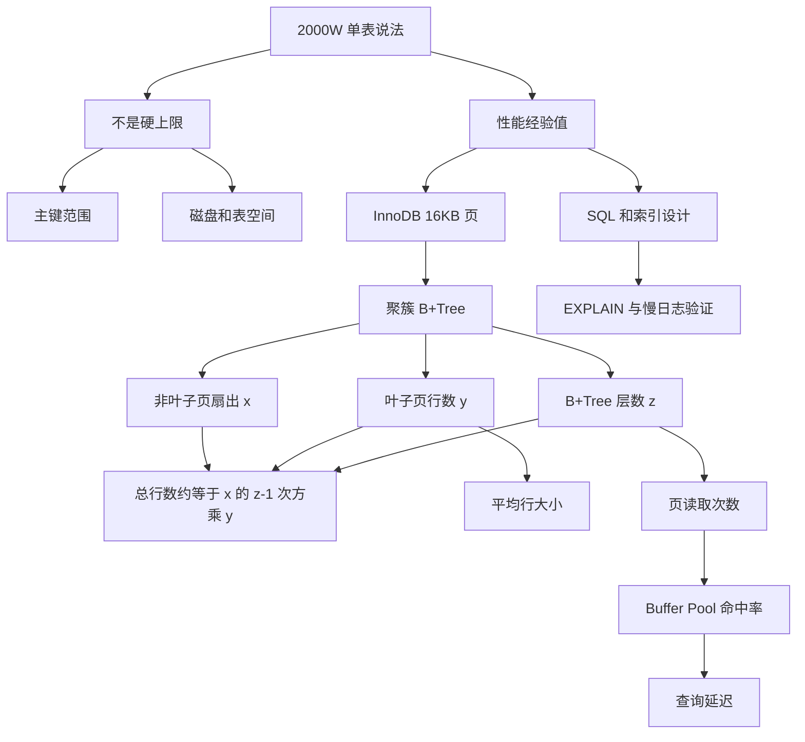

# MySQL 单表不要超过 2000W 行，靠谱吗？

### 1. 主题概览

- 本章讨论的问题：后端面试和工程实践里常说的“ MySQL 单表不要超过 2000W 行”到底是不是硬规则。
- 本章结论：**2000W 不是 MySQL 单表最大行数，而是一个基于 InnoDB 页、B+Tree 层高、行大小和缓存条件推出来的经验建议值。**
- 为什么重要：如果把 2000W 当铁律，就容易过早分库分表；如果完全忽略它，又可能错过 B+Tree 层高、索引缓存和查询性能的风险信号。
- 难点：不是公式本身，而是分清三个边界：
  - 单表最多能存多少行；
  - 单表查起来是否仍然快；
  - 什么时候应该优化 SQL、索引、硬件，什么时候才考虑拆表。
- 前置概念：InnoDB 表空间、16KB 页、B+Tree、叶子节点/非叶子节点、Buffer Pool、行记录大小。

### 2. 核心概念

#### 图式 1：区分“硬上限”和“性能建议值”

- 定义：硬上限来自主键类型、磁盘容量、表空间限制等物理或类型约束；“2000W 行”主要是性能经验值，不是 MySQL 写死的单表最大行数。
- 直觉：**能不能存**和**查起来快不快**是两件事。
- 例子：
  - 如果自增主键是 `INT`，理论值远超过 2000W。
  - 如果自增主键是 `BIGINT UNSIGNED`，主键范围更大，通常还没到主键上限，磁盘、索引、查询性能就先成为问题。
  - 反过来，一个 500W 行的表，如果没有合适索引、SQL 经常全表扫描，也可能很慢。
- 常见错误：
  - 说“超过 2000W MySQL 就存不下了”。
  - 一看到 2000W 就直接说必须分库分表。
  - 只看行数，不看行大小、索引、SQL、缓存和硬件。

#### 图式 2：用 B+Tree 页层高估算单表容量

- 定义：InnoDB 聚簇索引是一棵 B+Tree。非叶子节点主要存“主键值 + 页号”这类目录项，叶子节点存真实行数据。用简化模型估算：

```text
总行数 ≈ x^(z-1) * y
```

- 三个变量：
  - `x`：一个非叶子页能指向多少个下一层页，也就是扇出。
  - `y`：一个叶子数据页能放多少行真实记录。
  - `z`：B+Tree 的层数。
- 直觉：上层页像目录，目录项越多，能覆盖的下层页越多；叶子页每页能放的行越多，同样层数能容纳的总行数越多。
- 源文估算：
  - InnoDB 页大小通常是 16KB。
  - 扣掉页头、页尾、页目录等元信息，粗略按 15KB 可用空间估算。
  - 非叶子页里一条目录项约等于 `BIGINT 主键 8B + 页号 4B = 12B`。
  - 所以 `x ≈ 15 * 1024 / 12 ≈ 1280`。
- 常见错误：
  - 只背“2000W”这个数，不会解释这个数怎么来的。
  - 只说 B+Tree 是三层，不解释 `x`、`y`、`z`。
  - 把这个估算公式当成精确的 InnoDB 容量公式。

#### 图式 3：行越大，2000W 建议值越不可靠

- 定义：`y` 表示一个叶子页能放多少行。每行越大，`y` 越小；在同样 B+Tree 层数下，整棵树能容纳的行数就越少。
- 直觉：16KB 的页像固定大小的箱子。每条记录越大，一个箱子能装的记录越少。
- 源文例子：

```text
如果每行约 1KB：
y ≈ 15 * 1024 / 1000 ≈ 15
三层 B+Tree：1280^2 * 15 ≈ 2457W

如果每行约 5KB：
y ≈ 15 * 1024 / 5000 ≈ 3
三层 B+Tree：1280^2 * 3 ≈ 491W
```

- 关键结论：同样希望保持三层左右的 B+Tree，如果行记录变大，推荐行数阈值会明显下降。所以“2000W”不是所有表都通用。
- 常见错误：
  - 认为所有表都可以套同一个 2000W。
  - 只看记录条数，不看单行宽度。
  - 忘记叶子节点才是真正存行数据的地方。

#### 图式 4：页读取次数和 Buffer Pool 决定实际体感性能

- 定义：B+Tree 层数影响一次索引查找可能要访问多少个页；Buffer Pool 决定这些页有多少能直接从内存命中，而不是从磁盘读。
- 直觉：三层 B+Tree 不等于一定慢；如果根页、非叶子页、热点叶子页都在内存，查询可能仍然很快。真正危险的是查询要访问大量页，而且这些页不在 Buffer Pool 里。
- 例子：
  - 3000W 行表，如果主键点查、索引选择性好、热点数据在内存，可能表现稳定。
  - 500W 行表，如果查询条件没有索引，经常扫描大量页，也可能非常慢。
- 常见错误：
  - 把“表大”直接等同于“所有查询都慢”。
  - 忽略 SQL 是否走索引、索引是否能放进内存、查询是否扫描大量范围。

#### 图式 5：把 2000W 当风险信号，而不是迁移命令

- 定义：2000W 应该触发排查，而不是自动触发分库分表。真正的判断依据是查询路径、索引结构、行大小、缓存命中率、写入压力和业务增长趋势。
- 使用方式：
  - 先看慢 SQL 和 `EXPLAIN`，确认是否全表扫描、范围过大、回表过多或排序代价高。
  - 再看索引设计，确认是否能减少扫描行数、回表次数和 filesort。
  - 再看表结构，确认单行是否过宽、字段是否可以拆分。
  - 再看 Buffer Pool 和硬件，确认热点索引/数据页是否能被缓存。
  - 最后才评估拆表、分区、分库分表等结构性方案。
- 常见错误：
  - 不测量瓶颈，直接拆表。
  - 只加机器，不检查 SQL 是否本身低效。
  - 只看行数，不看工作集大小。

### 3. 深度理解

本章真正的因果链是：

```text
行数增长
-> 叶子数据页数量增长
-> B+Tree 可能需要更多层级
-> 一次索引查找可能访问更多页
-> 如果页不在 Buffer Pool 中，就会产生更多磁盘 I/O
-> 查询延迟可能明显上升
```

因此，“2000W 靠谱吗”的标准回答不是简单的是或否，而是：

> 2000W 不是硬限制，而是一个经验阈值。它大致来自 InnoDB 16KB 页、B+Tree 三层结构、非叶子页高扇出、叶子页每页能放一定数量行记录这些假设。具体是否靠谱，要看单行大小、索引结构、SQL 写法、Buffer Pool、硬件配置和业务读写模式。

这个章节最该掌握的边界是：

- 主键范围决定“理论上能编号多少行”。
- 页和 B+Tree 层高影响“索引定位要读多少页”。
- 行大小影响“叶子页能放多少行”。
- Buffer Pool 影响“读页时走内存还是磁盘”。
- SQL 和索引设计影响“到底要读多少页”。

### 4. 最小工作例子

假设：

```text
InnoDB 页大小 = 16KB
扣除页头、页尾、页目录后，可用空间粗略按 15KB 算
非叶子页一条目录项 ≈ BIGINT 主键 8B + 页号 4B = 12B
x ≈ 15 * 1024 / 12 ≈ 1280
z = B+Tree 层数
```

场景一：每行约 1KB。

```text
y ≈ 15 * 1024 / 1000 ≈ 15
总行数 ≈ 1280^2 * 15 = 24,576,000
```

这就接近 2000W，所以源文说 2000W 这个经验值不是凭空来的。

场景二：每行约 5KB。

```text
y ≈ 15 * 1024 / 5000 ≈ 3
总行数 ≈ 1280^2 * 3 = 4,915,200
```

这时在相同三层 B+Tree 假设下，阈值就接近 500W，而不是 2000W。下降的原因不是 `x` 变了，也不是 `z` 变了，而是叶子页能放的真实行数 `y` 变小了。

### 5. 知识图谱



### 6. 自测问题

- 回忆：2000W 是 MySQL 单表硬上限，还是性能经验值？
- 回忆：公式 `总行数 ≈ x^(z-1) * y` 中，`x`、`y`、`z` 分别表示什么？
- 回忆：为什么 InnoDB 的 16KB 页会影响单表容量估算？
- 应用：如果每行从 1KB 变成 5KB，公式里的哪个变量最直接变化？为什么？
- 应用：一个 2500W 行的表，主键点查很快，但无索引范围查询很慢。应该把问题直接归因于“超过 2000W”吗？为什么？
- 通俗解释：用“箱子装物品”的比喻解释为什么行越大，同样三层 B+Tree 能容纳的行数越少。

### 7. 薄弱点检测

- 失败表现：只会背“单表不要超过 2000W”。
  - 可能问题：表层记忆，没有形成 B+Tree 页层高图式。
- 失败表现：只谈 `INT` / `BIGINT` 主键范围。
  - 可能问题：混淆了“硬容量上限”和“性能经验阈值”。
- 失败表现：只说 B+Tree 是 `O(log n)`。
  - 可能问题：缺少页 I/O、扇出、层高视角。
- 失败表现：解释不出为什么 5KB 行会让阈值从 2000W 降到 500W 左右。
  - 可能问题：没有理解 `y = 叶子页能放多少行`。
- 失败表现：看到 2000W 就直接说分库分表。
  - 可能问题：缺少先测量 SQL、索引、缓存和工作集的诊断流程。
