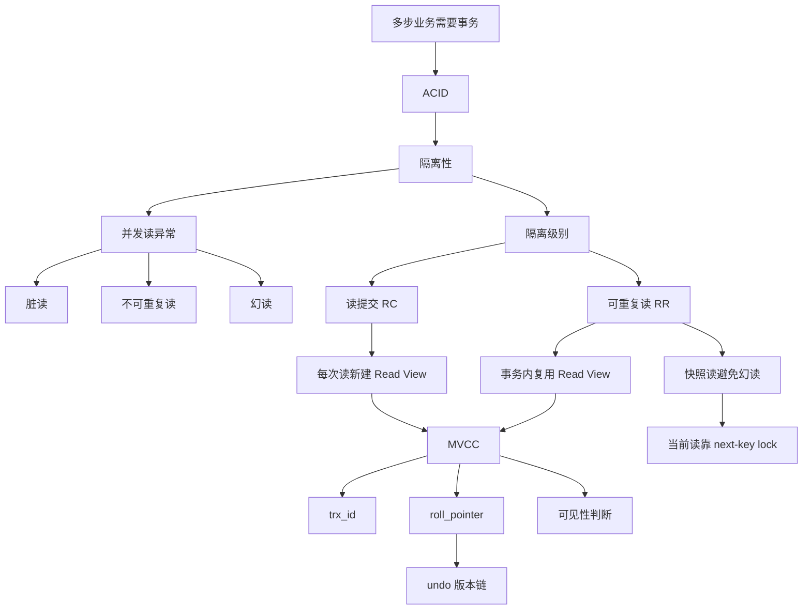

# MySQL Transaction Notes: 事务隔离级别和 MVCC

### 1. Topic Overview

- What this is about: 本章解释 MySQL/InnoDB 事务隔离级别如何实现，重点是 Read View、隐藏列、undo 版本链和 MVCC。
- Why it matters: 很多 MySQL 面试题都会追问“可重复读为什么能重复读”“Read View 里几个字段是什么意思”“MVCC 怎么判断一个版本可不可见”“为什么快照读和当前读处理幻读的方式不同”。
- Difficulty level: 中等偏高。难点不是背隔离级别名字，而是把并发异常、Read View 创建时机、记录版本链和可见性规则连成一个可运行模型。
- Prerequisites:
  - InnoDB 支持事务，MyISAM 不支持事务。
  - InnoDB 聚簇索引记录里有隐藏字段，尤其是 `trx_id` 和 `roll_pointer`。
  - undo log 可以保存旧版本记录。
  - 普通 `select` 和 `select ... for update` 的读语义不同。
- Source: `materials/mysql/transaction/mvcc.md`.

Roadmap from the source:

1. 事务为什么存在：转账这种多步业务要么全部成功，要么全部失败。
2. 事务四大特性：ACID。
3. 并发事务的三个问题：脏读、不可重复读、幻读。
4. 四种隔离级别：读未提交、读提交、可重复读、串行化。
5. MySQL 在可重复读下如何大程度避免幻读：快照读靠 MVCC，当前读靠 next-key lock。
6. Read View 的四个字段和记录隐藏列。
7. 可重复读和读提交的核心差异：Read View 创建时机不同。

### 2. Core Concepts

#### Schema 1: 用 ACID 定位事务的职责

- Definition: 事务把一组数据库操作封装成一个逻辑单元，要求它们要么全部成功，要么全部失败，并在并发和故障场景下仍保持数据约束。
- Intuition: 转账不是“扣钱”和“加钱”两个孤立 SQL，而是一个整体动作。如果只扣钱不加钱，业务状态就是错误的。
- Example: A 给 B 转 100 万，至少包括 A 账户扣款和 B 账户加款。事务保证这两个修改不会只完成一半。
- Common mistakes:
  - 只把事务理解成 `begin` 到 `commit` 的语法，而不是多步业务的一致性边界。
  - 把一致性当成单独某个日志保证；源文强调一致性依赖原子性、隔离性、持久性共同保障。

ACID 压缩：

- Atomicity: 全部完成或全部回滚。InnoDB 主要靠 undo log 支持回滚。
- Consistency: 事务前后数据满足约束。由原子性、隔离性、持久性共同支持。
- Isolation: 并发事务互不干扰。InnoDB 靠 MVCC 或锁机制实现。
- Durability: 提交后的修改持久保存。InnoDB 主要靠 redo log 保证。

#### Schema 2: 用并发读异常理解隔离级别

- Definition: 隔离级别是在性能和并发一致性之间做取舍，核心是在限制脏读、不可重复读、幻读这些异常。
- Intuition: 并发事务不是一定错，问题是“一个事务读到了哪个时间点、哪个事务状态下的数据”。
- Example:
  - 脏读: 事务 B 读到事务 A 未提交的修改；如果 A 回滚，B 读到的就是不该存在的数据。
  - 不可重复读: 事务 B 同一事务内两次读同一行，事务 A 中间提交了更新，B 两次读到不同值。
  - 幻读: 事务 B 同一事务内两次查同一条件的记录数量，事务 A 中间插入并提交，B 看到数量变化。
- Common mistakes:
  - 把不可重复读和幻读都说成“数据变了”，不区分一行值变化和结果集数量变化。
  - 认为隔离级别越高总是越好，忽略性能成本。

隔离级别压缩：

- 读未提交: 可以读到其他事务未提交的修改，可能脏读、不可重复读、幻读。
- 读提交: 只能读到已提交修改，避免脏读，但可能不可重复读和幻读。
- 可重复读: InnoDB 默认级别，同一事务内普通快照读保持一致视图，避免脏读和不可重复读，并很大程度避免幻读。
- 串行化: 通过读写锁串行访问，避免三类问题，但并发性能差。

#### Schema 3: 用读类型选择幻读解决方式

- Definition: InnoDB 在可重复读下，对普通 `select` 的快照读使用 MVCC；对 `select ... for update` 等当前读使用 next-key lock。
- Intuition: 普通查询可以看旧快照，不必阻塞别人插入；当前读要读最新并准备修改，所以需要锁住范围防止别人插入“幻影行”。
- Example:
  - 快照读: `select * from account where balance > 1000000;`
  - 当前读: `select * from account where balance > 1000000 for update;`
- Common mistakes:
  - 说 InnoDB 可重复读“完全解决幻读”，但源文明确说是很大程度避免，不是彻底完全。
  - 把 MVCC 用到所有读场景；当前读主要靠锁，尤其是 next-key lock。

#### Schema 4: 用 `trx_id` 和 `roll_pointer` 构造版本链

- Definition: InnoDB 聚簇索引记录里有和事务相关的隐藏列：`trx_id` 记录最后修改该记录的事务 id，`roll_pointer` 指向 undo log 里的旧版本记录。多次修改会形成一条版本链。
- Intuition: MVCC 不是只保存一份行数据，而是让一行在不同事务视图下能找到不同版本。
- Example:
  - 原始记录: 小林余额 100 万，`trx_id = 50`。
  - 事务 A 把余额改成 200 万，最新记录 `trx_id = 51`。
  - 旧的 100 万版本写入 undo log，最新记录的 `roll_pointer` 指向旧版本。
- Common mistakes:
  - 只背 `trx_id` 和 `roll_pointer` 名字，不知道它们分别负责“谁改的”和“旧版本在哪里”。
  - 以为 undo log 只用于回滚，不知道它也支撑快照读的旧版本查找。

#### Schema 5: 用 Read View 四字段判断版本可见性

- Definition: Read View 是一个事务读数据时创建的可见性视图，里面记录当时活跃事务范围，用来判断某条记录版本对当前事务是否可见。
- Intuition: Read View 像一张“拍照时刻的并发事务名单”。读记录时，不是只看最新值，而是拿记录的 `trx_id` 去问：这个版本在我拍照时已经稳定存在了吗？
- Four fields:
  - `m_ids`: 创建 Read View 时活跃事务 id 列表，活跃指已经启动但还没提交。
  - `min_trx_id`: `m_ids` 中最小的事务 id。
  - `max_trx_id`: 创建 Read View 时下一个将要分配的事务 id，不是 `m_ids` 最大值。
  - `creator_trx_id`: 创建该 Read View 的事务 id。
- Visibility rules:
  - 当前事务自己的修改总是可见。
  - 记录 `trx_id < min_trx_id`: 创建 Read View 前已经提交，可见。
  - 记录 `trx_id >= max_trx_id`: 创建 Read View 后才启动，不可见。
  - `min_trx_id <= trx_id < max_trx_id`:
    - `trx_id` 在 `m_ids` 中: 修改该版本的事务当时还活跃，不可见。
    - `trx_id` 不在 `m_ids` 中: 修改该版本的事务当时已经提交，可见。
- Common mistakes:
  - 把 `max_trx_id` 当作当前活跃事务最大 id。
  - 忘记在中间区间必须继续判断是否在 `m_ids`。
  - 忘记当前事务自己的修改可见。

#### Schema 6: 用 Read View 创建时机区分 RR 和 RC

- Definition: 读提交和可重复读都靠 Read View 与版本链实现快照读，区别是 Read View 创建时机不同。
- Intuition: RC 是每次读都重新拍照，所以能看到别人已经提交的新版本；RR 是事务开始时拍一张照并持续使用，所以同一事务内普通读保持一致。
- Example:
  - 事务 B 第一次读到余额 100 万。
  - 事务 A 把余额改成 200 万并提交。
  - 在 RC 下，事务 B 下一次读会创建新 Read View，可以看到 200 万。
  - 在 RR 下，事务 B 继续使用旧 Read View，普通 `select` 仍看到 100 万。
- Common mistakes:
  - 说 RR 是每次查询都创建 Read View。
  - 说 RC 会读到未提交数据；RC 只读提交后的版本，不会脏读。

#### Schema 7: 区分事务命令和事务真正启动时机

- Definition: `begin` 或 `start transaction` 后，并不一定立刻创建事务 Read View；执行第一条增删改查 SQL 时事务才真正启动。`start transaction with consistent snapshot` 会马上启动事务并创建一致性快照。
- Intuition: 不是敲了 `begin` 就立刻“拍照”，要看具体启动方式和第一条实际操作。
- Example:
  - `begin;` 后暂时没有 SQL，事务还未真正启动。
  - `start transaction with consistent snapshot;` 执行后立刻启动事务。
- Common mistakes:
  - 把 `begin` 语句本身当成 Read View 创建点。

### 3. Deep Understanding

本章的核心机制链条是：

```text
并发事务会互相影响
-> 隔离级别定义允许看到哪些并发修改
-> RC/RR 用 Read View 实现快照读
-> 聚簇索引记录用 trx_id 标记版本来源
-> roll_pointer 串起 undo log 旧版本
-> 读取时用 Read View 判断当前版本是否可见
-> 不可见就沿版本链找旧版本
-> RR 复用同一个 Read View，RC 每次读新建 Read View
```

三条边界最重要：

1. 快照读 vs 当前读:
   - 普通 `select` 是快照读，主要靠 MVCC。
   - `select ... for update` 是当前读，读最新版本并加锁，幻读主要靠 next-key lock 控制。

2. 可重复读 vs 读提交:
   - RR 的普通读在事务期间复用同一个 Read View。
   - RC 每个查询语句创建新的 Read View。

3. undo log 的双重角色:
   - 回滚时需要旧版本。
   - MVCC 快照读也需要沿版本链找可见旧版本。

### 4. Minimal Working Example

假设账户表里小林余额原本是 100 万，该版本由事务 50 生成：

```text
balance = 100w, trx_id = 50
```

事务 A 的事务 id 是 51，事务 B 的事务 id 是 52。

可重复读下，事务 B 在启动时创建 Read View：

```text
m_ids = [51, 52]
min_trx_id = 51
max_trx_id = 53
creator_trx_id = 52
```

执行过程：

1. 事务 B 第一次读小林余额。
   - 当前记录 `trx_id = 50`。
   - `50 < min_trx_id 51`，说明该版本在 B 的 Read View 创建前已提交。
   - B 读到 100 万。

2. 事务 A 把小林余额改成 200 万，但还没提交。
   - 最新版本变成 `balance = 200w, trx_id = 51`。
   - 旧版本 `balance = 100w, trx_id = 50` 被 undo log 串在版本链上。

3. 事务 B 第二次读。
   - 最新版本 `trx_id = 51`。
   - `51` 在 `m_ids` 里，说明创建 Read View 时事务 A 是活跃事务。
   - 最新版本不可见，B 沿 `roll_pointer` 找旧版本。
   - 旧版本 `trx_id = 50` 可见，所以 B 仍读到 100 万。

4. 事务 A 提交后，事务 B 第三次普通读。
   - RR 下 B 继续使用最初 Read View。
   - `trx_id = 51` 对这个旧 Read View 仍不可见。
   - B 仍读到 100 万。

如果是读提交，事务 B 第三次读会重新创建 Read View，此时事务 A 已提交，`trx_id = 51` 对新的 Read View 可见，所以 B 读到 200 万。

### 5. Knowledge Graph



### 6. Self-Test Questions

Recall:

1. ACID 四个特性分别是什么？InnoDB 分别主要靠什么机制保证？
2. 脏读、不可重复读、幻读分别读到了什么异常？
3. Read View 的 `m_ids`、`min_trx_id`、`max_trx_id`、`creator_trx_id` 分别是什么意思？

Application / transfer:

1. 事务 B 的 Read View 是 `m_ids=[51,52]`、`min_trx_id=51`、`max_trx_id=53`。现在某条记录最新版本 `trx_id=51`，这个版本对 B 可见吗？如果不可见，B 应该怎么找可见版本？
2. 同一条记录在事务 A 提交前后被事务 B 两次读取。为什么 RC 可能第二次看到新值，而 RR 普通读仍看到旧值？

Explain-like-I-am-5:

1. 为什么 MVCC 像“给每个事务一张照片”，但又不是简单复制整张表？

### 7. Weak Point Detection

- 如果把不可重复读和幻读都解释成“读到的数据变了”，需要修复一行值变化 vs 结果集数量变化。
- 如果说 RR 每次 `select` 都创建新 Read View，说明 RC/RR 创建时机混淆。
- 如果把 `max_trx_id` 当作活跃事务最大 id，说明 Read View 字段边界不稳。
- 如果只背 `trx_id`、`roll_pointer`，但无法解释“谁改的”和“旧版本在哪里”，需要回到隐藏字段桥接。
- 如果说 MVCC 解决所有幻读，说明快照读和当前读边界不稳；当前读要讲 next-key lock。
