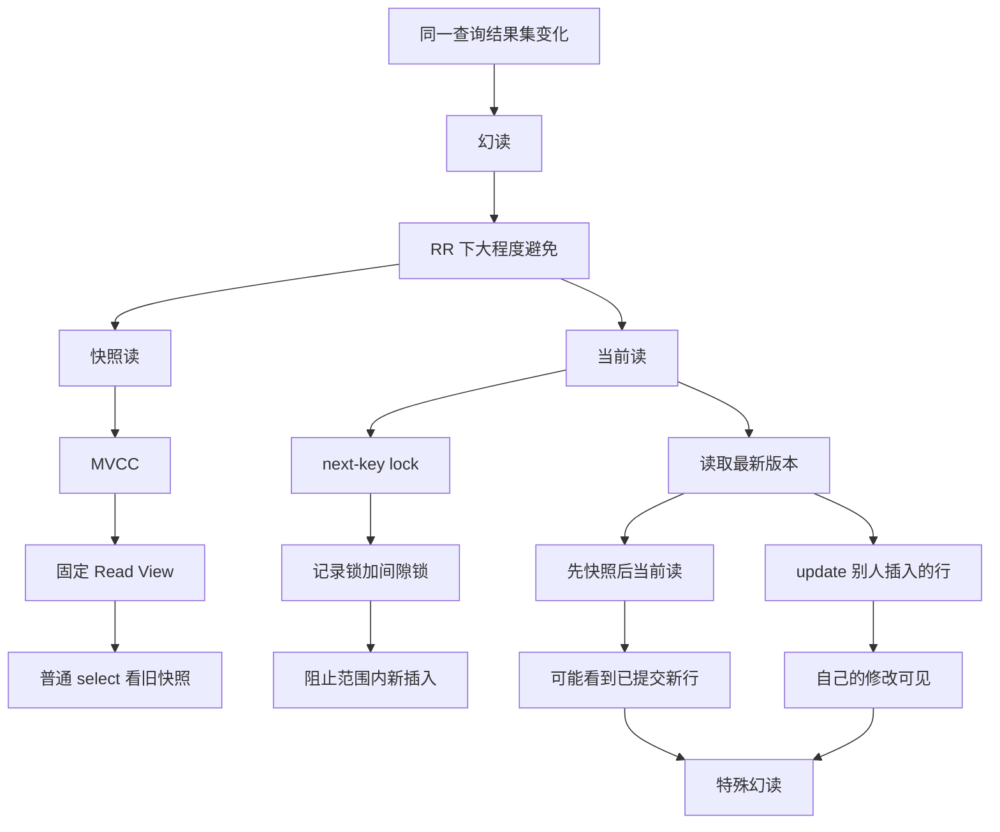

# MySQL 可重复读隔离级别，完全解决幻读了吗？

### 1. Topic Overview

- What this is about: 本章解释 InnoDB 在可重复读隔离级别下如何大程度避免幻读，以及为什么仍然存在两个特殊幻读场景。
- Why it matters: 面试里只说“可重复读解决幻读”是不够准确的。更好的回答要区分快照读、当前读、Read View、next-key lock，以及事务内读写顺序。
- Difficulty level: 中等偏高。难点不在背“幻读”定义，而在用时间线判断某次读到底走 MVCC 快照，还是读取最新版本并加锁。
- Prerequisites:
  - 普通 `select` 是快照读。
  - `select ... for update`、`update`、`insert`、`delete` 是当前读或会先读取最新版本再操作。
  - RR 下快照读复用 Read View。
  - 当前读避免幻读主要依赖 next-key lock，也就是记录锁加间隙锁。
  - 当前事务自己的修改对自己可见。
- Source: `materials/mysql/transaction/phantom.md`.

Source roadmap:

1. 幻读定义: 同一个事务内，同一个查询在不同时间产生不同结果集。
2. 快照读如何避免幻读: RR 下普通 `select` 通过固定 Read View 读一致快照。
3. 当前读如何避免幻读: `select ... for update` 等当前读通过 next-key lock 锁住范围，阻止其他事务插入。
4. 残留场景一: 先快照读看不到，别人插入后，本事务又 `update` 那行，再普通读能看到。
5. 残留场景二: 先快照读，别人插入提交后，再当前读 `for update`，结果集变多。
6. 规避建议: 如果事务需要保护某个范围不被插入，应尽早执行锁定读。

### 2. Core Concepts

#### Schema 1: 用结果集变化识别幻读

- Definition: 幻读发生在同一事务内，同一个查询条件在不同时间返回了不同的行集合。
- Intuition: 重点不是“某一行字段值变了”，而是“满足条件的行集合变了”。多一行或少一行都属于结果集变化。
- Example: 事务 A 两次执行 `select * from t_test where id > 100;`。第一次返回 5 行，第二次返回 6 行，是幻读；第一次返回 5 行，第二次返回 4 行，也属于幻读。
- Common mistakes:
  - 把幻读只理解成“多出一行”，忽略少一行也说明结果集变化。
  - 把不可重复读和幻读混在一起。不可重复读偏向同一行内容变化，幻读偏向同一条件下行集合变化。

#### Schema 2: 按读类型选择幻读防护机制

- Definition: InnoDB RR 下不是用一个机制处理所有幻读。普通 `select` 的快照读靠 MVCC；当前读靠 next-key lock。
- Intuition: 快照读可以继续看旧照片，不需要阻塞别人插入。当前读要看最新数据，并且常常准备修改，所以必须把相关范围锁住。
- Example:
  - `select * from t_stu where id > 2;` 是快照读，事务内后续普通查询仍用同一个 Read View。
  - `select * from t_stu where id > 2 for update;` 是当前读，会读取最新版本，并对范围 `(2, +infinity]` 加 next-key lock。
- Common mistakes:
  - 说 MVCC 完全解决所有幻读。
  - 说当前读也靠旧 Read View 避免幻读。
  - 只理解记录锁，忘记间隙锁要保护“还不存在但可能插入的位置”。

#### Schema 3: 用“自己修改自己可见”解释先看不见再看得见

- Definition: RR 快照读看不到其他事务后来插入的行，但如果本事务之后 `update` 了那行，这条记录的最新版本会带上本事务的 `trx_id`，于是后续普通读能看到自己的修改。
- Intuition: 违和点在于“我刚才明明看不到 id=5，为什么还能 update 到它？”原因是 `update` 是当前读，要读最新已提交版本；而当前事务自己的修改对自己可见。
- Example:
  1. 事务 A 普通查 `id = 5`，结果为空，并创建/使用 RR 的 Read View。
  2. 事务 B 插入 `id = 5` 并提交。
  3. 事务 A 执行 `update t_stu set name = '小林 coding' where id = 5;`，当前读能匹配这行。
  4. 事务 A 再普通查 `id = 5`，能看到这行，因为它已经被 A 自己修改过。
- Common mistakes:
  - 认为普通 `select` 看不到的行，`update` 也一定不能碰到。
  - 忘记当前读读取的是最新版本，不是沿用旧快照。
  - 忘记当前事务自己的修改总是可见。

#### Schema 4: 用锁的时间点解释先快照后当前读的幻读

- Definition: 如果事务一开始只做快照读，没有加锁保护范围，那么其他事务可以在这个范围插入并提交；本事务之后再执行当前读时，会读到最新集合，结果集就可能变化。
- Intuition: next-key lock 不是回溯生效的。你后来 `for update` 才加锁，只能阻止之后的新插入，不能阻止已经提交的插入被当前读看见。
- Example:
  1. T1: 事务 A 普通查 `select * from t_test where id > 100;`，得到 3 行。
  2. T2: 事务 B 插入 `id = 200` 并提交。
  3. T3: 事务 A 执行 `select * from t_test where id > 100 for update;`，当前读看到 4 行。
- Common mistakes:
  - 以为只要隔离级别是 RR，后面任何读都必须和第一次普通读一致。
  - 忘记当前读和快照读不使用同一个读取语义。
  - 把“当前读加锁”理解成能修复之前没有锁住的窗口。

### 3. Deep Understanding

本章的核心链条是：

```text
幻读 = 同一查询条件的结果集变化
-> RR 下 InnoDB 分两类读处理
-> 快照读: 复用 Read View, 读旧的一致快照
-> 当前读: 读取最新版本, 用 next-key lock 锁范围
-> 如果事务始终普通读, MVCC 大程度避免幻读
-> 如果事务一开始锁定读, next-key lock 大程度避免范围插入
-> 如果先快照读再当前读, 或先看不见再 update 别人插入的行, 读语义发生切换
-> 结果集可能变化, RR 仍可能出现特殊幻读
```

关键边界：

1. “可重复读”主要保证普通快照读的重复读取一致，不等于所有读语句都永远使用第一次的结果集。
2. `update`、`delete`、`select ... for update` 需要读取最新数据，所以它们不能只依赖旧 Read View。
3. next-key lock 的价值是提前保护范围。加锁太晚时，已经提交的新行会被当前读看到。
4. MVCC 不能完全避免幻读的核心原因，不是 Read View 失效，而是事务里可能混入当前读或自己的写操作。

### 4. Minimal Working Example

表 `t_stu(id primary key, name, age)` 初始没有 `id = 5` 的记录。

```sql
-- 事务 A
begin;
select * from t_stu where id = 5;
-- Empty set
```

事务 A 的普通 `select` 是快照读。它看到的快照里没有 `id = 5`。

```sql
-- 事务 B
begin;
insert into t_stu values(5, '小美', 18);
commit;
```

事务 B 插入并提交后，真实最新数据里已经有 `id = 5`。

```sql
-- 事务 A
update t_stu set name = '小林 coding' where id = 5;
select * from t_stu where id = 5;
```

这里的 `update` 是当前读，要读取最新版本，所以它能匹配事务 B 已提交的 `id = 5`。更新之后，这条记录的新版本属于事务 A 自己的修改。事务 A 后续普通读时，当前事务自己的修改可见，于是能查到 `id = 5`。

这个结果和事务 A 第一次普通查询的空结果不同，所以出现特殊幻读。

### 5. Knowledge Graph



### 6. Self-Test Questions

Recall:

1. 幻读的定义是什么？为什么 5 行变 4 行也算幻读？
2. RR 下普通 `select` 靠什么避免幻读？
3. RR 下 `select ... for update` 靠什么避免幻读？

Application / transfer:

1. 事务 A 先普通查 `id = 5` 为空，事务 B 插入 `id = 5` 并提交，事务 A 再 `update id = 5`，然后普通查到这行。请解释为什么会发生。
2. 事务 A 先普通查 `id > 100` 得到 3 行，事务 B 插入 `id = 200` 并提交，事务 A 再 `select ... where id > 100 for update` 得到 4 行。next-key lock 为什么没有阻止这次结果集变化？

Explain-like-I-am-5:

1. 为什么说 RR 像“普通查询一直看同一张照片”，但如果你后来改了真实世界里的东西，就可能在自己的照片里看见新东西？

### 7. Weak Point Detection

- 如果说“RR 完全解决幻读”，说明快照读和当前读边界不稳。
- 如果说普通 `select` 和 `select ... for update` 都读同一个旧快照，说明当前读语义不稳。
- 如果无法解释“第一次看不到 id=5，后面却能 update 到 id=5”，需要回到当前读读取最新版本，以及当前事务自己的修改可见。
- 如果说后来的 `for update` 能阻止之前已经提交的插入，说明 next-key lock 的时间点不稳。
- 如果把幻读解释成“一行内容变了”，需要修复不可重复读和幻读的边界。
