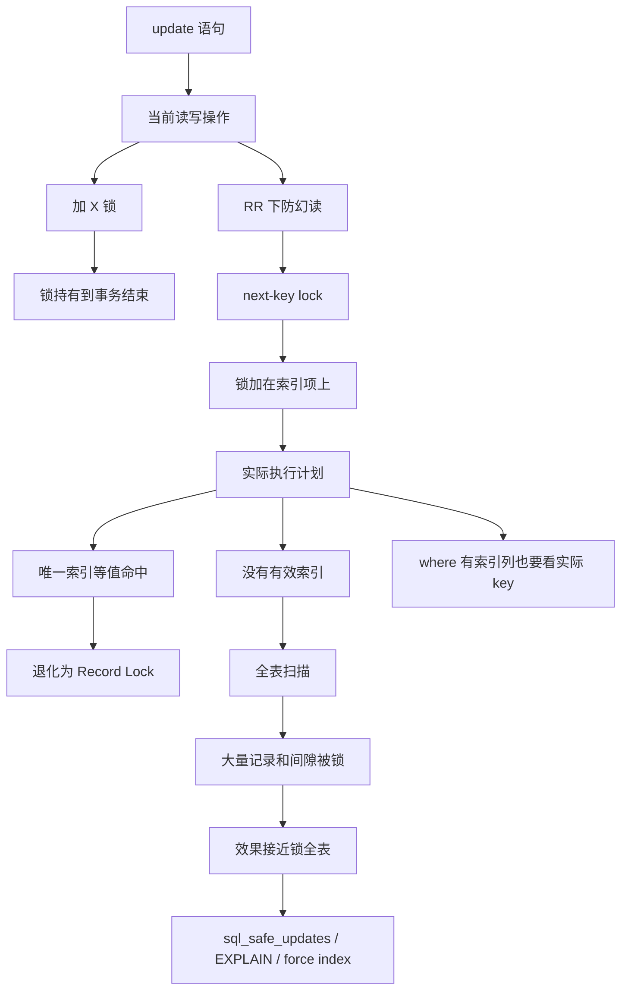

# update 没加索引会锁全表？

### 1. Topic Overview

- What this is about: 本章解释 InnoDB 在可重复读隔离级别下，`update` 的 `where` 条件没有走有效索引时，为什么会扫描大量记录并给大量索引项加 next-key lock，最终表现得像把整张表锁住。
- Why it matters: 生产环境里一条错误的 `update` 不只是慢查询问题，还可能把其他 `update`、`delete`、`insert` 阻塞到业务停滞。
- Difficulty level: 中等偏难。难点不在锁名，而在三个边界：`update` 是写操作会加 X 锁；锁加在索引项上，不是直接加在“表”上；真正决定锁范围的是优化器最终选择的扫描路径。
- Prerequisites: InnoDB、可重复读、当前读、X 锁、Record Lock、Gap Lock、Next-Key Lock、B+Tree 索引、优化器执行计划、`EXPLAIN`。
- Source: `materials/mysql/lock/update_index.md`.

Source order roadmap:

1. 线上事故问题：`update` 的 `where` 没带索引，导致业务被大面积阻塞。
2. 前提：InnoDB，可重复读隔离级别，当前读/写操作要用 next-key lock 处理幻读风险。
3. `update` 会对记录加 X 锁，锁不是语句结束就释放，而是事务结束才释放。
4. 唯一索引等值命中时，next-key lock 可以退化成 Record Lock，只锁一条记录。
5. 没有使用索引时，`update` 会全表扫描；扫描过程中会对索引项加锁，导致所有记录和间隙都被覆盖。
6. `where` 中出现索引列还不够，关键是优化器最终选择索引扫描还是全表扫描。
7. “锁全表”是效果，不是 InnoDB 真加了表锁；源码层面锁单位仍是索引项。
8. 避免方式：开启 `sql_safe_updates`，测试机确认执行计划，必要时用 `force index(index_name)`。

### 2. Core Concepts

#### Schema 1: 把 update 看成会持有 X 锁的当前读写操作

- Definition: `update` 需要读取最新记录并修改它，所以会对相关记录或索引范围加独占锁 X lock；这些锁通常会持有到事务结束。
- Intuition: `update` 不是“读完改一下就结束”。它要防止其他事务同时改同一批数据，也要在 RR 当前读场景下防止范围内插入造成幻读。
- Example: 事务 A 执行 `update user set name = 'x' where id = 1` 后不提交，事务 B 再修改 `id = 1` 会被阻塞，直到 A 提交或回滚。
- Common mistakes:
  - 认为 `update` 语句执行完锁就释放，忽略事务边界。
  - 只把 `update` 当成性能问题，不把它当成加锁操作。
  - 混淆普通快照读和当前读/写操作。

#### Schema 2: 用实际扫描路径决定 update 的锁范围

- Definition: InnoDB 行锁锁的是扫描到的索引记录和索引间隙；`update` 的锁范围由执行计划实际扫描了多少索引项决定。
- Intuition: SQL 条件只是意图，执行计划才是路径。路径窄，锁就窄；路径宽，锁就跟着扩大。
- Example: `where id = 1` 且 `id` 是唯一索引时，等值命中可以退化成 `id = 1` 的 Record Lock。反过来，`where name = 'Alice'` 且 `name` 没索引时，InnoDB 只能全表扫描，扫描到的记录和间隙都会被加锁。
- Common mistakes:
  - 认为 `where` 里写了条件就只锁满足条件的行。
  - 认为有索引列出现在 `where` 里就一定安全。
  - 只说“无索引会慢”，漏掉“无索引会扩大加锁范围”。

#### Schema 3: 区分“锁全表效果”和“表锁”

- Definition: `update` 没走索引时，InnoDB 不是直接加一个表锁，而是在全表扫描过程中对大量索引项加 next-key lock；效果上接近整张表被锁住。
- Intuition: 表锁是一把粗锁；这里是很多细粒度行锁/间隙锁铺满了表的索引范围。外在效果相似，内部机制不同。
- Example: 一张表有 4 条记录。无索引 `update` 全表扫描时，文章描述会产生 4 个记录锁和 5 个间隙锁，相当于把已有记录和记录之间的插入位置都堵住。
- Common mistakes:
  - 说“InnoDB update 没索引会加表锁”。
  - 忘记锁是加在索引上的，而不是直接加在业务行对象上。
  - 不能解释为什么普通 `select ... from` 通常还能读，而其他写入类操作会被阻塞。

#### Schema 4: 用安全更新和执行计划验证降低生产事故风险

- Definition: 避免事故的控制链是：打开 `sql_safe_updates` 做基础保护；上线前用 `EXPLAIN` 或测试执行确认实际走索引；如果优化器明明有索引却选择全表扫描，再评估是否使用 `force index(index_name)`。
- Intuition: 安全不是“where 写了索引列”四个字，而是要确认最终路径真的变窄。
- Example:
  - `sql_safe_updates = 1` 时，文章给出的 update 规则是：`where` 使用索引列，或使用 `limit`，或同时有 `where` 和 `limit`。
  - 如果 `where` 有索引列但执行计划仍是全表扫描，可以用 `force index` 提示优化器走指定索引。
- Common mistakes:
  - 把 `possible_keys` 当成实际使用索引；实际要看 `key`、`type`、`rows` 等执行计划信息。
  - 以为 `force index` 是默认万能解；它只是提示优化器，使用前要验证成本和正确性。
  - 只依赖 `sql_safe_updates`，不看真实执行计划。

### 3. Deep Understanding

本章的因果链是：

```text
RR 下 update 是当前读/写操作
-> 为了保护当前读结果和被修改记录，需要加 X 锁
-> InnoDB 行锁加在索引项上，基本单位是 next-key lock
-> 锁范围跟实际扫描路径走
-> 唯一索引等值命中：扫描路径很窄，可退化为单条 Record Lock
-> 没有有效索引：执行计划可能全表扫描
-> 全表扫描会访问大量索引项
-> 大量索引项都被 next-key lock 覆盖
-> 效果接近锁住整张表，写业务被阻塞直到事务结束
```

关键边界：

- 不是所有 `update` 都危险；危险来自“写操作 + 长事务 + 扫描路径很宽”。
- 不是“没索引就加表锁”；是“没走有效索引时，很多索引项都被行锁/间隙锁覆盖”。
- 不是“where 有索引列就安全”；最终要看优化器实际是否选择索引扫描。
- `force index` 是最后的计划控制手段之一，不是替代索引设计和执行计划验证。

### 4. Minimal Working Example

假设有表：

```sql
create table user (
  id int primary key,
  name varchar(20),
  age int
) engine = InnoDB;
```

已有记录 `id = 1, 2, 3, 4`，`age` 没有索引。

场景 A：走唯一索引。

```sql
begin;
update user set name = 'A' where id = 1;
```

推导：

1. `update` 是写操作，会加 X 锁。
2. `id` 是主键唯一索引。
3. `id = 1` 等值命中唯一记录。
4. next-key lock 退化成 `id = 1` 的 Record Lock。
5. 其他事务更新 `id = 2` 通常不会被这把锁阻塞。

场景 B：没走索引。

```sql
begin;
update user set name = 'A' where age = 20;
```

推导：

1. `age` 没索引，优化器可能全表扫描。
2. `update` 扫描过程中会对索引项加 X 型 next-key lock。
3. 表中已有记录和记录之间的间隙都可能被覆盖。
4. 其他事务执行 `insert`、`update`、`delete` 很容易被阻塞。
5. 锁要等事务提交或回滚后释放。

上线前应做：

```sql
explain update user set name = 'A' where age = 20;
```

如果执行计划显示没有实际使用有效索引，应先补索引、改 SQL、缩小范围，或在确认合理时使用 `force index(index_name)`。

### 5. Knowledge Graph



### 6. Self-Test Questions

Recall:

1. `update` 加的 X 锁通常什么时候释放？
2. InnoDB 行锁准确地说是加在“表”上、“行对象”上，还是“索引项”上？
3. 为什么唯一索引等值命中时，next-key lock 可以退化成 Record Lock？

Application / transfer:

1. `update user set name='x' where age=20`，`age` 没索引。为什么它不只是慢，还可能阻塞很多写操作？
2. `where` 里出现了索引列，但 `EXPLAIN` 显示优化器最终选择全表扫描。这个 update 的加锁风险还存在吗？为什么？

Explain-like-I-am-5:

1. 用“从目录找一本书”和“把每一页都翻一遍”的比喻解释：为什么没走索引的 update 会把锁范围放大？

### 7. Weak Point Detection

Likely failure patterns:

- 把“效果接近锁全表”说成“InnoDB 直接加了表锁”。
- 只记住“where 要带索引”，但不检查优化器实际是否走索引。
- 只从查询性能理解无索引，漏掉写操作全表扫描会放大锁范围。
- 忘记锁持有到事务结束，低估长事务造成的阻塞时间。
- 把 `sql_safe_updates` 当成完整保障，忽略执行计划验证和测试机演练。
