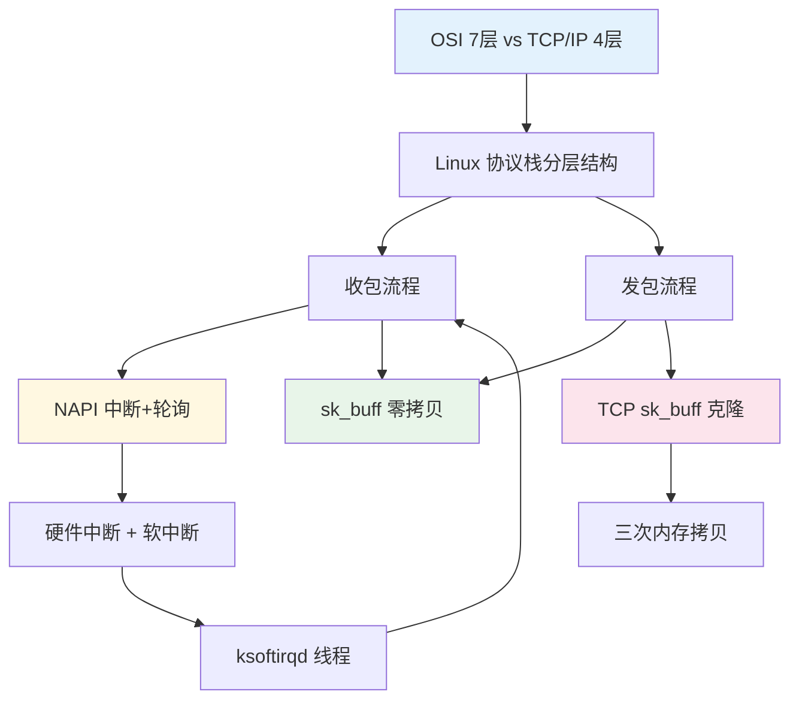

# Linux 系统是如何收发网络包的？

### 1. Topic Overview
- **What this is about**: Linux 内核网络协议栈的内部实现——不是"数据包在网络中怎么走"，而是"数据包在操作系统内部怎么被处理"。核心回答三个问题：收包时内核怎么从网卡拿到数据并层层上传？发包时内核怎么从应用层层层下传并发出？用什么数据结构避免内存拷贝？
- **Why it matters**: 理解内核网络栈是性能调优（如零拷贝、NAPI、中断合并）和排查网络问题的基础。也是理解 DPDK、eBPF 等高性能网络技术的起点。
- **Difficulty level**: 中等偏上。需要理解中断、DMA、内核态/用户态、Socket 等概念。
- **Prerequisites**: TCP/IP 四层模型；基本的中断和 DMA 概念；了解 Linux 用户态和内核态的区别。

### 2. Core Concepts

#### 2.1 Schema: OSI 七层 vs TCP/IP 四层
- **Definition**: OSI 七层模型（应用层、表示层、会话层、传输层、网络层、数据链路层、物理层）是概念理论模型。实际使用的 TCP/IP 四层模型将 OSI 的应用层+表示层+会话层合并为应用层，将数据链路层+物理层合并为网络接口层。Linux 内核网络栈按照 TCP/IP 四层模型实现。
- **Intuition**: OSI 是教科书，TCP/IP 是工程实践。教科书分得细是为了教学清晰，工程合并是为了实现简单。
- **四层 vs 七层负载均衡**：四层负载均衡工作在传输层（看 IP+端口），七层负载均衡工作在应用层（看 HTTP 头、URL 等应用内容）。
- **Common mistakes**: 背得下七层名字但说不清哪三层在 TCP/IP 里被合并了。

#### 2.2 Schema: Linux 网络协议栈分层结构（自上而下）
- **Definition**: Linux 网络协议栈从用户态到硬件分为：应用层（用户态）→ Socket 层（系统调用边界）→ 传输层（TCP/UDP）→ 网络层（IP）→ 网络接口层（MAC）→ 网卡驱动 → 硬件网卡。上下层之间通过"委托"关系传递数据。
- **Intuition**: 就像一个公司的层层审批——用户提交申请（系统调用）→ Socket 前台登记 → 传输层打包 → 网络层贴地址 → 网络接口层装箱 → 司机（网卡驱动）运输。
- **Example**: 应用调用 `send()` → 触发系统调用 → 进内核态 → Socket 层 → TCP 协议处理 → IP 协议处理 → MAC 封装 → 网卡驱动发送。
- **Common mistakes**: 把 Socket 层和传输层混为一谈（Socket 是接口抽象层，不是协议层；TCP/UDP 才是传输层协议）。

#### 2.3 Schema: NAPI —— 中断 + 轮询混合收包
- **Definition**: 网卡收到包后通过 DMA 写入 Ring Buffer（环形缓冲区），然后触发硬件中断通知 CPU。但高性能场景下中断过多会拖垮 CPU。NAPI 的解决方案是：**第一次用中断唤醒处理程序，之后用轮询（poll）批量取包，取完再开中断**。即"中断唤醒 + 轮询处理"的混合模式。
- **Intuition**: 完全中断模式像一个快递员每到一个包裹就给你打一个电话——你接电话接到崩溃。NAPI 是快递员第一次打电话说"有包裹了"，然后你每隔一段时间自己去门口拿一堆，拿完再等下一个电话。
- **Example 流程**：
  1. 网卡收到包 → DMA 写入 Ring Buffer → 触发硬件中断
  2. CPU 执行中断处理函数 → **暂时屏蔽网卡中断**（告诉网卡：别再通知了，我已知晓）→ **发起软中断**（告诉内核：该干活了）→ 恢复中断屏蔽
  3. ksoftirqd 内核线程收到软中断 → 调用 poll 轮询函数 → 从 Ring Buffer 中取数据帧
  4. 取完一批 → 重新开启中断，等待下一次硬件中断唤醒
- **Common mistakes**: 以为 NAPI 完全不用中断（第一次唤醒还是需要中断的）；和 "中断合并" 搞混（中断合并是硬件层面的，NAPI 是软件层面的）。

#### 2.4 Schema: sk_buff —— 零拷贝的内核网络包结构
- **Definition**: sk_buff（socket buffer）是 Linux 内核中表示网络包的统一数据结构。从应用层到网卡，同一个包的所有层用**同一个 sk_buff 实例**，不同层通过**调整 data 指针**来指向本层的数据起始位置，避免了层间传递时的内存拷贝。
- **Intuition**: 就像一本书的目录标签——书的物理页不变，但你把书签（data 指针）往前翻就是"应用层数据"，往后翻就是"TCP 头"，再往后就是"IP 头"。不同层的名字只是同一块数据的视角不同：在应用层叫 data，在 TCP 层叫 segment，在 IP 层叫 packet，在链路层叫 frame。
- **指针移动规则**：
  - **接收时**（从下到上剥头）：data 指针逐渐 +N（跳过帧头 → 跳过 IP 头 → 跳过 TCP 头 → 指向应用数据）
  - **发送时**（从上到下加头）：data 指针逐渐 -N（在预留空间里填入 TCP 头 → IP 头 → 帧头/帧尾）
- **Common mistakes**: 认为每一层都会 malloc 新的内存来加头/去头（sk_buff 的设计就是为了避免这一点）。

#### 2.5 Schema: Linux 收包完整流程
- **Definition**: 从网卡收到电信号到应用进程拿到数据，每一步的触发条件和边界：
  1. 网卡收到包 → DMA 写入 Ring Buffer
  2. 硬件中断 → 屏蔽中断 → 发起软中断 → ksoftirqd 开始 poll
  3. poll 从 Ring Buffer 取帧，封装为 sk_buff
  4. 网络接口层：检查合法性 → 识别上层协议类型（IPv4/IPv6）→ 去帧头帧尾 → 交网络层
  5. 网络层：判断包去向（本机消费 or 转发）→ 本机则看 IP 头协议号 → 去 IP 头 → 交传输层
  6. 传输层：取 TCP/UDP 头 → 根据四元组（源IP、源端口、目标IP、目标端口）找对应 Socket → 放入 Socket 接收缓冲区
  7. 应用层：调用 `recv()` → 系统调用 → 从 Socket 缓冲区拷贝数据到用户态 → 唤醒用户进程
- **Intuition**: 收包 = 网卡"送货到门口"（DMA）→ 中断"按门铃"→ ksoftirqd "开门取货" → 协议栈"拆快递包装"→ Socket "放到收件箱"→ 应用"来取件"。
- **Common mistakes**: 把 DMA 写入的 Ring Buffer 和 Socket 接收缓冲区搞混（前者是网卡驱动程序管理的硬件相关内存，后者是传输层管理的 Socket 相关内存）。

#### 2.6 Schema: Linux 发包完整流程
- **Definition**: 从应用调用 `send()` 到网卡发出信号，每一步做了什么、在哪里发生了内存拷贝：
  1. 应用调用 `send()` → 系统调用 → 用户态陷入内核态
  2. 内核申请 sk_buff → 将用户数据拷贝到 sk_buff（**第 1 次拷贝**）
  3. sk_buff 放入 Socket 发送缓冲区
  4. TCP 层：**先克隆一个 sk_buff 副本**（**第 2 次拷贝**，原因是 TCP 需要重传——原始 sk_buff 必须保留到收到 ACK；副本发送完即可释放）
  5. TCP 层填充 TCP 头（通过 sk_buff data 指针前移，不额外拷贝）
  6. IP 层：选取路由、填充 IP 头、netfilter 过滤、必要时分片（超过 MTU 则 **第 3 次拷贝**，拆成多个小 sk_buff）
  7. 网络接口层：ARP 获取 MAC → 填充帧头帧尾
  8. sk_buff 放入网卡发送队列 → 触发软中断通知网卡驱动
  9. 驱动程序从队列取 sk_buff → 挂到 Ring Buffer → DMA 映射 → 网卡发出
  10. 发送完成 → 硬件中断 → 释放副本 sk_buff 和清理 Ring Buffer
  11. 收到 ACK → 释放原始 sk_buff
- **Intuition**: 发包 = 应用"写好信"→ 系统调用"把信交给内核"（第1次拷贝）→ TCP"复印一份寄出去，原件留着以防丢"（第2次拷贝）→ IP"太长了就裁成几段"（第3次拷贝，一般不触发）→ 层层填表头 → 网卡"真正寄出去"。
- **Three-memory-copy rule**:
  1. 用户态 → 内核态 sk_buff（必选）
  2. TCP 克隆副本（TCP 协议必选）
  3. IP 分片拷贝（仅在 >MTU 时触发）
- **Common mistakes**: 认为 TCP 层在填充头时发生了拷贝（实际上只是调整 data 指针）；忘记 IP 分片拷贝是条件性的。

### 3. Deep Understanding

#### 3.1 收包和发包的两个关键设计哲学

**收包策略：中断 → 轮询的切换（NAPI）**
内核用状态机管理中断和轮询的切换：初始状态"开中断"→ 第一个包触发硬件中断 → 关闭中断、激活轮询 → 批量 poll 直到 Ring Buffer 取空 → 重新开中断。这个状态切换是 NAPI 的核心。

**发包策略：sk_buff 的克隆与延迟释放**
TCP 之所以要克隆 sk_buff，是因为发送和重传的时间线不同步：
- 副本 sk_buff：网卡发出后立即释放
- 原始 sk_buff：必须留到收到 ACK 才释放
如果网卡发送失败了，TCP 在超时后从原始 sk_buff 重新克隆一份再发。

#### 3.2 收包和发包的对称性

收包和发包在流程上是镜像对称的，但有几个关键不对称点：
- 收包入口是"硬件中断+DMA"，发包入口是"系统调用"
- 收包不需要克隆（因为不需要重传），发包需要
- 收包每层"去头"（data 指针后移），发包每层"加头"（data 指针前移）
- 收包的 Ring Buffer 是网卡写的，发包的 Ring Buffer 是驱动写的

#### 3.3 sk_buff 零拷贝的本质

sk_buff 通过一个 data 指针 + 预分配的缓冲区空间，让所有协议层共享同一块内存。不是"通过某种黑科技避免了拷贝"，而是"用指针偏移替代了分配新内存"。代价是发送时必须预留足够的头部空间（每个 sk_buff 在创建时就在 data 前面留出了各层协议头的空间）。

### 4. Minimal Working Example

以一次 HTTP 请求的发送和响应的接收为例：

**发包（客户端发 GET 请求）**：
```
用户态: write(sockfd, "GET / HTTP/1.1\r\n...", len)
  ↓ 系统调用
内核态: sk_buff 分配 → 用户数据拷贝到 sk_buff
  ↓ 放入 socket 发送缓冲区
TCP 层: clone sk_buff → 填 TCP 头(src_port, dst_port, seq, ack, window)
  ↓ data 指针前移，TCP 头就绪
IP 层:  查路由 → 填 IP 头(src_ip, dst_ip, protocol=TCP)
  ↓ data 指针前移，IP 头就绪
MAC 层: ARP 查下一跳 MAC → 填 MAC 头 + 帧尾
  ↓ data 指针前移，MAC 头/帧尾就绪
网卡驱动: sk_buff 挂到 RingBuffer → DMA → 网卡发出
```

**收包（客户端收 HTTP 响应）**：
```
网卡收到信号 → DMA 写入 Ring Buffer
  ↓ 硬件中断 → 软中断 → ksoftirqd poll
sk_buff 封装数据帧 → 网络接口层检查合法性 → 去帧头帧尾
  ↓ data 指针后移
IP 层: 目标 IP 是自己 → 协议号=TCP → 去 IP 头
  ↓ data 指针后移
TCP 层: 四元组匹配 → 找到 socket → 序号检查通过 → ACK → 去 TCP 头
  ↓ data 指针后移
Socket 层: 数据放入接收缓冲区
  ↓ 用户调用 read/recv
用户态: 拷贝到用户缓冲区 → 进程拿到 HTTP 响应
```

### 5. Knowledge Graph



> 图例：蓝色=模型/架构，绿色=核心数据结构，黄色=收包特有机制，粉色=发包特有机制。

### 6. Self-Test Questions
- **Recall**:
  1. NAPI 机制中，硬件中断处理函数做了哪两件事？软中断由哪个内核线程处理？
  2. sk_buff 发送数据时，data 指针如何移动来填充各层协议头？
  3. Linux 发包流程中哪三个地方会发生内存拷贝？分别在什么条件下触发？

- **Application/Transfer**:
  1. 如果去掉 TCP 克隆 sk_buff 这一步骤，直接用原始 sk_buff 发送并立即释放，会出现什么问题？
  2. 收包流程中，网络层怎么判断一个包是"发给本机的"还是"需要转发的"？这和路由器收包的判断逻辑有什么相同和不同？

- **Explain-like-I-am-5**:
  如果把收包比作"快递送到家"，请解释：Ring Buffer 是什么？DMA 是什么？硬件中断是什么？NAPI 相当于对快递员说了什么？

### 7. Weak Point Detection

| 典型错误表现 | 对应的 schema | 错误类型 | 检查方法 |
|-------------|-------------|---------|---------|
| 说不清 NAPI 中中断在什么时候关闭/什么时候重新开启 | NAPI (2.3) | 过程混淆 | 追问"如果一直轮询，后续新来的包怎么感知？" |
| 认为 sk_buff 在层间传递时发生了多次内存分配和拷贝 | sk_buff (2.4) | 概念误解 | 让解释"data 指针移动"和"分配新内存"的区别 |
| 不知道 TCP 为什么要克隆 sk_buff | TCP 克隆 (2.6) | 缺失前提 | 追问"如果发送完就释放，丢包重传时数据还在吗？" |
| 混淆 Ring Buffer 和 Socket 缓冲区 | 收包流程 (2.5) | 边界混淆 | 让分别画出两个缓冲区在收包路径上的位置 |
| 把 NAPI 和网卡硬件的中断合并当成一个东西 | NAPI (2.3) | 概念混淆 | 追问"如果一个发生在网卡驱动层，一个发生在网卡硬件，你能分清楚吗？" |
