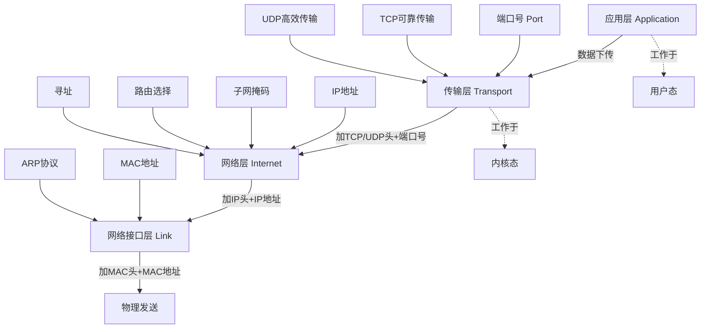

# TCP/IP 网络模型

### 1. Topic Overview
- **What this is about**: TCP/IP 四层网络模型是不同设备间进程通信的通用网络协议分层架构，从上到下分别是应用层、传输层、网络层、网络接口层。
- **Why it matters**: 理解分层模型是学习网络协议的基础，每一层的职责、封装方式、地址体系各不相同，但协同工作完成"把数据从一台设备的一个应用送到另一台设备的对应应用"。
- **Difficulty level**: 基础
- **Prerequisites**: 了解什么是进程间通信（IPC），知道设备通过网络连接的基本概念。

### 2. Core Concepts

#### 2.1 应用层（Application Layer）
- **Definition**: 最上层，直接面向用户，提供应用功能（HTTP、FTP、DNS、SMTP 等）。工作于用户态。
- **Intuition**: 你寄快递时只需要把包裹交给快递员，不需要关心运输过程。应用层只要把数据交给传输层即可。
- **Example**: 浏览器用 HTTP 协议请求网页，DNS 协议将域名解析为 IP。
- **Common mistakes**: 误以为应用层也负责数据传输，实际上它只负责生成应用数据并下传。

#### 2.2 传输层（Transport Layer）
- **Definition**: 为应用层提供网络支持，使用端口号区分不同应用。两大协议：TCP（可靠传输）和 UDP（简单高效）。
- **Intuition**: 快递员手里同时有很多人的包裹，他用收件人姓名（端口号）来区分哪个包裹是谁的。
- **Key concepts**:
  - **TCP**: 传输控制协议，提供流量控制、超时重传、拥塞控制等可靠传输特性。
  - **UDP**: 简单到只负责发送，不保证到达，但实时性好、效率高。
  - **MSS（Maximum Segment Size）**: TCP 的最大报文段长度，超过则分块，每个分块叫一个 TCP 段（TCP Segment）。
  - **Port**: 端口号，用于标识数据包属于哪个应用（如 80 端口是 Web 服务，22 是 SSH）。
- **Common mistakes**: 认为传输层直接负责把数据从一个设备传输到另一个设备——这是网络层的职责。

#### 2.3 网络层（Internet Layer）
- **Definition**: 负责将数据从一个设备传输到另一个设备。核心协议是 IP，提供寻址（IP 地址）和路由（路径选择）能力。
- **Intuition**: IP 寻址 = 导航告诉你目的地在哪个方向；路由 = 实际打方向盘、选路线。
- **Key concepts**:
  - **IP 地址**: IPv4 共 32 位，分四段（如 192.168.100.1），每段 8 位。
  - **网络号 vs 主机号**: IP 地址由子网掩码配合按位与运算拆分为两部分。
    - 网络号 = IP & 子网掩码 → 标识属于哪个子网。
    - 主机号 = IP & (~子网掩码) → 标识子网内的具体主机。
  - **子网掩码**: 如 /24 = 255.255.255.0 = 前 24 位全 1。
  - **MTU（Maximum Transmission Unit）**: 最大传输单元，以太网通常 1500 字节，IP 报文超过 MTU 会被分片。
  - **路由**: 在多个网络路径中选择最优路径转发数据包。
- **Common mistakes**: 
  - 混淆 IP 地址和端口的作用——IP 定位设备，端口定位应用。
  - 不清楚子网掩码的作用，误以为 IP 地址直接就能寻址。

#### 2.4 网络接口层（Link Layer）
- **Definition**: 最底层，在 IP 头部前加上 MAC 头部，封装成帧（Frame），通过以太网/WiFi 等物理网络发送。
- **Intuition**: IP 地址是"收件地址"，但最后一公里快递员要用门牌号（MAC 地址）找到具体那扇门。
- **Key concepts**:
  - **MAC 地址**: 以太网中标识设备的硬件地址。
  - **ARP 协议**: 通过 IP 地址获取对方的 MAC 地址。
  - **帧（Frame）**: 链路层的传输单位。
  - **以太网（Ethernet）**: 局域网技术，通过交换机、网线、WiFi 等把附近设备连接起来。
- **Common mistakes**: 认为 IP 地址就能直接完成局域网内的数据发送——实际上在以太网中必须用 MAC 地址。

### 3. Deep Understanding

#### 3.1 分层封装的完整流程（自上而下发送）
```
应用层数据（Message）
    ↓ 加 TCP/UDP 头（含端口号）
传输层 → TCP 段/UDP 数据报
    ↓ 加 IP 头（含源/目标 IP 地址）
网络层 → IP 包（Packet）
    ↓ 加 MAC 头（含源/目标 MAC 地址）
网络接口层 → 帧（Frame）
    ↓ 物理传输
```

接收方则反过来逐层拆解。

#### 3.2 为什么传输层不负责设备间传输？
传输层的设计哲学是"简单、高效、专注"——只服务应用，做应用到应用的通信。如果还要负责复杂的路径选择和路由，就违反了单一职责原则。这正是分层设计的核心价值：每一层各司其职。

#### 3.3 用户态 vs 内核态
- 应用层工作在**用户态**（操作系统为应用提供的运行空间）。
- 传输层及以下工作在**内核态**（操作系统核心，可直接访问硬件和网络栈）。

#### 3.4 IP 分片 vs TCP 分段
- TCP 分段：传输层根据 MSS 将数据拆分为 TCP 段。
- IP 分片：网络层根据 MTU 再次拆分为更小的 IP 包。
- 两层都可能拆分，但作用和依据不同。

### 4. Minimal Working Example

**场景：浏览器访问 www.example.com**

1. **应用层**: 浏览器生成 HTTP GET 请求报文。
2. **传输层**: TCP 协议将 HTTP 报文分段，每个段加上 TCP 头（源端口如 54321，目标端口 80）。
3. **网络层**: IP 协议加上 IP 头（源 IP 如 192.168.1.5，目标 IP 如 93.184.216.34）。如果 IP 包超过 1500 字节 MTU，再分片。
4. **网络接口层**: 加上 MAC 头（通过 ARP 获取下一跳网关的 MAC 地址），封装成帧，通过网卡发送。

**接收方**：
1. **网络接口层**: 检查 MAC 地址匹配，拆掉 MAC 头。
2. **网络层**: 检查 IP 地址匹配，拆掉 IP 头，如有分片则重组。
3. **传输层**: 检查端口号 80，将 TCP 段按序号重组，确认无误后交到 80 端口对应的 Web 服务。
4. **应用层**: Web 服务器读取 HTTP 请求并处理。

### 5. Knowledge Graph



### 6. Self-Test Questions

**Recall:**
1. TCP/IP 模型的四层从上到下分别是什么？每层的传输单位叫什么？
2. TCP 和 UDP 的核心区别是什么？
3. 端口号、IP 地址、MAC 地址分别在哪一层使用？各起什么作用？

**Application/Transfer:**
4. 如果一个 IP 数据包是 4000 字节，以太网 MTU 是 1500 字节，网络层会怎么做？
5. 为什么有了 IP 地址还需要 MAC 地址？能不能只用 IP 地址在局域网中通信？

**Explain-like-I-am-5:**
6. 把 TCP/IP 模型比喻成寄快递的过程，每一层对应什么角色？

### 7. Weak Point Detection
- **Likely failure patterns**:
  - 混淆各层职责，特别是搞不清"传输层负责什么 vs 网络层负责什么"。
  - 无法解释子网掩码的计算过程。
  - 认为 IP 地址就够了，不理解 MAC 地址的必要性。
  - 混淆 TCP 分段和 IP 分片。
  - 不理解为什么传输层不直接负责端到端设备传输。
