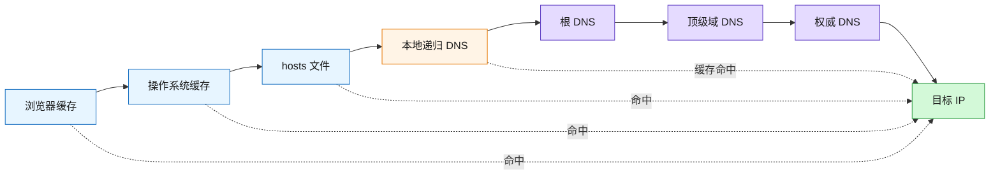
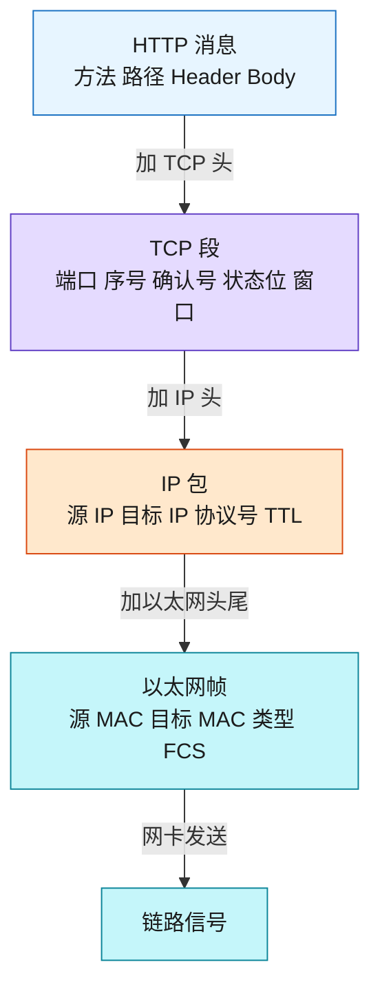
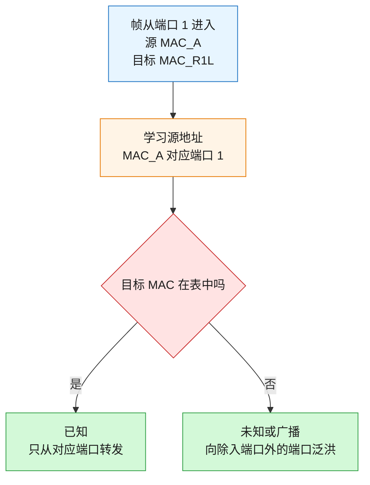
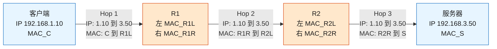
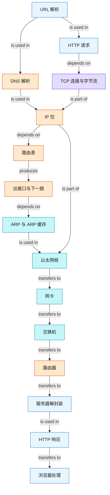

# 输入网址到网页显示：完整网络链路

### 1. 主题概览

- **这章讲什么**：以一次简化的 `HTTP over TCP/IPv4/Ethernet` 访问为主线，追踪浏览器怎样生成请求，以及请求怎样经过 DNS、操作系统协议栈、网卡、交换机和路由器到达 Web 服务器，再把响应交回浏览器。
- **为什么重要**：面试真正考察的不是背出协议名，而是能否运行一条因果链：每层解决什么问题、处理什么对象、把数据交给谁。
- **难度**：中等偏难。单个协议不复杂，难点在于区分最终目标与当前下一跳，并把封装、查表和逐跳转发放在同一条时间线上。
- **前置知识**：知道应用程序与操作系统不同；知道局域网是一组能够在同一二层网络内通信的设备；知道 IP 地址和 MAC 地址不是同一类地址。
- **来源范围**：`materials/network/1_base/what_happen_url.md`。原文使用 HTTP、TCP、IPv4 和以太网描述一条简化路径；本笔记保留该主线，并把 HTTPS、NAT、HTTP/3 和完整浏览器渲染标为边界。

整章可以先压缩成一条主线：

```text
URL
→ DNS 得到服务器 IP
→ TCP 建立连接并承载 HTTP 字节
→ IP 查路由表选择下一跳
→ ARP 得到下一跳 MAC
→ 网卡发送以太网帧
→ 交换机按 MAC 转发
→ 路由器逐跳重建以太网帧
→ 服务器逐层解封装
→ HTTP 响应返回并由浏览器处理
```

### 2. 核心概念

#### 2.1 Schema: 从 URL 提取协议、目标和资源

- **Definition**: 浏览器解析 URL，提取 scheme、host、port 和 path，从而确定使用什么应用层协议、连接哪个服务端口、请求什么资源，并据此生成 HTTP 请求消息。
- **Intuition**: URL 不是网页本身，而是一张任务单：用什么规则通信、去哪里、拿什么。
- **Example**: `http://www.server.test:8080/dir/file.html` 可拆为协议 `http`、主机 `www.server.test`、端口 `8080`、路径 `/dir/file.html`。若 URL 没写路径，请求路径是 `/`；服务器可以把 `/` 映射到 `index.html`，但这是服务器配置，不是 URL 自动补出的文件名。
- **Common mistakes**:
  - 把域名当成可直接写入 IP 包的网络地址；域名仍需先解析为 IP。
  - 把“请求 `/`”说成“HTTP 规定必须请求 `/index.html`”。
  - 忘记端口：HTTP 默认通常是 `80`，HTTPS 默认通常是 `443`，显式端口会覆盖默认值。

#### 2.2 Schema: 用 DNS 缓存链和分层委派得到目标 IP

- **Definition**: 客户端先检查浏览器缓存、操作系统缓存和 `hosts`。仍未命中时，它通常把完整问题交给本地递归 DNS；本地 DNS 若也无缓存，再沿 `根 DNS → 顶级域 DNS → 权威 DNS` 获取转介或最终记录。
- **Intuition**: DNS 像分层通讯录。本地 DNS 是代办员：你只问它一次，它若不知道，就向更高层目录逐级问路，直到找到管理目标域名的权威登记处。
- **Example**: 对 `www.server.test.` 而言，域名从右向左逐渐具体：根 `.`、顶级域 `.test`、权威区域 `server.test`、主机 `www`。权威 DNS 最终返回目标 IP，本地 DNS 再把结果交给客户端并缓存一段时间。

#### Visual Model: DNS 查询何时结束，何时继续向下一级追问？



- **How to read**: 沿实线从左到右检查；任一虚线“命中”都会提前得到结果，不必完成整条远程查询链。
- **Source anchor**: 原文“真实地址查询 —— DNS”的域名层级、解析流程与缓存链。
- **Boundary**: 图省略 CNAME、负缓存、DNS over HTTPS 和递归解析器内部的更多实现细节。
- **Common mistakes**:
  - 认为根 DNS 保存所有域名的最终 IP；根和顶级域 DNS 通常只告诉解析器下一步问谁。
  - 混淆客户端向本地 DNS 的递归请求与本地 DNS 向各级服务器的逐级查询。
  - 认为每次打开网页都必须完成一次完整的远程 DNS 查询。

#### 2.3 Schema: 让上层委托下层，并在发送端封装、接收端解封装

- **Definition**: 浏览器通过 Socket 把应用数据交给操作系统协议栈。发送端从上到下依次加入 TCP、IP 和以太网控制信息；接收端按相反方向检查、拆除本层信息并向上交付。
- **Intuition**: 每层只补一种能力：HTTP 描述要什么，TCP 标识进程并维护可靠字节流，IP 负责跨网络寻址，以太网负责当前链路交付，网卡把内存中的位变成链路信号。
- **Example**: 同一段 HTTP 请求在向下委托时依次变成 HTTP 消息、TCP 段、IP 包和以太网帧。它们不是四份独立数据，而是外层逐步包住内层。

#### Visual Model: HTTP 请求在发送端怎样逐层改变数据形态？



- **How to read**: 从上到下是发送端封装；接收端沿相反方向拆除对应头部。每层只读取自己负责的字段。
- **Source anchor**: 原文“指南好帮手 —— 协议栈”到“出口 —— 网卡”。
- **Boundary**: 图展示逻辑对象；真实系统可能使用分段、校验和等硬件卸载，导致本机抓包视图与线上帧略有差异。
- **Common mistakes**:
  - 说浏览器自己完成 TCP、IP 和网卡驱动工作；浏览器通过 Socket 委托操作系统。
  - 只背层名，却讲不出每层新增哪些字段、解决什么问题。
  - 把物理链路上的信号和内存中的 IP 包当成同一个对象。

#### 2.4 Schema: 用 TCP 连接状态和序号机制承载可靠字节流

- **Definition**: TCP 使用源/目标端口区分通信进程，使用序号、确认号、超时与重传提供可靠有序交付，使用接收窗口做流量控制，并调节发送速度应对拥塞。传输 HTTP 字节前，双方通常通过三次握手建立连接状态。
- **Intuition**: IP 负责尽力把包送向目标主机；TCP 在两个端点维护一本共同账本，记录哪些字节已发送、已确认、需要重传，以及接收方目前还能接收多少。
- **Example**: 客户端可使用临时端口 `49152` 连接服务器端口 `80`。握手为 `SYN → SYN+ACK → ACK`。连接建立后，若 HTTP 数据超过 MSS，TCP 会把字节流切成多个段；常见以太网 MTU 为 `1500` 字节，MSS 则是扣除 IP/TCP 头后一个 TCP 段可承载的应用数据上限。
- **Common mistakes**:
  - 把 TCP 连接想成所有中间路由器共同保存的一条实体管道；连接状态主要在两个端点维护。
  - 认为只有 HTTP 请求才需要 IP 和 MAC；TCP 握手包本身也要经过 IP 路由和二层交付。
  - 混淆流量控制和拥塞控制：前者保护接收端，后者控制向网络注入数据的速度。
  - 把 MTU 和 MSS 当成同一个值。

#### 2.5 Schema: 用目标 IP 匹配路由表，得到出接口和下一跳

- **Definition**: 主机或路由器用目标 IP 匹配路由表中的目标前缀，选择最具体的可用条目，由该条目得到出接口以及“直接交付”或“交给某个下一跳”。默认路由 `0.0.0.0/0` 是没有更具体匹配时的兜底。
- **Intuition**: 目标 IP 告诉设备最终要去哪个网络；路由表像“目标网段 → 当前下一步”的目录，只需要回答眼前从哪个接口走、先交给谁。
- **Example**: 使用 `/24` 先建立直觉：`192.168.3.50/24` 的网络部分是 `192.168.3.0/24`。R1 连接 `192.168.1.0/24` 和 `192.168.2.0/24`，而 R2 位于 `192.168.2.2` 并连接 `192.168.3.0/24`。因此 R1 可保存：

  | 目标网段 | 下一步 | 出接口 |
  | --- | --- | --- |
  | `192.168.1.0/24` | 直接交付 | R1 左接口 |
  | `192.168.2.0/24` | 直接交付 | R1 右接口 |
  | `192.168.3.0/24` | 下一跳 R2 `192.168.2.2` | R1 右接口 |

  目标为 `192.168.3.50` 时，R1 命中第三行。最终目标 IP 仍是服务器；R2 只是当前下一跳。
- **Common mistakes**:
  - 把目标主机不在本地网段理解成“本机可以直接发送给远端主机的 MAC”。
  - 用下一跳 R2 的 IP 覆盖 IP 包中的服务器目标 IP。
  - 认为默认路由优先级最高；它实际上是最不具体的匹配。
  - 把 `/24` 的“前三段是网络部分”直觉推广到所有前缀长度；一般情况要按掩码位计算。

#### 2.6 Schema: 用 ARP 得到下一跳 MAC，再由网卡发送链路信号

- **Definition**: 路由表先给出当前下一跳 IP，ARP 再在当前广播域中把该 IP 解析为 MAC。系统把结果保存在 ARP 缓存中；未命中时广播询问。随后以太网头写入源/目标 MAC，网卡驱动把帧交给网卡缓冲区，网卡补充链路发送所需标记和 FCS，并转换为链路信号。
- **Intuition**: 路由选择回答“下一站是谁”，ARP 回答“在当前房间里怎样认出它”，网卡负责“把准备好的帧真正送上链路”。
- **Example**: 客户端 `192.168.1.10` 要访问远端服务器 `192.168.3.50`。路由表选择默认网关 R1 `192.168.1.1`，所以 ARP 查询的是 R1 的 MAC，而不是服务器的 MAC。首跳帧可写成：

  ```text
  IP:  客户端 192.168.1.10 → 服务器 192.168.3.50
  MAC: 客户端 MAC_C         → R1 左接口 MAC_R1L
  ```

  若目标与客户端处于同一网段，下一跳就是目标主机本身，此时 ARP 才查询目标主机的 MAC。
- **Common mistakes**:
  - 试图在客户端局域网 ARP 公网或远端服务器的 MAC；ARP 广播不会穿过路由器。
  - 认为知道目标 IP 就能直接形成以太网帧；还缺少当前下一跳的 MAC。
  - 把 ARP 缓存 `IP → MAC` 与交换机 MAC 表 `MAC → 端口` 当成同一张表。
  - 认为同网段通信不需要 ARP；只要还不知道目标 MAC，仍需缓存或查询。

#### 2.7 Schema: 让交换机学习源 MAC，并按目标 MAC 选择端口

- **Definition**: 二层交换机接收以太网帧后，先用“源 MAC → 入端口”学习或刷新 MAC 地址表，再用目标 MAC 查询输出端口。目标已知时只向对应端口转发；目标未知或为广播地址时，向除入端口外的其他端口泛洪。
- **Intuition**: 交换机是一个局域网内的分拣台。谁从哪个门进来，能证明发送者在哪个门后；帧要去谁，则决定应该从哪个门出去。
- **Example**: 电脑 A 的帧从端口 1 进入，源 MAC 为 `MAC_A`，目标 MAC 为 R1 的 `MAC_R1L`。交换机先记录 `MAC_A → 端口 1`；若表里已有 `MAC_R1L → 端口 3`，就只从端口 3 原样转发。若没有目标记录，就向端口 2、3 等其他端口泛洪，真正的目标网卡接收，其他网卡忽略。

#### Visual Model: 交换机怎样学习并决定输出端口？



- **How to read**: 先看源 MAC 学习入端口，再看目标 MAC 决定输出；学习和转发使用的是帧中不同的字段。
- **Source anchor**: 原文“送别者 —— 交换机”的 MAC 地址表、已知目标转发、未知目标泛洪和广播转发。
- **Boundary**: 图描述普通二层交换；未展开 VLAN、生成树、链路聚合和交换机管理地址。
- **Common mistakes**:
  - 用目标 MAC 学习发送者位置；发送者位置应由源 MAC 和入端口确定。
  - 认为交换机查看目标 IP 或路由表；普通二层转发看的是目标 MAC 和 MAC 地址表。
  - 认为目标 MAC 未知时立即丢包；普通交换机会先泛洪。
  - 认为交换机会把帧的目标 MAC 改成自己；已知单播时它通常保持源/目标 MAC 不变并选择输出端口。

#### 2.8 Schema: 让每台路由器拆旧帧、查目标 IP并制作新帧

- **Definition**: 路由器接口只接收目标 MAC 指向自己的普通单播帧。校验后，路由器去掉已经完成当前一跳任务的旧以太网头尾，读取目标 IP、递减 TTL、查询本地路由表，确定出接口和下一跳，再通过 ARP/缓存获得下一跳 MAC并制作新的以太网帧。
- **Intuition**: IP 包像写着最终地址的信；每段局域网的以太网帧像当前配送面单。路由器拆掉已经用完的旧面单，根据信上的最终地址贴一张下一段的新面单。
- **Example**: 客户端要访问服务器 `192.168.3.50`。R1 选择 R2 作为下一跳；R2 发现 `192.168.3.0/24` 是直连网段，于是直接选择服务器作为下一跳。两台路由器运行的是同一个循环，区别只在各自路由表给出的结果。

#### Visual Model: 两台路由器之间，哪些地址保持，哪些地址逐跳变化？



- **How to read**: 比较三条边：无 NAT 时，源/目标 IP 仍代表客户端和服务器；每一跳的源/目标 MAC 都改成当前发送接口和当前下一跳。
- **Source anchor**: 原文“出境大门 —— 路由器”的接收、查路由表、发送操作，以及“源/目标 IP 不变、MAC 逐跳变化”的总结。
- **Boundary**: “IP 不变”特指无 NAT 时的源/目标 IP；TTL 会逐跳减一，IPv4 头部校验和也随之更新。图省略了中间交换机和 ARP 查询。
- **Common mistakes**:
  - 认为 R1 把包交给 R2 时，应把 IP 目标改成 R2；R2 只是当前帧的目标 MAC 所属设备。
  - 认为 R2 沿用 R1 制作的旧以太网头；R2 会拆旧帧并制作自己的新帧。
  - 认为每台路由器必须保存整条路径；每台只需根据本地路由表选择下一步。
  - 说整个 IP 头完全不变；TTL 等逐跳字段会变化。

#### 2.9 Schema: 让目标主机按 MAC、IP、协议号和端口逐层交付

- **Definition**: 服务器网卡先接收目标 MAC 指向自己的帧，链路层取出 IP 包；IP 层确认目标 IP，并按协议号 `6` 交给 TCP；TCP 按连接、序号和目标端口重组字节流，再把 HTTP 请求交给监听该端口的 Web 服务。响应随后经历同类的反向封装与转发。
- **Intuition**: 每层只回答一个“交给谁”：帧给哪块网卡、IP 包给哪个上层协议、TCP 字节流给哪个 socket、HTTP 请求给哪个应用处理。
- **Example**: Web 服务在 TCP 端口 `80` 收到 `GET /index.html` 后，生成 `HTTP/1.1 200 OK` 和 HTML。响应的源/目标 IP 与端口方向对调，再逐层封装返回客户端。浏览器拿到 HTML 后才开始解析，并可能继续请求 CSS、JavaScript 和图片。
- **Common mistakes**:
  - 说服务器拆掉 TCP 头后直接交给“浏览器”；服务器端实际交给监听目标端口的 Web 服务进程。
  - 认为请求和响应必须经过完全相同的路由器序列；IP 路由可以非对称。
  - 认为收到首个 HTML 响应就等于页面完整显示；浏览器还可能加载子资源并执行渲染流程。
  - 认为每次响应后必然立刻四次挥手；HTTP/1.1 可以复用连接，只有关闭连接时才终止 TCP。

### 3. 深入理解

#### 3.1 把整条因果链运行起来

```text
浏览器解析 URL
→ DNS 得到服务器 IP
→ Socket 委托操作系统建立 TCP 连接
→ TCP 段被封装进 IP 包
→ 目标 IP 匹配路由表，得到出接口与下一跳 IP
→ ARP/缓存把下一跳 IP 转为 MAC
→ 网卡发送以太网帧
→ 交换机按目标 MAC 选择端口
→ 路由器拆旧帧、查目标 IP、造新帧
→ 最后一台路由器直接交付服务器
→ 服务器逐层解封装并生成 HTTP 响应
→ 客户端接收响应，浏览器继续加载与渲染
```

TCP 握手包、HTTP 请求段和 HTTP 响应段都要运行后半段的 IP、ARP、以太网、交换机和路由器机制。握手不是发生在网络之外的准备动作。

#### 3.2 最终目标与当前下一跳必须分开

| 信息 | 回答的问题 | 典型有效范围 | 在无 NAT 的多跳路径中 |
| --- | --- | --- | --- |
| 目标 IP | 最终要到哪台主机 | 端到端寻址 | 通常保持为服务器 IP |
| 目标 TCP 端口 | 最终交给哪个服务 | 传输端点 | 通常保持为服务端口 |
| 目标 MAC | 当前这一跳交给谁 | 当前二层链路 | 每经过路由器都会改变 |

所以 R1 可以同时做两件不矛盾的事：IP 包继续写服务器 `192.168.3.50`，外层帧却先写 R2 的 MAC。

#### 3.3 下一跳为什么通常正确，却不是永远正确？

路由器转发时不会临时探索整条路径，只读取已经存在的路由表。路由表可能来自：

- **直连路由**：接口配置并启用后，路由器知道该网段就在这个接口后面。
- **静态路由**：管理员明确配置某目标前缀应交给哪个下一跳。
- **动态路由**：路由器之间通告可达前缀，协议按规则和度量选择路径。

一条路由项的承诺是：对目标前缀 `P`，把包交给当前可直接到达的邻居 `N`，由 `N` 继续处理。如果 R2 到服务器网段的连接已经断开，而 R1 的路由表尚未更新，那么 R1 仍可能把包交给 R2，但这个下一跳已经不再正确。正确性依赖**路由信息与真实拓扑一致**。

#### 3.4 四张表分别解决什么问题？

| 机制 | 查询键 → 结果 | 使用者 | 作用范围 | 未命中或不匹配时 |
| --- | --- | --- | --- | --- |
| DNS 缓存 | `域名 → IP/记录` | 浏览器、系统、DNS 解析器 | 名称解析 | 继续向 DNS 层级查询 |
| 路由表 | `目标 IP 前缀 → 下一跳/出接口` | 主机或路由器 | 三层逐跳决策 | 尝试更不具体路由，最后可能无路由 |
| ARP 缓存 | `当前链路 IP → MAC` | 主机或路由器 | 单个广播域 | 发送 ARP 广播查询 |
| 交换机 MAC 表 | `MAC → 交换机端口` | 交换机 | 本地二层网络 | 向除入端口外的端口泛洪 |

它们都包含“查表”，但输入、输出、执行设备和有效范围完全不同，不能合并成一个模糊的“网络缓存”。

#### 3.5 交换机与路由器的边界

| 对比项 | 交换机 | 路由器 |
| --- | --- | --- |
| 主要查看 | 目标 MAC | 目标 IP |
| 使用的表 | MAC 地址表 `MAC → 端口` | 路由表 `IP 前缀 → 下一跳/出接口` |
| 主要范围 | 同一二层网络 | 不同 IP 网络之间 |
| 对普通转发帧 | 通常保持源/目标 MAC并选择端口 | 终止旧帧，再为下一跳建立新帧 |
| 如何形成表 | 从源 MAC 学习端口 | 直连、静态配置或动态路由 |

一句话压缩：**交换机在当前房间里找门；路由器决定接下来去哪个房间。**

#### 3.6 适用边界

- 原文主线是明文 HTTP。HTTPS 会在 TCP 建立后、HTTP 消息发送前增加 TLS；HTTP/3 使用基于 UDP 的 QUIC，不走这里的 TCP 主线。
- DNS 返回的地址可能属于 CDN、反向代理或负载均衡，而不一定直接是业务进程所在主机。
- NAT 会改写 IP 和端口映射，因此“源/目标 IP 保持不变”只适用于无 NAT 的简化路径。
- 请求与响应可以经过不同的路由路径。
- “网页显示”还包含 HTML 解析、CSSOM、JavaScript、布局、绘制和合成；原文主要讲网络路径，没有展开完整渲染流水线。

### 4. 最小工作示例

#### 4.1 固定场景

- 浏览器输入：`http://www.server.test/index.html`
- DNS 结果：`www.server.test → 192.168.3.50`
- 客户端：IP `192.168.1.10/24`，MAC `MAC_C`
- R1 左接口：IP `192.168.1.1/24`，MAC `MAC_R1L`
- R1 右接口：IP `192.168.2.1/24`，MAC `MAC_R1R`
- R2 左接口：IP `192.168.2.2/24`，MAC `MAC_R2L`
- R2 右接口：IP `192.168.3.1/24`，MAC `MAC_R2R`
- 服务器：IP `192.168.3.50/24`，MAC `MAC_S`，监听 TCP `80`
- 客户端临时 TCP 端口：`49152`
- 简化前提：三个局域网各有交换机；路径中没有 NAT。

#### 4.2 从请求意图到首跳帧

1. 浏览器解析 URL，得到协议 `http`、主机 `www.server.test`、端口 `80`、路径 `/index.html`。
2. DNS 缓存未命中后完成解析，得到服务器 IP `192.168.3.50`。
3. 客户端通过 Socket 发起 TCP 连接；握手包和后续 HTTP 数据都使用 `49152 → 80`。
4. 连接建立后，浏览器写入：

   ```http
   GET /index.html HTTP/1.1
   Host: www.server.test
   Connection: close
   ```

5. TCP 加入端口、序号和确认信息，IP 加入：

   ```text
   源 IP: 192.168.1.10
   目标 IP: 192.168.3.50
   协议号: 6
   ```

6. 客户端发现目标不在 `192.168.1.0/24`，路由表选择默认网关 R1 `192.168.1.1`。
7. ARP 缓存若没有 R1 的记录，客户端广播询问并得到 `MAC_R1L`。
8. 客户端制作首跳帧，网卡把它发送到局域网交换机；交换机按目标 `MAC_R1L` 转发到 R1 所在端口。

#### 4.3 三跳地址跟踪

| 跳 | 当前发送方 → 当前接收方 | 源 IP → 目标 IP | 源 MAC → 目标 MAC | 当前设备为什么这样选 |
| --- | --- | --- | --- | --- |
| Hop 1 | 客户端 → R1 | `192.168.1.10 → 192.168.3.50` | `MAC_C → MAC_R1L` | 目标非本地，客户端选择默认网关 |
| Hop 2 | R1 → R2 | `192.168.1.10 → 192.168.3.50` | `MAC_R1R → MAC_R2L` | R1 路由表写着 `192.168.3.0/24 via 192.168.2.2` |
| Hop 3 | R2 → 服务器 | `192.168.1.10 → 192.168.3.50` | `MAC_R2R → MAC_S` | R2 发现 `192.168.3.0/24` 是直连网段 |

每段局域网里的交换机只按该跳的目标 MAC 选择端口。每台路由器都拆除旧以太网帧、查看同一个服务器目标 IP，再制作下一跳的新帧。

#### 4.4 服务器处理与响应

1. 服务器网卡确认目标 MAC 为 `MAC_S`，取出 IP 包。
2. IP 层确认目标 IP 为 `192.168.3.50`，按协议号 `6` 交给 TCP。
3. TCP 按连接、序号和目标端口 `80` 重组字节流，交给 Web 服务。
4. Web 服务生成 `HTTP/1.1 200 OK` 和 HTML。
5. 响应交换源/目标 IP 与端口，按相同分层机制返回客户端；在更复杂网络中，返回路径不必与请求完全相同。
6. 客户端 TCP 将响应字节交给浏览器。浏览器解析 HTML，并继续请求其中引用的 CSS、JavaScript 和图片。由于示例声明 `Connection: close`，数据传输结束后双方再终止 TCP 连接。

### 5. 章节知识地图



- **How to read**: 从 URL 开始沿依赖关系向下，直到请求到达服务器并产生响应；图保留主依赖，不重复局部转发细节。
- **Source anchor**: 原文从“孤单小弟 —— HTTP”到“互相扒皮 —— 服务器 与 客户端”的完整执行顺序。
- **Boundary**: 为保持章节地图紧凑，省略缓存命中分支、TCP 握手细节、逐跳 MAC 地址和浏览器渲染子步骤。

### 6. 自测题

#### Recall

1. DNS、路由表、ARP 缓存和交换机 MAC 表分别完成什么“输入 → 输出”映射？
2. 一个 HTTP 请求从应用数据变成链路信号，依次经历哪些数据对象？
3. 交换机收到帧后，分别怎样使用源 MAC 和目标 MAC？

#### Application / Transfer

1. R1 把包交给 R2 时，为什么 IP 目标仍是服务器，而目标 MAC 是 R2？如果 R2 到目标网段的链路已断而 R1 路由未更新，会发生什么？
2. 一个帧从交换机端口 4 进入，源 MAC 为 `MAC_X`，目标 MAC 为 `MAC_Y`；表中只有 `MAC_Y → 端口 2`。写出交换机先学习的记录和随后选择的输出端口。

#### Explain like I am 5

1. 用“跨城市送包裹”解释 DNS、IP、MAC、交换机和路由器分别做什么，并指出哪个地址代表最终收件人，哪个地址只代表当前下一站。

### 7. 薄弱点检测

| 典型错误表现 | 对应 schema | 错误类型 | 最小检查问题 |
| --- | --- | --- | --- |
| 说 URL 没有路径就一定自动补 `/index.html` | URL 到请求意图 | boundary confusion | URL 请求 `/` 与服务器映射默认文件分别是谁决定的？ |
| 背出根、顶级域、权威 DNS，却说不出本地 DNS 的角色 | DNS 分层解析 | procedure confusion | 客户端通常把完整问题交给谁？ |
| 只会背 HTTP→TCP→IP→MAC，讲不出对象和字段变化 | 分层封装 | surface-level memorization | TCP 段与 IP 包各新增什么字段？ |
| 认为三次握手完成后才需要 IP 和 MAC | TCP 连接状态 | concept misunderstanding | SYN 包怎样到达服务器？ |
| 不知道路由器为什么要交给下一跳 | 路由表选择 | missing prerequisite | 目标网段是否与任一本机接口直连？不直连时哪条路由匹配？ |
| 认为路由表里的下一跳永远正确 | 下一跳可信条件 | boundary confusion | 路由表和真实链路不一致时，旧下一跳还能继续送达吗？ |
| 把 R2 写成 IP 包最终目标 | IP 与 MAC 分层 | boundary confusion | 最终目标和当前下一跳分别写在哪一层？ |
| 试图从客户端 ARP 远端服务器 MAC | ARP 下一跳解析 | boundary confusion | ARP 广播能否穿过本地路由器？ |
| 把 ARP 缓存与交换机 MAC 表混为一谈 | 二层表项 | concept misunderstanding | 两张表的键和值分别是什么？ |
| 用目标 MAC 学习交换机端口 | 交换机学习 | procedure confusion | 哪个字段能证明发送者位于入端口后面？ |
| 认为交换机和路由器都只是原样转发 | L2 与 L3 转发 | concept misunderstanding | 谁保持帧的 MAC，谁拆旧帧并建立新帧？ |
| 认为收到 HTML 就完成整个页面显示 | 服务器响应与浏览器加载 | transfer failure | HTML 中引用的 CSS、JS 和图片何时请求？ |
