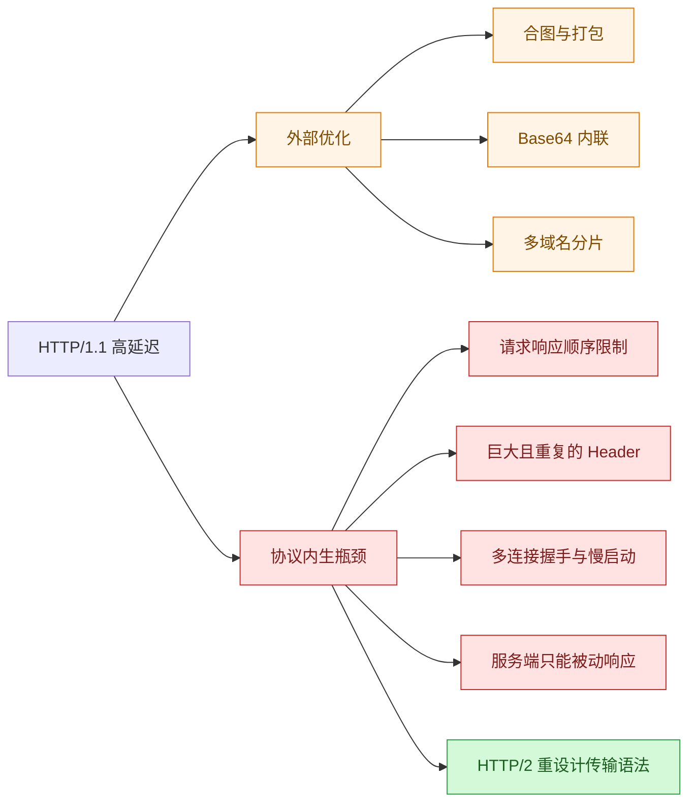
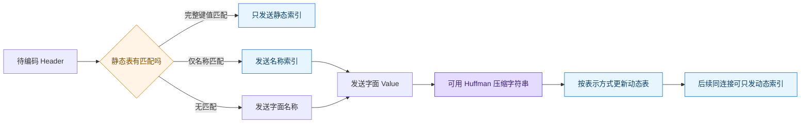
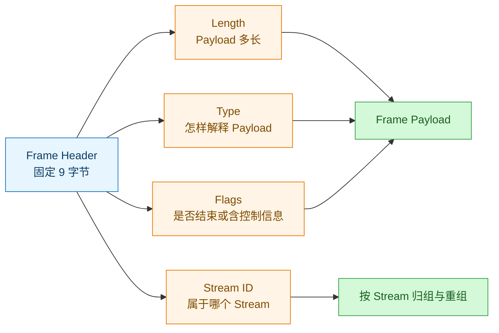
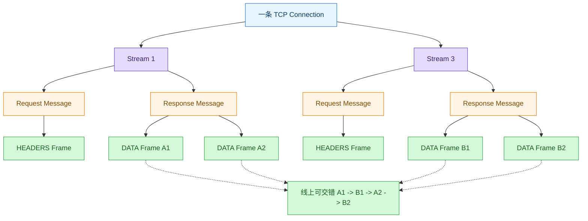
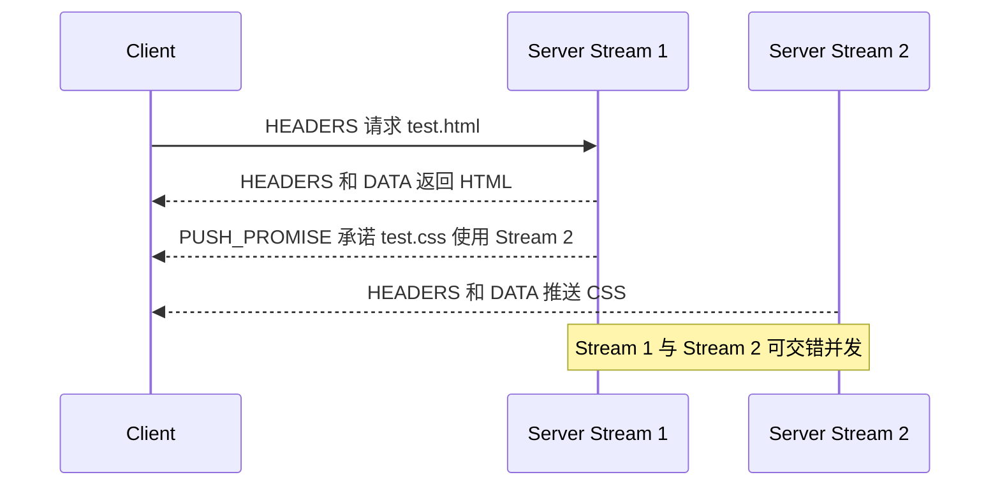
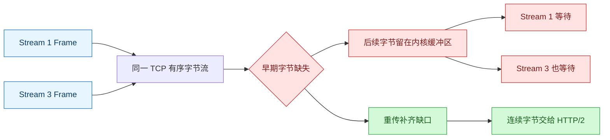
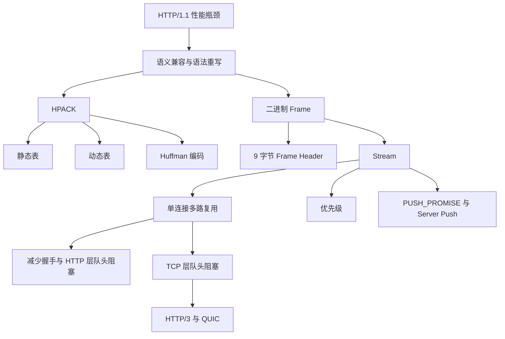

# HTTP/2：从 HTTP/1.1 的协议瓶颈到二进制多路复用

### 1. Topic Overview

- **主题**：HTTP/2 为什么出现，以及它如何用 HPACK、二进制帧、Stream 多路复用和服务器推送改善 HTTP/1.1 的性能。
- **为什么重要**：面试中不能只背“HTTP/2 更快”，而要能从 HTTP/1.1 的具体成本推导 HTTP/2 的对应机制，并说明 HTTP/2 仍受 TCP 层队头阻塞影响。
- **难度**：中等偏高。难点不是功能名，而是分清 `Connection -> Stream -> Message -> Frame -> TCP 字节流` 的层级，以及静态表、动态表和 Huffman 编码各压缩什么。
- **前置知识**：HTTP 请求/响应、Header/Body、HTTP/1.1 长连接与响应队头阻塞、TCP 可靠有序字节流、TLS 握手与慢启动的基本成本。
- **本地原文**：[materials/network/2_http/http2.md](../../../materials/network/2_http/http2.md)
- **图文核对**：已逐段读取原文 307 行，并检查全部 22 张图片；其中 21 张是知识图或抓包图，末尾 1 张宣传图不计入知识内容。
- **原文章节顺序**：HTTP/1.1 性能问题 -> 兼容 HTTP/1.1 -> 头部压缩 -> 二进制帧 -> 并发传输 -> 服务器主动推送 -> TCP 层队头阻塞与 HTTP/3。

#### Roadmap

1. 从 HTTP/1.1 的外部优化识别“必须改协议”的瓶颈。
2. 区分 HTTP 语义兼容与二进制传输语法重写。
3. 拆开 HPACK 的静态表、动态表与 Huffman 编码。
4. 读懂 9 字节 Frame Header 和十种基本帧类型。
5. 用 `Stream -> Message -> Frame` 解释单连接并发。
6. 追踪 `PUSH_PROMISE` 与偶数号推送 Stream。
7. 定位 HTTP/2 仍存在的 TCP 层队头阻塞。

### 2. Core Concepts

#### 2.1 Schema: 从“外部优化上限”识别协议重设计需求

- **Definition**：HTTP/1.1 可以通过合并、内联、打包和域名分片减少表面成本，但这些办法不能改变请求—响应模型、重复 Header、每条连接的握手与慢启动、以及服务器不能主动推送等协议边界。
- **Intuition**：如果堵车来自车太多，可以拼车；如果堵车来自道路规则规定“一次只能过一辆”，继续拼车不能改掉道路规则。
- **现代站点为何放大问题**：
  - 消息从几 KB 增长到几 MB。
  - 页面资源从不足 10 个增长到 100 多个。
  - 内容从文本扩展到图片、视频和音频。
  - 实时性要求越来越高。
- **HTTP/1.1 的高延迟来源**：
  1. 带宽可以增长，但物理与往返延迟下降到一定程度后很难再降。
  2. 浏览器对同一域名的并发连接有限；每条连接还要承担 TCP/TLS 握手和 TCP 慢启动。
  3. 同一连接中的慢事务会造成响应队头阻塞。
  4. 无状态请求反复携带巨大、重复的 Header，Cookie 尤其明显。
  5. 服务端不能主动推送资源或通知，客户端往往只能轮询。
- **原文列出的 HTTP/1.1 外部优化及代价**：
  - 多张小图合成大图：请求减少，但一个小图更新可能使整张大图重新下载。
  - 图片 Base64 内联进 HTML/CSS：少一次独立请求，但增大宿主文件并改变缓存粒度。
  - Webpack 打包多个 JavaScript：请求减少，但一个模块变化可能使整个包失效。
  - 资源分散到多个域名：绕开同域连接上限，但增加域名、连接和握手管理成本。
- **Common mistakes**：认为“再多开连接”或“再打大一点的包”就能消除协议层队头阻塞；只说 HTTP/2 更快，却说不出它在替换哪一笔 HTTP/1.1 成本。
- **Boundary**：原文中的“同域最多 6 条连接”是其浏览器示例，不是 HTTP 协议规定的固定常数。

#### Visual Model: HTTP/1.1 哪些问题能靠外部技巧缓解，哪些要改协议？



- **How to read**：左支只能绕开或减轻成本；右支要求改变报文组织与并发模型，因此导向 HTTP/2。
- **Source anchor**：`materials/network/2_http/http2.md`，“HTTP/1.1 协议的性能问题”。

#### 2.2 Schema: 保留 HTTP 语义，重写线上语法

- **Definition**：HTTP/2 没有改掉 HTTP 的请求方法、状态码、Header 语义等上层合同，而是重写它们在网络上的编码与传输格式。
- **Intuition**：用户仍然说同一种“业务语言”，但运输单据从可读文本换成更紧凑、可拆分和可交错的二进制格式。
- **兼容点**：
  - URI 没有新增协议名，仍使用 `http://` 和 `https://`。
  - 仍位于应用层，原文中的 HTTP/2 仍以 TCP 为传输基础。
  - `GET`、`POST`、状态码和头字段等语义保持。
- **改变点**：
  - HTTP/1.x 的文本报文语法改为 HTTP/2 二进制分帧语法。
  - Header 使用 HPACK 编码。
  - 一个 TCP 连接上可以交错传输多个 Stream 的 Frame。
- **Common mistakes**：认为 HTTP/2 改了 GET/POST 的意义；或反过来认为“兼容 HTTP/1.1”表示线上报文字节完全相同。
- **Boundary**：原文没有展开客户端与服务端如何协商选择 HTTP/2；本章只要求掌握“URI 与语义保持，传输语法改变”。

#### 2.3 Schema: 用静态表、动态表和 Huffman 三层压缩 Header

- **Definition**：HPACK 不压缩 Body，而是专门压缩 HTTP Header；它用索引消除重复字段，再用 Huffman 编码缩短仍需发送的字符串。
- **为什么 Header 值得单独优化**：
  - Cookie、User-Agent、Accept 等字段本身可达数百甚至上千字节。
  - 连续请求和响应存在大量重复字段。
  - HTTP/1.1 的 ASCII 文本便于人读，但编码效率低。
- **三种组件的职责**：
  1. **静态表**：协议预置 61 个高频 Header 名称或完整键值，例如索引 2 为 `:method: GET`，索引 8 为 `:status: 200`，索引 54 为 `server` 字段名。
  2. **动态表**：同一 HTTP/2 连接两端同步维护，从索引 62 开始，把之前发送过的字段加入字典，后续可只发索引。
  3. **Huffman 编码**：对仍需发送的字符串按出现频率使用变长编码，高频内容用更短比特串。
- **连接局部性**：动态表收益依赖“同一连接上重复出现相同 Header”；换连接、只出现一次或值持续变化时，收益会减弱。
- **Common mistakes**：
  - 把 HPACK 当成 Body 的 gzip。
  - 说 Huffman 负责记住跨请求的完整 Header；跨请求复用是动态表职责。
  - 认为动态表是所有用户、所有连接共享的永久缓存。

#### Visual Model: 一个 Header 如何被 HPACK 缩短？



- **How to read**：先问“能否用索引替代”，不能完全替代的字符串再用 Huffman 缩短；动态表为同连接的后续报文积累索引。
- **Source anchor**：`materials/network/2_http/http2.md`，“头部压缩”“静态表编码”“动态表编码”。
- **Boundary**：图压缩的是原文主线；具体 HPACK 表示还存在“是否索引”等编码模式，本章只精读原文展示的模式。

#### 2.4 Schema: 用 `server: nghttpx` 跑通一次 HPACK 编码

- **HTTP/1.1 文本形式**：

```plain
server: nghttpx\r\n
```

- **原始成本**：连同冒号、空格和结尾 `\r\n` 共 17 字节。
- **HPACK 示例**：
  1. 静态表中 `server` 的索引是 54，二进制为 `110110`。
  2. 原文示例使用前缀 `01`，首字节组成 `01110110`。
  3. 第二字节为 `10000110`：最高位 `1` 表示 Value 使用 Huffman；剩余 7 位 `0000110` 表示压缩后长度为 6 字节。
  4. `nghttpx` 的 Huffman 编码占 6 字节，末尾需要补位。
  5. 总计 8 字节，原文按 `17 -> 8` 计算约 47% 压缩率。
- **为什么不再需要 `:`、空格和 `\r\n`**：二进制表示中，字段索引与明确的 Value Length 已经给出了边界。
- **Common mistakes**：把“索引 54”误认为完整的 `server: nghttpx` 已在静态表；静态表这里只有字段名，变化的 Value 仍要发送。

#### 2.5 Schema: 动态表用连接状态换带宽

- **Definition**：第一次发送新的完整 Header 时，两端把它加入各自连接的动态表；以后同一连接再发送完全相同字段，可以只发送较短索引。
- **Example**：第一次发送上百字节的 `User-Agent`，Huffman 编码后传输并加入动态索引 62；下一次可只发送索引 62。
- **收益前提**：
  - 必须在同一连接。
  - Header 必须重复且足够相同。
  - 连接中报文越多，字典越可能积累出高复用率。
- **代价**：动态表消耗内存，因此连接或可处理请求数不能无界增长。原文用 Web 服务器限制连接请求数的配置思路说明这一点。
- **Common mistakes**：只背“动态表压缩率高”，忽略它需要两端状态同步、连接复用与内存成本。
- **Boundary**：原文中的服务器配置名和默认值属于实现示例；协议核心边界是“动态表按连接维护且占用内存”。

#### 2.6 Schema: 用 9 字节 Frame Header 拆出类型、控制与归属

- **Definition**：Frame 是 HTTP/2 的最小传输单位。HTTP 消息会被拆成不同类型的二进制 Frame，例如 HEADERS 携带头部块，DATA 携带消息体。
- **Frame Header 固定为 9 字节**：

| 字段 | 位数 | 作用 |
| --- | ---: | --- |
| Length | 24 | 后续 Frame Payload 的长度 |
| Type | 8 | 指明 Frame 类型 |
| Flags | 8 | 携带该类型允许的简单控制标志 |
| Reserved | 1 | 保留位 |
| Stream Identifier | 31 | 指明 Frame 属于哪个 Stream |

- **原文图中的十种基本帧类型**：

| 类型 | 编码 | 主要用途 |
| --- | ---: | --- |
| DATA | `0x0` | 传输 HTTP Body |
| HEADERS | `0x1` | 传输 HTTP Header |
| PRIORITY | `0x2` | 指定 Stream 优先级 |
| RST_STREAM | `0x3` | 终止某个 Stream |
| SETTINGS | `0x4` | 修改连接或 Stream 的配置 |
| PUSH_PROMISE | `0x5` | 承诺即将推送的资源 |
| PING | `0x6` | 心跳、测量往返时间 |
| GOAWAY | `0x7` | 优雅停止连接或通知错误 |
| WINDOW_UPDATE | `0x8` | 更新流控制窗口 |
| CONTINUATION | `0x9` | 继续传输未结束的 Header 块 |

- **原文重点 Flags**：
  - `END_HEADERS`：当前 Header 块结束。
  - `END_STREAM`：该发送方向结束，不再有后续 Frame。
  - `PRIORITY`：在允许该标志的 Frame 中携带优先级信息。
- **Stream ID 上限**：只有 31 位可用，因此可用最大值是 `2^31 - 1`；原文把数量级近似写作 `2^31`，约 21 亿。
- **Common mistakes**：
  - 认为每个 Frame 都同时包含 HPACK Header 和 Body；实际上 HEADERS/CONTINUATION 携带压缩头部块，DATA 携带 Body，控制帧还有各自 Payload。
  - 把 Frame 边界等同于 TCP Segment 边界。
  - 忘记 Stream ID 才让乱序到达的不同 Stream Frame 可以重新归组。

#### Visual Model: 9 字节 Frame Header 如何让 Frame 可解析、可归组？



- **How to read**：Length 给边界，Type 给解释规则，Flags 给状态，Stream ID 给归属；四者共同让二进制内容可解析。
- **Source anchor**：`materials/network/2_http/http2.md`，“二进制帧”及帧结构、帧类型配图。

#### 2.7 Schema: 用 `Connection -> Stream -> Message -> Frame` 解释多路复用

- **层级**：
  1. 一个 TCP Connection 承载一个或多个 Stream。
  2. 普通客户端请求 Stream 中，请求与响应各是一条 HTTP Message。
  3. Message 由 HTTP Header 与可选 Body 构成，并被编码成一个或多个 Frame。
  4. Frame 是 HTTP/2 最小单位，但在 TCP 层仍只是字节；一个 Frame 可跨多个 TCP Segment，TCP Segment 也不等于 HTTP Message。
- **并发规则**：
  - 不同 Stream 的 Frame 可以交错发送，例如 `A1 -> B1 -> A2 -> B2`。
  - 每个 Frame 带 Stream ID，接收方按 ID 把 Frame 放回对应 Stream。
  - 同一 Stream 内的 Frame 顺序必须保持其协议语义要求。
- **性能来源**：多个请求/响应不必各建一条 TCP 连接，因此可共用一次 TCP/TLS 建连，并减少多条连接分别经历慢启动的成本。
- **Common mistakes**：
  - 把 Stream、Message、Frame 当同义词。
  - 说“多路复用”表示 TCP 字节可以无序交付。
  - 认为一个 Frame 必定对应一个 TCP Segment。
- **Boundary**：原文用“一个 Stream 有两个 Message”描述普通请求—响应。服务器推送 Stream 的发起方式不同，不应机械套成客户端请求加服务端响应。

#### Visual Model: 多个请求怎样共用一条 TCP 连接？



- **How to read**：先沿树看层级，再看虚线汇入同一条线上交错发送；Stream ID 让接收方恢复两条独立消息。
- **Source anchor**：`materials/network/2_http/http2.md`，“并发传输”及 `stream`、`stream2`、多路复用配图。

#### 2.8 Schema: 用 Stream ID 管理发起方、生命周期与优先级

- **奇偶规则**：
  - 客户端创建的 Stream ID 为奇数。
  - 服务器创建的推送 Stream ID 为偶数。
- **唯一与递增**：同一连接中的 Stream ID 不复用并按创建方向递增；ID 空间耗尽时发送 `GOAWAY`，关闭或迁移到新连接。
- **并发上限**：实现可限制同时活跃的 Stream 数量；原文以 Nginx 的 128 个并发 Stream 配置示例说明并发不是无限的。
- **优先级**：原文示例希望 HTML/CSS 先于图片传输，通过 Stream 优先级改善关键渲染资源的体验。
- **Common mistakes**：认为奇数/偶数代表请求或响应方向；真正表示的是 Stream 由哪一端创建。也不要把“最多并发 Stream”与“整个连接一生可使用的 Stream ID 数量”混为一谈。

#### 2.9 Schema: `PUSH_PROMISE` 先承诺，偶数 Stream 再发送

- **Definition**：服务端在客户端尚未请求依赖资源时，先承诺将推送该资源，再通过服务器创建的偶数号 Stream 发送响应。
- **Example**：
  1. 客户端在 Stream 1 请求 `/test.html`。
  2. 服务端在 Stream 1 返回 HTML，同时发送 `PUSH_PROMISE`，其中的 Promised Stream ID 告知客户端 CSS 将使用 Stream 2。
  3. 服务端在 Stream 2 发送 `/test.css` 的响应 Header 与 Body。
  4. Stream 1 与 Stream 2 可以并发。
- **原文 Nginx 示例**：

```nginx
location /test.html {
  http2_push /test.css;
}
```

- **收益**：不必等客户端解析 HTML、发现 CSS、再发起第二次请求，减少一轮应用层请求—响应等待。
- **Common mistakes**：
  - 说服务器把 CSS DATA 直接塞进原 HTML Message。
  - 忘记 `PUSH_PROMISE` 只承诺资源和 Promised Stream ID，真正的资源在另一个 Stream。
  - 把偶数号解释成“响应 Stream”；它表示服务器创建的推送 Stream。
- **Boundary**：Nginx 片段是原文中的实现示例；本章要掌握的协议机制是 `PUSH_PROMISE -> Promised Stream ID -> 偶数推送 Stream`。

#### Visual Model: HTML 和 CSS 推送如何并发？



- **How to read**：承诺仍从关联的客户端 Stream 1 发出，资源本身由服务器创建的 Stream 2 发送。
- **Source anchor**：`materials/network/2_http/http2.md`，“服务器主动推送资源”及 `push`、`push2` 配图。

#### 2.10 Schema: HTTP/2 消除一层队头阻塞，但保留 TCP 层队头阻塞

- **HTTP/1.1 问题**：应用层请求—响应顺序使慢响应挡住同连接中的后续响应。
- **HTTP/2 改进**：不同 Stream 的 Frame 可以交错，慢 Stream 不必在 HTTP/2 调度层独占整条连接。
- **仍然存在的问题**：
  1. 所有 Stream 最终都变成同一条 TCP 连接中的连续字节。
  2. TCP 必须向应用提供完整、连续、有序的字节流。
  3. 如果较早的 TCP 字节丢失，后续已经到达的字节只能留在内核接收缓冲区等待重传。
  4. HTTP/2 暂时拿不到这些后续字节，因此同连接上的其他 Stream 也可能一起停住。
- **转向 HTTP/3**：原文由此引出 HTTP/3 在 UDP 之上使用 QUIC，把可靠性与多 Stream 管理放到能区分 Stream 的传输层实现中。
- **Common mistakes**：说 HTTP/2 “彻底没有队头阻塞”；或只说“TCP 丢包会慢”，但说不出为什么已经完整到达的另一个 Stream 也不能先交给 HTTP/2。

#### Visual Model: HTTP/2 的并发为什么仍会被一个 TCP 缺口卡住？



- **How to read**：HTTP/2 能区分 Stream，但 TCP 交付前只看连续字节；缺口补齐前，应用层看不到后续 Stream 的完整字节。
- **Source anchor**：`materials/network/2_http/http2.md`，“总结”末尾的 HTTP/2 TCP 队头阻塞说明。

#### 2.11 Source Coverage Boundary

- 原文明确说 HTTP/2 还有**流控制、流状态、依赖关系**等内容，但本章没有展开其状态机或算法；本笔记保留这些名词，不用外部知识冒充原文章节内容。
- 帧类型图中的 `WINDOW_UPDATE` 对应流控制，`PRIORITY` 对应依赖/优先级，`RST_STREAM`、`END_STREAM`、`GOAWAY` 与 Stream/连接生命周期相关；本章只掌握它们在整体结构中的职责。
- 原文引用的配置名、默认值与服务器推送配置用于帮助理解机制，不应背成所有服务器和所有版本都固定不变的协议规则。

### 3. Deep Understanding

#### 3.1 HTTP/1.1 的每个瓶颈如何映射到 HTTP/2

| HTTP/1.1 成本 | HTTP/2 机制 | 直接收益 | 仍有边界 |
| --- | --- | --- | --- |
| Header 巨大且重复 | HPACK 静态表、动态表、Huffman | 减少重复字符串与编码字节 | 动态表按连接维护并耗内存 |
| 文本报文解析与边界表示冗余 | 二进制 Frame | 用长度、类型、标志和 Stream ID 明确解析 | 二进制不等于自动解决所有时延 |
| 同连接响应队头阻塞 | 多 Stream 交错 Frame | HTTP 层可并发多个请求/响应 | TCP 丢包仍会阻塞整条连接 |
| 多连接的 TCP/TLS 握手与慢启动 | 单 TCP 连接承载多个 Stream | 减少重复建连与各自慢启动 | 单连接也形成共享故障与拥塞边界 |
| 客户端解析后才请求依赖资源 | Server Push + PUSH_PROMISE | 可提前发送依赖资源 | 推送是否有益取决于客户端是否需要或已有缓存 |
| 资源重要性不同 | Stream 优先级 | 更早调度关键 HTML/CSS | 原文未展开完整优先级依赖模型 |

#### 3.2 关键机制链

```text
HTTP 语义不变
-> Header 与 Body 编码成二进制 Frame
-> Frame 用 Stream ID 归属到各自 Stream
-> 多个 Stream 的 Frame 在一条 TCP 连接上交错
-> 减少多连接成本并消除 HTTP 层顺序等待
-> 所有 Frame 最终仍进入同一 TCP 有序字节流
-> TCP 缺口会阻塞同连接全部 Stream
-> 引出 HTTP/3 的 QUIC 独立 Stream
```

### 4. Minimal Working Example

场景：浏览器访问 `/index.html`，页面依赖 `/style.css` 和 `/hero.jpg`。

1. 浏览器与服务器建立一条 HTTP/2 连接。
2. 浏览器在 Stream 1 发送 HTML 请求的 HEADERS Frame。
3. 服务端用 Stream 1 的 HEADERS/DATA 返回 HTML，并用 `PUSH_PROMISE` 承诺在 Stream 2 推送 CSS。
4. 浏览器解析 HTML 后，可在 Stream 3 请求图片。
5. 线上 Frame 可以交错为：

```text
S1: HTML HEADERS
-> S1: HTML DATA 1
-> S2: CSS HEADERS
-> S3: image HEADERS
-> S2: CSS DATA
-> S1: HTML DATA 2
-> S3: image DATA
```

6. 每个 Frame 的 Stream ID 让客户端把内容分别组装回 HTML、CSS 和图片。
7. 重复 Header 可由 HPACK 的静态/动态索引缩短。
8. 如果承载这些 Frame 的某个早期 TCP Segment 丢失，即使后面的 CSS 或图片字节已到达，TCP 仍要先补齐缺口才向 HTTP/2 连续交付，因此多个 Stream 都可能等待。

### 5. Chapter Knowledge Map



### 6. Self-Test Questions

#### Recall

1. HPACK 的静态表、动态表、Huffman 编码分别解决什么问题？
2. HTTP/2 Frame Header 的四组核心信息是什么，它们各自解决什么解析问题？
3. 客户端和服务器创建的 Stream ID 为什么分别使用奇数和偶数？

#### Application / Transfer

4. 两个 HTTP/2 Stream 的 Frame 已交错发送，其中一个早期 TCP Segment 丢失。为什么另一个 Stream 的完整后续字节也可能暂时不能交给应用？
5. 一个 Header 只在某条连接中出现一次，另一个 Header 在同一连接中重复 100 次。哪个更能利用动态表，为什么？

#### Explain Like I Am 5

6. 用“一条公路、多辆不同编号的车、前方缺了一段路”解释 HTTP/2 多路复用与 TCP 层队头阻塞。

### 7. Weak Point Detection

| Failure pattern | Likely error type | Repair question |
| --- | --- | --- |
| 只背“二进制、多路复用、推送”，说不出对应 HTTP/1.1 痛点 | surface-level memorization | “每个机制具体省掉哪一笔成本？” |
| 把静态表、动态表、Huffman 都说成字符串压缩算法 | concept misunderstanding | “谁给索引，谁缩短仍需发送的字符串？” |
| 把 Stream、Message、Frame 混为同一层 | boundary confusion | “一个请求响应、一次 HEADERS、一个 TCP 连接分别属于哪层？” |
| 认为不同 Stream 可交错等于 TCP 可无序交付 | boundary confusion | “谁负责按 Stream 归组，谁仍要求连续字节？” |
| 把偶数 Stream 当成所有服务端响应 | boundary confusion | “奇偶规则标记响应方向，还是创建 Stream 的一端？” |
| 认为 HTTP/2 已彻底解决队头阻塞 | transfer failure | “丢一个早期 TCP Segment 时，内核能否先交付后续 Stream 字节？” |
